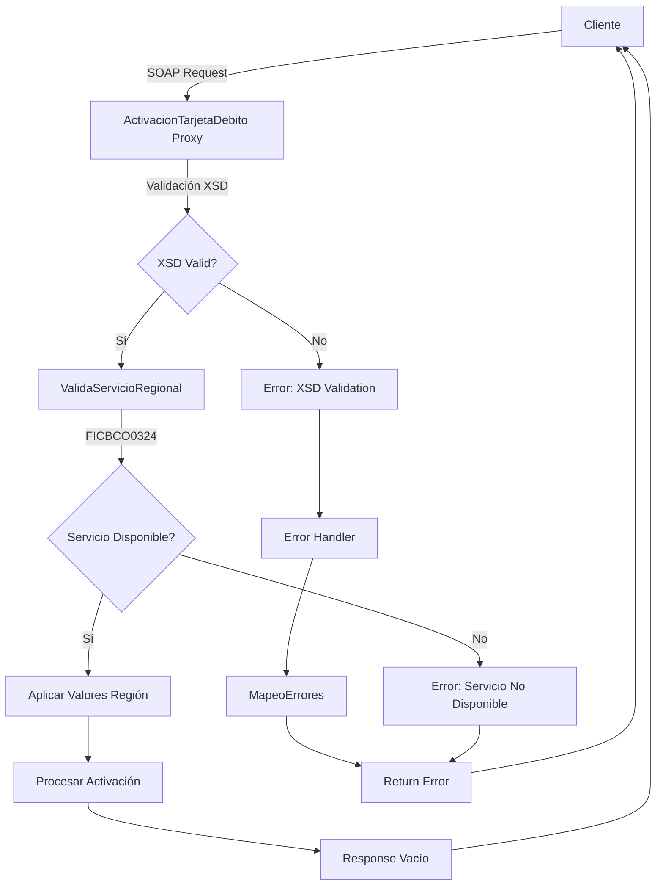
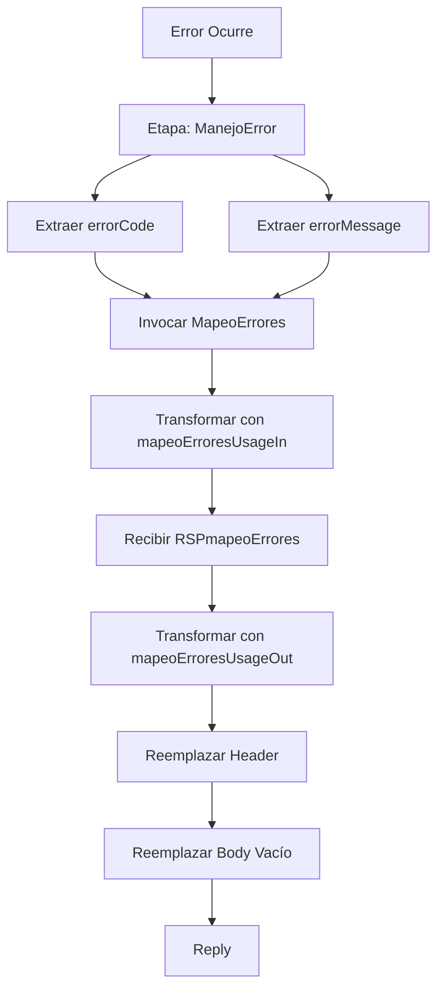

# Análisis Técnico - ActivacionTarjetaDebito

## 1. Resumen Ejecutivo

**Nombre del Servicio:** ActivacionTarjetaDebito  
**Código de Servicio:** FICBCO0324  
**Tipo de Servicio:** Servicio Regional Multi-Core  
**Patrón de Diseño:** Validación Regional con Procesamiento

### Descripción Funcional
El servicio ActivacionTarjetaDebito proporciona capacidades de activación de tarjetas de débito para clientes. Implementa un patrón de validación regional que verifica la disponibilidad del servicio en la región del solicitante antes de procesar la activación. El servicio valida el esquema XSD del request con un campo obligatorio (DEBIT_CARD_NUMBER), ejecuta ValidaServicioRegional con código FICBCO0324, y procesa la activación de la tarjeta. El response es un elemento vacío sin campos de salida. Incluye manejo de errores mediante MapeoErrores para estandarización de mensajes. Es un servicio transaccional que puede requerir reversos.

---

## 2. Arquitectura del Servicio

### Patrón Arquitectónico
El servicio implementa un patrón de **Validación Regional con Procesamiento Directo**:

1. Recepción de solicitud sin autenticación custom token
2. Validación XSD del request
3. Validación de disponibilidad regional del servicio
4. Aplicación de configuraciones regionales
5. Procesamiento de activación de tarjeta
6. Manejo centralizado de errores con mapeo

### Diagrama de Flujo



---

## 3. Servicios Dependientes

### Servicios de Validación y Configuración

| Servicio | Tipo | Propósito | Operación |
|----------|------|-----------|-----------|
| ValidaServicioRegional | Business Service (DB) | Validar disponibilidad del servicio en la región | ValidaServicioRegional |
| MapeoErrores | Proxy Service | Estandarizar códigos y mensajes de error | mapeoErrores |

### Cadena de Dependencias
```
ActivacionTarjetaDebito
├── ValidaServicioRegional (DB)
└── MapeoErrores
```

---

## 4. Transformaciones de Datos

### Transformaciones por Etapa

| Etapa | Descripción | Archivos XQuery Request | Archivos XQuery Response |
|-------|-------------|------------------------|--------------------------|
| Validación Regional | Construcción de request para validar servicio | [Transformación inline en proxy] | N/A |
| Aplicación Regional | Aplicar configuraciones por defecto de región | N/A | [Transformación inline en proxy] |
| Mapeo de Errores Request | Construcción de request para mapeo de errores | `Middleware/v2/Resources/MapeoErrores/xq/mapeoErroresUsageIn.xq` | N/A |
| Mapeo de Errores Response | Transformación de respuesta de mapeo de errores | N/A | `Middleware/v2/Resources/MapeoErrores/xq/mapeoErroresUsageOut.xq` |

### Lógica de Transformación

**Validación Regional (inline):**
- Entrada: RequestHeader, serviceId
- Salida: Request para ValidaServicioRegional
- Parámetros: serviceId = "FICBCO0324"

**Aplicación Regional (inline):**
- Entrada: RequestHeader original
- Salida: RequestHeader con valores regionales aplicados
- Propósito: Enriquecer header con configuraciones específicas de la región

**mapeoErroresUsageIn.xq:**
- Entrada: CODIGO_ERROR (errorCode del fault), MENSAJE_ERROR (concatenado con "FICBCO0324$#$")
- Salida: Request para MapeoErrores

**mapeoErroresUsageOut.xq:**
- Entrada: mapeoErroresResponse, successIndicator (errorCode)
- Salida: ResponseHeader con error mapeado

---

## 5. Conexiones por País

### Validación Regional (Común para todos los países)

| País | Tipo Conexión | Servicio | Endpoint | Operación |
|------|---------------|----------|----------|-----------|
| Todos | JCA (Database) | ValidaServicioRegional | [CONNECTION_VALIDACION_REGIONAL] | ValidaServicioRegional |

**Nota:** La conexión JCA maneja la autenticación a nivel de conexión configurada en el servidor.

---

## 6. Validación XSD

### Esquema Principal
- **Archivo XSD:** activacionTarjetaDebitoTypes.xsd
- **Ruta:** Middleware/v2/Resources/ActivacionTarjetaDebito/xsd/activacionTarjetaDebitoTypes.xsd
- **Namespace:** http://www.ficohsa.com.hn/middleware.services/activacionTarjetaDebitoTypes
- **Prefijo:** cons

### Estructura del Request: activacionTarjetaDebito

| Campo | Tipo | Obligatorio | Cardinalidad | Restricciones | Descripción |
|-------|------|-------------|--------------|---------------|-------------|
| activacionTarjetaDebito | complexType | Sí | 1..1 | - | Elemento raíz del request |
| DEBIT_CARD_NUMBER | string | Sí | 1..1 | - | Número de tarjeta de débito |

### Estructura del Response: activacionTarjetaDebitoResponse

| Campo | Tipo | Obligatorio | Cardinalidad | Restricciones | Descripción |
|-------|------|-------------|--------------|---------------|-------------|
| activacionTarjetaDebitoResponse | Empty Type | Sí | 1..1 | - | Elemento raíz del response (vacío) |

### Ejemplo de Request Válido

**Nota:** Los siguientes son datos de ejemplo no reales, utilizados únicamente para propósitos de testing y documentación.

```xml
<act:activacionTarjetaDebito xmlns:act="http://www.ficohsa.com.hn/middleware.services/activacionTarjetaDebitoTypes">
  <DEBIT_CARD_NUMBER>4111111111111111</DEBIT_CARD_NUMBER>
</act:activacionTarjetaDebito>
```

### Ejemplo de Response Válido

**Nota:** Los siguientes son datos de ejemplo no reales, utilizados únicamente para propósitos de testing y documentación.

```xml
<act:activacionTarjetaDebitoResponse xmlns:act="http://www.ficohsa.com.hn/middleware.services/activacionTarjetaDebitoTypes"/>
```

### Casos de Error de Validación XSD

**Error 1: DEBIT_CARD_NUMBER faltante**
```xml
<act:activacionTarjetaDebito>
  <!-- DEBIT_CARD_NUMBER faltante -->
</act:activacionTarjetaDebito>
```
Error esperado: `cvc-complex-type.2.4.b: The content of element 'activacionTarjetaDebito' is not complete`

### Estadísticas de Validación
- **Total de elementos en Request:** 2
- **Elementos obligatorios:** 2 (100%)
- **Elementos opcionales:** 0 (0%)
- **Total de elementos en Response:** 1
- **Elementos obligatorios en Response:** 1 (100%)
- **Elementos opcionales en Response:** 0 (0%)
- **Tipos complejos definidos:** 1
- **Tipos simples definidos:** 0
- **Cobertura de documentación:** 100%

---

## 7. Manejo de Errores

### Error Handler Dedicado
- **Nombre:** _onErrorHandler-4182142964583057300--6039b43d.16ae53305de.-7e75
- **Tipo:** Pipeline de error con mapeo

### Flujo de Manejo de Errores



### Extracción de Información de Error
```xpath
errorCode: fn:string($fault/ctx:errorCode/text())
errorMessage: fn:string($fault/ctx:reason/text())
```

### Integración con MapeoErrores
- **Servicio:** Middleware/v2/ProxyServices/MapeoErrores
- **Operación:** mapeoErrores
- **Transformación Request:** mapeoErroresUsageIn.xq
- **Transformación Response:** mapeoErroresUsageOut.xq
- **Parámetros:** CODIGO_ERROR, MENSAJE_ERROR (formato: "FICBCO0324$#$[mensaje]")

---

## 8. Configuración de Seguridad

### Autenticación
- **Tipo:** Sin autenticación custom token configurada
- **Nota:** El servicio NO implementa autenticación custom token en la configuración del proxy

### Transporte
- **Protocolo:** HTTPS (obligatorio)
- **Provider:** http
- **Dirección:** Inbound

---

## 9. Configuración de Monitoreo y Logging

### Logging
- **Estado:** Habilitado
- **Nivel:** debug
- **Propósito:** Trazabilidad completa de requests y responses

### Reporting
- **Estado:** Habilitado
- **Propósito:** Métricas de uso y rendimiento

### SLA Alerting
- **Estado:** Habilitado
- **Nivel:** normal
- **Propósito:** Alertas de cumplimiento de SLA

### Pipeline Alerting
- **Estado:** Habilitado
- **Nivel:** normal
- **Propósito:** Alertas de errores en pipeline

### Monitoring
- **Estado:** Deshabilitado
- **Intervalo de agregación:** 10 segundos
- **Nivel:** Pipeline

---

## 10. Consideraciones de Implementación

### Variables de Configuración Requeridas
- `[CONNECTION_VALIDACION_REGIONAL]`: Conexión JCA a base de datos de validación

### Dependencias de Despliegue
1. Base de datos de ValidaServicioRegional debe estar disponible
2. Servicio MapeoErrores debe estar desplegado
3. Esquemas XSD deben estar registrados en el servidor OSB

### Puntos de Configuración por Ambiente
- Conexión JCA a base de datos
- Credenciales de autenticación (si se requieren)
- Timeouts de servicios
- Niveles de logging

### Consideraciones Especiales
- El servicio NO implementa router dinámico
- El servicio NO tiene autenticación custom token configurada
- El response es un elemento vacío (sin campos de salida)
- Es un servicio transaccional que puede requerir reversos
- El servicio es utilizado por canales NST y ONBASE
- Existe un servicio relacionado en MiddlewareCaja con la misma capacidad

---

**Versión del Documento:** 1.0  
**Fecha de Análisis:** 2025-01-15  
**Analista:** Equipo de Arquitectura OSB
