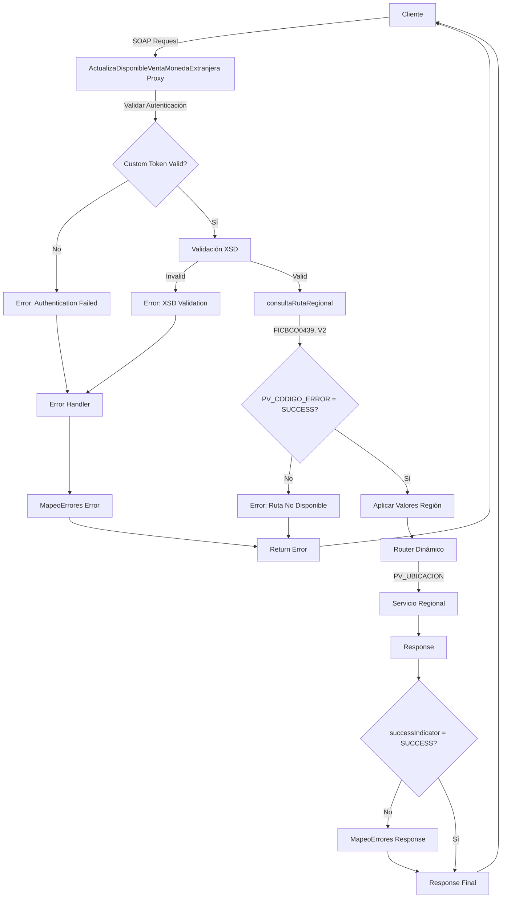
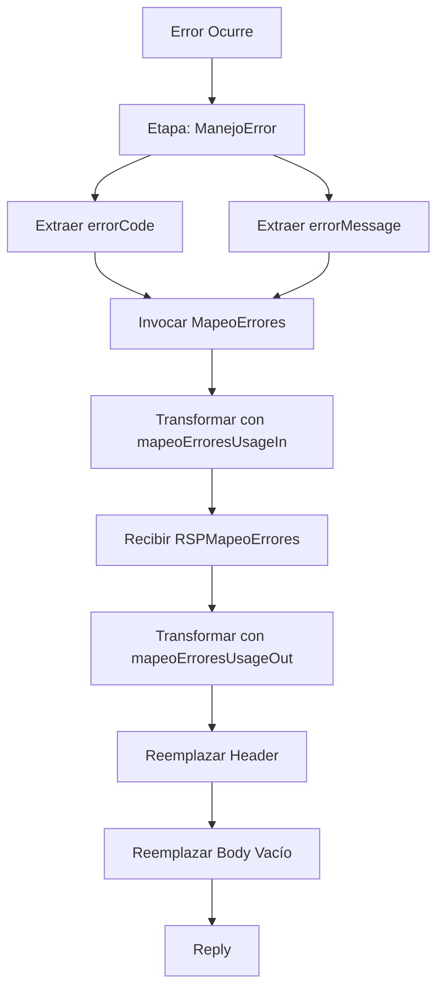

# Análisis Técnico - ActualizaDisponibleVentaMonedaExtranjera

## 1. Resumen Ejecutivo

**Nombre del Servicio:** ActualizaDisponibleVentaMonedaExtranjera  
**Código de Servicio:** FICBCO0439  
**Tipo de Servicio:** Router Dinámico Regional  
**Patrón de Diseño:** Enrutamiento Dinámico con Consulta de Ruta Regional

### Descripción Funcional
El servicio ActualizaDisponibleVentaMonedaExtranjera proporciona capacidades de actualización del monto disponible para venta de moneda extranjera. Implementa un patrón de router dinámico que consulta la ruta del servicio regional en tiempo de ejecución mediante el servicio consultaRutaRegional. El servicio valida el esquema XSD del request con 8 campos obligatorios (PROFILE, CURRENCY, AMOUNT, DEAL, STATUS, OPERATION_TYPE, END_DATE, ACTION_TYPE), obtiene la ubicación del servicio regional según el país y versión (V2), y enruta dinámicamente la solicitud al servicio correspondiente. Incluye mapeo de errores tanto en el pipeline de respuesta como en el error handler para estandarización de mensajes. Es un servicio transaccional que actualiza el inventario de divisas.

---

## 2. Arquitectura del Servicio

### Patrón Arquitectónico
El servicio implementa un patrón de **Router Dinámico Regional con Consulta de Ruta en Tiempo de Ejecución**:

1. Recepción de solicitud con autenticación custom token
2. Validación XSD del request (8 campos obligatorios)
3. Consulta de ruta regional con código FICBCO0439 y versión V2
4. Evaluación de resultado de consulta de ruta
5. Aplicación de configuraciones regionales
6. Enrutamiento dinámico al servicio regional determinado
7. Mapeo de errores en response pipeline
8. Manejo centralizado de errores con mapeo

### Diagrama de Flujo



---

## 3. Servicios Dependientes

### Servicios de Enrutamiento

| Servicio | Tipo | Propósito | Operación |
|----------|------|-----------|-----------|
| consultaRutaRegional | Business Service (DB) | Obtener ruta del servicio regional según país y versión | consultaRutaRegional |
| MapeoErrores | Proxy Service | Estandarizar códigos y mensajes de error | mapeoErrores |

### Servicios de Procesamiento

| Servicio | Tipo | Propósito | Operación |
|----------|------|-----------|-----------|
| Servicio Regional Dinámico | Proxy Service | Actualizar disponible de venta según región | [Determinado en runtime] |

### Cadena de Dependencias
```
ActualizaDisponibleVentaMonedaExtranjera
├── consultaRutaRegional (DB)
├── MapeoErrores
└── [Servicio Regional Dinámico]
    └── [Servicios Backend Regionales]
```

---

## 4. Transformaciones de Datos

### Transformaciones por Etapa

| Etapa | Descripción | Archivos XQuery Request | Archivos XQuery Response |
|-------|-------------|------------------------|--------------------------|
| Consulta Ruta Regional | Construcción de request para obtener ruta | `Middleware/v2/Resources/Generales/xq/consultaRutaRegionalIn.xq` | N/A |
| Aplicación Regional | Aplicar configuraciones por defecto de región | N/A | `Middleware/v2/Resources/Generales/xq/aplicarValoresPorDefectoRegion.xq` |
| Mapeo Errores Request (Response) | Construcción de request para mapeo en response pipeline | `Middleware/v2/Resources/MapeoErrores/xq/mapeoErroresUsageIn.xq` | N/A |
| Mapeo Errores Response (Response) | Transformación de respuesta de mapeo en response pipeline | N/A | `Middleware/v2/Resources/MapeoErrores/xq/mapeoErroresUsageOut.xq` |
| Mapeo Errores Request (Error) | Construcción de request para mapeo en error handler | `Middleware/v2/Resources/MapeoErrores/xq/mapeoErroresUsageIn.xq` | N/A |
| Mapeo Errores Response (Error) | Transformación de respuesta de mapeo en error handler | N/A | `Middleware/v2/Resources/MapeoErrores/xq/mapeoErroresUsageOut.xq` |

### Lógica de Transformación

**consultaRutaRegionalIn.xq:**
- Entrada: idServicio (string), requestHeader (aut:RequestHeader), operacion (string), version (string)
- Salida: Request para consultaRutaRegional
- Parámetros: idServicio = "FICBCO0439", version = "V2"

**aplicarValoresPorDefectoRegion.xq:**
- Entrada: RequestHeader original
- Salida: RequestHeader con valores regionales aplicados
- Propósito: Enriquecer header con configuraciones específicas de la región

**mapeoErroresUsageIn.xq (Response Pipeline):**
- Entrada: CODIGO_ERROR (successIndicator), MENSAJE_ERROR (concatenado con "FICBCO0439$#$")
- Salida: Request para MapeoErrores
- Contexto: Invocado cuando successIndicator != "SUCCESS"

**mapeoErroresUsageOut.xq (Response Pipeline):**
- Entrada: mapeoErroresResponse, successIndicator
- Salida: ResponseHeader con error mapeado
- Propósito: Transformar respuesta de MapeoErrores a formato estándar

**mapeoErroresUsageIn.xq (Error Handler):**
- Entrada: CODIGO_ERROR (errorCode del fault), MENSAJE_ERROR (concatenado con "FICBCO0439$#$")
- Salida: Request para MapeoErrores
- Contexto: Invocado en error handler

**mapeoErroresUsageOut.xq (Error Handler):**
- Entrada: mapeoErroresResponse, successIndicator (errorCode)
- Salida: ResponseHeader con error mapeado
- Propósito: Transformar respuesta de MapeoErrores en error handler

---

## 5. Conexiones por País

### Consulta de Ruta (Común para todos los países)

| País | Tipo Conexión | Servicio | Endpoint | Operación |
|------|---------------|----------|----------|-----------|
| Todos | JCA (Database) | consultaRutaRegional | [CONNECTION_CONSULTA_RUTA_REGIONAL] | consultaRutaRegional |

**Nota:** La conexión JCA maneja la autenticación a nivel de conexión configurada en el servidor.

### Enrutamiento Dinámico

| Determinación | Tipo Conexión | Servicio | Endpoint | Operación |
|---------------|---------------|----------|----------|-----------|
| Runtime (PV_UBICACION) | SOAP | [Servicio Regional Dinámico] | [ENDPOINT_DETERMINADO_RUNTIME] | [Operación del servicio regional] |

**Nota:** El servicio destino se determina en tiempo de ejecución mediante el valor PV_UBICACION retornado por consultaRutaRegional. El enrutamiento es completamente dinámico.

---

## 6. Validación XSD

### Esquema Principal
- **Archivo XSD:** actualizaDisponibleVentaMonedaExtranjeraTypes.xsd
- **Ruta:** Middleware/v2/Resources/ActualizaDisponibleVentaMonedaExtranjera/xsd/actualizaDisponibleVentaMonedaExtranjeraTypes.xsd
- **Namespace:** http://www.ficohsa.com.hn/middleware.services/actualizaDisponibleVentaMonedaExtranjeraTypes
- **Prefijo:** tns

### Estructura del Request: actualizaDisponibleVentaMonedaExtranjera

| Campo | Tipo | Obligatorio | Cardinalidad | Restricciones | Descripción |
|-------|------|-------------|--------------|---------------|-------------|
| actualizaDisponibleVentaMonedaExtranjera | complexType | Sí | 1..1 | - | Elemento raíz del request |
| PROFILE | string | Sí | 1..1 | - | Perfil de la operación |
| CURRENCY | string | Sí | 1..1 | - | Código de moneda extranjera |
| AMOUNT | string | Sí | 1..1 | - | Monto de la operación |
| DEAL | string | Sí | 1..1 | - | Número de deal/transacción |
| STATUS | string | Sí | 1..1 | - | Estado de la operación |
| OPERATION_TYPE | string | Sí | 1..1 | - | Tipo de operación |
| END_DATE | string | Sí | 1..1 | - | Fecha de finalización |
| ACTION_TYPE | string | Sí | 1..1 | - | Tipo de acción (incremento/decremento) |

### Estructura del Response: actualizaDisponibleVentaMonedaExtranjeraResponse

| Campo | Tipo | Obligatorio | Cardinalidad | Restricciones | Descripción |
|-------|------|-------------|--------------|---------------|-------------|
| actualizaDisponibleVentaMonedaExtranjeraResponse | complexType | Sí | 1..1 | - | Elemento raíz del response |
| SUCCESS_FLAG | string | No | 0..1 | - | Indicador de éxito de la operación |

### Ejemplo de Request Válido

**Nota:** Los siguientes son datos de ejemplo no reales, utilizados únicamente para propósitos de testing y documentación.

```xml
<act:actualizaDisponibleVentaMonedaExtranjera xmlns:act="http://www.ficohsa.com.hn/middleware.services/actualizaDisponibleVentaMonedaExtranjeraTypes">
  <PROFILE>PROFILE001</PROFILE>
  <CURRENCY>USD</CURRENCY>
  <AMOUNT>1000.00</AMOUNT>
  <DEAL>DEAL123456</DEAL>
  <STATUS>ACTIVE</STATUS>
  <OPERATION_TYPE>SALE</OPERATION_TYPE>
  <END_DATE>2024-12-31</END_DATE>
  <ACTION_TYPE>DECREMENT</ACTION_TYPE>
</act:actualizaDisponibleVentaMonedaExtranjera>
```

### Ejemplo de Response Válido

**Nota:** Los siguientes son datos de ejemplo no reales, utilizados únicamente para propósitos de testing y documentación.

```xml
<act:actualizaDisponibleVentaMonedaExtranjeraResponse xmlns:act="http://www.ficohsa.com.hn/middleware.services/actualizaDisponibleVentaMonedaExtranjeraTypes">
  <SUCCESS_FLAG>Y</SUCCESS_FLAG>
</act:actualizaDisponibleVentaMonedaExtranjeraResponse>
```

### Casos de Error de Validación XSD

**Error 1: Campo obligatorio faltante**
```xml
<act:actualizaDisponibleVentaMonedaExtranjera>
  <PROFILE>PROFILE001</PROFILE>
  <CURRENCY>USD</CURRENCY>
  <!-- AMOUNT faltante -->
  <DEAL>DEAL123456</DEAL>
  <STATUS>ACTIVE</STATUS>
  <OPERATION_TYPE>SALE</OPERATION_TYPE>
  <END_DATE>2024-12-31</END_DATE>
  <ACTION_TYPE>DECREMENT</ACTION_TYPE>
</act:actualizaDisponibleVentaMonedaExtranjera>
```
Error esperado: `cvc-complex-type.2.4.b: The content of element 'actualizaDisponibleVentaMonedaExtranjera' is not complete`

### Estadísticas de Validación
- **Total de elementos en Request:** 9
- **Elementos obligatorios:** 9 (100%)
- **Elementos opcionales:** 0 (0%)
- **Total de elementos en Response:** 2
- **Elementos obligatorios en Response:** 1 (50%)
- **Elementos opcionales en Response:** 1 (50%)
- **Tipos complejos definidos:** 2
- **Tipos simples definidos:** 0
- **Cobertura de documentación:** 100%

---

## 7. Manejo de Errores

### Error Handler Dedicado
- **Nombre:** _onErrorHandler-7380136380639673818-7d350195.174b119091f.-7cf7
- **Tipo:** Pipeline de error con mapeo

### Flujo de Manejo de Errores



### Extracción de Información de Error
```xpath
errorCode: fn:string($fault/ctx:errorCode/text())
errorMessage: fn:string($fault/ctx:reason/text())
```

### Integración con MapeoErrores
- **Servicio:** Middleware/v2/ProxyServices/MapeoErrores
- **Operación:** mapeoErrores
- **Transformación Request:** mapeoErroresUsageIn.xq
- **Transformación Response:** mapeoErroresUsageOut.xq
- **Parámetros:** CODIGO_ERROR, MENSAJE_ERROR (formato: "FICBCO0439$#$[mensaje]")

### Mapeo de Errores en Response Pipeline
- **Condición:** successIndicator != "SUCCESS"
- **Ubicación:** ValidacionesGenerales_response, etapa MapeoError
- **Proceso:** Similar al error handler pero usando successIndicator del header

---

## 8. Configuración de Seguridad

### Autenticación Custom Token
- **Tipo:** Username/Password en header
- **Namespace:** http://www.ficohsa.com.hn/middleware.services/autType
- **Prefijo:** aut

**Extracción de Username:**
```xpath
./aut:RequestHeader/Authentication/UserName/text()
```

**Extracción de Password:**
```xpath
./aut:RequestHeader/Authentication/Password/text()
```

**Variable de contexto:** header

### Transporte
- **Protocolo:** HTTPS (obligatorio)
- **Provider:** http
- **Dirección:** Inbound

---

## 9. Configuración de Monitoreo y Logging

### Logging
- **Estado:** Habilitado
- **Nivel:** debug
- **Propósito:** Trazabilidad completa de requests y responses

### Reporting
- **Estado:** Habilitado
- **Propósito:** Métricas de uso y rendimiento

### SLA Alerting
- **Estado:** Habilitado
- **Nivel:** normal
- **Propósito:** Alertas de cumplimiento de SLA

### Pipeline Alerting
- **Estado:** Habilitado
- **Nivel:** normal
- **Propósito:** Alertas de errores en pipeline

### Monitoring
- **Estado:** Deshabilitado
- **Intervalo de agregación:** 10 segundos
- **Nivel:** Pipeline

### Configuraciones Adicionales
- **Throttling:** Deshabilitado
- **Message Tracing:** Deshabilitado

---

## 10. Consideraciones de Implementación

### Variables de Configuración Requeridas
- `[CONNECTION_CONSULTA_RUTA_REGIONAL]`: Conexión JCA a base de datos de rutas regionales
- `[ENDPOINT_DETERMINADO_RUNTIME]`: Endpoint del servicio regional (determinado dinámicamente)

### Dependencias de Despliegue
1. Base de datos de consultaRutaRegional debe estar disponible
2. Servicio MapeoErrores debe estar desplegado
3. Servicios regionales deben estar configurados y accesibles
4. Configuración de rutas en base de datos debe estar actualizada
5. Esquemas XSD deben estar registrados en el servidor OSB

### Puntos de Configuración por Ambiente
- Conexión JCA a base de datos de rutas
- Endpoints de servicios regionales
- Credenciales de autenticación
- Timeouts de servicios
- Niveles de logging

### Consideraciones Especiales
- El servicio implementa router dinámico (`<con3:dynamic-route>`)
- La ruta del servicio regional se determina en tiempo de ejecución
- El servicio usa versión "V2" para consulta de ruta regional
- El mapeo de errores se aplica en dos puntos: response pipeline y error handler
- El servicio NO tiene información de canales en Servicios-Priorizados.csv
- El enrutamiento es completamente dinámico basado en PV_UBICACION
- Todos los campos de entrada son obligatorios (8 campos)
- Es un servicio transaccional que actualiza inventario de divisas

---

**Versión del Documento:** 1.0  
**Fecha de Análisis:** 2025-01-15  
**Analista:** Equipo de Arquitectura OSB
