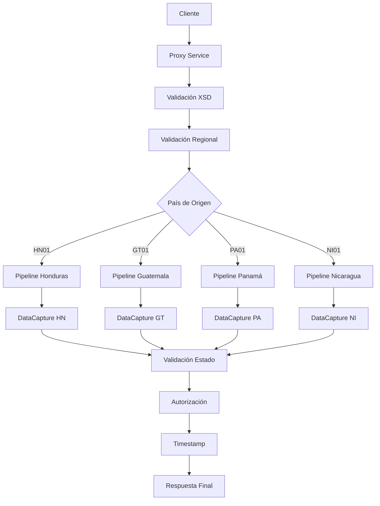

# Análisis Técnico: AutorizacionDataCapture

## Resumen Ejecutivo

El servicio **AutorizacionDataCapture** (autorizacionDataCapture) es un servicio Servicio Regional Multi-Core que permite la autorización de transacciones de data capture mediante identificador único. Implementa un patrón de Servicio Simple con validación de estado.

## Arquitectura del Servicio

### Patrón de Diseño
- **Tipo**: Servicio Regional Multi-Core
- **Versión**: V1
- **Protocolo**: SOAP/HTTP
- **Seguridad**: Custom Token Authentication

### Flujo de Ejecución



## Servicios Dependientes

### 1. DataCapture
- **Propósito**: Sistema backend para autorización de transacciones de data capture
- **Parámetros**: DATA_CAPTURE_ID
- **Respuesta**: TRANSACTION_DATE con timestamp de autorización
- **Validación**: Validación de existencia y estado de la transacción

## Transformaciones de Datos

### Procesamiento por País

| País | Código | Descripción Lógica | XQuery Request | XQuery Response |
|-------|--------|-------------------|----------------|----------------|
| Honduras | HN01 | Autorización directa con validación de estado local | [ARCHIVOS_REQUEST_HN] | [ARCHIVOS_RESPONSE_HN] |
| Guatemala | GT01 | Autorización con validación de estado Guatemala | [ARCHIVOS_REQUEST_GT] | [ARCHIVOS_RESPONSE_GT] |
| Panamá | PA01 | Autorización con validación de estado Panamá | [ARCHIVOS_REQUEST_PA] | [ARCHIVOS_RESPONSE_PA] |
| Nicaragua | NI01 | Autorización con validación de estado Nicaragua | [ARCHIVOS_REQUEST_NI] | [ARCHIVOS_RESPONSE_NI] |

## Conexiones por País

### Honduras (HN01)
```xml
<!-- HTTP -->
<service>[SERVICIO_HN]</service>
<endpoint>[ENDPOINT_DATACAPTURE_HN]</endpoint>
<operation>autorizacionDataCapture</operation>
<!-- Autenticación: Basic Authentication -->
```

### Guatemala (GT01)
```xml
<!-- HTTP -->
<service>[SERVICIO_GT]</service>
<endpoint>[ENDPOINT_DATACAPTURE_GT]</endpoint>
<operation>autorizacionDataCapture</operation>
<!-- Autenticación: Token Authentication -->
```

### Panamá (PA01)
```xml
<!-- HTTP -->
<service>[SERVICIO_PA]</service>
<endpoint>[ENDPOINT_DATACAPTURE_PA]</endpoint>
<operation>autorizacionDataCapture</operation>
<!-- Autenticación: OAuth 2.0 -->
```

### Nicaragua (NI01)
```xml
<!-- HTTP -->
<service>[SERVICIO_NI]</service>
<endpoint>[ENDPOINT_DATACAPTURE_NI]</endpoint>
<operation>autorizacionDataCapture</operation>
<!-- Autenticación: Basic Authentication -->
```

## Validación XSD

### Información General
- **Esquema XSD**: autorizacionDataCaptureTypes.xsd
- **Namespace**: http://www.ficohsa.com.hn/middleware.services/autorizacionDataCaptureTypes
- **Versión**: 1.0

### Archivos de Esquema

#### Ubicación
- **XSD Principal**: `MasterNuevo/Middleware/Business_Resources/dataCapture/AutorizacionDataCapture/autorizacionDataCaptureTypes.xsd`
- **WSDL**: `MasterNuevo/Middleware/Business_Resources/dataCapture/AutorizacionDataCapture/autorizacionDataCapturePS.wsdl`
- **Headers**: `MasterNuevo/Middleware/Business_Resources/esquemas_generales/HeaderElements.xsd`

#### Dependencias
- **Namespace http://www.ficohsa.com.hn/middleware.services/autType**: Para headers de autenticación
- **Namespace http://www.ficohsa.com.hn/middleware.services/autorizacionDataCaptureTypes**: Para tipos específicos del servicio

### Estructura del Request

#### Definición XSD Request
```xml
<xs:element name="autorizacionDataCapture">
    <xs:complexType>
        <xs:sequence>
            <xs:element name="DATA_CAPTURE_ID" type="xs:string"/>
        </xs:sequence>
    </xs:complexType>
</xs:element>
```

#### Ejemplo de Request Válido
> **Nota:** Los siguientes son datos de ejemplo no reales, utilizados únicamente para propósitos de testing y documentación.

```xml
<autorizacionDataCapture xmlns="http://www.ficohsa.com.hn/middleware.services/autorizacionDataCaptureTypes">
    <DATA_CAPTURE_ID>DC001234567890</DATA_CAPTURE_ID>
</autorizacionDataCapture>
```

### Estructura del Response

### Definiciones XSD Completas

#### Response Principal
```xml
<xs:element name="autorizacionDataCaptureResponse" type="cons:autorizacionDataCaptureResponseType">
</xs:element>

<xs:complexType name="autorizacionDataCaptureResponseType">
    <xs:sequence>
        <xs:element name="TRANSACTION_DATE"/>
    </xs:sequence>
</xs:complexType>
```

### Ejemplo de Response Válido

> **Nota:** Los siguientes son datos de ejemplo no reales, utilizados únicamente para propósitos de testing y documentación.

```xml
<autorizacionDataCaptureResponse xmlns="http://www.ficohsa.com.hn/middleware.services/autorizacionDataCaptureTypes">
    <TRANSACTION_DATE>2026-01-02T17:15:00.000Z</TRANSACTION_DATE>
</autorizacionDataCaptureResponse>
```

### Casos de Error XSD

#### Request Inválido - Campo Faltante
> **Nota:** Los siguientes son datos de ejemplo no reales, utilizados únicamente para propósitos de testing y documentación.

```xml
<!-- ERROR: Falta DATA_CAPTURE_ID -->
<autorizacionDataCapture xmlns="http://www.ficohsa.com.hn/middleware.services/autorizacionDataCaptureTypes">
    <!-- DATA_CAPTURE_ID faltante -->
</autorizacionDataCapture>
```

#### Request Inválido - Namespace Incorrecto
> **Nota:** Los siguientes son datos de ejemplo no reales, utilizados únicamente para propósitos de testing y documentación.

```xml
<!-- ERROR: Namespace incorrecto -->
<autorizacionDataCapture xmlns="http://wrong.namespace/">
    <DATA_CAPTURE_ID>DC001234567890</DATA_CAPTURE_ID>
</autorizacionDataCapture>
```

#### Response Inválido - Campo Requerido Faltante
> **Nota:** Los siguientes son datos de ejemplo no reales, utilizados únicamente para propósitos de testing y documentación.

```xml
<!-- ERROR: Falta TRANSACTION_DATE (requerido) -->
<autorizacionDataCaptureResponse xmlns="http://www.ficohsa.com.hn/middleware.services/autorizacionDataCaptureTypes">
    <!-- TRANSACTION_DATE faltante -->
</autorizacionDataCaptureResponse>
```

---

## Historial de Cambios

| Fecha | Versión | Autor | Descripción |
|-------|---------|-------|-------------|
| 2026-01-02 | 1.0 | ARQ FICOHSA | Creación inicial |
