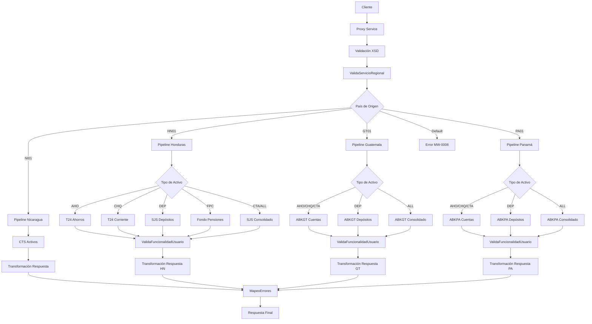

# Análisis Técnico: ConsultaActivosCliente

## Resumen Ejecutivo

El servicio **ConsultaActivosCliente** (FICBCO0043) es un servicio Router Dinámico Regional que permite consultar los activos financieros de un cliente específico por tipo de producto. Implementa un patrón de Router Dinámico Regional con soporte multi-core y regionalización por país.

## Arquitectura del Servicio

### Patrón de Diseño
- **Tipo**: Router Dinámico Regional
- **Versión**: v2
- **Protocolo**: SOAP/HTTP
- **Seguridad**: Custom Token Authentication

### Flujo de Ejecución



## Servicios Dependientes

### 1. ValidaServicioRegional
- **Propósito**: Validar disponibilidad del servicio por región
- **Parámetros**: serviceId="FICBCO0043", requestHeader
- **Respuesta**: PV_CODIGO_ERROR, PV_MENSAJE_ERROR
- **Validación**: Debe retornar SUCCESS para continuar

### 2. ValidaFuncionalidadUsuario
- **Propósito**: Validar permisos del usuario para consultar saldos
- **Parámetros**: functionality="SALDOS_ACTIVOS", requestHeader
- **Respuesta**: PV_CODIGO_ERROR, PV_VALOR
- **Validación**: Determina qué información mostrar al usuario

### 3. MapeoErrores
- **Propósito**: Mapear y transformar códigos de error
- **Parámetros**: CODIGO_ERROR, MENSAJE_ERROR con prefijo FICBCO0043
- **Respuesta**: ResponseHeader mapeado
- **Validación**: Se ejecuta cuando successIndicator != SUCCESS

## Transformaciones de Datos

### Procesamiento por País

| País | Código | Descripción Lógica | XQuery Request | XQuery Response |
|-------|--------|-------------------|----------------|----------------|
| Honduras | HN01 | Consulta diferenciada por tipo de activo usando T24, SJS y FondoPensiones | consultaActivosAhorrosClienteV2In.xq, consultaActivosCorrientesClienteV2In.xq, consultaActivosDepositosClienteIn.xq, consultaActivosClienteSjIn.xq | consultaActivosClienteHeaderV2Out.xq, consultaActivosClienteV2Out.xq, consultaActivosClienteSjHeaderOut.xq, consultaActivosClienteSjOut.xq |
| Guatemala | GT01 | Consulta directa a base de datos ABKGT por tipo específico | consultaListaCuentasGTIn.xq, consultaListaDepositosGTIn.xq, sjConsultaActivosClientesGTIn.xq | consultaListaCuentasGTHeaderOut.xq, consultaListaCuentasGTOut.xq, consultaListaDepositosGTHeaderOut.xq, consultaListaDepositosGTOut.xq, sjConsultaActivosClienteGTHdrOut.xq, sjConsultaActivosClienteGTOut.xq |
| Panamá | PA01 | Consulta directa a base de datos ABKPA por tipo específico | consultaListaCuentasPAIn.xq, consultaListaDepositosPAIn.xq, sjConsultaActivosClientesPAIn.xq | consultaListaCuentasPAHeaderOut.xq, consultaListaCuentasPAOut.xq, consultaListaDepositosPAHeaderOut.xq, consultaListaDepositosPAOut.xq, sjConsultaActivosClientePAHeaderOut.xq, sjConsultaActivosClientePAOut.xq |
| Nicaragua | NI01 | Consulta a sistema COBIS CTS | consultaActivosClienteNIIn.xq | consultaActivosClienteNIHeaderOut.xq, consultaActivosClienteNIOut.xq |

## Conexiones por País

### Honduras (HN01)
```xml
<!-- HTTP/SOAP Connections -->
<service>T24/ConsultaCuentaAhorro</service>
<endpoint>http://172.23.13.19:7003/svcConsultaCuentaAhorro/services</endpoint>
<operation>ConsultaCuentaAhorroxCliente</operation>

<service>T24/ConsultaCuentaCorriente</service>
<endpoint>http://172.23.13.19:7003/svcConsultaCuentaCorriente/services</endpoint>
<operation>ConsultaCuentaCorrientexCliente</operation>

<service>ConsultaFondoPensiones12c</service>
<endpoint>Internal Service</endpoint>
<operation>getAssetsCustomer</operation>

<!-- Flow Connections -->
<service>SJS/consultaActivosCliente</service>
<connection>flow:Middleware/v2/BusinessServices/SJS/consultaActivosCliente/flow/sjConsultaActivosCliente</connection>
<operation>consultaActivosCliente</operation>

<service>SJS/consultaCuentasCliente</service>
<connection>flow:Middleware/v2/BusinessServices/SJS/consultaCuentasCliente/flow/sjConsultaCuentasCliente</connection>
<operation>consultaActivosCliente</operation>

<service>consultasClienteBS</service>
<endpoint>http://10.9.104.55:7004/svcConsultasCliente/services</endpoint>
<operation>Consultadecliente, Consultadecertifdepporcliente</operation>
<!-- Autenticación: Custom Token Authentication -->
```

### Guatemala (GT01)
```xml
<!-- JCA/DB Connections -->
<service>ABKGT/consultaListaCuentas</service>
<connection>jca://eis/DB/ConnectionProxyAbanksGT</connection>
<operation>consultaListaCuentas</operation>

<service>ABKGT/consultaListaDepositos</service>
<connection>jca://eis/DB/ConnectionProxyAbanksGT</connection>
<operation>consultaListaDepositosCliente</operation>

<service>ABKGT/consultaActivosCliente</service>
<connection>flow:Middleware/v2/BusinessServices/ABKGT/consultaActivosCliente/flow/sjConsultaActivosCliente</connection>
<operation>consultaActivosCliente</operation>
```

### Panamá (PA01)
```xml
<!-- JCA/DB Connections -->
<service>ABKPA/consultaListaCuentas</service>
<connection>jca://eis/DB/ConnectionProxyAbanksPA</connection>
<operation>consultaListaCuentas</operation>

<service>ABKPA/consultaListaDepositos</service>
<connection>jca://eis/DB/ConnectionProxyAbanksPA</connection>
<operation>consultaListaDepositosCliente</operation>

<service>ABKPA/consultaActivosCliente</service>
<connection>flow:Middleware/v2/BusinessServices/ABKPA/consultaActivosCliente/flow/sjConsultaActivosCliente</connection>
<operation>consultaActivosCliente</operation>
```

### Nicaragua (NI01)
```xml
<!-- HTTP/SOAP Connection -->
<service>CTS/activos</service>
<endpoint>http://10.235.53.145:9080/GerenciaProductoActivos/SrvAplCobisActivosService</endpoint>
<operation>OpConsultaActivosCliente</operation>
<!-- Autenticación: Custom Token Authentication -->
```

## Validación XSD

### Información General
- **Esquema XSD**: consultaClientesTypes.xsd
- **Namespace**: http://www.ficohsa.com.hn/middleware.services/consultaClientesTypes
- **Versión**: 1.0

### Archivos de Esquema

#### Ubicación
- **XSD Principal**: `Middleware/v2/Resources/ConsultaActivosCliente/xsd/consultaClientesTypes.xsd`
- **WSDL**: `Middleware/v2/Resources/ConsultaActivosCliente/wsdl/consultaActivosClientePS.wsdl`
- **Headers**: `../../esquemas_generales/HeaderElements.xsd`

#### Dependencias
- **Namespace http://www.ficohsa.com.hn/middleware.services/autType**: Para elementos de autenticación y headers
- **Namespace http://www.ficohsa.com.hn/middleware.services/consultaClientesTypes**: Para tipos específicos del servicio

### Estructura del Request

#### Definición XSD Request
```xml
<xs:element name="consultaActivosClienteRequest">
    <xs:complexType>
        <xs:sequence>
            <xs:element name="CUSTOMER_ID" minOccurs="1" maxOccurs="1">
                <xs:simpleType>
                    <xs:restriction base="xs:string">
                        <xs:minLength value="1"/>
                    </xs:restriction>
                </xs:simpleType>
            </xs:element>
            <xs:element name="ASSET_TYPE" minOccurs="1" maxOccurs="1">
                <xs:simpleType>
                    <xs:restriction base="xs:string">
                        <xs:minLength value="1"/>
                    </xs:restriction>
                </xs:simpleType>
            </xs:element>
        </xs:sequence>
    </xs:complexType>
</xs:element>
```

#### Ejemplo de Request Válido
> **Nota:** Los siguientes son datos de ejemplo no reales, utilizados únicamente para propósitos de testing y documentación.

```xml
<consultaActivosClienteRequest xmlns="http://www.ficohsa.com.hn/middleware.services/consultaClientesTypes">
    <CUSTOMER_ID>12345678</CUSTOMER_ID>
    <ASSET_TYPE>ALL</ASSET_TYPE>
</consultaActivosClienteRequest>
```

### Estructura del Response

### Definiciones XSD Completas

#### Response Principal
```xml
<xs:element name="consultaActivosClienteResponse" type="cons:consultaActivosClienteResponseType">
</xs:element>

<xs:complexType name="consultaActivosClienteResponseType">
    <xs:sequence>
        <xs:element name="consultaActivosClienteAhorrosResponseType" type="cons:consultaActivosClienteResponseRecordType" minOccurs="0"/>
        <xs:element name="consultaActivosClienteCorrienteResponseType" type="cons:consultaActivosClienteResponseRecordType" minOccurs="0"/>
        <xs:element name="consultaActivosClienteDepositosResponseType" type="cons:consultaActivosClienteResponseRecordType" minOccurs="0"/>
        <xs:element name="consultaActivosClientePensionesResponseType" type="cons:consultaActivosClienteResponseRecordType" minOccurs="0"/>
    </xs:sequence>
</xs:complexType>
```

#### Tipos Complejos
```xml
<xs:complexType name="consultaActivosClienteResponseRecordType">
    <xs:sequence>
        <xs:element name="SUCCESS_INDICATOR" type="xs:string" minOccurs="0"/>
        <xs:element name="consultaActivosClienteResponseRecordType" type="cons:consultaActivosClienteResponseArrayType" minOccurs="0" maxOccurs="unbounded"/>
    </xs:sequence>
</xs:complexType>

<xs:complexType name="consultaActivosClienteResponseArrayType">
    <xs:sequence>
        <xs:element name="ASSET_TYPE" type="xs:string" minOccurs="0"/>
        <xs:element name="ASSET_NUMBER" type="xs:string" minOccurs="0"/>
        <xs:element name="ASSET_NAME" type="xs:string" minOccurs="0"/>
        <xs:element name="ASSET_CURRENCY" type="xs:string" minOccurs="0"/>
        <xs:element name="ASSET_TOTAL_BALANCE" type="xs:string" minOccurs="0"/>
        <xs:element name="ASSET_RESERVE_BALANCE" type="xs:string" minOccurs="0"/>
        <xs:element name="ASSET_LOCKED_BALANCE" type="xs:string" minOccurs="0"/>
        <xs:element name="ASSET_VISA_FLOATING_BALANCE" type="xs:string" minOccurs="0"/>
        <xs:element name="ASSET_AVAILABLE_BALANCE" type="xs:string" minOccurs="0"/>
        <xs:element name="ASSET_SOURCE_BANK" type="xs:string" minOccurs="0"/>
        <xs:element name="ASSET_PRODUCT_TYPE" type="xs:string" minOccurs="0"/>
        <xs:element name="INTERNATIONAL_ACCOUNT_NUMBER" type="xs:string" minOccurs="0"/>
        <xs:element name="OPENING_DATE" type="xs:string" minOccurs="0"/>
        <xs:element name="ACCOUNT_STATUS" type="xs:string" minOccurs="0"/>
    </xs:sequence>
</xs:complexType>
```

### Ejemplo de Response Válido

> **Nota:** Los siguientes son datos de ejemplo no reales, utilizados únicamente para propósitos de testing y documentación.

```xml
<consultaActivosClienteResponse xmlns="http://www.ficohsa.com.hn/middleware.services/consultaClientesTypes">
    <consultaActivosClienteAhorrosResponseType>
        <SUCCESS_INDICATOR>SUCCESS</SUCCESS_INDICATOR>
        <consultaActivosClienteResponseRecordType>
            <ASSET_TYPE>AHO</ASSET_TYPE>
            <ASSET_NUMBER>1234567890</ASSET_NUMBER>
            <ASSET_NAME>CUENTA DE AHORROS</ASSET_NAME>
            <ASSET_CURRENCY>HNL</ASSET_CURRENCY>
            <ASSET_TOTAL_BALANCE>15000.00</ASSET_TOTAL_BALANCE>
            <ASSET_AVAILABLE_BALANCE>14500.00</ASSET_AVAILABLE_BALANCE>
            <ASSET_SOURCE_BANK>HN01</ASSET_SOURCE_BANK>
            <ASSET_PRODUCT_TYPE>AHORROS</ASSET_PRODUCT_TYPE>
            <INTERNATIONAL_ACCOUNT_NUMBER>HN12FICH12345678901234567890</INTERNATIONAL_ACCOUNT_NUMBER>
            <OPENING_DATE>2023-01-15</OPENING_DATE>
            <ACCOUNT_STATUS>ACTIVE</ACCOUNT_STATUS>
        </consultaActivosClienteResponseRecordType>
    </consultaActivosClienteAhorrosResponseType>
</consultaActivosClienteResponse>
```

### Casos de Error XSD

#### Request Inválido - Campo Faltante
> **Nota:** Los siguientes son datos de ejemplo no reales, utilizados únicamente para propósitos de testing y documentación.

```xml
<!-- ERROR: Falta ASSET_TYPE -->
<consultaActivosClienteRequest xmlns="http://www.ficohsa.com.hn/middleware.services/consultaClientesTypes">
    <CUSTOMER_ID>12345678</CUSTOMER_ID>
    <!-- ASSET_TYPE faltante -->
</consultaActivosClienteRequest>
```

#### Request Inválido - Namespace Incorrecto
> **Nota:** Los siguientes son datos de ejemplo no reales, utilizados únicamente para propósitos de testing y documentación.

```xml
<!-- ERROR: Namespace incorrecto -->
<consultaActivosClienteRequest xmlns="http://wrong.namespace/">
    <CUSTOMER_ID>12345678</CUSTOMER_ID>
    <ASSET_TYPE>ALL</ASSET_TYPE>
</consultaActivosClienteRequest>
```

#### Response Inválido - Campo Requerido Faltante
> **Nota:** Los siguientes son datos de ejemplo no reales, utilizados únicamente para propósitos de testing y documentación.

```xml
<!-- ERROR: Estructura de respuesta incompleta -->
<consultaActivosClienteResponse xmlns="http://www.ficohsa.com.hn/middleware.services/consultaClientesTypes">
    <!-- Falta estructura interna de respuesta -->
</consultaActivosClienteResponse>
```

---

## Historial de Cambios

| Fecha | Versión | Autor | Descripción |
|-------|---------|-------|-------------|
| 2024-12-19 | 1.0 | ARQ FICOHSA | Creación inicial |