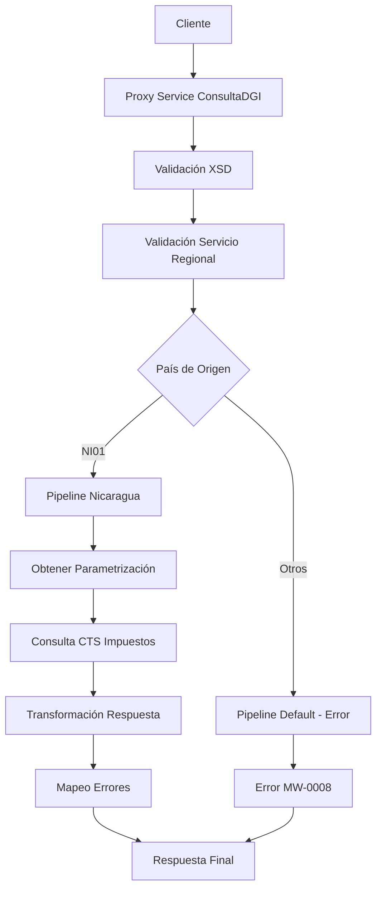

# Análisis Técnico: ConsultaDGI

## Resumen Ejecutivo

El servicio **ConsultaDGI** (FICBCO0256) es un servicio regional específico que permite consultar información de impuestos de la Dirección General de Ingresos (DGI) de Nicaragua. Implementa un patrón de servicio regional con validación previa y manejo centralizado de errores.

## Arquitectura del Servicio

### Patrón de Diseño
- **Tipo**: Servicio Regional Multi-Core
- **Versión**: v2
- **Protocolo**: SOAP/HTTP
- **Seguridad**: Custom Token Authentication

### Flujo de Ejecución



## Servicios Dependientes

### 1. ValidaServicioRegional
- **Propósito**: Validar disponibilidad del servicio por región
- **Parámetros**: serviceId "FICBCO0256", requestHeader
- **Respuesta**: PV_CODIGO_ERROR, PV_MENSAJE_ERROR
- **Validación**: Si código != 'SUCCESS', retorna error

### 2. ObtenerParametrizacion
- **Propósito**: Obtener parámetros de configuración específicos
- **Parámetros**: FICBCO0256.TIPOCONSULTADGI, FICBCO0256.CODIGOBANCODGI
- **Respuesta**: Valores de configuración para el servicio
- **Validación**: Verifica que no haya errores en la obtención

### 3. CTS/impuesto
- **Propósito**: Consultar información de impuestos en el sistema CTS
- **Parámetros**: RUC, tipoConsulta, codigoBanco, BIT
- **Respuesta**: Datos completos del impuesto (montos, fechas, descripciones)
- **Validación**: Esquema XSD del servicio CTS

### 4. MapeoErrores
- **Propósito**: Mapeo centralizado de códigos de error
- **Parámetros**: CODIGO_ERROR, MENSAJE_ERROR con prefijo FICBCO0256
- **Respuesta**: Error mapeado según estándares del banco
- **Validación**: Aplicado en casos de error y en pipeline de error

## Transformaciones de Datos

### Procesamiento por País

| País | Código | Descripción Lógica | XQuery Request | XQuery Response |
|-------|--------|-------------------|----------------|----------------|
| Nicaragua | NI01 | Obtiene parámetros y consulta CTS de impuestos | MasterNuevo/Middleware/v2/Resources/ConsultaDGI/xq/consultaDGIIn.xq | MasterNuevo/Middleware/v2/Resources/ConsultaDGI/xq/consultaDGIOut.xq, MasterNuevo/Middleware/v2/Resources/ConsultaDGI/xq/consultaDGIHeaderOut.xq |
| Default | Otros | Retorna error de servicio no implementado | N/A | N/A |

## Conexiones por País

### Nicaragua (NI01)
```xml
<!-- HTTP -->
<service>CTS/impuesto</service>
<endpoint>[ENDPOINT_CTS_NICARAGUA]</endpoint>
<operation>OpConsultaDGI</operation>
<!-- Autenticación: No especificada (manejada por CTS) -->
```

### Default (Otros Países)
```xml
<!-- ERROR -->
<service>N/A</service>
<error>MW-0008: SERVICE NOT IMPLEMENTED YET FOR THIS COUNTRY/COMPANY</error>
```

## Validación XSD

### Información General
- **Esquema XSD**: consultaDGITypes.xsd
- **Namespace**: http://www.ficohsa.com.hn/middleware.services/consultaDGITypes
- **Versión**: v2

### Archivos de Esquema

#### Ubicación
- **XSD Principal**: `MasterNuevo/Middleware/v2/Resources/ConsultaDGI/xsd/consultaDGITypes.xsd`
- **WSDL**: `MasterNuevo/Middleware/v2/Resources/ConsultaDGI/wsdl/consultaDGIPS.wsdl`
- **Headers**: `MasterNuevo/Middleware/v2/Resources/esquemas_generales/HeaderElements.xsd`

#### Dependencias
- **Namespace http://www.ficohsa.com.hn/middleware.services/autType**: Para headers de autenticación
- **Namespace http://www.ficohsa.com.hn/middleware.services/consultaDGITypes**: Para tipos específicos del servicio

### Estructura del Request

#### Definición XSD Request
```xml
<xs:element name="consultaDGI">
    <xs:complexType>
        <xs:sequence>
            <xs:element name="RUC" type="dnh:stringMinLength1" minOccurs="1"/>
            <xs:element name="BILL_NUMBER" type="dnh:stringMinLength1" minOccurs="1"/>
        </xs:sequence>
    </xs:complexType>
</xs:element>

<xs:simpleType name="stringMinLength1">
    <xs:restriction base="xs:string">
        <xs:minLength value="1" />
    </xs:restriction>
</xs:simpleType>
```

#### Ejemplo de Request Válido
> **Nota:** Los siguientes son datos de ejemplo no reales, utilizados únicamente para propósitos de testing y documentación.

```xml
<consultaDGI xmlns="http://www.ficohsa.com.hn/middleware.services/consultaDGITypes">
    <RUC>J0310000000001</RUC>
    <BILL_NUMBER>123456789</BILL_NUMBER>
</consultaDGI>
```

### Estructura del Response

### Definiciones XSD Completas

#### Response Principal
```xml
<xs:element name="consultaDGIResponse">
    <xs:complexType>
        <xs:sequence>
            <xs:element name="TOTAL_AMOUNT" type="xs:decimal" minOccurs="0"/>
            <xs:element name="DUE_DATE" type="xs:date" minOccurs="0"/>
            <xs:element name="TAX_VALUE" type="xs:decimal" minOccurs="0"/>
            <xs:element name="EXCH_RATE_FEE" type="xs:decimal" minOccurs="0"/>
            <xs:element name="LATE_FEE" type="xs:decimal" minOccurs="0"/>
            <xs:element name="PENALTY_FEE" type="xs:decimal" minOccurs="0"/>
            <xs:element name="BILL_AMOUNT" type="xs:decimal" minOccurs="0"/>
            <xs:element name="ACCOUNT_CODE" type="xs:string" minOccurs="0"/>
            <xs:element name="TAX_DESCRIPTION" type="xs:string" minOccurs="0"/>
        </xs:sequence>
    </xs:complexType>
</xs:element>
```

### Ejemplo de Response Válido

> **Nota:** Los siguientes son datos de ejemplo no reales, utilizados únicamente para propósitos de testing y documentación.

```xml
<consultaDGIResponse xmlns="http://www.ficohsa.com.hn/middleware.services/consultaDGITypes">
    <TOTAL_AMOUNT>1500.00</TOTAL_AMOUNT>
    <DUE_DATE>2024-12-31</DUE_DATE>
    <TAX_VALUE>1200.00</TAX_VALUE>
    <EXCH_RATE_FEE>50.00</EXCH_RATE_FEE>
    <LATE_FEE>100.00</LATE_FEE>
    <PENALTY_FEE>150.00</PENALTY_FEE>
    <BILL_AMOUNT>1500.00</BILL_AMOUNT>
    <ACCOUNT_CODE>ACC001</ACCOUNT_CODE>
    <TAX_DESCRIPTION>Impuesto sobre la Renta</TAX_DESCRIPTION>
</consultaDGIResponse>
```

### Casos de Error XSD

#### Request Inválido - Campo Faltante
> **Nota:** Los siguientes son datos de ejemplo no reales, utilizados únicamente para propósitos de testing y documentación.

```xml
<!-- ERROR: Falta BILL_NUMBER -->
<consultaDGI xmlns="http://www.ficohsa.com.hn/middleware.services/consultaDGITypes">
    <RUC>J0310000000001</RUC>
    <!-- BILL_NUMBER faltante -->
</consultaDGI>
```

#### Request Inválido - Namespace Incorrecto
> **Nota:** Los siguientes son datos de ejemplo no reales, utilizados únicamente para propósitos de testing y documentación.

```xml
<!-- ERROR: Namespace incorrecto -->
<consultaDGI xmlns="http://wrong.namespace/">
    <RUC>J0310000000001</RUC>
    <BILL_NUMBER>123456789</BILL_NUMBER>
</consultaDGI>
```

#### Request Inválido - Campo Vacío
> **Nota:** Los siguientes son datos de ejemplo no reales, utilizados únicamente para propósitos de testing y documentación.

```xml
<!-- ERROR: RUC vacío (viola stringMinLength1) -->
<consultaDGI xmlns="http://www.ficohsa.com.hn/middleware.services/consultaDGITypes">
    <RUC></RUC>
    <BILL_NUMBER>123456789</BILL_NUMBER>
</consultaDGI>
```

---

## Historial de Cambios

| Fecha | Versión | Autor | Descripción |
|-------|---------|-------|-------------|
| 2024-12-19 | 1.0 | ARQ FICOHSA | Creación inicial |