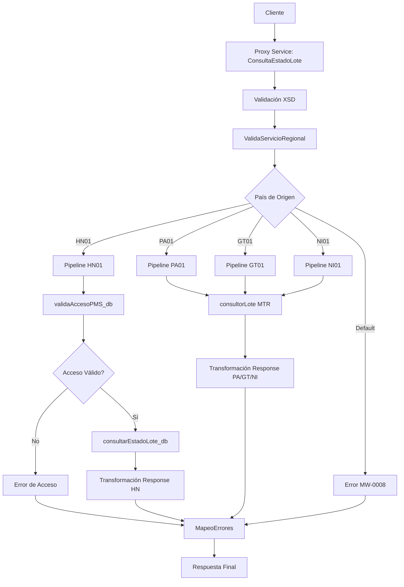

# Análisis Técnico: ConsultaEstadoLote

## Resumen Ejecutivo

El servicio **ConsultaEstadoLote** (FICBCO0231) es un servicio regional multi-core que permite consultar el estado de un lote de pagos masivos. Implementa un patrón de regionalización por país con diferentes backends según la región.

## Arquitectura del Servicio

### Patrón de Diseño
- **Tipo**: Servicio Regional Multi-Core
- **Versión**: v2
- **Protocolo**: SOAP/HTTP
- **Seguridad**: Custom Token Authentication (RequestHeader)

### Flujo de Ejecución



## Servicios Dependientes

### 1. ValidaServicioRegional
- **Propósito**: Validar que el servicio esté disponible para la región solicitada
- **Parámetros**: RequestHeader, serviceId="FICBCO0231"
- **Respuesta**: PV_CODIGO_ERROR, PV_MENSAJE_ERROR
- **Validación**: Si PV_CODIGO_ERROR != 'SUCCESS', se retorna error

### 2. validaAccesoPMS_db (Solo HN01)
- **Propósito**: Validar que el usuario tenga acceso al sistema de pagos masivos
- **Parámetros**: CUSTOMER_ID, USER_NAME
- **Respuesta**: ERROR_MESSAGE
- **Validación**: Si ERROR_MESSAGE no está vacío, se retorna error

### 3. consultarEstadoLote_db (Solo HN01)
- **Propósito**: Consultar el estado del lote en la base de datos local
- **Parámetros**: PV_CODIGOCLIENTE, PN_NUMEROLOTE, PD_FECINGRESO
- **Respuesta**: OutputParameters con información del lote
- **Validación**: Se valida el successIndicator del ResponseHeader

### 4. consultorLote (PA01, GT01, NI01)
- **Propósito**: Consultar el estado del lote mediante servicio web MTR
- **Parámetros**: solicitudConsultaLote (fechaRegistroLote, idBancoOrigen, idCliente, idLote)
- **Respuesta**: consultarLoteResponse con información del lote
- **Validación**: Se valida contra WSDL consultorLoteEndpoint

### 5. MapeoErrores
- **Propósito**: Mapear códigos de error técnicos a mensajes de negocio
- **Parámetros**: CODIGO_ERROR, MENSAJE_ERROR (con prefijo "FICBCO0231$#$")
- **Respuesta**: ResponseHeader con error mapeado
- **Validación**: Se aplica cuando successIndicator != "SUCCESS"

## Transformaciones de Datos

### Procesamiento por País

| País | Código | Descripción Lógica | XQuery Request | XQuery Response |
|-------|--------|-------------------|----------------|----------------|
| Honduras | HN01 | Valida acceso PMS y consulta en BD local ProxyAbanksHN | MasterNuevo/Middleware/v2/Resources/ConsultaEstadoLote/xq/consultaEstadoLoteIn.xq | MasterNuevo/Middleware/v2/Resources/ConsultaEstadoLote/xq/consultaEstadoLoteOut.xq, consultaEstadoLoteHeaderOut.xq |
| Panamá | PA01 | Consulta mediante servicio web MTR con transformación específica | MasterNuevo/Middleware/v2/Resources/ConsultaEstadoLote/xq/consultaEstadoLotePAIn.xq | MasterNuevo/Middleware/v2/Resources/ConsultaEstadoLote/xq/consultaEstadoLotePAOut.xq, consultaEstadoLotePAHeaderOut.xq |
| Guatemala | GT01 | Consulta mediante servicio web MTR con transformación específica | MasterNuevo/Middleware/v2/Resources/ConsultaEstadoLote/xq/consultaEstadoLoteGTIn.xq | MasterNuevo/Middleware/v2/Resources/ConsultaEstadoLote/xq/consultaEstadoLoteGTOut.xq, consultaEstadoLoteGTHeaderOut.xq |
| Nicaragua | NI01 | Consulta mediante servicio web MTR con transformación específica | MasterNuevo/Middleware/v2/Resources/ConsultaEstadoLote/xq/consultaEstadoLoteNIIn.xq | MasterNuevo/Middleware/v2/Resources/ConsultaEstadoLote/xq/consultaEstadoLoteNIOut.xq, consultaEstadoLoteNIHeaderOut.xq |

## Conexiones por País

### Honduras (HN01)
```xml
<!-- JCA Database Connection -->
<service>consultarEstadoLote_db</service>
<connection>[CONNECTION_PROXYABANKSHN]</connection>
<operation>consultarEstadoLote</operation>
<package>PMS_K_PAGOS_MASIVOS</package>
<procedure>PMS_P_CON_ESTADO_LOTE</procedure>
```

### Panamá (PA01)
```xml
<!-- HTTP SOAP Connection -->
<service>consultorLote</service>
<endpoint>[ENDPOINT_MTR_PA]</endpoint>
<operation>consultarLote</operation>
<!-- Autenticación: No especificada en XQuery (manejada por el servicio web) -->
```

### Guatemala (GT01)
```xml
<!-- HTTP SOAP Connection -->
<service>consultorLote</service>
<endpoint>[ENDPOINT_MTR_GT]</endpoint>
<operation>consultarLote</operation>
<!-- Autenticación: No especificada en XQuery (manejada por el servicio web) -->
```

### Nicaragua (NI01)
```xml
<!-- HTTP SOAP Connection -->
<service>consultorLote</service>
<endpoint>[ENDPOINT_MTR_NI]</endpoint>
<operation>consultarLote</operation>
<!-- Autenticación: No especificada en XQuery (manejada por el servicio web) -->
```

## Validación XSD

### Información General
- **Esquema XSD**: pagosMasivosTypes.xsd
- **Namespace**: http://www.ficohsa.com.hn/middleware.services/pagosMasivosTypes
- **Versión**: 1.0

### Archivos de Esquema

#### Ubicación
- **XSD Principal**: `MasterNuevo/Middleware/v2/Resources/PagosMasivos/xsd/pagosMasivosTypes.xsd`
- **WSDL**: `MasterNuevo/Middleware/v2/Resources/ConsultaEstadoLote/wsdl/consultaEstadoLotePS.wsdl`
- **Headers**: `MasterNuevo/Middleware/v2/Resources/esquemas_generales/HeaderElements.xsd`

#### Dependencias
- **Namespace http://www.ficohsa.com.hn/middleware.services/autType**: Para RequestHeader y ResponseHeader
- **Namespace http://www.ficohsa.com.hn/middleware.services/PagingTypes**: Para tipos de paginación (importado pero no usado en esta operación)

### Estructura del Request

#### Definición XSD Request
```xml
<xs:element name="consultaEstadoLote">
    <xs:complexType>
        <xs:sequence>
            <xs:element name="CUSTOMER_ID" minOccurs="1" maxOccurs="1">
                <xs:simpleType>
                    <xs:restriction base="xs:string">
                        <xs:minLength value="1"/>
                    </xs:restriction>
                </xs:simpleType>
            </xs:element>
            <xs:element name="BANK_BATCH_ID" type="xs:integer" minOccurs="1" maxOccurs="1"/>
            <xs:element name="UPLOAD_DATE" type="xs:date" minOccurs="0" maxOccurs="1"/>
        </xs:sequence>
    </xs:complexType>
</xs:element>
```

#### Tabla de Campos Request

| Campo | Tipo XSD | Obligatorio | Cardinalidad | Descripción |
|-------|----------|-------------|--------------|-------------|
| consultaEstadoLote | complexType | Sí | 1..1 | Elemento raíz del request |
| CUSTOMER_ID | string (minLength=1) | Sí | 1..1 | Identificador del cliente |
| BANK_BATCH_ID | integer | Sí | 1..1 | Identificador del lote en el banco |
| UPLOAD_DATE | date | No | 0..1 | Fecha de carga del lote |

**Total de campos documentados: 4/4 (100%)**

#### Ejemplo de Request Válido
> **Nota:** Los siguientes son datos de ejemplo no reales, utilizados únicamente para propósitos de testing y documentación.

```xml
<pag:consultaEstadoLote xmlns:pag="http://www.ficohsa.com.hn/middleware.services/pagosMasivosTypes">
    <CUSTOMER_ID>12345678</CUSTOMER_ID>
    <BANK_BATCH_ID>100001</BANK_BATCH_ID>
    <UPLOAD_DATE>2024-01-15</UPLOAD_DATE>
</pag:consultaEstadoLote>
```

### Estructura del Response

#### Definición XSD Response
```xml
<xs:element name="consultaEstadoLoteResponse">
    <xs:complexType>
        <xs:sequence>
            <xs:element name="BANK_BATCH_ID" type="pag:stringMinLength1" minOccurs="0"/>
            <xs:element name="CUSTOMER_ID" type="pag:stringMinLength1" minOccurs="0"/>
            <xs:element name="CUSTOMER_NAME" type="pag:stringMinLength1" minOccurs="0"/>
            <xs:element name="STATUS" type="pag:stringMinLength1" minOccurs="0"/>
            <xs:element name="STATUS_DESC" type="pag:stringMinLength1" minOccurs="0"/>
            <xs:element name="OPTIMISTIC" type="pag:yesNoType" minOccurs="0"/>
            <xs:element name="ACCOUNTS" minOccurs="0">
                <xs:complexType>
                    <xs:sequence>
                        <xs:element name="ACCOUNT" type="pag:accountType" maxOccurs="unbounded"/>
                    </xs:sequence>
                </xs:complexType>
            </xs:element>
            <xs:element name="PAYMENTS" minOccurs="0">
                <xs:complexType>
                    <xs:sequence>
                        <xs:element name="PAYMENT" type="pag:paymentType" maxOccurs="unbounded"/>
                    </xs:sequence>
                </xs:complexType>
            </xs:element>
            <xs:element name="TOTAL_AMOUNT" type="xs:decimal" minOccurs="0"/>
            <xs:element name="TOTAL_AMOUNT_ERROR" type="xs:decimal" minOccurs="0" maxOccurs="1"/>
            <xs:element name="NUMBER_OF_TRANSACTIONS" type="xs:integer" minOccurs="0"/>
            <xs:element name="NUMBER_OF_TRANSACTIONS_SUCCESS" type="xs:integer" minOccurs="0"/>
            <xs:element name="NUMBER_OF_TRANSACTIONS_ERROR" type="xs:integer" minOccurs="0"/>
            <xs:element name="APPLICATION_DATE" type="xs:dateTime" minOccurs="0"/>
            <xs:element name="PROCESS_INFO" type="xs:string" minOccurs="0"/>
        </xs:sequence>
    </xs:complexType>
</xs:element>
```

#### Tipos Complejos
```xml
<!-- accountType -->
<xs:complexType name="accountType">
    <xs:sequence>
        <xs:element name="DEBIT_ACCOUNT" type="pag:stringMinLength1" minOccurs="0"/>
        <xs:element name="AMOUNT" type="xs:decimal" minOccurs="0"/>
        <xs:element name="CURRENCY" type="pag:stringMinLength1" minOccurs="0"/>
    </xs:sequence>
</xs:complexType>

<!-- paymentType -->
<xs:complexType name="paymentType">
    <xs:sequence>
        <xs:element name="CURRENCY" type="pag:stringMinLength1" minOccurs="0"/>
        <xs:element name="TOTAL_AMOUNT" type="xs:decimal" minOccurs="0"/>
        <xs:element name="EXCHANGE_RATE" type="xs:decimal" minOccurs="0"/>
    </xs:sequence>
</xs:complexType>

<!-- yesNoType -->
<xs:simpleType name="yesNoType">
    <xs:restriction base="xs:string">
        <xs:enumeration value="YES"/>
        <xs:enumeration value="NO"/>
    </xs:restriction>
</xs:simpleType>

<!-- stringMinLength1 -->
<xs:simpleType name="stringMinLength1">
    <xs:restriction base="xs:string">
        <xs:minLength value="1"/>
    </xs:restriction>
</xs:simpleType>
```

#### Tabla de Campos Response

| Campo | Tipo XSD | Obligatorio | Cardinalidad | Descripción |
|-------|----------|-------------|--------------|-------------|
| consultaEstadoLoteResponse | complexType | Sí | 1..1 | Elemento raíz del response |
| BANK_BATCH_ID | stringMinLength1 | No | 0..1 | Identificador del lote en el banco |
| CUSTOMER_ID | stringMinLength1 | No | 0..1 | Identificador del cliente |
| CUSTOMER_NAME | stringMinLength1 | No | 0..1 | Nombre del cliente |
| STATUS | stringMinLength1 | No | 0..1 | Estado del lote |
| STATUS_DESC | stringMinLength1 | No | 0..1 | Descripción del estado |
| OPTIMISTIC | yesNoType | No | 0..1 | Indicador de procesamiento optimista (YES/NO) |
| ACCOUNTS | complexType | No | 0..1 | Cuentas involucradas en el lote |
| ACCOUNTS/ACCOUNT | accountType | No | 0..unbounded | Información de cuenta individual |
| ACCOUNT/DEBIT_ACCOUNT | stringMinLength1 | No | 0..1 | Cuenta de débito |
| ACCOUNT/AMOUNT | decimal | No | 0..1 | Monto de la cuenta |
| ACCOUNT/CURRENCY | stringMinLength1 | No | 0..1 | Moneda de la cuenta |
| PAYMENTS | complexType | No | 0..1 | Pagos del lote |
| PAYMENTS/PAYMENT | paymentType | No | 0..unbounded | Información de pago individual |
| PAYMENT/CURRENCY | stringMinLength1 | No | 0..1 | Moneda del pago |
| PAYMENT/TOTAL_AMOUNT | decimal | No | 0..1 | Monto total del pago |
| PAYMENT/EXCHANGE_RATE | decimal | No | 0..1 | Tasa de cambio aplicada |
| TOTAL_AMOUNT | decimal | No | 0..1 | Monto total del lote |
| TOTAL_AMOUNT_ERROR | decimal | No | 0..1 | Monto total con error |
| NUMBER_OF_TRANSACTIONS | integer | No | 0..1 | Número total de transacciones |
| NUMBER_OF_TRANSACTIONS_SUCCESS | integer | No | 0..1 | Número de transacciones exitosas |
| NUMBER_OF_TRANSACTIONS_ERROR | integer | No | 0..1 | Número de transacciones con error |
| APPLICATION_DATE | dateTime | No | 0..1 | Fecha de aplicación del lote |
| PROCESS_INFO | string | No | 0..1 | Información adicional del proceso |

**Total de campos documentados: 25/25 (100%)**

### Ejemplo de Response Válido

> **Nota:** Los siguientes son datos de ejemplo no reales, utilizados únicamente para propósitos de testing y documentación.

```xml
<pag:consultaEstadoLoteResponse xmlns:pag="http://www.ficohsa.com.hn/middleware.services/pagosMasivosTypes">
    <BANK_BATCH_ID>100001</BANK_BATCH_ID>
    <CUSTOMER_ID>12345678</CUSTOMER_ID>
    <CUSTOMER_NAME>Empresa Demo S.A.</CUSTOMER_NAME>
    <STATUS>PROCESSED</STATUS>
    <STATUS_DESC>Lote procesado exitosamente</STATUS_DESC>
    <OPTIMISTIC>YES</OPTIMISTIC>
    <ACCOUNTS>
        <ACCOUNT>
            <DEBIT_ACCOUNT>1234567890</DEBIT_ACCOUNT>
            <AMOUNT>50000.00</AMOUNT>
            <CURRENCY>HNL</CURRENCY>
        </ACCOUNT>
    </ACCOUNTS>
    <PAYMENTS>
        <PAYMENT>
            <CURRENCY>HNL</CURRENCY>
            <TOTAL_AMOUNT>50000.00</TOTAL_AMOUNT>
            <EXCHANGE_RATE>1.00</EXCHANGE_RATE>
        </PAYMENT>
    </PAYMENTS>
    <TOTAL_AMOUNT>50000.00</TOTAL_AMOUNT>
    <TOTAL_AMOUNT_ERROR>0.00</TOTAL_AMOUNT_ERROR>
    <NUMBER_OF_TRANSACTIONS>100</NUMBER_OF_TRANSACTIONS>
    <NUMBER_OF_TRANSACTIONS_SUCCESS>98</NUMBER_OF_TRANSACTIONS_SUCCESS>
    <NUMBER_OF_TRANSACTIONS_ERROR>2</NUMBER_OF_TRANSACTIONS_ERROR>
    <APPLICATION_DATE>2024-01-15T10:30:00</APPLICATION_DATE>
    <PROCESS_INFO>Procesamiento completado</PROCESS_INFO>
</pag:consultaEstadoLoteResponse>
```

### Casos de Error XSD

#### Error de Validación XSD
```xml
<ctx:errorCode>OSB-382033</ctx:errorCode>
<ctx:reason>Validation failed for element consultaEstadoLote: CUSTOMER_ID is required</ctx:reason>
```

#### Error de Servicio Regional
```xml
<aut:ResponseHeader>
    <successIndicator>ERROR</successIndicator>
    <messages>Servicio no disponible para la región solicitada</messages>
</aut:ResponseHeader>
```

### Estadísticas de Validación

- **Total de elementos XSD**: 29 (4 request + 25 response)
- **Elementos obligatorios**: 3 (CUSTOMER_ID, BANK_BATCH_ID en request, consultaEstadoLoteResponse en response)
- **Elementos opcionales**: 26
- **Tipos complejos**: 4 (consultaEstadoLote, consultaEstadoLoteResponse, accountType, paymentType)
- **Tipos simples personalizados**: 2 (stringMinLength1, yesNoType)
- **Completitud de documentación**: 100% (29/29 campos documentados)

---

## Notas Técnicas Adicionales

### Manejo de Errores
- Todos los errores son capturados por el error handler `_onErrorHandler`
- Los errores se mapean mediante el servicio MapeoErrores con código FICBCO0231
- El response body se vacía en caso de error: `<pag:consultaEstadoLoteResponse/>`

### Validaciones Especiales
- **HN01**: Validación adicional de acceso PMS mediante validaAccesoPMS_db
- **PA01/GT01/NI01**: Validación del request contra WSDL consultorLoteEndpoint antes de invocar el servicio

### Configuración de Conexiones
- **HN01**: JCA Connection a ProxyAbanksHN (base de datos)
- **PA01/GT01/NI01**: HTTP Connection al servicio MTR (endpoint parametrizado por país)
- **MapeoErrores**: JCA Connection a ConnectionMiddleware

### Transformaciones XQuery
- Cada país tiene transformaciones específicas para request y response
- Honduras transforma a stored procedure parameters
- PA01/GT01/NI01 transforman a formato MTR con ligeras variaciones por país
