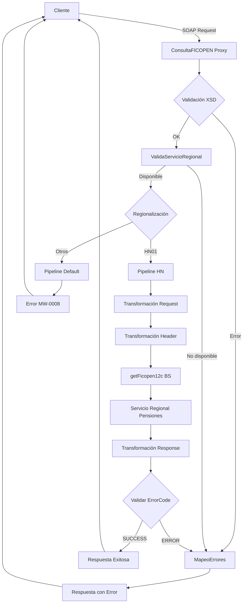

# Análisis Técnico: ConsultaFICOPEN

## 1. Resumen Ejecutivo

**Nombre del Servicio:** ConsultaFICOPEN  
**Código FICBCO:** FICBCO0110  
**Tipo de Servicio:** Servicio Regional Multi-Core  
**Patrón de Diseño:** Proxy Service con regionalización por país

**Descripción Funcional:**  
El servicio ConsultaFICOPEN permite consultar información detallada de cuentas FICOPEN (Fondo Individual de Capitalización de Prestaciones Laborales) de los clientes. Proporciona datos completos del cliente, información del contrato, y un detalle histórico de balances que incluye contribuciones, intereses, retiros, comisiones y seguros. El servicio está diseñado para soportar múltiples países mediante regionalización, actualmente implementado para Honduras (HN01).

---

## 2. Arquitectura del Servicio

### 2.1. Patrón de Diseño

El servicio implementa un patrón de **Proxy Service con Regionalización por País**, donde:
- Se valida la estructura del mensaje contra XSD
- Se valida la disponibilidad del servicio por región
- Se enruta la petición según el país de origen (SourceBank)
- Se transforma el mensaje para adaptarlo al proveedor regional
- Se maneja la respuesta y errores de forma estandarizada

### 2.2. Diagrama de Flujo



### 2.3. Flujo Detallado por Etapa

**Etapa 1: Validaciones Generales**
1. Validación XSD contra consultaFICOPENTypes.xsd
2. Validación de servicio regional con serviceId "FICBCO0110"
3. Aplicación de valores por defecto de región

**Etapa 2: Regionalización (HN01 - Honduras)**
1. Transformación de request mediante getFICOPENIn.xq
2. Construcción de header de autenticación mediante getFICOPENHeaderIn.xq
3. Invocación a getFicopen12c business service
4. Evaluación de código de respuesta (SUCCESS/ERROR)
5. Transformación de response mediante getFICOPENOut.xq (si SUCCESS)
6. Mapeo de errores mediante MapeoErrores (si ERROR)

**Etapa 3: Regionalización (Default - Otros Países)**
1. Retorno de error MW-0008 "SERVICE NOT IMPLEMENTED YET FOR THIS COUNTRY/COMPANY"

---

## 3. Servicios Dependientes

### 3.1. Business Services

| Servicio | Tipo | Propósito | Conexión |
|----------|------|-----------|----------|
| getFicopen12c | HTTP/SOAP | Consulta de información FICOPEN en sistema regional de pensiones | [ENDPOINT_FICOPEN_HN01] |
| ValidaServicioRegional_db | JCA/Database | Validación de disponibilidad del servicio por región | [CONNECTION_MIDDLEWARE] |
| mapeodeErrores_db | JCA/Database | Mapeo de códigos de error | [CONNECTION_MIDDLEWARE] |
| guardarBitacoraMapeoErrores_db | JCA/Database | Registro de bitácora de errores mapeados | [CONNECTION_MIDDLEWARE] |
| consultaFICOPENBS | JCA/Database | Business service legacy de consulta FICOPEN | [CONNECTION_FICOPEN] |

### 3.2. Proxy Services

| Servicio | Operación | Propósito |
|----------|-----------|-----------|
| MapeoErrores | mapeoErrores | Estandarización de códigos de error con código de servicio FICBCO0110 |

---

## 4. Transformaciones de Datos

### 4.1. Transformaciones por País

| País | Código | Descripción de Lógica | Archivos XQuery Request | Archivos XQuery Response |
|------|--------|------------------------|-------------------------|--------------------------|
| Honduras | HN01 | Consulta de información FICOPEN mediante servicio regional de pensiones. Se construye el request con los parámetros de entrada (INVESTMENT_CODE, START_DATE, END_DATE) y se agrega header de autenticación con credenciales OSB12AUTH. La respuesta incluye datos del cliente, contrato y detalle de balances históricos. | MasterNuevo/Middleware/v2/Resources/ConsultaFICOPEN/xq/getFICOPENIn.xq | MasterNuevo/Middleware/v2/Resources/ConsultaFICOPEN/xq/getFICOPENOut.xq |
| Default | N/A | Retorna error MW-0008 indicando que el servicio no está implementado para el país/empresa solicitado | N/A | N/A |

### 4.2. Transformaciones de Header

| País | Archivo XQuery | Descripción |
|------|----------------|-------------|
| Honduras (HN01) | MasterNuevo/Middleware/v2/Resources/ConsultaFICOPEN/xq/getFICOPENHeaderIn.xq | Construye el header de autenticación obteniendo credenciales de Middleware/Security/OSB12AUTH y configurando SourceBank y DestinationBank |

---

## 5. Conexiones por País

### 5.1. Honduras (HN01)

| Servicio Backend | Tipo Conexión | Endpoint | Operación | Timeout | Autenticación |
|------------------|---------------|----------|-----------|---------|---------------|
| getFicopen12c | HTTP/SOAP | [ENDPOINT_FICOPEN_HN01] | consultaFICOPEN | 70s (connection: 65s) | Basic Auth (OSB12AUTH) |

**Detalles de Autenticación:**
- Tipo: Basic Authentication
- Credenciales: Obtenidas de Middleware/Security/OSB12AUTH mediante fn-bea:lookupBasicCredentials
- Método: Las credenciales se inyectan en el header mediante transformación XQuery

---

## 6. Validación XSD

### 6.1. Información del Esquema

**Archivo XSD Principal:** consultaFICOPENTypes.xsd  
**Namespace:** http://www.ficohsa.com.hn/middleware.services/consultaFICOPENTypes  
**Ubicación:** MasterNuevo/Middleware/v2/Resources/ConsultaFICOPEN/xsd/consultaFICOPENTypes.xsd  
**WSDL:** MasterNuevo/Middleware/v2/Resources/ConsultaFICOPEN/wsdl/consultaFICOPENPS.wsdl

### 6.2. Estructura del Request

**Elemento:** consultaFICOPEN

| Campo | Tipo | Obligatorio | Restricciones | Descripción |
|-------|------|-------------|---------------|-------------|
| INVESTMENT_CODE | string | Sí | minLength=1 | Código de inversión del cliente |
| START_DATE | string | Sí | length=8 | Fecha de inicio del período (formato: YYYYMMDD) |
| END_DATE | string | Sí | length=8 | Fecha de fin del período (formato: YYYYMMDD) |

**Ejemplo de Request:**

> **Nota:** Los siguientes son datos de ejemplo no reales, utilizados únicamente para propósitos de testing y documentación.

```xml
<consultaFICOPEN xmlns="http://www.ficohsa.com.hn/middleware.services/consultaFICOPENTypes">
    <INVESTMENT_CODE>INV123456</INVESTMENT_CODE>
    <START_DATE>20240101</START_DATE>
    <END_DATE>20241231</END_DATE>
</consultaFICOPEN>
```

### 6.3. Estructura del Response

**Elemento:** consultaFICOPENResponse

| Campo | Tipo | Obligatorio | Cardinalidad | Descripción |
|-------|------|-------------|--------------|-------------|
| CUSTOMER_LEGAL_ID | string | No | 0..1 | Identificación legal del cliente |
| CUSTOMER_NAME | string | No | 0..1 | Nombre completo del cliente |
| ACCOUNT_NUMBER | string | No | 0..1 | Número de cuenta FICOPEN |
| ACCOUNT_CURRENCY | string | No | 0..1 | Moneda de la cuenta |
| CONTRACT_NUMBER | string | No | 0..1 | Número de contrato |
| CONTRACT_TYPE | string | No | 0..1 | Tipo de contrato |
| COMPANY | string | No | 0..1 | Empresa asociada al contrato |
| START_DATE | string | No | 0..1 | Fecha de inicio del contrato |
| consultaFICOPENResponseType | Complex Type | No | 0..1 | Contenedor de registros de balance |
| &nbsp;&nbsp;└─ consultaFICOPENResponseRecordType | Complex Type | No | 0..unbounded | Registro individual de balance |
| &nbsp;&nbsp;&nbsp;&nbsp;&nbsp;&nbsp;├─ BALANCE_TYPE | string | No | 0..1 | Tipo de balance |
| &nbsp;&nbsp;&nbsp;&nbsp;&nbsp;&nbsp;├─ PREVIOUS_BALANCE | string | No | 0..1 | Balance anterior |
| &nbsp;&nbsp;&nbsp;&nbsp;&nbsp;&nbsp;├─ GROSS_CONTRIBUTIONS_AMOUNT | string | No | 0..1 | Monto de contribuciones brutas |
| &nbsp;&nbsp;&nbsp;&nbsp;&nbsp;&nbsp;├─ INTEREST_AMOUNT | string | No | 0..1 | Monto de intereses generados |
| &nbsp;&nbsp;&nbsp;&nbsp;&nbsp;&nbsp;├─ WITHDRAWALS_AMOUNT | string | No | 0..1 | Monto de retiros realizados |
| &nbsp;&nbsp;&nbsp;&nbsp;&nbsp;&nbsp;├─ FEE_AMOUNT | string | No | 0..1 | Monto de comisiones cobradas |
| &nbsp;&nbsp;&nbsp;&nbsp;&nbsp;&nbsp;├─ INSURANCE_AMOUNT | string | No | 0..1 | Monto de seguros |
| &nbsp;&nbsp;&nbsp;&nbsp;&nbsp;&nbsp;└─ CURRENT_BALANCE | string | No | 0..1 | Balance actual |

**Ejemplo de Response:**

> **Nota:** Los siguientes son datos de ejemplo no reales, utilizados únicamente para propósitos de testing y documentación.

```xml
<consultaFICOPENResponse xmlns="http://www.ficohsa.com.hn/middleware.services/consultaFICOPENTypes">
    <CUSTOMER_LEGAL_ID>0801199012345</CUSTOMER_LEGAL_ID>
    <CUSTOMER_NAME>Juan Perez Lopez</CUSTOMER_NAME>
    <ACCOUNT_NUMBER>1234567890</ACCOUNT_NUMBER>
    <ACCOUNT_CURRENCY>HNL</ACCOUNT_CURRENCY>
    <CONTRACT_NUMBER>CONT-2024-001</CONTRACT_NUMBER>
    <CONTRACT_TYPE>FICOPEN</CONTRACT_TYPE>
    <COMPANY>FICOHSA</COMPANY>
    <START_DATE>20240101</START_DATE>
    <consultaFICOPENResponseType>
        <consultaFICOPENResponseRecordType>
            <BALANCE_TYPE>MENSUAL</BALANCE_TYPE>
            <PREVIOUS_BALANCE>50000.00</PREVIOUS_BALANCE>
            <GROSS_CONTRIBUTIONS_AMOUNT>5000.00</GROSS_CONTRIBUTIONS_AMOUNT>
            <INTEREST_AMOUNT>250.00</INTEREST_AMOUNT>
            <WITHDRAWALS_AMOUNT>0.00</WITHDRAWALS_AMOUNT>
            <FEE_AMOUNT>50.00</FEE_AMOUNT>
            <INSURANCE_AMOUNT>100.00</INSURANCE_AMOUNT>
            <CURRENT_BALANCE>55100.00</CURRENT_BALANCE>
        </consultaFICOPENResponseRecordType>
    </consultaFICOPENResponseType>
</consultaFICOPENResponse>
```

### 6.4. Validaciones y Restricciones

**Validaciones de Request:**
- INVESTMENT_CODE: Debe contener al menos 1 carácter
- START_DATE: Debe tener exactamente 8 caracteres (formato YYYYMMDD)
- END_DATE: Debe tener exactamente 8 caracteres (formato YYYYMMDD)

**Validaciones de Negocio:**
- El servicio valida la disponibilidad regional mediante ValidaServicioRegional
- Si el código de región no es HN01, se retorna error MW-0008
- Si ValidaServicioRegional retorna código diferente a SUCCESS, se retorna el error correspondiente

### 6.5. Casos de Error XSD

| Código Error | Descripción | Acción |
|--------------|-------------|--------|
| BEA-382505 | Error de validación XSD | Se aplica transformación mapeoErrorValidate.xq y se invoca MapeoErrores |
| MW-0008 | Servicio no implementado para país/empresa | Se retorna error directamente al cliente |

### 6.6. Estadísticas de Validación

- **Total de campos documentados:** 19
- **Campos obligatorios:** 3 (request)
- **Campos opcionales:** 16 (response)
- **Tipos complejos:** 3 (consultaFICOPEN, consultaFICOPENResponse, consultaFICOPENResponseRecordType)
- **Porcentaje de completitud:** 100%

---

## 7. Manejo de Errores

### 7.1. Códigos de Error

| Código | Descripción | Tipo | Severidad | Acción |
|--------|-------------|------|-----------|--------|
| BEA-382505 | Error de validación XSD | Técnico | High | Mapeo mediante mapeoErrorValidate.xq |
| MW-0008 | Servicio no implementado para país/empresa | Negocio | Medium | Retorno directo al cliente |
| SUCCESS | Operación exitosa | N/A | N/A | Procesamiento normal |
| ERROR | Error general del proveedor | Técnico/Negocio | High | Mapeo mediante MapeoErrores con código FICBCO0110 |

### 7.2. Flujo de Manejo de Errores

1. **Error de Validación XSD:** Se captura en el error handler, se aplica mapeoErrorValidate.xq y se invoca MapeoErrores
2. **Error de ValidaServicioRegional:** Se retorna el mensaje de error del procedimiento almacenado
3. **Error del Proveedor:** Se evalúa el successIndicator del header de respuesta, si es diferente a SUCCESS se invoca MapeoErrores
4. **Error de País No Soportado:** Se retorna MW-0008 directamente

---

## 8. Configuraciones Técnicas

### 8.1. Timeouts

| Componente | Timeout | Descripción |
|------------|---------|-------------|
| getFicopen12c | 70 segundos | Timeout de lectura del servicio regional |
| getFicopen12c (conexión) | 65 segundos | Timeout de establecimiento de conexión |

### 8.2. Políticas de Retry

| Componente | Retry Count | Retry Interval | Retry on App Errors |
|------------|-------------|----------------|---------------------|
| getFicopen12c | 0 | 0 | false |

### 8.3. Seguridad

| Aspecto | Configuración |
|---------|---------------|
| Autenticación Proxy | Custom Token Authentication (Username/Password desde header) |
| Autenticación Backend | Basic Authentication (credenciales OSB12AUTH) |
| Protocolo | SOAP 1.1 over HTTP/HTTPS |

### 8.4. Monitoreo y Logging

| Aspecto | Configuración |
|---------|---------------|
| Monitoring | Enabled (intervalo: 360 segundos) |
| Pipeline Monitoring Level | Action |
| Logging | Enabled (nivel: debug) |
| SLA Alerting | Enabled (nivel: normal) |
| Pipeline Alerting | Enabled (nivel: normal) |
| Message Tracing | Disabled |

---

## 9. Consideraciones de Implementación

### 9.1. Limitaciones Conocidas

- Servicio implementado únicamente para Honduras (HN01)
- No soporta reintentos automáticos
- Respuesta puede contener múltiples registros de balance (unbounded)
- Todos los campos de respuesta son opcionales

### 9.2. Mejores Prácticas

- Validar formato de fechas en el cliente antes de invocar el servicio
- Manejar adecuadamente el caso de respuesta vacía (sin registros de balance)
- Considerar el timeout de 70 segundos en la configuración del cliente
- Implementar manejo de errores para el código MW-0008 en clientes de otros países

### 9.3. Dependencias Externas

- Servicio regional de pensiones (/regional/pension/soap/getFICOPEN/v11g)
- Base de datos Middleware (para ValidaServicioRegional y MapeoErrores)
- Base de datos Ficopen (para consultaFICOPENBS legacy)
- Credenciales OSB12AUTH en Middleware/Security

---

## Historial de Cambios

| Fecha | Versión | Autor | Descripción |
|-------|---------|-------|-------------|
| 2025-12-06 | 1.0 | ARQ FICOHSA | Creación inicial del análisis técnico |
