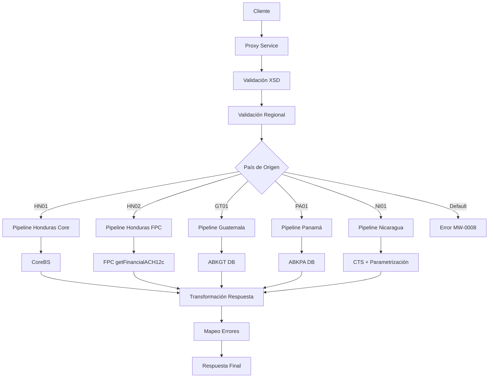

# Análisis Técnico: ConsultaFinancierasACH

## Resumen Ejecutivo

El servicio **ConsultaFinancierasACH** (FICBCO0118) es un servicio regional multi-core que permite consultar la información de las entidades financieras disponibles para transferencias ACH. Implementa un patrón de enrutamiento regional por país con validación XSD y manejo de errores centralizado.

## Arquitectura del Servicio

### Patrón de Diseño
- **Tipo**: Servicio Regional Multi-Core
- **Versión**: v2
- **Protocolo**: SOAP/HTTP
- **Seguridad**: Custom Token Authentication

### Flujo de Ejecución



## Servicios Dependientes

### 1. ValidaServicioRegional
- **Propósito**: Validar disponibilidad del servicio por región
- **Parámetros**: serviceId "FICBCO0118", RequestHeader
- **Respuesta**: Código de error y mensaje
- **Validación**: Conexión JCA a base de datos Middleware

### 2. MapeoErrores
- **Propósito**: Mapear códigos de error a formato estándar
- **Parámetros**: Código de error, mensaje de error
- **Respuesta**: Header de respuesta mapeado
- **Validación**: Servicio SOAP interno

### 3. CoreBS (HN01)
- **Propósito**: Consulta de entidades financieras en sistema Core
- **Parámetros**: Request transformado con headers
- **Respuesta**: Lista de entidades ACH
- **Validación**: Conexión HTTP a múltiples endpoints

### 4. FPC getFinancialACH12c (HN02)
- **Propósito**: Consulta de entidades financieras en sistema FPC
- **Parámetros**: Request con headers modificados para OSB12AUTH
- **Respuesta**: Lista de entidades ACH
- **Validación**: Conexión HTTP con autenticación especial

### 5. ABKGT consultaFinancierasACH (GT01)
- **Propósito**: Consulta de entidades financieras en base de datos Guatemala
- **Parámetros**: Request transformado para Guatemala
- **Respuesta**: Lista de entidades ACH
- **Validación**: Conexión JCA a base de datos Guatemala

### 6. ABKPA consultaFinancierasACH (PA01)
- **Propósito**: Consulta de entidades financieras en base de datos Panamá
- **Parámetros**: Request transformado para Panamá
- **Respuesta**: Lista de entidades ACH
- **Validación**: Conexión JCA a base de datos Panamá

### 7. CTS transferencia (NI01)
- **Propósito**: Consulta de entidades financieras en sistema CTS Nicaragua
- **Parámetros**: Request transformado y validado contra XSD CTS
- **Respuesta**: Lista de entidades ACH
- **Validación**: Conexión HTTP a sistema CTS

### 8. ObtenerParametrizacion (NI01)
- **Propósito**: Obtener parametrización de tipos de productos para Nicaragua
- **Parámetros**: Nombre del parámetro "FICBCO0118.NI.PRODUCTS_TYPES"
- **Respuesta**: Configuración de tipos de productos
- **Validación**: Conexión JCA a base de datos Middleware

## Transformaciones de Datos

### Procesamiento por País

| País | Código | Descripción Lógica | XQuery Request | XQuery Response |
|-------|--------|-------------------|----------------|----------------|
| Honduras Core | HN01 | Consulta directa al Core Banking System | MasterNuevo/Middleware/v2/Resources/ConsultaFinancierasACH/xq/consultaFinancierasACHIn.xq | MasterNuevo/Middleware/v2/Resources/ConsultaFinancierasACH/xq/consultaFinanacierasACHOut.xq, MasterNuevo/Middleware/v2/Resources/ConsultaFinancierasACH/xq/consultaFinanacierasACHHeaderOut.xq |
| Honduras FPC | HN02 | Consulta al sistema FPC con headers modificados | MasterNuevo/Middleware/v2/Resources/ConsultaFinancierasACH/xq/getFinancialACHHeaderIn.xq | MasterNuevo/Middleware/v2/Resources/ConsultaFinancierasACH/xq/getFinancialACHOut.xq |
| Guatemala | GT01 | Consulta a base de datos ABKGT | MasterNuevo/Middleware/v2/Resources/ConsultaFinancierasACH/xq/consultaFinancierasACHGTIn.xq | MasterNuevo/Middleware/v2/Resources/ConsultaFinancierasACH/xq/consultaFinancierasACHGTOut.xq, MasterNuevo/Middleware/v2/Resources/ConsultaFinancierasACH/xq/consultaFinancierasACHGTHeaderOut.xq |
| Panamá | PA01 | Consulta a base de datos ABKPA | MasterNuevo/Middleware/v2/Resources/ConsultaFinancierasACH/xq/consultaFinancierasACHPAIn.xq | MasterNuevo/Middleware/v2/Resources/ConsultaFinancierasACH/xq/consultaFinancierasACHPAOut.xq, MasterNuevo/Middleware/v2/Resources/ConsultaFinancierasACH/xq/consultaFinancierasACHPAHeaderOut.xq |
| Nicaragua | NI01 | Consulta a CTS con parametrización adicional | MasterNuevo/Middleware/v2/Resources/ConsultaFinancierasACH/xq/consultaFinanacierasACHNIIn.xq | MasterNuevo/Middleware/v2/Resources/ConsultaFinancierasACH/xq/consultaFinanacierasACHNIOut.xq, MasterNuevo/Middleware/v2/Resources/ConsultaFinancierasACH/xq/consultaFinanacierasACHNIHeaderOut.xq |

## Conexiones por País

### Honduras Core (HN01)
```xml
<!-- HTTP -->
<service>[SERVICIO_CORE_HN]</service>
<endpoint>[ENDPOINT_CORE_HN]</endpoint>
<operation>ConsultadedestinosACH</operation>
<!-- Autenticación: Manejo interno del Core Banking System -->
```

### Honduras FPC (HN02)
```xml
<!-- HTTP -->
<service>[SERVICIO_FPC_HN]</service>
<endpoint>[ENDPOINT_FPC_HN]</endpoint>
<operation>consultaFinancierasACH</operation>
<!-- Autenticación: OSB12AUTH con headers modificados -->
```

### Guatemala (GT01)
```xml
<!-- JCA -->
<service>[SERVICIO_ABKGT]</service>
<connection>[CONNECTION_PROXY_ABANKS_GT]</connection>
<operation>consultaFinancierasACH</operation>
```

### Panamá (PA01)
```xml
<!-- JCA -->
<service>[SERVICIO_ABKPA]</service>
<connection>[CONNECTION_PROXY_ABANKS_PA]</connection>
<operation>consultaFinancierasACH</operation>
```

### Nicaragua (NI01)
```xml
<!-- HTTP -->
<service>[SERVICIO_CTS_NI]</service>
<endpoint>[ENDPOINT_CTS_NI]</endpoint>
<operation>OpConsultaFinacierasACH</operation>
<!-- Autenticación: Manejo interno del sistema CTS -->
```

## Validación XSD

### Información General
- **Esquema XSD**: consultaFinancierasACHTypes.xsd
- **Namespace**: http://www.ficohsa.com.hn/middleware.services/consultaFinancierasACHTypes
- **Versión**: 1.0

### Archivos de Esquema

#### Ubicación
- **XSD Principal**: `MasterNuevo/Middleware/Business_Resources/Core/consultaFinancierasACH/consultaFinancierasACHTypes.xsd`
- **WSDL**: `MasterNuevo/Middleware/v2/Resources/ConsultaFinancierasACH/wsdl/consultaFinancieraACHPS.wsdl`
- **Headers**: `MasterNuevo/Middleware/v2/Resources/esquemas_generales/HeaderElements.xsd`

#### Dependencias
- **Namespace autType**: Para headers de autenticación
- **Namespace consultaFinancierasACHTypes**: Para tipos específicos del servicio

### Estructura del Request

#### Definición XSD Request
```xml
<xs:element name="consultaFinancierasACH">
    <xs:complexType>
        <xs:sequence>
            <xs:element name="DESTINATION_CODE" type="xs:string" minOccurs="0"/>
        </xs:sequence>
    </xs:complexType>
</xs:element>
```

#### Ejemplo de Request Válido
> **Nota:** Los siguientes son datos de ejemplo no reales, utilizados únicamente para propósitos de testing y documentación.

```xml
<consultaFinancierasACH xmlns="http://www.ficohsa.com.hn/middleware.services/consultaFinancierasACHTypes">
    <DESTINATION_CODE>001</DESTINATION_CODE>
</consultaFinancierasACH>
```

### Estructura del Response

### Definiciones XSD Completas

#### Response Principal
```xml
<xs:element name="consultaFinancierasACHResponse" type="cons:consultaFinancierasACHResponseType"/>

<xs:complexType name="consultaFinancierasACHResponseType">
    <xs:sequence>
        <xs:element name="consultaFinancierasACHResponseType" type="cons:consultaFinancierasACHResponseRecordType" form="qualified" minOccurs="0"/>
    </xs:sequence>
</xs:complexType>
```

#### Tipos Complejos
```xml
<xs:complexType name="consultaFinancierasACHResponseRecordType">
    <xs:sequence>
        <xs:element name="consultaFinancierasACHResponseRecordType" type="cons:consultaFinancierasACHResponseArrayType" form="qualified" minOccurs="0" maxOccurs="unbounded"/>
    </xs:sequence>
</xs:complexType>

<xs:complexType name="consultaFinancierasACHResponseArrayType">
    <xs:sequence>
        <xs:element name="DESTINATION_CODE" type="xs:string" minOccurs="0" maxOccurs="1"/>
        <xs:element name="DESTINATION_NAME" type="xs:string" minOccurs="0" maxOccurs="1"/>
        <xs:element name="consultaFinancierasACHDetailResponseType" minOccurs="0" maxOccurs="1" form="qualified">
            <xs:complexType>
                <xs:sequence>
                    <xs:element name="consultaFinancierasACHDetailResponseRecordType" minOccurs="0" maxOccurs="unbounded" form="qualified">
                        <xs:complexType>
                            <xs:sequence>
                                <xs:element name="TYPE_OF_PRODUCT" type="xs:string" minOccurs="0" maxOccurs="1"/>
                                <xs:element name="MIN_PRODUCT_ID_LENGTH" type="xs:string" minOccurs="0" maxOccurs="1"/>
                                <xs:element name="MAX_PRODUCT_ID_LENGTH" type="xs:string" minOccurs="0" maxOccurs="1"/>
                                <xs:element name="LEADING_ZEROS_YES_NO" type="xs:string" minOccurs="0" maxOccurs="1"/>
                                <xs:element name="PRODUCT_ID_SAMPLE" type="xs:string" minOccurs="0" maxOccurs="1"/>
                                <xs:element name="TRANSFER_TYPE" type="xs:string" minOccurs="0" maxOccurs="1"/>
                            </xs:sequence>
                        </xs:complexType>
                    </xs:element>
                </xs:sequence>
            </xs:complexType>
        </xs:element>
    </xs:sequence>
</xs:complexType>
```

### Ejemplo de Response Válido

> **Nota:** Los siguientes son datos de ejemplo no reales, utilizados únicamente para propósitos de testing y documentación.

```xml
<consultaFinancierasACHResponse xmlns="http://www.ficohsa.com.hn/middleware.services/consultaFinancierasACHTypes">
    <consultaFinancierasACHResponseType>
        <consultaFinancierasACHResponseRecordType>
            <DESTINATION_CODE>001</DESTINATION_CODE>
            <DESTINATION_NAME>Banco Ejemplo</DESTINATION_NAME>
            <consultaFinancierasACHDetailResponseType>
                <consultaFinancierasACHDetailResponseRecordType>
                    <TYPE_OF_PRODUCT>CUENTA_CORRIENTE</TYPE_OF_PRODUCT>
                    <MIN_PRODUCT_ID_LENGTH>10</MIN_PRODUCT_ID_LENGTH>
                    <MAX_PRODUCT_ID_LENGTH>15</MAX_PRODUCT_ID_LENGTH>
                    <LEADING_ZEROS_YES_NO>Y</LEADING_ZEROS_YES_NO>
                    <PRODUCT_ID_SAMPLE>1234567890</PRODUCT_ID_SAMPLE>
                    <TRANSFER_TYPE>ACH</TRANSFER_TYPE>
                </consultaFinancierasACHDetailResponseRecordType>
            </consultaFinancierasACHDetailResponseType>
        </consultaFinancierasACHResponseRecordType>
    </consultaFinancierasACHResponseType>
</consultaFinancierasACHResponse>
```

### Casos de Error XSD

#### Request Inválido - Namespace Incorrecto
> **Nota:** Los siguientes son datos de ejemplo no reales, utilizados únicamente para propósitos de testing y documentación.

```xml
<!-- ERROR: Namespace incorrecto -->
<consultaFinancierasACH xmlns="http://wrong.namespace/">
    <DESTINATION_CODE>001</DESTINATION_CODE>
</consultaFinancierasACH>
```

#### Request Inválido - Tipo de Dato Incorrecto
> **Nota:** Los siguientes son datos de ejemplo no reales, utilizados únicamente para propósitos de testing y documentación.

```xml
<!-- ERROR: DESTINATION_CODE debe ser string -->
<consultaFinancierasACH xmlns="http://www.ficohsa.com.hn/middleware.services/consultaFinancierasACHTypes">
    <DESTINATION_CODE>123</DESTINATION_CODE>
</consultaFinancierasACH>
```

#### Response Inválido - Estructura Incorrecta
> **Nota:** Los siguientes son datos de ejemplo no reales, utilizados únicamente para propósitos de testing y documentación.

```xml
<!-- ERROR: Estructura de respuesta incorrecta -->
<consultaFinancierasACHResponse xmlns="http://www.ficohsa.com.hn/middleware.services/consultaFinancierasACHTypes">
    <DESTINATION_CODE>001</DESTINATION_CODE>
    <!-- Falta estructura consultaFinancierasACHResponseType -->
</consultaFinancierasACHResponse>
```

---

## Historial de Cambios

| Fecha | Versión | Autor | Descripción |
|-------|---------|-------|-------------|
| 2025-12-22 | 1.0 | ARQ FICOHSA | Creación inicial |
