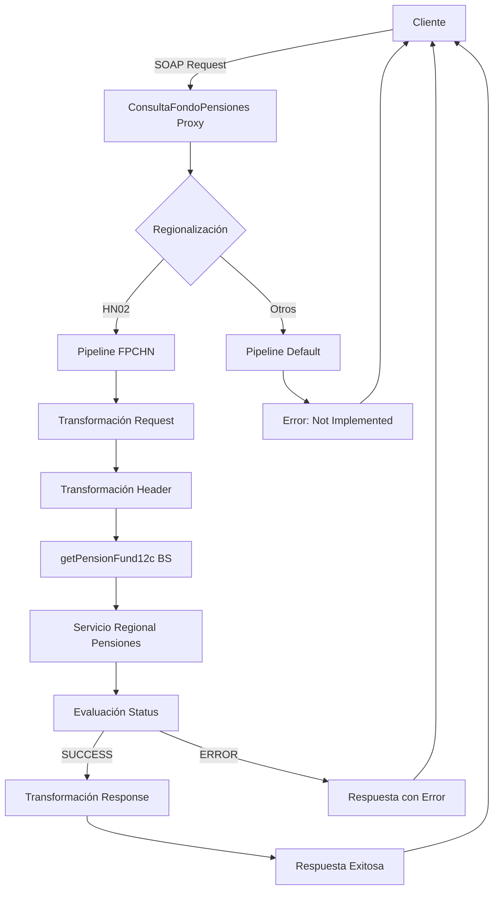

# Análisis Técnico: ConsultaFondoPensiones

## 1. Resumen Ejecutivo

**Nombre del Servicio:** ConsultaFondoPensiones  
**Código FICBCO:** No especificado  
**Tipo de Servicio:** Servicio Regional Multi-Core  
**Patrón de Diseño:** Proxy Service con regionalización por país

**Descripción Funcional:**  
El servicio ConsultaFondoPensiones permite consultar información completa de fondos de pensiones de los clientes, incluyendo datos de la cuenta, información del producto, historial de contribuciones, tipos de balance e información detallada de beneficiarios. El servicio está diseñado para soportar múltiples países mediante regionalización, actualmente implementado para Honduras FPC (HN02).

---

## 2. Arquitectura del Servicio

### 2.1. Patrón de Diseño

El servicio implementa un patrón de **Proxy Service con Regionalización por País**, donde:
- Se enruta la petición según el país de origen (SourceBank)
- Se transforma el mensaje para adaptarlo al proveedor regional
- Se evalúa el estado de la respuesta del proveedor
- Se maneja la respuesta y errores de forma directa (sin MapeoErrores)

### 2.2. Diagrama de Flujo



### 2.3. Flujo Detallado por Etapa

**Etapa 1: Regionalización (HN02 - Honduras FPC)**
1. Transformación de request mediante getPensionFundIn.xq
2. Construcción de header de autenticación mediante getPensionFundHeaderIn.xq
3. Invocación a getPensionFund12c business service
4. Evaluación del campo StatusInfo/Status de la respuesta
5. Si Status = SUCCESS: Transformación de response mediante consultaFondoPensionesHNOut.xq
6. Si Status != SUCCESS: Retorno del mensaje de error del campo ErrorInfo/Description

**Etapa 2: Regionalización (Default - Otros Países)**
1. Retorno de error "SERVICE NOT IMPLEMENTED YET FOR THIS COUNTRY/COMPANY"

---

## 3. Servicios Dependientes

### 3.1. Business Services

| Servicio | Tipo | Propósito | Conexión |
|----------|------|-----------|----------|
| getPensionFund12c | HTTP/SOAP | Consulta de información de fondos de pensiones en sistema regional | [ENDPOINT_PENSION_FUND_HN02] |

### 3.2. Proxy Services

No utiliza proxy services intermedios (no usa MapeoErrores ni ValidaServicioRegional).

---

## 4. Transformaciones de Datos

### 4.1. Transformaciones por País

| País | Código | Descripción de Lógica | Archivos XQuery Request | Archivos XQuery Response |
|------|--------|------------------------|-------------------------|--------------------------|
| Honduras FPC | HN02 | Consulta de información de fondos de pensiones mediante servicio regional. Se construye el request con el número de cuenta y se agregan datos de región (SourceBank, DestinationBank). Se agrega header de autenticación con credenciales OSB12AUTH. La respuesta incluye datos completos de la cuenta, contribuciones, tipos de balance y beneficiarios. | MasterNuevo/Middleware/v2/Resources/ConsultaFondoPensiones/xq/getPensionFundIn.xq | MasterNuevo/Middleware/v2/Resources/ConsultaFondoPensiones/xq/consultaFondoPensionesHNOut.xq |
| Default | N/A | Retorna error indicando que el servicio no está implementado para el país/empresa solicitado | N/A | N/A |

### 4.2. Transformaciones de Header

| País | Archivo XQuery | Descripción |
|------|----------------|-------------|
| Honduras FPC (HN02) | MasterNuevo/Middleware/v2/Resources/ConsultaFondoPensiones/xq/getPensionFundHeaderIn.xq | Construye el header de autenticación obteniendo credenciales de Middleware/Security/OSB12AUTH y configurando SourceBank y DestinationBank |

---

## 5. Conexiones por País

### 5.1. Honduras FPC (HN02)

| Servicio Backend | Tipo Conexión | Endpoint | Operación | Timeout | Autenticación |
|------------------|---------------|----------|-----------|---------|---------------|
| getPensionFund12c | HTTP/SOAP | [ENDPOINT_PENSION_FUND_HN02] | getPensionFund | 70s (connection: 65s) | Basic Auth (OSB12AUTH) |

**Detalles de Autenticación:**
- Tipo: Basic Authentication
- Credenciales: Obtenidas de Middleware/Security/OSB12AUTH mediante fn-bea:lookupBasicCredentials
- Método: Las credenciales se inyectan en el header mediante transformación XQuery

---

## 6. Validación XSD

### 6.1. Información del Esquema

**Archivo XSD Principal:** consultaFondoPensionesTypes.xsd  
**Namespace:** http://www.ficohsa.com.hn/middleware.services/consultaFondoPensionesTypes  
**Ubicación:** MasterNuevo/Middleware/v2/Resources/ConsultaFondoPensiones/xsd/consultaFondoPensionesTypes.xsd  
**WSDL:** MasterNuevo/Middleware/v2/Resources/ConsultaFondoPensiones/wsdl/consultaFondoPensionesPS.wsdl

### 6.2. Estructura del Request

**Elemento:** consultaFondoPensionesRequest

| Campo | Tipo | Obligatorio | Restricciones | Descripción |
|-------|------|-------------|---------------|-------------|
| ACCOUNT_NUMBER | string | Sí | N/A | Número de cuenta del fondo de pensiones |

**Ejemplo de Request:**

> **Nota:** Los siguientes son datos de ejemplo no reales, utilizados únicamente para propósitos de testing y documentación.

```xml
<consultaFondoPensionesRequest xmlns="http://www.ficohsa.com.hn/middleware.services/consultaFondoPensionesTypes">
    <ACCOUNT_NUMBER>1234567890</ACCOUNT_NUMBER>
</consultaFondoPensionesRequest>
```

### 6.3. Estructura del Response

**Elemento:** consultaFondoPensionesResponse

| Campo | Tipo | Obligatorio | Cardinalidad | Descripción |
|-------|------|-------------|--------------|-------------|
| ACCOUNT_NUMBER | string | No | 0..1 | Número de cuenta |
| ACCOUNT_TYPE | string | No | 0..1 | Tipo de cuenta |
| ACCOUNT_CURRENCY | string | No | 0..1 | Moneda de la cuenta |
| ACCOUNT_STATUS | string | No | 0..1 | Estado de la cuenta |
| REQUEST_ID | string | No | 0..1 | ID de solicitud |
| GROUP_CODE | string | No | 0..1 | Código de grupo |
| CONTRACT_ID | string | No | 0..1 | ID de contrato |
| CUSTOMER_ID | string | No | 0..1 | ID del cliente |
| CUSTOMER_NAME | string | No | 0..1 | Nombre del cliente |
| PRODUCT_CODE | string | No | 0..1 | Código de producto |
| PRODUCT_NAME | string | No | 0..1 | Nombre del producto |
| SUB_PRODUCT_CODE | string | No | 0..1 | Código de subproducto |
| SUB_PRODUCT_NAME | string | No | 0..1 | Nombre del subproducto |
| OPENING_DATE | string | No | 0..1 | Fecha de apertura |
| EXPIRATION_DATE | string | No | 0..1 | Fecha de expiración |
| CLOSING_DATE | string | No | 0..1 | Fecha de cierre |
| OFFICER_CODE | string | No | 0..1 | Código de oficial |
| BRANCH_CODE | string | No | 0..1 | Código de sucursal |
| NOTIFICATION_TYPE | string | No | 0..1 | Tipo de notificación |
| APPLY_INSURANCE | string | No | 0..1 | Aplica seguro |
| FREQUENCY | string | No | 0..1 | Frecuencia de contribución |
| FREQUENCY_DATE | string | No | 0..1 | Fecha de frecuencia |
| PAYMENT_METHOD | string | No | 0..1 | Método de pago |
| SALARY_AMOUNT | string | No | 0..1 | Monto de salario |
| PREMIUM_AMOUNT | string | No | 0..1 | Monto de prima |
| INSURED_AMOUNT | string | No | 0..1 | Monto asegurado |
| CONTRIBUTION_TYPE | string | No | 0..1 | Tipo de contribución |
| CONTRIBUTION_AMOUNT | string | No | 0..1 | Monto de contribución |
| FIRST_CONTRIBUTION_AMOUNT | string | No | 0..1 | Monto de primera contribución |
| FIRST_CONTRIBUTION_DATE | string | No | 0..1 | Fecha de primera contribución |
| LAST_CONTRIBUTION_AMOUNT | string | No | 0..1 | Monto de última contribución |
| LAST_CONTRIBUTION_DATE | string | No | 0..1 | Fecha de última contribución |
| NEXT_CONTRIBUTION_AMOUNT | string | No | 0..1 | Monto de próxima contribución |
| NEXT_CONTRIBUTION_DATE | string | No | 0..1 | Fecha de próxima contribución |
| LAST_EXTRA_CONTRIBUTION_AMOUNT | string | No | 0..1 | Monto de última contribución extra |
| LAST_EXTRA_CONTRIBUTION_DATE | string | No | 0..1 | Fecha de última contribución extra |
| BALANCE_TYPE_INFO | balanceListType | No | 0..1 | Información de tipos de balance |
| &nbsp;&nbsp;└─ BALANCE_TYPE_ITEM | balanceType | No | 0..unbounded | Item de tipo de balance |
| &nbsp;&nbsp;&nbsp;&nbsp;&nbsp;&nbsp;├─ BALANCE_TYPE_CODE | string | No | 0..1 | Código de tipo de balance |
| &nbsp;&nbsp;&nbsp;&nbsp;&nbsp;&nbsp;├─ BALANCE_TYPE_DESCRIPTION | string | No | 0..1 | Descripción de tipo de balance |
| &nbsp;&nbsp;&nbsp;&nbsp;&nbsp;&nbsp;├─ INVESTMENT_TYPE_CODE | string | No | 0..1 | Código de tipo de inversión |
| &nbsp;&nbsp;&nbsp;&nbsp;&nbsp;&nbsp;├─ INVESTMENT_TYPE_DESCRIPTION | string | No | 0..1 | Descripción de tipo de inversión |
| &nbsp;&nbsp;&nbsp;&nbsp;&nbsp;&nbsp;└─ DISTRIBUTION_PERCENTANGE | string | No | 0..1 | Porcentaje de distribución |
| BENEFICIARY_INFO | beneficiaryListType | No | 0..1 | Información de beneficiarios |
| &nbsp;&nbsp;└─ BENEFICIARY_ITEM | beneficiaryType | Sí | 1..unbounded | Item de beneficiario |
| &nbsp;&nbsp;&nbsp;&nbsp;&nbsp;&nbsp;├─ FULL_NAME | string | Sí | 1..1 | Nombre completo del beneficiario |
| &nbsp;&nbsp;&nbsp;&nbsp;&nbsp;&nbsp;├─ FIRST_NAME | string | No | 0..1 | Primer nombre |
| &nbsp;&nbsp;&nbsp;&nbsp;&nbsp;&nbsp;├─ SECOND_NAME | string | No | 0..1 | Segundo nombre |
| &nbsp;&nbsp;&nbsp;&nbsp;&nbsp;&nbsp;├─ FIRST_LASTNAME | string | No | 0..1 | Primer apellido |
| &nbsp;&nbsp;&nbsp;&nbsp;&nbsp;&nbsp;├─ SECOND_LASTNAME | string | No | 0..1 | Segundo apellido |
| &nbsp;&nbsp;&nbsp;&nbsp;&nbsp;&nbsp;├─ BIRTH_DATE | string | No | 0..1 | Fecha de nacimiento |
| &nbsp;&nbsp;&nbsp;&nbsp;&nbsp;&nbsp;├─ GENDER | enum | Sí | 1..1 | Género (MALE/FEMALE) |
| &nbsp;&nbsp;&nbsp;&nbsp;&nbsp;&nbsp;├─ RELATIONSHIP | string | No | 0..1 | Relación con el titular |
| &nbsp;&nbsp;&nbsp;&nbsp;&nbsp;&nbsp;└─ DISTRIBUTION_PERCENTAGE | string | No | 0..1 | Porcentaje de distribución |

**Ejemplo de Response:**

> **Nota:** Los siguientes son datos de ejemplo no reales, utilizados únicamente para propósitos de testing y documentación.

```xml
<consultaFondoPensionesResponse xmlns="http://www.ficohsa.com.hn/middleware.services/consultaFondoPensionesTypes">
    <ACCOUNT_NUMBER>1234567890</ACCOUNT_NUMBER>
    <CUSTOMER_ID>0801199012345</CUSTOMER_ID>
    <CUSTOMER_NAME>Juan Perez Lopez</CUSTOMER_NAME>
    <PRODUCT_CODE>FP01</PRODUCT_CODE>
    <PRODUCT_NAME>Fondo de Pensiones</PRODUCT_NAME>
    <SUB_PRODUCT_CODE>FP01-001</SUB_PRODUCT_CODE>
    <OPENING_DATE>20200101</OPENING_DATE>
    <FREQUENCY>MENSUAL</FREQUENCY>
    <PAYMENT_METHOD>DEBITO_AUTOMATICO</PAYMENT_METHOD>
    <INSURED_AMOUNT>500000.00</INSURED_AMOUNT>
    <CONTRIBUTION_AMOUNT>5000.00</CONTRIBUTION_AMOUNT>
    <LAST_CONTRIBUTION_AMOUNT>5000.00</LAST_CONTRIBUTION_AMOUNT>
    <LAST_CONTRIBUTION_DATE>20241201</LAST_CONTRIBUTION_DATE>
    <NEXT_CONTRIBUTION_DATE>20250101</NEXT_CONTRIBUTION_DATE>
    <LAST_EXTRA_CONTRIBUTION_AMOUNT>10000.00</LAST_EXTRA_CONTRIBUTION_AMOUNT>
    <BALANCE_TYPE_INFO>
        <BALANCE_TYPE_ITEM>
            <BALANCE_TYPE_CODE>001</BALANCE_TYPE_CODE>
            <BALANCE_TYPE_DESCRIPTION>Balance Principal</BALANCE_TYPE_DESCRIPTION>
            <INVESTMENT_TYPE_CODE>INV01</INVESTMENT_TYPE_CODE>
            <INVESTMENT_TYPE_DESCRIPTION>Inversión Conservadora</INVESTMENT_TYPE_DESCRIPTION>
            <DISTRIBUTION_PERCENTANGE>60.00</DISTRIBUTION_PERCENTANGE>
        </BALANCE_TYPE_ITEM>
    </BALANCE_TYPE_INFO>
    <BENEFICIARY_INFO>
        <BENEFICIARY_ITEM>
            <FULL_NAME>Maria Lopez Garcia</FULL_NAME>
            <GENDER>FEMALE</GENDER>
            <RELATIONSHIP>ESPOSA</RELATIONSHIP>
            <DISTRIBUTION_PERCENTAGE>50.00</DISTRIBUTION_PERCENTAGE>
        </BENEFICIARY_ITEM>
        <BENEFICIARY_ITEM>
            <FULL_NAME>Carlos Perez Lopez</FULL_NAME>
            <GENDER>MALE</GENDER>
            <RELATIONSHIP>HIJO</RELATIONSHIP>
            <DISTRIBUTION_PERCENTAGE>50.00</DISTRIBUTION_PERCENTAGE>
        </BENEFICIARY_ITEM>
    </BENEFICIARY_INFO>
</consultaFondoPensionesResponse>
```

### 6.4. Validaciones y Restricciones

**Validaciones de Request:**
- ACCOUNT_NUMBER: Campo obligatorio

**Validaciones de Response:**
- GENDER: Debe ser "MALE" o "FEMALE"
- GENDER: Debe tener al menos 1 carácter (minLength=1)
- BENEFICIARY_ITEM: Debe haber al menos 1 beneficiario si existe BENEFICIARY_INFO

**Validaciones de Negocio:**
- El servicio evalúa el campo StatusInfo/Status de la respuesta del proveedor
- Si Status != SUCCESS, se retorna el mensaje de ErrorInfo/Description
- Si el código de región no es HN02, se retorna error de servicio no implementado

### 6.5. Casos de Error

| Código Error | Descripción | Acción |
|--------------|-------------|--------|
| SUCCESS | Operación exitosa | Procesamiento normal de respuesta |
| ERROR | Error del proveedor | Se retorna el mensaje de ErrorInfo/Description |
| SERVICE NOT IMPLEMENTED | Servicio no implementado para país/empresa | Se retorna error directamente al cliente |

### 6.6. Estadísticas de Validación

- **Total de campos documentados:** 52
- **Campos obligatorios:** 1 (request) + 3 (response en beneficiarios)
- **Campos opcionales:** 48
- **Tipos complejos:** 5 (consultaFondoPensionesRequest, consultaFondoPensionesResponse, balanceListType, balanceType, beneficiaryListType, beneficiaryType)
- **Porcentaje de completitud:** 100%

---

## 7. Manejo de Errores

### 7.1. Códigos de Error

| Código | Descripción | Tipo | Severidad | Acción |
|--------|-------------|------|-----------|--------|
| SUCCESS | Operación exitosa | N/A | N/A | Procesamiento normal |
| ERROR | Error general del proveedor | Técnico/Negocio | High | Retorno del mensaje de error del proveedor |
| SERVICE NOT IMPLEMENTED | Servicio no implementado para país/empresa | Negocio | Medium | Retorno directo al cliente |

### 7.2. Flujo de Manejo de Errores

1. **Error del Proveedor:** Se evalúa el campo StatusInfo/Status, si es diferente a SUCCESS se retorna el mensaje de ErrorInfo/Description
2. **Error de País No Soportado:** Se retorna "SERVICE NOT IMPLEMENTED YET FOR THIS COUNTRY/COMPANY" directamente
3. **Error General:** Se captura en el error handler y se retorna el código y razón del fault

**Nota:** Este servicio NO utiliza MapeoErrores ni ValidaServicioRegional, el manejo de errores es directo.

---

## 8. Configuraciones Técnicas

### 8.1. Timeouts

| Componente | Timeout | Descripción |
|------------|---------|-------------|
| getPensionFund12c | 70 segundos | Timeout de lectura del servicio regional |
| getPensionFund12c (conexión) | 65 segundos | Timeout de establecimiento de conexión |

### 8.2. Políticas de Retry

| Componente | Retry Count | Retry Interval | Retry on App Errors |
|------------|-------------|----------------|---------------------|
| getPensionFund12c | 0 | 0 | false |

### 8.3. Seguridad

| Aspecto | Configuración |
|---------|---------------|
| Autenticación Proxy | Custom Token Authentication (Username/Password desde header) |
| Autenticación Backend | Basic Authentication (credenciales OSB12AUTH) |
| Protocolo | SOAP 1.1 over HTTPS |
| HTTPS | Enabled (use-https: true) |

### 8.4. Monitoreo y Logging

| Aspecto | Configuración |
|---------|---------------|
| Monitoring | Disabled |
| Pipeline Monitoring Level | Pipeline |
| Logging | Enabled (nivel: debug) |
| SLA Alerting | Enabled (nivel: normal) |
| Pipeline Alerting | Enabled (nivel: normal) |
| Message Tracing | N/A |

---

## 9. Consideraciones de Implementación

### 9.1. Limitaciones Conocidas

- Servicio implementado únicamente para Honduras FPC (HN02)
- No soporta reintentos automáticos
- Respuesta puede contener múltiples beneficiarios (unbounded)
- Respuesta puede contener múltiples tipos de balance (unbounded)
- Todos los campos de respuesta son opcionales excepto los de beneficiarios
- No utiliza validación regional estándar
- No utiliza mapeo de errores estándar

### 9.2. Mejores Prácticas

- Validar número de cuenta en el cliente antes de invocar el servicio
- Manejar adecuadamente el caso de múltiples beneficiarios
- Manejar adecuadamente el caso de múltiples tipos de balance
- Considerar el timeout de 70 segundos en la configuración del cliente
- Implementar manejo de errores para el mensaje de servicio no implementado

### 9.3. Dependencias Externas

- Servicio regional de pensiones (/regional/pension/soap/getPensionFund11g/v1)
- Credenciales OSB12AUTH en Middleware/Security

---

## Historial de Cambios

| Fecha | Versión | Autor | Descripción |
|-------|---------|-------|-------------|
| 2025-12-06 | 1.0 | ARQ FICOHSA | Creación inicial del análisis técnico |
