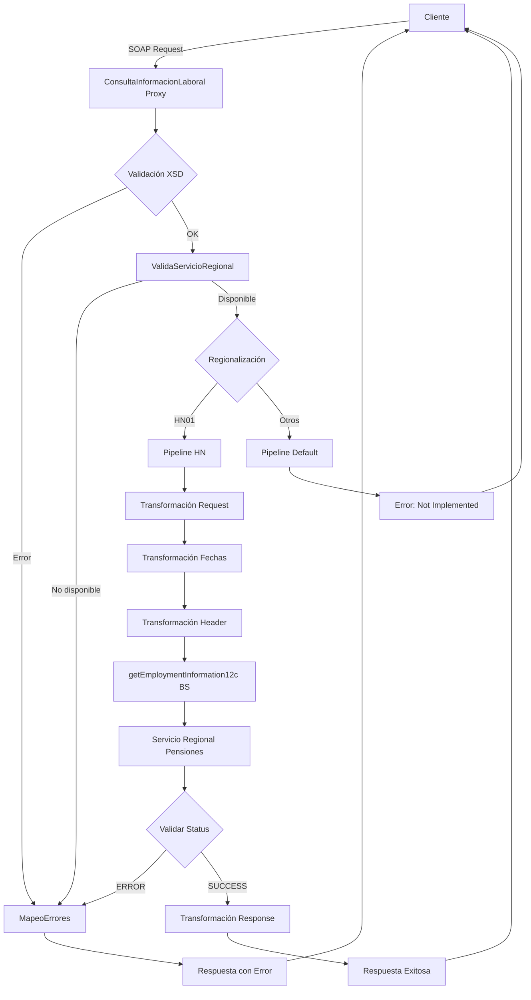

# Análisis Técnico: ConsultaInformacionLaboral

## 1. Resumen Ejecutivo

**Nombre del Servicio:** ConsultaInformacionLaboral  
**Código FICBCO:** FICBCO0181  
**Tipo de Servicio:** Servicio Regional Multi-Core  
**Patrón de Diseño:** Proxy Service con regionalización por país

**Descripción Funcional:**  
El servicio ConsultaInformacionLaboral permite consultar el historial completo de información laboral de los clientes, incluyendo datos de empleadores, períodos de empleo, salarios, ocupaciones y títulos de puestos. El servicio soporta filtrado por rango de fechas y está diseñado para soportar múltiples países mediante regionalización, actualmente implementado para Honduras (HN01).

---

## 2. Arquitectura del Servicio

### 2.1. Patrón de Diseño

El servicio implementa un patrón de **Proxy Service con Regionalización por País**, donde:
- Se valida la estructura del mensaje contra XSD
- Se valida la disponibilidad del servicio por región
- Se enruta la petición según el país de origen (SourceBank)
- Se transforman las fechas al formato requerido por el proveedor
- Se transforma el mensaje para adaptarlo al proveedor regional
- Se maneja la respuesta y errores de forma estandarizada

### 2.2. Diagrama de Flujo



### 2.3. Flujo Detallado por Etapa

**Etapa 1: Validaciones Generales**
1. Validación XSD contra consultaInformacionLaboralTypes.xsd
2. Validación de servicio regional con serviceId "FICBCO0181"
3. Aplicación de valores por defecto de región

**Etapa 2: Regionalización (HN01 - Honduras)**
1. Transformación de request mediante getEmploymentInformationIn.xq (convierte fechas YYYYMMDD a dd/MM/yyyy)
2. Construcción de header de autenticación mediante getEmploymentInformationHeaderIn.xq
3. Invocación a getEmploymentInformation12c business service
4. Evaluación del campo StatusInfo/Status de la respuesta
5. Transformación de response mediante getEmploymentInformationHNOut.xq (si SUCCESS)
6. Mapeo de errores mediante MapeoErrores (si ERROR)

**Etapa 3: Regionalización (Default - Otros Países)**
1. Retorno de error "SERVICE NOT IMPLEMENTED YET FOR THIS COUNTRY/COMPANY"

---

## 3. Servicios Dependientes

### 3.1. Business Services

| Servicio | Tipo | Propósito | Conexión |
|----------|------|-----------|----------|
| getEmploymentInformation12c | HTTP/SOAP | Consulta de historial de información laboral en sistema regional de pensiones | [ENDPOINT_EMPLOYMENT_INFO_HN01] |
| ValidaServicioRegional_db | JCA/Database | Validación de disponibilidad del servicio por región | [CONNECTION_MIDDLEWARE] |
| consultaInformacionLaboralFPC_db | JCA/Database | Business service legacy de consulta de información laboral | [CONNECTION_FICOPEN] |

### 3.2. Proxy Services

| Servicio | Operación | Propósito |
|----------|-----------|-----------|
| MapeoErrores | mapeoErrores | Estandarización de códigos de error con código de servicio FICBCO0181 |

---

## 4. Transformaciones de Datos

### 4.1. Transformaciones por País

| País | Código | Descripción de Lógica | Archivos XQuery Request | Archivos XQuery Response |
|------|--------|------------------------|-------------------------|--------------------------|
| Honduras | HN01 | Consulta de historial de información laboral mediante servicio regional de pensiones. Se construye el request con el número de cuenta del cliente y opcionalmente rango de fechas. Las fechas se transforman de formato YYYYMMDD a dd/MM/yyyy. Se agrega header de autenticación con credenciales OSB12AUTH. La respuesta incluye lista completa de registros laborales con información de empleadores, salarios y ocupaciones. | MasterNuevo/Middleware/v2/Resources/ConsultaInformacionLaboral/xq/getEmploymentInformationIn.xq | MasterNuevo/Middleware/v2/Resources/ConsultaInformacionLaboral/xq/getEmploymentInformationHNOut.xq |
| Default | N/A | Retorna error indicando que el servicio no está implementado para el país/empresa solicitado | N/A | N/A |

### 4.2. Transformaciones de Header

| País | Archivo XQuery | Descripción |
|------|----------------|-------------|
| Honduras (HN01) | MasterNuevo/Middleware/v2/Resources/ConsultaInformacionLaboral/xq/getEmploymentInformationHeaderIn.xq | Construye el header de autenticación obteniendo credenciales de Middleware/Security/OSB12AUTH y configurando SourceBank y DestinationBank |

### 4.3. Transformación de Fechas

El servicio realiza una transformación especial de fechas:
- **Entrada:** Formato YYYYMMDD (ejemplo: 20230101)
- **Salida:** Formato dd/MM/yyyy (ejemplo: 01/01/2023)
- **Función:** local:formatDate() en getEmploymentInformationIn.xq
- **Proceso:** Convierte string a xs:date y luego formatea usando fn-bea:date-to-string-with-format()

---

## 5. Conexiones por País

### 5.1. Honduras (HN01)

| Servicio Backend | Tipo Conexión | Endpoint | Operación | Timeout | Autenticación |
|------------------|---------------|----------|-----------|---------|---------------|
| getEmploymentInformation12c | HTTP/SOAP | [ENDPOINT_EMPLOYMENT_INFO_HN01] | consultaInformacionLaboral | 70s (connection: 65s) | Basic Auth (OSB12AUTH) |

**Detalles de Autenticación:**
- Tipo: Basic Authentication
- Credenciales: Obtenidas de Middleware/Security/OSB12AUTH mediante fn-bea:lookupBasicCredentials
- Método: Las credenciales se inyectan en el header mediante transformación XQuery

---

## 6. Validación XSD

### 6.1. Información del Esquema

**Archivo XSD Principal:** consultaInformacionLaboralTypes.xsd  
**Namespace:** http://www.ficohsa.com.hn/middleware.services/consultaInformacionLaboralTypes  
**Ubicación:** MasterNuevo/Middleware/v2/Resources/ConsultaInformacionLaboral/xsd/consultaInformacionLaboralTypes.xsd  
**WSDL:** MasterNuevo/Middleware/v2/Resources/ConsultaInformacionLaboral/wsdl/consultaInformacionLaboralPS.wsdl

### 6.2. Estructura del Request

**Elemento:** consultaInformacionLaboralRequest

| Campo | Tipo | Obligatorio | Restricciones | Descripción |
|-------|------|-------------|---------------|-------------|
| CUSTOMER_ACCOUNT | string | Sí | N/A | Número de cuenta del cliente |
| FROM_DATE | string | No | Formato: YYYYMMDD | Fecha de inicio del período de consulta |
| TO_DATE | string | No | Formato: YYYYMMDD | Fecha de fin del período de consulta |

**Ejemplo de Request:**

> **Nota:** Los siguientes son datos de ejemplo no reales, utilizados únicamente para propósitos de testing y documentación.

```xml
<consultaInformacionLaboralRequest xmlns="http://www.ficohsa.com.hn/middleware.services/consultaInformacionLaboralTypes">
    <CUSTOMER_ACCOUNT>1234567890</CUSTOMER_ACCOUNT>
    <FROM_DATE>20230101</FROM_DATE>
    <TO_DATE>20241231</TO_DATE>
</consultaInformacionLaboralRequest>
```

### 6.3. Estructura del Response

**Elemento:** consultaInformacionLaboralResponse

| Campo | Tipo | Obligatorio | Cardinalidad | Descripción |
|-------|------|-------------|--------------|-------------|
| JOB_INFO_HISTORY | jobInfoHistoryListType | No | 0..1 | Contenedor del historial de información laboral |
| &nbsp;&nbsp;└─ JOB_INFO_HISTORY_ITEM | jobInfoHistoryType | No | 0..unbounded | Item individual de historial laboral |
| &nbsp;&nbsp;&nbsp;&nbsp;&nbsp;&nbsp;├─ CUSTOMER_ACCOUNT | string | Sí | 1..1 | Número de cuenta del cliente |
| &nbsp;&nbsp;&nbsp;&nbsp;&nbsp;&nbsp;├─ STATUS | string | Sí | 1..1 | Estado del registro laboral |
| &nbsp;&nbsp;&nbsp;&nbsp;&nbsp;&nbsp;├─ START_DATE | string | Sí | 1..1 | Fecha de inicio del empleo |
| &nbsp;&nbsp;&nbsp;&nbsp;&nbsp;&nbsp;├─ END_DATE | string | Sí | 1..1 | Fecha de fin del empleo |
| &nbsp;&nbsp;&nbsp;&nbsp;&nbsp;&nbsp;├─ PAYMENT_PERIOD | string | Sí | 1..1 | Período de pago |
| &nbsp;&nbsp;&nbsp;&nbsp;&nbsp;&nbsp;├─ EMPLOYER_CODE | string | Sí | 1..1 | Código del empleador |
| &nbsp;&nbsp;&nbsp;&nbsp;&nbsp;&nbsp;├─ EMPLOYER_NAME | string | Sí | 1..1 | Nombre del empleador |
| &nbsp;&nbsp;&nbsp;&nbsp;&nbsp;&nbsp;├─ EMPLOYER_RTN | string | Sí | 1..1 | RTN del empleador |
| &nbsp;&nbsp;&nbsp;&nbsp;&nbsp;&nbsp;├─ BALANCE_TYPE | string | Sí | 1..1 | Tipo de balance |
| &nbsp;&nbsp;&nbsp;&nbsp;&nbsp;&nbsp;├─ PAYMENT_CURRENCY | string | Sí | 1..1 | Moneda de pago |
| &nbsp;&nbsp;&nbsp;&nbsp;&nbsp;&nbsp;├─ PAYMENT_AMOUNT | string | Sí | 1..1 | Monto de pago |
| &nbsp;&nbsp;&nbsp;&nbsp;&nbsp;&nbsp;├─ SALARY_CURRENCY | string | Sí | 1..1 | Moneda de salario |
| &nbsp;&nbsp;&nbsp;&nbsp;&nbsp;&nbsp;├─ SALARY_AMOUNT | string | Sí | 1..1 | Monto de salario |
| &nbsp;&nbsp;&nbsp;&nbsp;&nbsp;&nbsp;├─ OCCUPATION_CODE | string | Sí | 1..1 | Código de ocupación |
| &nbsp;&nbsp;&nbsp;&nbsp;&nbsp;&nbsp;├─ OCCUPATION_DESC | string | Sí | 1..1 | Descripción de ocupación |
| &nbsp;&nbsp;&nbsp;&nbsp;&nbsp;&nbsp;├─ JOB_TITLE_CODE | string | Sí | 1..1 | Código de título del puesto |
| &nbsp;&nbsp;&nbsp;&nbsp;&nbsp;&nbsp;└─ JOB_TITLE_DESC | string | Sí | 1..1 | Descripción del título del puesto |

**Ejemplo de Response:**

> **Nota:** Los siguientes son datos de ejemplo no reales, utilizados únicamente para propósitos de testing y documentación.

```xml
<consultaInformacionLaboralResponse xmlns="http://www.ficohsa.com.hn/middleware.services/consultaInformacionLaboralTypes">
    <JOB_INFO_HISTORY>
        <JOB_INFO_HISTORY_ITEM>
            <CUSTOMER_ACCOUNT>1234567890</CUSTOMER_ACCOUNT>
            <STATUS>ACTIVO</STATUS>
            <START_DATE>20200101</START_DATE>
            <END_DATE>20241231</END_DATE>
            <PAYMENT_PERIOD>MENSUAL</PAYMENT_PERIOD>
            <EMPLOYER_CODE>EMP001</EMPLOYER_CODE>
            <EMPLOYER_NAME>Empresa Ejemplo S.A.</EMPLOYER_NAME>
            <EMPLOYER_RTN>08011990123456</EMPLOYER_RTN>
            <BALANCE_TYPE>REGULAR</BALANCE_TYPE>
            <PAYMENT_CURRENCY>HNL</PAYMENT_CURRENCY>
            <PAYMENT_AMOUNT>15000.00</PAYMENT_AMOUNT>
            <SALARY_CURRENCY>HNL</SALARY_CURRENCY>
            <SALARY_AMOUNT>15000.00</SALARY_AMOUNT>
            <OCCUPATION_CODE>OCC001</OCCUPATION_CODE>
            <OCCUPATION_DESC>Ingeniero de Software</OCCUPATION_DESC>
            <JOB_TITLE_CODE>JT001</JOB_TITLE_CODE>
            <JOB_TITLE_DESC>Desarrollador Senior</JOB_TITLE_DESC>
        </JOB_INFO_HISTORY_ITEM>
    </JOB_INFO_HISTORY>
</consultaInformacionLaboralResponse>
```

### 6.4. Validaciones y Restricciones

**Validaciones de Request:**
- CUSTOMER_ACCOUNT: Campo obligatorio
- FROM_DATE: Opcional, formato YYYYMMDD
- TO_DATE: Opcional, formato YYYYMMDD

**Validaciones de Negocio:**
- El servicio valida la disponibilidad regional mediante ValidaServicioRegional
- Si el código de región no es HN01, se retorna error de servicio no implementado
- Si ValidaServicioRegional retorna código diferente a SUCCESS, se retorna el error correspondiente
- Las fechas se transforman automáticamente al formato dd/MM/yyyy

**Validaciones de Response:**
- Todos los campos dentro de JOB_INFO_HISTORY_ITEM son obligatorios
- Puede retornar múltiples items de historial laboral (unbounded)

### 6.5. Casos de Error XSD

| Código Error | Descripción | Acción |
|--------------|-------------|--------|
| BEA-382505 | Error de validación XSD | Se aplica transformación mapeoErrorValidate.xq y se invoca MapeoErrores |
| SUCCESS | Operación exitosa | Procesamiento normal |
| ERROR | Error del proveedor | Se invoca MapeoErrores con código FICBCO0181 |

### 6.6. Estadísticas de Validación

- **Total de campos documentados:** 20
- **Campos obligatorios (Request):** 1
- **Campos opcionales (Request):** 2
- **Campos obligatorios (Response - por item):** 17
- **Tipos complejos:** 3 (consultaInformacionLaboralRequest, consultaInformacionLaboralResponse, jobInfoHistoryListType, jobInfoHistoryType)
- **Porcentaje de completitud:** 100%

---

## 7. Manejo de Errores

### 7.1. Códigos de Error

| Código | Descripción | Tipo | Severidad | Acción |
|--------|-------------|------|-----------|--------|
| BEA-382505 | Error de validación XSD | Técnico | High | Mapeo mediante mapeoErrorValidate.xq |
| SUCCESS | Operación exitosa | N/A | N/A | Procesamiento normal |
| ERROR | Error general del proveedor | Técnico/Negocio | High | Mapeo mediante MapeoErrores con código FICBCO0181 |

### 7.2. Flujo de Manejo de Errores

1. **Error de Validación XSD:** Se captura en el error handler, se aplica mapeoErrorValidate.xq y se invoca MapeoErrores
2. **Error de ValidaServicioRegional:** Se retorna el mensaje de error del procedimiento almacenado
3. **Error del Proveedor:** Se evalúa el StatusInfo/Status del header de respuesta, si es diferente a SUCCESS se invoca MapeoErrores
4. **Error de País No Soportado:** Se retorna error de servicio no implementado directamente

---

## 8. Configuraciones Técnicas

### 8.1. Timeouts

| Componente | Timeout | Descripción |
|------------|---------|-------------|
| getEmploymentInformation12c | 70 segundos | Timeout de lectura del servicio regional |
| getEmploymentInformation12c (conexión) | 65 segundos | Timeout de establecimiento de conexión |

### 8.2. Políticas de Retry

| Componente | Retry Count | Retry Interval | Retry on App Errors |
|------------|-------------|----------------|---------------------|
| getEmploymentInformation12c | 0 | 0 | false |

### 8.3. Seguridad

| Aspecto | Configuración |
|---------|---------------|
| Autenticación Proxy | Custom Token Authentication (Username/Password desde header) |
| Autenticación Backend | Basic Authentication (credenciales OSB12AUTH) |
| Protocolo | SOAP 1.1 over HTTP/HTTPS |

### 8.4. Monitoreo y Logging

| Aspecto | Configuración |
|---------|---------------|
| Monitoring | Enabled (intervalo: 10 segundos) |
| Pipeline Monitoring Level | Pipeline |
| Logging | Enabled (nivel: debug) |
| SLA Alerting | Enabled (nivel: normal) |
| Pipeline Alerting | Enabled (nivel: normal) |
| Message Tracing | Disabled |

---

## 9. Consideraciones de Implementación

### 9.1. Limitaciones Conocidas

- Servicio implementado únicamente para Honduras (HN01)
- No soporta reintentos automáticos
- Respuesta puede contener múltiples registros de historial laboral (unbounded)
- Todos los campos dentro de cada item de historial son obligatorios
- Las fechas deben proporcionarse en formato YYYYMMDD y se transforman a dd/MM/yyyy

### 9.2. Mejores Prácticas

- Validar formato de fechas en el cliente antes de invocar el servicio
- Manejar adecuadamente el caso de respuesta vacía (sin registros de historial)
- Considerar el timeout de 70 segundos en la configuración del cliente
- Implementar manejo de errores para el código de servicio no implementado en clientes de otros países
- Validar que las fechas FROM_DATE y TO_DATE sean coherentes (FROM_DATE <= TO_DATE)

### 9.3. Dependencias Externas

- Servicio regional de pensiones (/regional/pension/soap/getEmploymentInformation/v11g)
- Base de datos Middleware (para ValidaServicioRegional y MapeoErrores)
- Base de datos Ficopen (para consultaInformacionLaboralFPC_db legacy)
- Credenciales OSB12AUTH en Middleware/Security

---

## Historial de Cambios

| Fecha | Versión | Autor | Descripción |
|-------|---------|-------|-------------|
| 2025-12-06 | 1.0 | ARQ FICOHSA | Creación inicial del análisis técnico |
