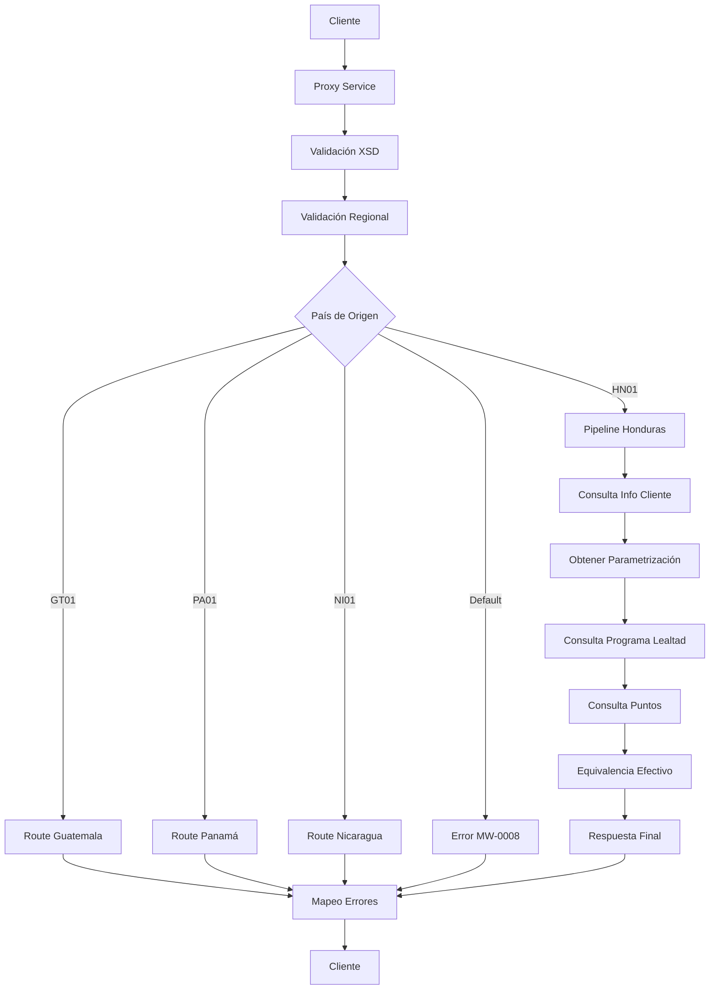

# Análisis Técnico: ConsultaPuntosLealtad

## Resumen Ejecutivo

El servicio **ConsultaPuntosLealtad** (FICBCO0229) es un servicio Router Dinámico Regional que permite consultar los puntos de lealtad disponibles de un cliente mediante diferentes tipos de identificación (ID Cliente, ID Legal o Número de Tarjeta). Implementa un patrón de Router Dinámico Regional con lógica específica por país.

## Arquitectura del Servicio

### Patrón de Diseño
- **Tipo**: Router Dinámico Regional
- **Versión**: v2
- **Protocolo**: SOAP/HTTP
- **Seguridad**: Custom Token Authentication

### Flujo de Ejecución



## Servicios Dependientes

### 1. ValidaServicioRegional_db
- **Propósito**: Validar disponibilidad del servicio por región
- **Parámetros**: serviceId (FICBCO0229), RequestHeader
- **Respuesta**: Código y mensaje de validación regional
- **Validación**: Verificación de disponibilidad por país/empresa

### 2. consultasClienteBS
- **Propósito**: Consultar información de clientes en T24
- **Parámetros**: customerId/legalId, username, password
- **Respuesta**: Datos del cliente (LEGALID, SHORTNAME)
- **Validación**: Verificación de existencia del cliente

### 3. sjConsultaTipoTarjeta
- **Propósito**: Determinar si una tarjeta es débito o crédito
- **Parámetros**: binNumber (primeros 6 dígitos), username, password
- **Respuesta**: Tipo de tarjeta (DEBIT/CREDIT)
- **Validación**: Validación del BIN de la tarjeta

### 4. tarjetasDebitoBS
- **Propósito**: Consultar información de tarjetas débito en Cobis
- **Parámetros**: cardNumber, username, password
- **Respuesta**: Información del cliente asociado a la tarjeta débito
- **Validación**: Verificación de existencia de la tarjeta

### 5. transaccionesAlcance
- **Propósito**: Consultar información de tarjetas crédito en Alcance
- **Parámetros**: cardNumber
- **Respuesta**: Información del cliente y grupo de afinidad
- **Validación**: Verificación del estatus de confirmación

### 6. ObtenerParametrizacion
- **Propósito**: Obtener parámetros de configuración
- **Parámetros**: nombreParametros (FICBCO0229.MRS.INSTITUTION.NAME)
- **Respuesta**: Valor del parámetro de configuración
- **Validación**: Verificación de existencia del parámetro

### 7. consultaProgramaLealtad_db
- **Propósito**: Determinar el programa de lealtad del cliente
- **Parámetros**: logo (grupo afinidad), codigoPais
- **Respuesta**: Código del programa de lealtad (1=Mastercard, 2=VISA)
- **Validación**: Verificación de programa asociado

### 8. CustomerService (Mastercard)
- **Propósito**: Consultar puntos en programa Mastercard
- **Parámetros**: Headers de autenticación MRS
- **Respuesta**: Puntos disponibles (AvailablePoints)
- **Validación**: Autenticación con Mastercard

### 9. WSCRS (VISA)
- **Propósito**: Consultar puntos en programa VISA
- **Parámetros**: cardNumber
- **Respuesta**: Puntos actuales del cliente
- **Validación**: Verificación del resultado de la operación

### 10. canjearPuntosEfectivo_db
- **Propósito**: Calcular equivalencia de puntos a efectivo
- **Parámetros**: tipoConversion, montoConversion, CASH_REDEMPTION
- **Respuesta**: Equivalente en efectivo y moneda
- **Validación**: Verificación del cálculo de conversión

### 11. MapeoErrores
- **Propósito**: Mapear códigos de error del servicio
- **Parámetros**: CODIGO_ERROR, MENSAJE_ERROR
- **Respuesta**: Error mapeado según configuración
- **Validación**: Transformación de errores técnicos a errores de negocio

## Transformaciones de Datos

### Procesamiento por País

| País | Código | Descripción Lógica | XQuery Request | XQuery Response |
|-------|--------|-------------------|----------------|----------------|
| Honduras | HN01 | Implementación completa con consulta de cliente, programa de lealtad y puntos. Soporta Mastercard y VISA | MasterNuevo/Middleware/v2/Resources/ConsultaPuntosLealtad/xq/consultaPuntosLealtadIn.xq | MasterNuevo/Middleware/v2/Resources/ConsultaPuntosLealtad/xq/consultaPuntosLealtadOut.xq |
| Guatemala | GT01 | Enrutamiento a servicio específico de Guatemala | MasterNuevo/Middleware/v2/Resources/ConsultaPuntosLealtad/xq/consultaPuntosLealtadGTOut.xq | MasterNuevo/Middleware/v2/Resources/ConsultaPuntosLealtad/xq/consultaPuntosLealtadGTOut.xq |
| Panamá | PA01 | Enrutamiento a servicio específico de Panamá | MasterNuevo/Middleware/v2/Resources/ConsultaPuntosLealtad/xq/consultaPuntosLealtadPAOut.xq | MasterNuevo/Middleware/v2/Resources/ConsultaPuntosLealtad/xq/consultaPuntosLealtadPAOut.xq |
| Nicaragua | NI01 | Enrutamiento a servicio específico de Nicaragua | MasterNuevo/Middleware/v2/Resources/ConsultaPuntosLealtad/xq/consultaPuntosLealtadNIOut.xq | MasterNuevo/Middleware/v2/Resources/ConsultaPuntosLealtad/xq/consultaPuntosLealtadNIOut.xq |

## Conexiones por País

### Honduras (HN01)
```xml
<!-- JCA -->
<service>ValidaServicioRegional_db</service>
<connection>[CONNECTION_MIDDLEWARE_HN]</connection>
<operation>ValidaServicioRegional</operation>

<!-- HTTP -->
<service>consultasClienteBS</service>
<endpoint>[ENDPOINT_T24_HN]</endpoint>
<operation>Consultadecliente</operation>
<!-- Autenticación: Basic Authentication con username/password del RequestHeader -->

<!-- HTTP -->
<service>tarjetasDebitoBS</service>
<endpoint>[ENDPOINT_COBIS_HN]</endpoint>
<operation>ConsultaMaestraTarjetaDebito</operation>
<!-- Autenticación: Basic Authentication con username/password del RequestHeader -->

<!-- HTTP -->
<service>transaccionesAlcance</service>
<endpoint>[ENDPOINT_ALCANCE_HN]</endpoint>
<operation>InformacionTarjeta</operation>

<!-- HTTPS -->
<service>CustomerService</service>
<endpoint>[ENDPOINT_MASTERCARD_HN]</endpoint>
<operation>getPointDetails</operation>
<!-- Autenticación: Custom MRS Identity Headers -->

<!-- HTTP -->
<service>WSCRS</service>
<endpoint>[ENDPOINT_VISA_HN]</endpoint>
<operation>validarDatosOpcion</operation>
```

### Guatemala (GT01)
```xml
<!-- SOAP -->
<service>ConsultaPuntosLealtadGT</service>
<endpoint>[ENDPOINT_GUATEMALA_PROXY]</endpoint>
<operation>consultaPuntosLealtad</operation>
```

### Panamá (PA01)
```xml
<!-- SOAP -->
<service>ConsultaPuntosLealtadPA</service>
<endpoint>[ENDPOINT_PANAMA_PROXY]</endpoint>
<operation>consultaPuntosLealtad</operation>
```

### Nicaragua (NI01)
```xml
<!-- SOAP -->
<service>ConsultaPuntosLealtadNI</service>
<endpoint>[ENDPOINT_NICARAGUA_PROXY]</endpoint>
<operation>consultaPuntosLealtad</operation>
```

## Validación XSD

### Información General
- **Esquema XSD**: programaLealtadTypes.xsd
- **Namespace**: http://www.ficohsa.com.hn/middleware.services/programaLealtadTypes
- **Versión**: v2

### Archivos de Esquema

#### Ubicación
- **XSD Principal**: `MasterNuevo/Middleware/v2/Resources/ProgramaLealtad/xsd/programaLealtadTypes.xsd`
- **WSDL**: `MasterNuevo/Middleware/v2/Resources/ConsultaPuntosLealtad/wsdl/consultaPuntosLealtadPS.wsdl`
- **Headers**: `MasterNuevo/Middleware/v2/Resources/esquemas_generales/HeaderElements.xsd`

#### Dependencias
- **Namespace auth**: Para elementos de autenticación (RequestHeader/ResponseHeader)
- **Namespace pro**: Para elementos específicos del programa de lealtad

### Estructura del Request

#### Definición XSD Request
```xml
<xs:element name="consultaPuntosLealtad">
    <xs:complexType>
        <xs:sequence>
            <xs:element name="CUSTOMER_ID_TYPE" type="xs:string" minOccurs="1" maxOccurs="1"/>
            <xs:element name="CUSTOMER_ID_VALUE" type="xs:string" minOccurs="1" maxOccurs="1"/>
            <xs:element name="RETURN_CASH_EQUIVALENT" type="xs:string" minOccurs="1" maxOccurs="1"/>
            <xs:element name="CASH_REDEMPTION" type="pro:CashRedemptionType" minOccurs="1" maxOccurs="1"/>
            <xs:element name="PROGRAM_ID" type="xs:string" minOccurs="0" maxOccurs="1"/>
        </xs:sequence>
    </xs:complexType>
</xs:element>
```

#### Ejemplo de Request Válido
> **Nota:** Los siguientes son datos de ejemplo no reales, utilizados únicamente para propósitos de testing y documentación.

```xml
<consultaPuntosLealtad xmlns="http://www.ficohsa.com.hn/middleware.services/programaLealtadTypes">
    <CUSTOMER_ID_TYPE>CUSTOMER_ID</CUSTOMER_ID_TYPE>
    <CUSTOMER_ID_VALUE>12345</CUSTOMER_ID_VALUE>
    <RETURN_CASH_EQUIVALENT>YES</RETURN_CASH_EQUIVALENT>
    <CASH_REDEMPTION>
        <CARD_NUMBER>1234567890123456</CARD_NUMBER>
        <MERCHANT_ID>MERCH001</MERCHANT_ID>
        <MERCHANT_TYPE>RETAIL</MERCHANT_TYPE>
        <TERMINAL_ID>TERM001</TERMINAL_ID>
    </CASH_REDEMPTION>
    <PROGRAM_ID>1</PROGRAM_ID>
</consultaPuntosLealtad>
```

### Estructura del Response

### Definiciones XSD Completas

#### Response Principal
```xml
<xs:element name="consultaPuntosLealtadResponse" type="pro:ConsultaPuntosLealtadResponseType">
</xs:element>

<xs:complexType name="ConsultaPuntosLealtadResponseType">
    <xs:sequence>
        <xs:element name="LEGAL_ID" type="xs:string" minOccurs="0" maxOccurs="1"/>
        <xs:element name="CUSTOMER_NAME" type="xs:string" minOccurs="0" maxOccurs="1"/>
        <xs:element name="BALANCE" type="xs:decimal" minOccurs="0" maxOccurs="1"/>
        <xs:element name="CASH_EQUIVALENT" type="xs:decimal" minOccurs="0" maxOccurs="1"/>
        <xs:element name="CASH_CURRENCY" type="xs:string" minOccurs="0" maxOccurs="1"/>
    </xs:sequence>
</xs:complexType>
```

#### Tipos Complejos
```xml
<xs:complexType name="CashRedemptionType">
    <xs:sequence>
        <xs:element name="CARD_NUMBER" type="xs:string" minOccurs="1" maxOccurs="1"/>
        <xs:element name="MERCHANT_ID" type="xs:string" minOccurs="1" maxOccurs="1"/>
        <xs:element name="MERCHANT_TYPE" type="xs:string" minOccurs="1" maxOccurs="1"/>
        <xs:element name="TERMINAL_ID" type="xs:string" minOccurs="1" maxOccurs="1"/>
    </xs:sequence>
</xs:complexType>
```

### Ejemplo de Response Válido

> **Nota:** Los siguientes son datos de ejemplo no reales, utilizados únicamente para propósitos de testing y documentación.

```xml
<consultaPuntosLealtadResponse xmlns="http://www.ficohsa.com.hn/middleware.services/programaLealtadTypes">
    <LEGAL_ID>0801199012345</LEGAL_ID>
    <CUSTOMER_NAME>Juan Pérez</CUSTOMER_NAME>
    <BALANCE>1500.00</BALANCE>
    <CASH_EQUIVALENT>15.00</CASH_EQUIVALENT>
    <CASH_CURRENCY>HNL</CASH_CURRENCY>
</consultaPuntosLealtadResponse>
```

### Casos de Error XSD

#### Request Inválido - Campo Faltante
> **Nota:** Los siguientes son datos de ejemplo no reales, utilizados únicamente para propósitos de testing y documentación.

```xml
<!-- ERROR: Falta CUSTOMER_ID_TYPE -->
<consultaPuntosLealtad xmlns="http://www.ficohsa.com.hn/middleware.services/programaLealtadTypes">
    <!-- CUSTOMER_ID_TYPE faltante -->
    <CUSTOMER_ID_VALUE>12345</CUSTOMER_ID_VALUE>
    <RETURN_CASH_EQUIVALENT>YES</RETURN_CASH_EQUIVALENT>
</consultaPuntosLealtad>
```

#### Request Inválido - Namespace Incorrecto
> **Nota:** Los siguientes son datos de ejemplo no reales, utilizados únicamente para propósitos de testing y documentación.

```xml
<!-- ERROR: Namespace incorrecto -->
<consultaPuntosLealtad xmlns="http://wrong.namespace/">
    <CUSTOMER_ID_TYPE>CUSTOMER_ID</CUSTOMER_ID_TYPE>
    <CUSTOMER_ID_VALUE>12345</CUSTOMER_ID_VALUE>
</consultaPuntosLealtad>
```

#### Response Inválido - Estructura Incorrecta
> **Nota:** Los siguientes son datos de ejemplo no reales, utilizados únicamente para propósitos de testing y documentación.

```xml
<!-- ERROR: Elemento no válido en response -->
<consultaPuntosLealtadResponse xmlns="http://www.ficohsa.com.hn/middleware.services/programaLealtadTypes">
    <INVALID_FIELD>Valor inválido</INVALID_FIELD>
    <LEGAL_ID>0801199012345</LEGAL_ID>
</consultaPuntosLealtadResponse>
```

---

## Historial de Cambios

| Fecha | Versión | Autor | Descripción |
|-------|---------|-------|-------------|
| 2024-12-19 | 1.0 | ARQ FICOHSA | Creación inicial |