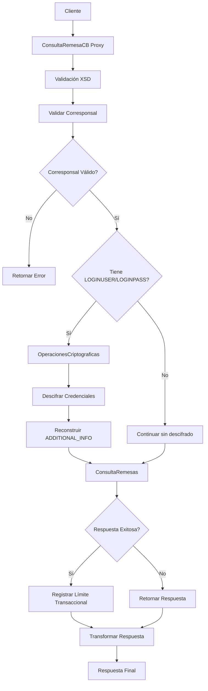

# Análisis Técnico: ConsultaRemesaCB

## Resumen Ejecutivo

El servicio **ConsultaRemesaCB** es un servicio de consulta de remesas de corresponsales bancarios que permite a los canales digitales consultar información de remesas internacionales. Implementa un patrón de servicio con validaciones de seguridad, descifrado de credenciales y registro de límites transaccionales.

## Arquitectura del Servicio

### Patrón de Diseño
- **Tipo**: Servicio con Lógica de Validación y Seguridad
- **Versión**: v2
- **Protocolo**: SOAP/HTTP
- **Seguridad**: Custom Token Authentication

### Flujo de Ejecución



## Servicios Dependientes

### 1. consultarCorresponsalB
- **Propósito**: Validar el código de corresponsal bancario
- **Parámetros**: transactionType="9", bankingCorrespId, sourceBank
- **Respuesta**: PV_CODIGO_MENSAJE, PV_MENSAJE_ERROR
- **Validación**: Si PV_CODIGO_MENSAJE != "SUCCESS", se retorna error

### 2. OperacionesCriptograficas
- **Propósito**: Descifrar credenciales LOGINUSER y LOGINPASS
- **Parámetros**: encryptedData, keyAlias="ONE-TIME-PASSWORD", cipher="RSA"
- **Respuesta**: DECRYPTED_DATA
- **Validación**: Solo se ejecuta si LOGINUSER y LOGINPASS están presentes y no vacíos

### 3. ConsultaRemesas
- **Propósito**: Consultar remesas en múltiples remesadoras
- **Parámetros**: Todos los campos del request transformados
- **Respuesta**: consultaRemesasResponse con array de remesas
- **Validación**: Se aplican transformaciones de entrada y salida

### 4. limiteTrxRegistrar
- **Propósito**: Registrar límite transaccional de la consulta
- **Parámetros**: consultaRemesasResponse, IdCliente
- **Respuesta**: Confirmación de registro
- **Validación**: Solo se ejecuta si successIndicator="SUCCESS"

## Transformaciones de Datos

### Procesamiento por País

| País | Código | Descripción Lógica | XQuery Request | XQuery Response |
|-------|--------|-------------------|----------------|-----------------|
| Todos | N/A | Transformación estándar de request CB a formato interno | MasterNuevo/Middleware/v2/Resources/ConsultaRemesasCB/xq/consultaRemesaCBIn.xq | MasterNuevo/Middleware/v2/Resources/ConsultaRemesasCB/xq/consultaRemesaCBOut.xq |
| Todos | N/A | Transformación de header CB a formato interno | MasterNuevo/Middleware/v2/Resources/ConsultaRemesasCB/xq/consultaRemesaCBHeaderIn.xq | N/A |
| Todos | N/A | Registro de límite transaccional | MasterNuevo/Middleware/v2/Resources/ConsultaRemesasCB/xq/limiteTransacionalRegistrarIn.xq | N/A |

## Conexiones por País

### Conexión a ConsultaRemesas
```xml
<!-- SOAP/HTTP -->
<service>ConsultaRemesas</service>
<endpoint>[ENDPOINT_CONSULTA_REMESAS]</endpoint>
<operation>consultaRemesas</operation>
<!-- Autenticación: Custom Token Authentication (solo para conexiones HTTP/SOAP) -->
```

### Conexión a OperacionesCriptograficas
```xml
<!-- SOAP/HTTP -->
<service>OperacionesCriptograficas</service>
<endpoint>[ENDPOINT_OPERACIONES_CRIPTOGRAFICAS]</endpoint>
<operation>cifrarDatos</operation>
<!-- Autenticación: Custom Token Authentication (solo para conexiones HTTP/SOAP) -->
```

### Conexión a consultarCorresponsalB
```xml
<!-- JCA -->
<service>consultarCorresponsalB_db</service>
<connection>[CONNECTION_MIDDLEWARE]</connection>
<operation>consultarCorresponsalB</operation>
```

### Conexión a limiteTrxRegistrar
```xml
<!-- JCA -->
<service>limiteTrxRegistrar_db</service>
<connection>[CONNECTION_MIDDLEWARE]</connection>
<operation>limiteTrxRegistrar</operation>
```

## Validación XSD

### Información General
- **Esquema XSD**: consultaRemesasCBTypes.xsd
- **Namespace**: http://www.ficohsa.com.hn/middleware.services/consultaRemesasCBTypes
- **Versión**: 1.0

### Archivos de Esquema

#### Ubicación
- **XSD Principal**: `MasterNuevo/Middleware/v2/Resources/ConsultaRemesasCB/xsd/consultaRemesasCBTypes.xsd`
- **WSDL**: `MasterNuevo/Middleware/v2/Resources/ConsultaRemesasCB/wsdl/consultaRemesaCB.wsdl`
- **Headers**: `MasterNuevo/Middleware/v2/Resources/esquemas_generales/HeaderElementsCB.xsd`

#### Dependencias
- **Namespace http://www.ficohsa.com.hn/middleware.services/autType**: Para RequestHeader y ResponseHeader
- **Namespace http://www.ficohsa.com.hn/middleware.services/consultaRemesasCBTypes**: Para tipos de datos del servicio

### Estructura del Request

#### Definición XSD Request
```xml
<xs:element name="consultaRemesas">
    <xs:complexType>
        <xs:sequence>
            <xs:element name="REMITTANCE_ID" type="xs:string" minOccurs="0"/>
            <xs:element name="REMITTER_FIRSTNAME" type="xs:string" minOccurs="0"/>
            <xs:element name="REMITTER_MIDDLENAME" type="xs:string" minOccurs="0"/>
            <xs:element name="REMITTER_FIRSTSURNAME" type="xs:string" minOccurs="0"/>
            <xs:element name="REMITTER_SECONDSURNAME" type="xs:string" minOccurs="0"/>
            <xs:element name="BENEFICIARY_FIRSTNAME" type="xs:string" minOccurs="0"/>
            <xs:element name="BENEFICIARY_MIDDLENAME" type="xs:string" minOccurs="0"/>
            <xs:element name="BENEFICIARY_FIRSTSURNAME" type="xs:string" minOccurs="0"/>
            <xs:element name="BENEFICIARY_SECONDSURNAME" type="xs:string" minOccurs="0"/>
            <xs:element name="CORRESPONSAL_BRANCHCODE" type="xs:string" minOccurs="0"/>
            <xs:element name="ADDITIONAL_INFO" minOccurs="0" maxOccurs="1">
                <xs:complexType>
                    <xs:sequence>
                        <xs:element name="INFO" minOccurs="0" maxOccurs="unbounded">
                            <xs:complexType>
                                <xs:sequence>
                                    <xs:element name="NAME" type="xs:string" minOccurs="0"/>
                                    <xs:element name="VALUE" type="xs:string" minOccurs="0"/>
                                </xs:sequence>
                            </xs:complexType>
                        </xs:element>
                    </xs:sequence>
                </xs:complexType>
            </xs:element>
        </xs:sequence>
    </xs:complexType>
</xs:element>
```

#### Ejemplo de Request Válido
> **Nota:** Los siguientes son datos de ejemplo no reales, utilizados únicamente para propósitos de testing y documentación.

```xml
<cons:consultaRemesas xmlns:cons="http://www.ficohsa.com.hn/middleware.services/consultaRemesasCBTypes">
    <REMITTANCE_ID>REM123456789</REMITTANCE_ID>
    <REMITTER_FIRSTNAME>Juan</REMITTER_FIRSTNAME>
    <REMITTER_MIDDLENAME>Carlos</REMITTER_MIDDLENAME>
    <REMITTER_FIRSTSURNAME>Perez</REMITTER_FIRSTSURNAME>
    <REMITTER_SECONDSURNAME>Lopez</REMITTER_SECONDSURNAME>
    <BENEFICIARY_FIRSTNAME>Maria</BENEFICIARY_FIRSTNAME>
    <BENEFICIARY_MIDDLENAME>Elena</BENEFICIARY_MIDDLENAME>
    <BENEFICIARY_FIRSTSURNAME>Gomez</BENEFICIARY_FIRSTSURNAME>
    <BENEFICIARY_SECONDSURNAME>Martinez</BENEFICIARY_SECONDSURNAME>
    <CORRESPONSAL_BRANCHCODE>001</CORRESPONSAL_BRANCHCODE>
    <ADDITIONAL_INFO>
        <INFO>
            <NAME>ID</NAME>
            <VALUE>12345678</VALUE>
        </INFO>
        <INFO>
            <NAME>LOGINUSER</NAME>
            <VALUE>encrypted_user_value</VALUE>
        </INFO>
        <INFO>
            <NAME>LOGINPASS</NAME>
            <VALUE>encrypted_pass_value</VALUE>
        </INFO>
    </ADDITIONAL_INFO>
</cons:consultaRemesas>
```

### Estructura del Response

### Definiciones XSD Completas

#### Response Principal
```xml
<xs:element name="consultaRemesasResponse" type="cons:consultaRemesasResponseType"/>

<xs:complexType name="consultaRemesasResponseType">
    <xs:sequence>
        <xs:element name="consultaRemesasResponseType" type="cons:consultaRemesasResponseRecordType" form="qualified" minOccurs="0"/>
    </xs:sequence>
</xs:complexType>
```

#### Tipos Complejos
```xml
<xs:complexType name="consultaRemesasResponseRecordType">
    <xs:sequence>
        <xs:element name="consultaRemesasResponseRecordType" type="cons:consultaRemesasResponseArrayType" form="qualified" minOccurs="0" maxOccurs="unbounded"/>
    </xs:sequence>
</xs:complexType>

<xs:complexType name="consultaRemesasResponseArrayType">
    <xs:sequence>
        <xs:element name="REMITTANCE_ID" type="xs:string" minOccurs="0"/>
        <xs:element name="REMITTER_ID" type="xs:string" minOccurs="0"/>
        <xs:element name="REMITTER_NAME" type="xs:string" minOccurs="0"/>
        <xs:element name="BENEFICIARY_NAME" type="xs:string" minOccurs="0"/>
        <xs:element name="BRANCH_NAME" type="xs:string" minOccurs="0"/>
        <xs:element name="PAYMENT_DATE" type="xs:string" minOccurs="0"/>
        <xs:element name="CURRENCY" type="xs:string" minOccurs="0"/>
        <xs:element name="EXCHANGE_RATE" type="xs:string" minOccurs="0"/>
        <xs:element name="REMITTANCE_STATUS" type="xs:string" minOccurs="0"/>
        <xs:element name="REMITTANCE_AMOUNT" type="xs:string" minOccurs="0"/>
        <xs:element name="REMITTANCE_SOURCE_AMOUNT" type="xs:string" minOccurs="0"/>
        <xs:element name="ORIGIN_COUNTRY" type="xs:string" minOccurs="0"/>
    </xs:sequence>
</xs:complexType>
```

### Ejemplo de Response Válido

> **Nota:** Los siguientes son datos de ejemplo no reales, utilizados únicamente para propósitos de testing y documentación.

```xml
<cons:consultaRemesasResponse xmlns:cons="http://www.ficohsa.com.hn/middleware.services/consultaRemesasCBTypes">
    <cons:consultaRemesasResponseType>
        <cons:consultaRemesasResponseRecordType>
            <REMITTANCE_ID>REM123456789</REMITTANCE_ID>
            <REMITTER_ID>RMT001</REMITTER_ID>
            <REMITTER_NAME>Juan Carlos Perez Lopez</REMITTER_NAME>
            <BENEFICIARY_NAME>Maria Elena Gomez Martinez</BENEFICIARY_NAME>
            <BRANCH_NAME>Sucursal Central</BRANCH_NAME>
            <PAYMENT_DATE>2024-01-15</PAYMENT_DATE>
            <CURRENCY>USD</CURRENCY>
            <EXCHANGE_RATE>24.50</EXCHANGE_RATE>
            <REMITTANCE_STATUS>DISPONIBLE</REMITTANCE_STATUS>
            <REMITTANCE_AMOUNT>500.00</REMITTANCE_AMOUNT>
            <REMITTANCE_SOURCE_AMOUNT>500.00</REMITTANCE_SOURCE_AMOUNT>
            <ORIGIN_COUNTRY>USA</ORIGIN_COUNTRY>
        </cons:consultaRemesasResponseRecordType>
    </cons:consultaRemesasResponseType>
</cons:consultaRemesasResponse>
```

### Casos de Error XSD

#### Request Inválido - Namespace Incorrecto
> **Nota:** Los siguientes son datos de ejemplo no reales, utilizados únicamente para propósitos de testing y documentación.

```xml
<!-- ERROR: Namespace incorrecto -->
<consultaRemesas xmlns="http://wrong.namespace/">
    <REMITTANCE_ID>REM123456789</REMITTANCE_ID>
</consultaRemesas>
```

#### Request Inválido - Estructura ADDITIONAL_INFO Incorrecta
> **Nota:** Los siguientes son datos de ejemplo no reales, utilizados únicamente para propósitos de testing y documentación.

```xml
<!-- ERROR: Estructura de INFO incorrecta -->
<cons:consultaRemesas xmlns:cons="http://www.ficohsa.com.hn/middleware.services/consultaRemesasCBTypes">
    <ADDITIONAL_INFO>
        <INFO>
            <INVALID_FIELD>valor</INVALID_FIELD>
        </INFO>
    </ADDITIONAL_INFO>
</cons:consultaRemesas>
```

#### Response Inválido - Campo con Tipo Incorrecto
> **Nota:** Los siguientes son datos de ejemplo no reales, utilizados únicamente para propósitos de testing y documentación.

```xml
<!-- ERROR: Todos los campos deben ser string -->
<cons:consultaRemesasResponse xmlns:cons="http://www.ficohsa.com.hn/middleware.services/consultaRemesasCBTypes">
    <cons:consultaRemesasResponseType>
        <cons:consultaRemesasResponseRecordType>
            <REMITTANCE_AMOUNT>500</REMITTANCE_AMOUNT> <!-- Debe ser string "500.00" -->
        </cons:consultaRemesasResponseRecordType>
    </cons:consultaRemesasResponseType>
</cons:consultaRemesasResponse>
```

---

## Historial de Cambios

| Fecha | Versión | Autor | Descripción |
|-------|---------|-------|-------------|
| 2024-01-15 | 1.0 | ARQ FICOHSA | Creación inicial |
