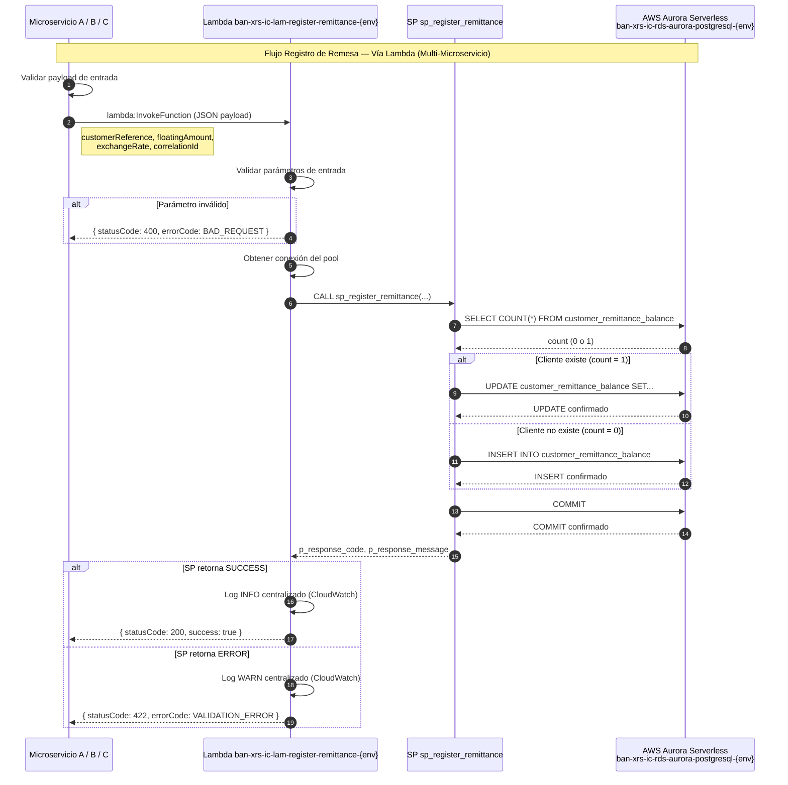

# Migración AWS Aurora — Lambda Registro de Remesas 

## Control de Cambios

| Fecha | Versión | Cambio | Autor |
|-------|---------|--------|-------|
| 2026-03-12 | v1.0 | **Creación del Documento** | **David Julian Molano Peralta** |
| 2026-03-19 | v1.1 | **Análisis variante Lambda para escenario multi-microservicio** | **David Julian Molano Peralta** |

[[_TOC_]]

---
## 1. Resumen Ejecutivo

Describe la justificación técnica y el diseño de arquitectura para **introducir una Lambda como capa de acceso al stored procedure** `sp_register_remittance` en AWS Aurora PostgreSQL, aplicable cuando la funcionalidad de registro de remesas deba ser consumida por **más de un microservicio**.

El análisis incluye:
- Criterios de decisión para adoptar Lambda como intermediario
- Comparación de arquitecturas con y sin Lambda en contexto multi-microservicio
- Diseño de la Lambda, contrato de interfaz y manejo de errores
- Consideraciones de seguridad, costos y operabilidad

| Componente Original | Componente AWS | Identificador |
|---|---|---|
| Oracle Schema `MIDDLEWARE` | Aurora PostgreSQL Schema `remittanceManagement` | `ban-xrs-ic-rds-aurora-postgresql-{env}` |
| `MW_MONTOS_CLIENTES_REMESAS` | `customer_remittance_balance` | — |
| `OSB_P_REGISTRAR_REMESA` | `sp_register_remittance` | `ban-xrs-ic-sp-register-remittance-{env}` |
| _(nuevo)_ | **Lambda Registro** | **`ban-xrs-ic-lam-register-remittance-{env}`** |

---

## 2. Mapeo de Nomenclatura BIAN

_(Sin cambios respecto al documento base — se reproduce por completitud)_

### 2.1 Tabla

| Nombre Original (Oracle) | Nombre BIAN (Aurora PostgreSQL) | Descripción |
|---|---|---|
| `MW_MONTOS_CLIENTES_REMESAS` | `customer_remittance_balance` | Registro de montos acumulados y flotantes de remesas por cliente |

### 2.2 Campos — `MW_MONTOS_CLIENTES_REMESAS` → `customer_remittance_balance`

| Campo Original | Campo BIAN | Tipo Original | Tipo Aurora | Descripción |
|---|---|---|---|---|
| `ID_CLIENTE` | `customer_reference` | `VARCHAR2` | `VARCHAR(50)` | Identificador único del cliente |
| `MONTO_ACUMULADO` | `accumulated_amount` | `VARCHAR2` | `NUMERIC(18,2)` | Monto total acumulado de remesas |
| `MONTO_FLOTANTE` | `floating_amount` | `VARCHAR2` | `NUMERIC(18,2)` | Monto flotante pendiente de procesar |
| `TASA_CAMBIO` | `exchange_rate` | `VARCHAR2` | `NUMERIC(10,6)` | Tasa de cambio aplicada |
| `ESTADO` | `status` | `VARCHAR2` | `VARCHAR(10)` | Estado: `PEN`=Pendiente, `PRO`=Procesado, `CAN`=Cancelado |

### 2.3 Parámetros del Stored Procedure

| Parámetro Original | Parámetro BIAN | Dirección | Descripción |
|---|---|---|---|
| `PV_ID_CLIENTE` | `p_customer_reference` | IN | Identificador del cliente |
| `PV_MONTO_FLOTANTE` | `p_floating_amount` | IN | Monto flotante a registrar |
| `PV_TASA_CAMBIO` | `p_exchange_rate` | IN | Tasa de cambio |
| `PV_CODIGO_ERROR` | `p_response_code` | OUT | Código de respuesta: `SUCCESS` / `ERROR` |
| `PV_MENSAJE_ERROR` | `p_response_message` | OUT | Mensaje descriptivo del resultado |

---

## 3. Modelo de Datos — AWS Aurora PostgreSQL

### 3.1 Tabla: `customer_remittance_balance`

```sql
Schema  : remittanceManagement
Tabla   : customer_remittance_balance
PK      : customer_reference
Índices : idx_crb_status, idx_crb_customer_status
```

| Columna | Tipo | Nulo | PK | FK | Descripción |
|---|---|---|---|---|---|
| `customer_reference` | `VARCHAR(50)` | NO | PK | — | Identificador único del cliente |
| `accumulated_amount` | `NUMERIC(18,2)` | NO | — | — | Monto total acumulado |
| `floating_amount` | `NUMERIC(18,2)` | NO | — | — | Monto flotante pendiente |
| `exchange_rate` | `NUMERIC(10,6)` | NO | — | — | Tasa de cambio aplicada |
| `status` | `VARCHAR(10)` | NO | — | — | Estado de la remesa |
| `created_at` | `TIMESTAMP` | NO | — | — | Fecha de creación del registro |
| `updated_at` | `TIMESTAMP` | YES | — | — | Fecha de última modificación |

---

## 4. Modelo Entidad-Relación

```
┌─────────────────────────────────────────────────────────────────────┐
│                    remittanceManagement schema                     │
│                                                                     │
│  ┌──────────────────────────────────────────────────────────────┐   │
│  │              customer_remittance_balance                     │   │
│  ├──────────────────────────────────────────────────────────────┤   │
│  │ PK customer_reference                                        │   │
│  │    accumulated_amount                                        │   │
│  │    floating_amount                                           │   │
│  │    exchange_rate                                             │   │
│  │    status  (PEN/PRO/CAN)                                     │   │
│  │    created_at                                                │   │
│  │    updated_at                                                │   │
│  └──────────────────────────────────────────────────────────────┘   │
│                                                                     │
│  Tabla independiente - No relaciones FK                            │
└─────────────────────────────────────────────────────────────────────┘
```

**Cardinalidad:**
- Tabla independiente con un registro por cliente
- Operaciones UPSERT (INSERT o UPDATE según existencia del cliente)

---

## 5. Scripts DDL — Creación de Tablas


```sql
-- ============================================================
-- Schema
-- ============================================================
CREATE SCHEMA IF NOT EXISTS remittanceManagement;

-- ============================================================
-- Tabla: customer_remittance_balance
-- Equivalente a: MW_MONTOS_CLIENTES_REMESAS
-- ============================================================
CREATE TABLE remittanceManagement.customer_remittance_balance (
    customer_reference      VARCHAR(50)         NOT NULL,
    accumulated_amount      NUMERIC(18,2)       NOT NULL DEFAULT 0.00,
    floating_amount         NUMERIC(18,2)       NOT NULL DEFAULT 0.00,
    exchange_rate           NUMERIC(10,6)       NOT NULL,
    status                  VARCHAR(10)         NOT NULL DEFAULT 'PEN',
    created_at              TIMESTAMP           NOT NULL DEFAULT NOW(),
    updated_at              TIMESTAMP,

    CONSTRAINT pk_customer_remittance_balance
        PRIMARY KEY (customer_reference),

    CONSTRAINT chk_crb_status
        CHECK (status IN ('PEN', 'PRO', 'CAN')),

    CONSTRAINT chk_crb_amounts_positive
        CHECK (accumulated_amount >= 0 AND floating_amount >= 0),

    CONSTRAINT chk_crb_exchange_rate_positive
        CHECK (exchange_rate > 0)
);

CREATE INDEX idx_crb_status
    ON remittanceManagement.customer_remittance_balance (status);

CREATE INDEX idx_crb_customer_status
    ON remittanceManagement.customer_remittance_balance (customer_reference, status);

COMMENT ON TABLE remittanceManagement.customer_remittance_balance
    IS 'Registro de montos acumulados y flotantes de remesas por cliente. Migrado desde Oracle MW_MONTOS_CLIENTES_REMESAS.';
```

---

## 6. Scripts DML — Carga Inicial de Datos

_(Sin cambios respecto al documento base)_

```sql
-- ============================================================
-- Carga inicial: customer_remittance_balance
-- Fuente: MW_MONTOS_CLIENTES_REMESAS.csv
-- Nota: El archivo CSV solo contiene headers, no hay datos iniciales
-- ============================================================

-- Datos de ejemplo para testing
INSERT INTO remittanceManagement.customer_remittance_balance
    (customer_reference, accumulated_amount, floating_amount, exchange_rate, status, created_at)
VALUES
    ('CUST001', 1500.00, 250.00, 24.5000, 'PEN', NOW()),
    ('CUST002', 3200.50, 0.00, 24.4800, 'PRO', NOW()),
    ('CUST003', 0.00, 500.00, 24.5200, 'PEN', NOW());
```

---

## 7. Stored Procedure — AWS Aurora PostgreSQL

_(Sin cambios respecto al documento base)_

> **Nombre:** `sp_register_remittance`
> **Identificador AWS:** `ban-xrs-ic-sp-register-remittance-{env}`
> **Motor:** Aurora PostgreSQL — PL/pgSQL
> **Equivalente Oracle:** `MIDDLEWARE.OSB_P_REGISTRAR_REMESA`

```sql
CREATE OR REPLACE PROCEDURE remittanceManagement.sp_register_remittance(
    IN  p_customer_reference        VARCHAR(50),
    IN  p_floating_amount           NUMERIC(18,2),
    IN  p_exchange_rate             NUMERIC(10,6),
    OUT p_response_code             VARCHAR(10),
    OUT p_response_message          VARCHAR(500)
)
LANGUAGE plpgsql
AS $$
DECLARE
    v_customer_count INTEGER := 0;
BEGIN
    IF p_customer_reference IS NULL OR TRIM(p_customer_reference) = '' THEN
        p_response_code    := 'ERROR';
        p_response_message := 'ERROR: PARAMETRO DE ENTRADA customer_reference ES REQUERIDO.';
        RETURN;
    END IF;

    IF p_floating_amount IS NULL OR p_floating_amount < 0 THEN
        p_response_code    := 'ERROR';
        p_response_message := 'ERROR: PARAMETRO floating_amount DEBE SER MAYOR O IGUAL A CERO.';
        RETURN;
    END IF;

    IF p_exchange_rate IS NULL OR p_exchange_rate <= 0 THEN
        p_response_code    := 'ERROR';
        p_response_message := 'ERROR: PARAMETRO exchange_rate DEBE SER MAYOR A CERO.';
        RETURN;
    END IF;

    BEGIN
        SELECT COUNT(*) INTO v_customer_count
        FROM remittanceManagement.customer_remittance_balance
        WHERE customer_reference = p_customer_reference;
    EXCEPTION
        WHEN OTHERS THEN
            p_response_code    := 'ERROR';
            p_response_message := 'ERROR EN CONSULTA CLIENTE: ' || SQLERRM;
            RETURN;
    END;

    BEGIN
        IF v_customer_count = 1 THEN
            UPDATE remittanceManagement.customer_remittance_balance
            SET floating_amount = p_floating_amount,
                exchange_rate   = p_exchange_rate,
                status          = 'PEN',
                updated_at      = NOW()
            WHERE customer_reference = p_customer_reference;

            IF NOT FOUND THEN
                p_response_code    := 'ERROR';
                p_response_message := 'ERROR: NO SE PUDO ACTUALIZAR EL CLIENTE.';
                RETURN;
            END IF;
        ELSE
            INSERT INTO remittanceManagement.customer_remittance_balance
                (customer_reference, accumulated_amount, floating_amount, exchange_rate, status, created_at)
            VALUES
                (p_customer_reference, 0.00, p_floating_amount, p_exchange_rate, 'PEN', NOW());
        END IF;

        COMMIT;
    EXCEPTION
        WHEN OTHERS THEN
            ROLLBACK;
            p_response_code    := 'ERROR';
            p_response_message := 'ERROR EN OPERACION UPSERT: ' || SQLERRM;
            RETURN;
    END;

    p_response_code    := 'SUCCESS';
    p_response_message := '';

EXCEPTION
    WHEN OTHERS THEN
        ROLLBACK;
        p_response_code    := 'ERROR';
        p_response_message := 'ERROR GENERAL SP sp_register_remittance: ' || SQLERRM;
END;
$$;

-- Permisos: la Lambda asume un rol IAM que dispone de este permiso
GRANT EXECUTE ON PROCEDURE remittanceManagement.sp_register_remittance(
    VARCHAR, NUMERIC, NUMERIC,
    OUT VARCHAR, OUT VARCHAR
) TO remittance_lambda_role;
```

---

## 8. Decisión de Arquitectura: Justificación del Uso de Lambda en Escenario Multi-Microservicio

### 8.1 Pregunta Central

> **¿Cuándo deja de ser suficiente el consumo directo y se justifica introducir una Lambda?**

La respuesta es clara: **cuando más de un microservicio necesita ejecutar la misma operación sobre la misma base de datos**. En ese punto, replicar la lógica de conexión, el manejo de errores y la transformación de datos en cada consumidor genera deuda técnica, aumenta la superficie de errores y dificulta el mantenimiento evolutivo.

### 8.2 Condiciones que Activan esta Decisión

| Condición | ¿Aplica? | Descripción |
|---|---|---|
| Más de un microservicio consumidor | **SÍ** | El SP es invocado desde múltiples contextos de negocio |
| Lógica de transformación compartida | **SÍ** | Mapeo de parámetros, normalización de errores y logging estructurado deben ser consistentes |
| Necesidad de control centralizado de acceso a DB | **SÍ** | Un único punto de conexión reduce el número de conexiones abiertas a Aurora |
| Requisitos de auditoría transversal | **SÍ** | Logging y trazabilidad centralizados sin repetir código en cada MS |
| Desacoplamiento de credenciales de BD | **SÍ** | Ningún microservicio conoce las credenciales de Aurora directamente |

### 8.3 Problema del Consumo Directo con Múltiples Microservicios

Cuando varios microservicios se conectan directamente a Aurora, surgen los siguientes problemas:

```
┌──────────────────┐  pool propio TCP  ┌──────────────────────────┐
│ Microservicio A  │ ─────────────────► │                          │
│ (Remesas)        │   CALL sp_...      │   Aurora PostgreSQL       │
└──────────────────┘                   │   Max connections: 1000   │
                                        │   (limitado por instancia)│
┌──────────────────┐  pool propio TCP  │                          │
│ Microservicio B  │ ─────────────────► │                          │
│ (Pagos)          │   CALL sp_...      └──────────────────────────┘
└──────────────────┘
                                        ▲ Problema: cada MS abre su
┌──────────────────┐  pool propio TCP   propio pool de conexiones.
│ Microservicio C  │ ─────────────────► Con N microservicios, las
│ (Notificaciones) │   CALL sp_...      conexiones se multiplican.
└──────────────────┘
```

**Consecuencias:**
- **Agotamiento de conexiones**: Aurora Serverless tiene un límite de conexiones simultáneas; cada microservicio con su propio pool compite por ese recurso.
- **Duplicación de lógica**: El código de conexión, retry y transformación de errores se replica en cada MS.
- **Credenciales dispersas**: Las credenciales de la base de datos deben existir en los Secrets Manager o variables de entorno de cada microservicio por separado.
- **Inconsistencia de logs**: Cada MS puede registrar los errores del SP de forma diferente, dificultando la observabilidad centralizada.

### 8.4 Solución: Lambda como Proxy del Stored Procedure

La Lambda actúa como un **único punto de acceso centralizado** al SP. Ningún microservicio mantiene una conexión directa a Aurora.

```
┌──────────────────┐                   ┌─────────────────────────┐
│ Microservicio A  │ ──── invoke ─────► │                         │
│ (Remesas)        │   JSON payload     │  Lambda                 │
└──────────────────┘                   │  ban-xrs-ic-lam-        │   pool TCP   ┌───────────────────────┐
                                        │  register-remittance-   │ ────────────► │  Aurora PostgreSQL     │
┌──────────────────┐                   │  {env}                  │  CALL sp...   │  sp_register_remittance│
│ Microservicio B  │ ──── invoke ─────► │                         │ ◄──────────── │                       │
│ (Pagos)          │   JSON payload     │  · Pool de conexiones   │  result       └───────────────────────┘
└──────────────────┘                   │  · Manejo de errores    │
                                        │  · Logging centralizado │
┌──────────────────┐                   │  · Transformación resp. │
│ Microservicio C  │ ──── invoke ─────► │                         │
│ (Notificaciones) │   JSON payload     └─────────────────────────┘
└──────────────────┘
```

### 8.5 Comparación Arquitectónica: Directo vs Lambda (Multi-Microservicio)

#### Opción A: Consumo Directo con Múltiples Microservicios (NO recomendada en este escenario)

| Criterio | Evaluación |
|---|---|
| Conexiones a Aurora | N pools × M conexiones cada uno = deuda de conexiones |
| Gestión de credenciales | Secreto replicado en cada microservicio |
| Actualización de lógica | Requiere despliegue coordinado de todos los MS |
| Observabilidad | Logs fragmentados en múltiples CloudWatch log groups |
| Riesgo de inconsistencia | Alto: cada MS puede implementar el retry de forma diferente |

#### Opción B: Lambda como Proxy Centralizado (RECOMENDADA en escenario multi-MS)

| Criterio | Evaluación |
|---|---|
| Conexiones a Aurora | Un único pool gestionado por la Lambda (con RDS Proxy opcional) |
| Gestión de credenciales | Secreto en Secrets Manager, accedido solo por la Lambda |
| Actualización de lógica | Un único despliegue de Lambda afecta a todos los consumidores |
| Observabilidad | Logs centralizados en un único CloudWatch log group |
| Riesgo de inconsistencia | Bajo: la transformación y el manejo de errores son uniformes |

### 8.6 Justificaciones Técnicas Detalladas

#### 8.6.1 Gestión Eficiente de Conexiones a Aurora

Aurora PostgreSQL tiene un límite máximo de conexiones simultáneas determinado por el tamaño de la instancia (ACUs en Serverless v2). Cada microservicio que abre su propio connection pool consume conexiones de ese límite de forma independiente.

Con la Lambda:
- Un único pool de conexiones (o RDS Proxy) atiende a todos los microservicios.
- Las conexiones se reutilizan entre invocaciones de la Lambda en el mismo contenedor (execution context reuse).
- Se puede añadir **Amazon RDS Proxy** frente a Aurora para gestionar aún mejor el pooling sin cambiar la Lambda.

```
Sin Lambda (3 MS × pool de 10):   30 conexiones mínimas abiertas
Con Lambda (1 pool de 10):        10 conexiones máximas abiertas
```

#### 8.6.2 Centralización de Credenciales y Seguridad

Con consumo directo, cada microservicio necesita acceso a:
- `AURORA_HOST`, `DB_USER`, `DB_PASSWORD` (o ARN del secret en Secrets Manager)
- Regla de Security Group que permita tráfico TCP 5432 desde cada MS

Con Lambda:
- Solo la Lambda tiene el secreto de la base de datos.
- Los microservicios solo necesitan permiso IAM `lambda:InvokeFunction` sobre el ARN de la Lambda.
- El Security Group de Aurora solo permite ingresos desde el Security Group de la Lambda.
- **Principio de mínimo privilegio**: los MS nunca conocen las credenciales de la BD.

#### 8.6.3 Evolución y Mantenimiento

Si el SP cambia (nuevo parámetro, cambio de esquema, nueva validación), con consumo directo se deben actualizar y redesplegar todos los microservicios consumidores de forma coordinada. Con la Lambda, el cambio se absorbe en un único artefacto desplegable, con posibilidad de versionado y alias (`PROD`, `STAGING`) para rollout gradual.

#### 8.6.4 Observabilidad Centralizada

La Lambda emite todos los logs al mismo CloudWatch log group (`/aws/lambda/ban-xrs-ic-lam-register-remittance-{env}`). Esto permite:
- Dashboards unificados de latencia y errores.
- Alarmas centralizadas en CloudWatch Alarms.
- Trazabilidad con AWS X-Ray activado en la Lambda (trace por correlationId).
- Un único destino de logs para herramientas de observabilidad (Datadog, OpenSearch, etc.).

#### 8.6.5 Gestión de Throttling y Rate Limiting

Con consumo directo, si dos microservicios generan picos de carga simultáneos, compiten directamente por las conexiones de Aurora. Con la Lambda se puede configurar:
- **Reserved Concurrency**: limitar el número máximo de ejecuciones paralelas de la Lambda, protegiendo a Aurora de sobrecargas.
- **Provisioned Concurrency**: eliminar cold starts para microservicios críticos.

### 8.7 Cuándo NO Usar Lambda (referencia cruzada)

| Escenario | Recomendación |
|---|---|
| Un solo microservicio consume el SP | Consumo directo (ver `ET-RegistrarRemesa.md`) |
| El SP solo es llamado en procesos batch nocturnos | Consumo directo desde el job scheduler |
| Latencia sub-milisegundo es un requisito estricto | Evaluar consumo directo con RDS Proxy |
| Dos o más microservicios en producción consumen el SP | **Lambda recomendada** (este documento) |

### 8.8 Recomendación Final

> **RECOMENDACIÓN: USAR Lambda cuando la funcionalidad es consumida por más de un microservicio.**
>
> La Lambda `ban-xrs-ic-lam-register-remittance-{env}` actúa como el único punto de acceso al stored procedure `sp_register_remittance`. Centraliza conexiones, credenciales, logging y manejo de errores, reduciendo la complejidad operativa total a medida que crece el número de consumidores.

---

## 9. Diseño de la Lambda

### 9.1 Identificación del Componente

| Atributo | Valor |
|---|---|
| **Nombre** | `ban-xrs-ic-lam-register-remittance-{env}` |
| **Runtime** | Node.js 20.x |
| **Arquitectura** | arm64 (Graviton2 — mejor relación precio/performance) |
| **Timeout** | 15 segundos |
| **Memory** | 256 MB |
| **VPC** | Misma VPC que Aurora PostgreSQL |
| **Rol IAM** | `ban-xrs-ic-rol-lam-register-remittance-{env}` |
| **Reserva de concurrencia** | 50 (ajustable según carga) |

### 9.2 Contrato de Interfaz

#### Request (JSON)

```json
{
  "customerReference": "CUST001",
  "floatingAmount": 250.00,
  "exchangeRate": 24.5500,
  "correlationId": "uuid-v4-opcional"
}
```

#### Response exitoso

```json
{
  "statusCode": 200,
  "body": {
    "success": true,
    "correlationId": "uuid-v4",
    "message": "Remesa registrada exitosamente"
  }
}
```

#### Response con error de negocio

```json
{
  "statusCode": 422,
  "body": {
    "success": false,
    "correlationId": "uuid-v4",
    "errorCode": "VALIDATION_ERROR",
    "errorMessage": "ERROR: PARAMETRO floating_amount DEBE SER MAYOR O IGUAL A CERO."
  }
}
```

#### Response con error técnico

```json
{
  "statusCode": 500,
  "body": {
    "success": false,
    "correlationId": "uuid-v4",
    "errorCode": "INTERNAL_ERROR",
    "errorMessage": "Error interno al registrar la remesa."
  }
}
```
---

## 10. Manejo de Errores

### 10.1 Tabla de Códigos de Error Unificada

| Capa | HTTP Status | errorCode | Causa | Acción Recomendada |
|---|---|---|---|---|
| Lambda | 400 | `BAD_REQUEST` | Parámetro faltante o de tipo incorrecto | Validar payload en el MS antes de invocar |
| SP | 422 | `VALIDATION_ERROR` | `customer_reference` nulo, monto negativo, tasa cero | Corregir los valores de entrada |
| SP | 422 | `VALIDATION_ERROR` | No se pudo actualizar el cliente | Revisar condición de carrera o reintentar |
| Lambda | 500 | `INTERNAL_ERROR` | Error de conexión a Aurora o fallo técnico del SP | Revisar logs en CloudWatch, alertar a operaciones |

---

## 11. Diagrama de Secuencia — Con Lambda (Multi-Microservicio)



---

## 12. Consideraciones de Migración

### 12.1 Diferencias Oracle → Aurora PostgreSQL

| Aspecto | Oracle PL/SQL | Aurora PostgreSQL PL/pgSQL |
|---|---|---|---|
| Tipo de dato numérico | `VARCHAR2` para montos (error de diseño) | `NUMERIC(18,2)` para precisión decimal |
| Manejo de transacciones | `COMMIT` explícito | `COMMIT` explícito (igual) |
| Variables locales | `CONTAR_ID NUMBER` | `v_customer_count INTEGER` |
| Verificación de filas afectadas | Implícito en Oracle | `IF NOT FOUND THEN` explícito |
| Manejo de excepciones | `WHEN OTHERS THEN` | `WHEN OTHERS THEN` (igual) |

### 12.2 Script de Migración de Datos

```sql
INSERT INTO remittanceManagement.customer_remittance_balance
    (customer_reference, accumulated_amount, floating_amount, exchange_rate, status, created_at)
SELECT
    ID_CLIENTE,
    CAST(MONTO_ACUMULADO AS NUMERIC(18,2)),
    CAST(MONTO_FLOTANTE AS NUMERIC(18,2)),
    CAST(TASA_CAMBIO AS NUMERIC(10,6)),
    CASE
        WHEN ESTADO = 'PEN' THEN 'PEN'
        WHEN ESTADO = 'PRO' THEN 'PRO'
        WHEN ESTADO = 'CAN' THEN 'CAN'
        ELSE 'PEN'
    END,
    NOW()
FROM oracle_source.MW_MONTOS_CLIENTES_REMESAS;
```

---

## 13. Testing y Validación

### 13.1 Casos de Prueba del SP (sin cambios)

| Caso | Entrada | Resultado Esperado |
|---|---|---|
| **Cliente nuevo** | customerReference='NEW001', floatingAmount=100.00, exchangeRate=24.50 | INSERT exitoso, responseCode=200 |
| **Cliente existente** | customerReference='EXIST001', floatingAmount=200.00, exchangeRate=24.60 | UPDATE exitoso, responseCode=200 |
| **Customer reference nulo** | customerReference=null | statusCode=400, BAD_REQUEST |
| **Floating amount negativo** | floatingAmount=-50.00 | statusCode=400, BAD_REQUEST |
| **Exchange rate cero** | exchangeRate=0.00 | statusCode=400, BAD_REQUEST |

### 13.2 Pruebas Específicas de la Lambda

| Caso | Descripción | Resultado Esperado |
|---|---|---|
| **Invocación concurrente** | Invocar la Lambda desde 3 MS simultáneamente | Todas responden independientemente sin interferirse |
| **Pool de conexiones** | Verificar que la Lambda reutiliza conexiones entre invocaciones tibias | Latencia P95 < 200ms en invocaciones sucesivas |
| **Cold start** | Primera invocación tras período de inactividad | Latencia < 2s (acceptable para cold start) |
| **Error de conexión a Aurora** | Simular Aurora no disponible | statusCode=500, INTERNAL_ERROR, sin exponer detalles internos |
| **Concurrencia reservada** | Superar el límite de concurrencia configurado | Throttle controlado, MS recibe TooManyRequestsException |


## 14. Repositorio y Despliegue

| Ambiente | Repositorio | Rama | Observación |
|----------|-------------|------|-------------|
| Dev | `fn-ic-register_remittance-sys` | [Repositorio Azure](https://dev.azure.com/DevopsFicohsa/NOVA%20-%20Modernizaci%C3%B3n%20Capa%20Integraci%C3%B3n/_git/fn-ic-register_remittance-sys) | `develop` | Desarrollo activo |

**Artefactos adicionales para la variante Lambda:**
- Código fuente: `src/lambda/register-remittance/handler.js`
- SAM / CDK template: `infra/lambda/register-remittance.yaml`
- Pipeline CI/CD: stage `deploy-lambda` en `azure-pipelines.yml`

---

## 15. Conclusiones y Recomendaciones

### 15.1 Resumen de la Decisión

| Escenario | Arquitectura Recomendada | Documento de Referencia |
|---|---|---|
| Un único microservicio consumidor | Consumo directo al SP | `ET-RegistrarRemesa.md` |
| Dos o más microservicios consumidores | **Lambda como proxy del SP** | **Este documento** |

### 15.2 Beneficios Clave de la Lambda en Escenario Multi-MS

1. **Un único pool de conexiones** en lugar de N pools independientes — Aurora no se satura.
2. **Credenciales centralizadas** — Los MS nunca acceden directamente a la BD.
3. **Un punto de despliegue** para cambios en la interfaz con el SP — sin coordinación entre equipos de múltiples MS.
4. **Logging y trazabilidad unificados** — Un solo log group, un solo dashboard de observabilidad.
5. **Control de throttling** mediante concurrencia reservada — protege a Aurora de sobrecarga en picos.
6. **Seguridad reforzada** — La Lambda vive en la misma VPC que Aurora; los MS solo necesitan permiso IAM `lambda:InvokeFunction`.

### 15.3 Consideraciones de Costo

| Componente | Costo Adicional vs Consumo Directo |
|---|---|
| Lambda invocations | ~$0.20 por millón de invocaciones |
| Lambda duration (256 MB, ~150ms avg) | ~$0.0000033 por invocación |
| CloudWatch Logs | Según volumen de logs generados |
| **Total estimado (1M invocaciones/mes)** | **< $5 USD/mes** |

El costo adicional es marginal comparado con el beneficio operativo de centralizar el acceso a la BD cuando el número de consumidores crece.

### 15.4 Próximos Pasos

1. **Confirmar la lista de microservicios** que consumirán el SP (criterio de activación de esta arquitectura).
2. **Crear la Lambda** en el repositorio `fn-ic-register_remittance-sys` con el handler descrito en §9.3.
3. **Configurar el rol IAM** de la Lambda y las políticas de cada MS consumidor (§9.5 y §9.6).
4. **Desplegar en Dev** y ejecutar los casos de prueba de §13.2 y §13.3.
5. **Actualizar los microservicios consumidores** para invocar la Lambda en lugar de conectarse directamente a Aurora.
6. **Monitorear** latencia P50/P95/P99 y tasa de errores durante el período de estabilización.
