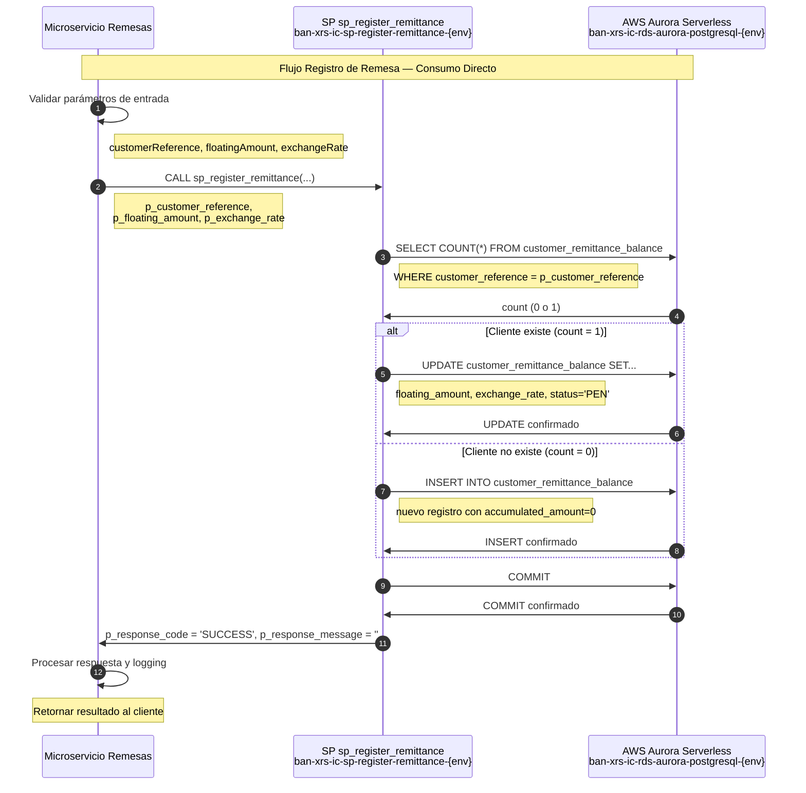

# Migración AWS Aurora — Lambda Registro de Remesas

## Control de Cambios

| Fecha | Versión | Cambio | Autor |
|-------|---------|--------|-------|
| 2026-03-12 | v1.0 | **Creación del Documento** | **David Julian Molano Peralta** |

[[_TOC_]]

---
## 1. Resumen Ejecutivo

Este documento describe la migración de la tabla Oracle (`MW_MONTOS_CLIENTES_REMESAS`) y su stored procedure asociado (`OSB_P_REGISTRAR_REMESA`) desde una base de datos Oracle hacia **AWS Aurora Serverless PostgreSQL**.

El proceso de migración incluye:
- Rediseño del esquema con nomenclatura **BIAN (Banking Industry Architecture Network)**
- Reescritura del stored procedure en **PL/pgSQL** (compatible con Aurora PostgreSQL)
- **Recomendación de NO usar Lambda** debido a que será consumido desde un único microservicio
- Definición de estrategia de manejo de errores y logging

| Componente Original | Componente AWS | Identificador |
|---|---|---|
| Oracle Schema `MIDDLEWARE` | Aurora PostgreSQL Schema `remittanceManagement` | `ban-xrs-ic-rds-aurora-postgresql-{env}` |
| `MW_MONTOS_CLIENTES_REMESAS` | `customer_remittance_balance` | — |
| `OSB_P_REGISTRAR_REMESA` | `sp_register_remittance` | `ban-xrs-ic-sp-register-remittance-{env}` |

---

## 2. Mapeo de Nomenclatura BIAN

### 2.1 Tabla

| Nombre Original (Oracle) | Nombre BIAN (Aurora PostgreSQL) | Descripción |
|---|---|---|
| `MW_MONTOS_CLIENTES_REMESAS` | `customer_remittance_balance` | Registro de montos acumulados y flotantes de remesas por cliente |

### 2.2 Campos — `MW_MONTOS_CLIENTES_REMESAS` → `customer_remittance_balance`

| Campo Original | Campo BIAN | Tipo Original | Tipo Aurora | Descripción |
|---|---|---|---|---|
| `ID_CLIENTE` | `customer_reference` | `VARCHAR2` | `VARCHAR(50)` | Identificador único del cliente |
| `MONTO_ACUMULADO` | `accumulated_amount` | `VARCHAR2` | `NUMERIC(18,2)` | Monto total acumulado de remesas |
| `MONTO_FLOTANTE` | `floating_amount` | `VARCHAR2` | `NUMERIC(18,2)` | Monto flotante pendiente de procesar |
| `TASA_CAMBIO` | `exchange_rate` | `VARCHAR2` | `NUMERIC(10,6)` | Tasa de cambio aplicada |
| `ESTADO` | `status` | `VARCHAR2` | `VARCHAR(10)` | Estado: `PEN`=Pendiente, `PRO`=Procesado, `CAN`=Cancelado |

### 2.3 Parámetros del Stored Procedure

| Parámetro Original | Parámetro BIAN | Dirección | Descripción |
|---|---|---|---|
| `PV_ID_CLIENTE` | `p_customer_reference` | IN | Identificador del cliente |
| `PV_MONTO_FLOTANTE` | `p_floating_amount` | IN | Monto flotante a registrar |
| `PV_TASA_CAMBIO` | `p_exchange_rate` | IN | Tasa de cambio |
| `PV_CODIGO_ERROR` | `p_response_code` | OUT | Código de respuesta: `SUCCESS` / `ERROR` |
| `PV_MENSAJE_ERROR` | `p_response_message` | OUT | Mensaje descriptivo del resultado |

---

## 3. Modelo de Datos — AWS Aurora PostgreSQL

### 3.1 Tabla: `customer_remittance_balance`

```sql
Schema  : remittanceManagement
Tabla   : customer_remittance_balance
PK      : customer_reference
Índices : idx_crb_status, idx_crb_customer_status
```

| Columna | Tipo | Nulo | PK | FK | Descripción |
|---|---|---|---|---|---|
| `customer_reference` | `VARCHAR(50)` | NO | PK | — | Identificador único del cliente |
| `accumulated_amount` | `NUMERIC(18,2)` | NO | — | — | Monto total acumulado |
| `floating_amount` | `NUMERIC(18,2)` | NO | — | — | Monto flotante pendiente |
| `exchange_rate` | `NUMERIC(10,6)` | NO | — | — | Tasa de cambio aplicada |
| `status` | `VARCHAR(10)` | NO | — | — | Estado de la remesa |
| `created_at` | `TIMESTAMP` | NO | — | — | Fecha de creación del registro |
| `updated_at` | `TIMESTAMP` | YES | — | — | Fecha de última modificación |

---

## 4. Modelo Entidad-Relación

```
┌─────────────────────────────────────────────────────────────────────┐
│                    remittanceManagement schema                     │
│                                                                     │
│  ┌──────────────────────────────────────────────────────────────┐   │
│  │              customer_remittance_balance                     │   │
│  ├──────────────────────────────────────────────────────────────┤   │
│  │ PK customer_reference                                        │   │
│  │    accumulated_amount                                        │   │
│  │    floating_amount                                           │   │
│  │    exchange_rate                                             │   │
│  │    status  (PEN/PRO/CAN)                                     │   │
│  │    created_at                                                │   │
│  │    updated_at                                                │   │
│  └──────────────────────────────────────────────────────────────┘   │
│                                                                     │
│  Tabla independiente - No relaciones FK                            │
└─────────────────────────────────────────────────────────────────────┘
```

**Cardinalidad:**
- Tabla independiente con un registro por cliente
- Operaciones UPSERT (INSERT o UPDATE según existencia del cliente)

---

## 5. Scripts DDL — Creación de Tablas

```sql
-- ============================================================
-- Schema
-- ============================================================
CREATE SCHEMA IF NOT EXISTS remittanceManagement;

-- ============================================================
-- Tabla: customer_remittance_balance
-- Equivalente a: MW_MONTOS_CLIENTES_REMESAS
-- ============================================================
CREATE TABLE remittanceManagement.customer_remittance_balance (
    customer_reference      VARCHAR(50)         NOT NULL,
    accumulated_amount      NUMERIC(18,2)       NOT NULL DEFAULT 0.00,
    floating_amount         NUMERIC(18,2)       NOT NULL DEFAULT 0.00,
    exchange_rate           NUMERIC(10,6)       NOT NULL,
    status                  VARCHAR(10)         NOT NULL DEFAULT 'PEN',
    created_at              TIMESTAMP           NOT NULL DEFAULT NOW(),
    updated_at              TIMESTAMP,

    CONSTRAINT pk_customer_remittance_balance
        PRIMARY KEY (customer_reference),

    CONSTRAINT chk_crb_status
        CHECK (status IN ('PEN', 'PRO', 'CAN')),

    CONSTRAINT chk_crb_amounts_positive
        CHECK (accumulated_amount >= 0 AND floating_amount >= 0),

    CONSTRAINT chk_crb_exchange_rate_positive
        CHECK (exchange_rate > 0)
);

CREATE INDEX idx_crb_status
    ON remittanceManagement.customer_remittance_balance (status);

CREATE INDEX idx_crb_customer_status
    ON remittanceManagement.customer_remittance_balance (customer_reference, status);

COMMENT ON TABLE remittanceManagement.customer_remittance_balance
    IS 'Registro de montos acumulados y flotantes de remesas por cliente. Migrado desde Oracle MW_MONTOS_CLIENTES_REMESAS.';

COMMENT ON COLUMN remittanceManagement.customer_remittance_balance.customer_reference
    IS 'Identificador único del cliente en el sistema.';
COMMENT ON COLUMN remittanceManagement.customer_remittance_balance.accumulated_amount
    IS 'Monto total acumulado de remesas procesadas para el cliente.';
COMMENT ON COLUMN remittanceManagement.customer_remittance_balance.floating_amount
    IS 'Monto flotante pendiente de procesar o confirmar.';
COMMENT ON COLUMN remittanceManagement.customer_remittance_balance.exchange_rate
    IS 'Tasa de cambio aplicada a la última transacción de remesa.';
COMMENT ON COLUMN remittanceManagement.customer_remittance_balance.status
    IS 'Estado de la remesa: PEN=Pendiente, PRO=Procesado, CAN=Cancelado.';
```

---

## 6. Scripts DML — Carga Inicial de Datos

```sql
-- ============================================================
-- Carga inicial: customer_remittance_balance
-- Fuente: MW_MONTOS_CLIENTES_REMESAS.csv
-- Nota: El archivo CSV solo contiene headers, no hay datos iniciales
-- ============================================================

-- Datos de ejemplo para testing
INSERT INTO remittanceManagement.customer_remittance_balance
    (customer_reference, accumulated_amount, floating_amount, exchange_rate, status, created_at)
VALUES
    ('CUST001', 1500.00, 250.00, 24.5000, 'PEN', NOW()),
    ('CUST002', 3200.50, 0.00, 24.4800, 'PRO', NOW()),
    ('CUST003', 0.00, 500.00, 24.5200, 'PEN', NOW());
```

---

## 7. Stored Procedure — AWS Aurora PostgreSQL

> **Nombre:** `sp_register_remittance`
> **Identificador AWS:** `ban-xrs-ic-sp-register-remittance-{env}`
> **Motor:** Aurora PostgreSQL — PL/pgSQL
> **Equivalente Oracle:** `MIDDLEWARE.OSB_P_REGISTRAR_REMESA`

```sql
-- ============================================================
-- SP: sp_register_remittance
-- Descripción: Registra o actualiza los datos de remesa de un cliente.
--              Si el cliente existe, actualiza monto flotante y tasa.
--              Si no existe, crea un nuevo registro.
-- Autor migración: ficohsa-capa-media team
-- Fecha migración: 2026-03-12
-- Versión original Oracle: 1.0
-- ============================================================
CREATE OR REPLACE PROCEDURE remittanceManagement.sp_register_remittance(
    -- Parámetros de entrada
    IN  p_customer_reference        VARCHAR(50),
    IN  p_floating_amount           NUMERIC(18,2),
    IN  p_exchange_rate             NUMERIC(10,6),
    -- Parámetros de salida
    OUT p_response_code             VARCHAR(10),
    OUT p_response_message          VARCHAR(500)
)
LANGUAGE plpgsql
AS $$
DECLARE
    v_customer_count INTEGER := 0;
BEGIN

    -- --------------------------------------------------------
    -- Validación parámetros de entrada
    -- --------------------------------------------------------
    IF p_customer_reference IS NULL OR TRIM(p_customer_reference) = '' THEN
        p_response_code    := 'ERROR';
        p_response_message := 'ERROR: PARAMETRO DE ENTRADA customer_reference ES REQUERIDO.';
        RETURN;
    END IF;

    IF p_floating_amount IS NULL OR p_floating_amount < 0 THEN
        p_response_code    := 'ERROR';
        p_response_message := 'ERROR: PARAMETRO floating_amount DEBE SER MAYOR O IGUAL A CERO.';
        RETURN;
    END IF;

    IF p_exchange_rate IS NULL OR p_exchange_rate <= 0 THEN
        p_response_code    := 'ERROR';
        p_response_message := 'ERROR: PARAMETRO exchange_rate DEBE SER MAYOR A CERO.';
        RETURN;
    END IF;

    -- --------------------------------------------------------
    -- Verificar si el cliente existe
    -- --------------------------------------------------------
    BEGIN
        SELECT COUNT(*) INTO v_customer_count
        FROM remittanceManagement.customer_remittance_balance
        WHERE customer_reference = p_customer_reference;

    EXCEPTION
        WHEN OTHERS THEN
            p_response_code    := 'ERROR';
            p_response_message := 'ERROR EN CONSULTA CLIENTE: ' || SQLERRM;
            RETURN;
    END;

    -- --------------------------------------------------------
    -- Actualizar cliente existente o insertar nuevo cliente
    -- --------------------------------------------------------
    BEGIN
        IF v_customer_count = 1 THEN
            -- Cliente existe: actualizar datos
            UPDATE remittanceManagement.customer_remittance_balance
            SET floating_amount = p_floating_amount,
                exchange_rate   = p_exchange_rate,
                status          = 'PEN',
                updated_at      = NOW()
            WHERE customer_reference = p_customer_reference;

            IF NOT FOUND THEN
                p_response_code    := 'ERROR';
                p_response_message := 'ERROR: NO SE PUDO ACTUALIZAR EL CLIENTE.';
                RETURN;
            END IF;

        ELSE
            -- Cliente no existe: insertar nuevo registro
            INSERT INTO remittanceManagement.customer_remittance_balance
                (customer_reference, accumulated_amount, floating_amount, exchange_rate, status, created_at)
            VALUES
                (p_customer_reference, 0.00, p_floating_amount, p_exchange_rate, 'PEN', NOW());

        END IF;

        -- Confirmar transacción
        COMMIT;

    EXCEPTION
        WHEN OTHERS THEN
            ROLLBACK;
            p_response_code    := 'ERROR';
            p_response_message := 'ERROR EN OPERACION UPSERT: ' || SQLERRM;
            RETURN;
    END;

    -- --------------------------------------------------------
    -- Respuesta exitosa
    -- --------------------------------------------------------
    p_response_code    := 'SUCCESS';
    p_response_message := '';

EXCEPTION
    WHEN OTHERS THEN
        ROLLBACK;
        p_response_code    := 'ERROR';
        p_response_message := 'ERROR GENERAL SP sp_register_remittance: ' || SQLERRM;
END;
$$;

-- Permisos de ejecución
GRANT EXECUTE ON PROCEDURE remittanceManagement.sp_register_remittance(
    VARCHAR, NUMERIC, NUMERIC,
    OUT VARCHAR, OUT VARCHAR
) TO remittance_microservice_role;
```

---

## 8. Decisión de Arquitectura: ¿Lambda o Consumo Directo?

### 8.1 Análisis del Contexto

**Características del caso de uso:**
- **Un único microservicio consumidor** (no múltiples APIs externas)
- **Operación UPSERT simple** (INSERT o UPDATE según existencia)
- **Modelo de datos sencillo** (una sola tabla, sin relaciones complejas)
- **Lógica de negocio mínima** (validaciones básicas de entrada)

### 8.2 Comparación de Arquitecturas

#### Opción A: Con Lambda (NO recomendada)

```
┌─────────────────┐    REST/HTTPS    ┌──────────────┐    pool TCP    ┌──────────────────────────┐
│ Microservicio   │ ───────────────► │ Lambda       │ ─────────────► │  Aurora PostgreSQL        │
│ Remesas         │    JSON          │ (wrapper)    │    CALL sp..   │  sp_register_remittance   │
└─────────────────┘                  └──────────────┘                └──────────────────────────┘
```

**Desventajas:**
- **Latencia adicional**: HTTP round-trip + cold start Lambda
- **Complejidad innecesaria**: Wrapper que no agrega valor
- **Costos adicionales**: Invocaciones Lambda + API Gateway
- **Punto de falla extra**: Lambda puede fallar independientemente del SP

#### Opción B: Consumo Directo (RECOMENDADA)

```
┌─────────────────┐    conexión pool    ┌──────────────────────────┐
│ Microservicio   │ ──────────────────► │  Aurora PostgreSQL        │
│ Remesas         │    CALL sp_register │  sp_register_remittance   │
└─────────────────┘                     └──────────────────────────┘
```

**Ventajas:**
- **Menor latencia**: Conexión directa sin intermediarios
- **Simplicidad**: Menos componentes = menos puntos de falla
- **Menor costo**: Sin costos de Lambda ni API Gateway
- **Control total**: El microservicio maneja su propio pool de conexiones y retry logic

### 8.3 Recomendación Final

> **RECOMENDACIÓN: NO usar Lambda**
>
> Para este caso específico, la Lambda actuaría como un **wrapper innecesario** que agrega complejidad sin beneficios. El microservicio debe consumir directamente el stored procedure desde Aurora PostgreSQL.

### 8.4 Implementación Recomendada en el Microservicio

```javascript
// Ejemplo de implementación en Node.js
const { Pool } = require('pg');

class RemittanceService {
    constructor() {
        this.pool = new Pool({
            host: process.env.AURORA_HOST,
            port: 5432,
            database: 'remittance_db',
            user: process.env.DB_USER,
            password: process.env.DB_PASSWORD,
            max: 10, // máximo 10 conexiones en el pool
            idleTimeoutMillis: 30000,
            connectionTimeoutMillis: 2000,
        });
    }

    async registerRemittance(customerReference, floatingAmount, exchangeRate) {
        const client = await this.pool.connect();
        try {
            const result = await client.query(
                'CALL remittanceManagement.sp_register_remittance($1, $2, $3, $4, $5)',
                [customerReference, floatingAmount, exchangeRate, null, null]
            );
            
            const [responseCode, responseMessage] = result.rows[0];
            
            if (responseCode === 'SUCCESS') {
                return { success: true, message: 'Remesa registrada exitosamente' };
            } else {
                return { success: false, error: responseMessage };
            }
        } finally {
            client.release();
        }
    }
}
```

---

## 9. Manejo de Errores del Stored Procedure

### 9.1 Tabla de Códigos de Error

| Código Error | Origen | Causa | Acción Recomendada |
|---|---|---|---|
| `SUCCESS` | SP | Operación exitosa | Continuar flujo normal |
| `ERROR: PARAMETRO DE ENTRADA customer_reference ES REQUERIDO` | SP | `customer_reference` nulo o vacío | Validar entrada en microservicio |
| `ERROR: PARAMETRO floating_amount DEBE SER MAYOR O IGUAL A CERO` | SP | `floating_amount` negativo | Validar monto en microservicio |
| `ERROR: PARAMETRO exchange_rate DEBE SER MAYOR A CERO` | SP | `exchange_rate` cero o negativo | Validar tasa de cambio |
| `ERROR EN CONSULTA CLIENTE` | SP | Error en SELECT COUNT | Revisar conectividad y permisos DB |
| `ERROR: NO SE PUDO ACTUALIZAR EL CLIENTE` | SP | UPDATE no afectó filas | Posible condición de carrera |
| `ERROR EN OPERACION UPSERT` | SP | Error en INSERT/UPDATE | Revisar constraints y tipos de datos |
| `ERROR GENERAL SP sp_register_remittance` | SP | Error inesperado | Revisar logs Aurora y estructura de datos |

---

## 10. Diagrama de Secuencia



---

## 11. Consideraciones de Migración

### 11.1 Diferencias Oracle → Aurora PostgreSQL

| Aspecto | Oracle PL/SQL | Aurora PostgreSQL PL/pgSQL |
|---|---|---|---|
| Tipo de dato numérico | `VARCHAR2` para montos (error de diseño) | `NUMERIC(18,2)` para precisión decimal |
| Manejo de transacciones | `COMMIT` explícito | `COMMIT` explícito (igual) |
| Variables locales | `CONTAR_ID NUMBER` | `v_customer_count INTEGER` |
| Verificación de filas afectadas | Implícito en Oracle | `IF NOT FOUND THEN` explícito |
| Manejo de excepciones | `WHEN OTHERS THEN` | `WHEN OTHERS THEN` (igual) |
| `SQLERRM` | Sí | `SQLERRM` disponible |
| Parámetros OUT | Por referencia | Por referencia (igual) |

### 11.2 Mejoras Implementadas en la Migración

| Mejora | Descripción | Beneficio |
|---|---|---|
| **Tipos de datos correctos** | Cambio de `VARCHAR2` a `NUMERIC` para montos | Precisión decimal y validaciones automáticas |
| **Validaciones de entrada** | Verificación de parámetros nulos y valores negativos | Prevención de errores de datos |
| **Constraints de tabla** | `CHECK` constraints para montos positivos y estados válidos | Integridad de datos a nivel DB |
| **Campos de auditoría** | `created_at` y `updated_at` automáticos | Trazabilidad temporal |
| **Índices optimizados** | Índices compuestos para consultas frecuentes | Mejor performance |
| **Nomenclatura BIAN** | Nombres de campos alineados con estándares bancarios | Consistencia arquitectónica |

### 11.3 Datos de Migración

**Tabla original:** Solo contiene headers en el CSV, sin datos reales
```csv
"ID_CLIENTE","MONTO_ACUMULADO","MONTO_FLOTANTE","TASA_CAMBIO","ESTADO"
```

**Estrategia de migración:**
1. **Crear tabla nueva** con estructura mejorada
2. **Migrar datos existentes** (si los hay) usando AWS DMS o script personalizado
3. **Validar integridad** con queries de verificación
4. **Probar SP** con casos de prueba completos

### 11.4 Script de Migración de Datos

```sql
-- Script para migrar datos desde Oracle (cuando existan)
INSERT INTO remittanceManagement.customer_remittance_balance
    (customer_reference, accumulated_amount, floating_amount, exchange_rate, status, created_at)
SELECT 
    ID_CLIENTE,
    CAST(MONTO_ACUMULADO AS NUMERIC(18,2)),
    CAST(MONTO_FLOTANTE AS NUMERIC(18,2)),
    CAST(TASA_CAMBIO AS NUMERIC(10,6)),
    CASE 
        WHEN ESTADO = 'PEN' THEN 'PEN'
        WHEN ESTADO = 'PRO' THEN 'PRO'
        WHEN ESTADO = 'CAN' THEN 'CAN'
        ELSE 'PEN'
    END,
    NOW()
FROM oracle_source.MW_MONTOS_CLIENTES_REMESAS;
```

---

## 12. Testing y Validación

### 12.1 Casos de Prueba del SP

| Caso | Entrada | Resultado Esperado |
|---|---|---|
| **Cliente nuevo** | customer_reference='NEW001', floating_amount=100.00, exchange_rate=24.50 | INSERT exitoso, response_code='SUCCESS' |
| **Cliente existente** | customer_reference='EXIST001', floating_amount=200.00, exchange_rate=24.60 | UPDATE exitoso, response_code='SUCCESS' |
| **Customer reference nulo** | customer_reference=NULL | response_code='ERROR', mensaje de validación |
| **Floating amount negativo** | floating_amount=-50.00 | response_code='ERROR', mensaje de validación |
| **Exchange rate cero** | exchange_rate=0.00 | response_code='ERROR', mensaje de validación |
| **Error de DB** | Simular falla de conexión | response_code='ERROR', mensaje técnico |

---

## 13. Repositorio y Despliegue

| Ambiente | Repositorio | Rama | Observación |
|----------|-------------|------|-------------|
| Dev | `fn-ic-register_remittance-sys` | [Repositorio Azure](https://dev.azure.com/DevopsFicohsa/NOVA%20-%20Modernizaci%C3%B3n%20Capa%20Integraci%C3%B3n/_git/fn-ic-register_remittance-sys) | `develop` | Desarrollo activo |

---

## 14. Conclusiones y Recomendaciones

### 14.1 Decisiones Clave

1. **NO usar Lambda**: El microservicio debe consumir directamente el SP para minimizar latencia y complejidad
2. **Mejorar tipos de datos**: Cambiar de `VARCHAR2` a `NUMERIC` para montos monetarios
3. **Agregar validaciones**: Implementar checks a nivel de SP y tabla
4. **Mantener simplicidad**: La operación UPSERT es suficiente sin lógica adicional

### 14.2 Beneficios de la Migración

- **Performance mejorada**: Aurora Serverless v2 con escalado automático
- **Integridad de datos**: Constraints y tipos correctos
- **Observabilidad**: Logs estructurados en el microservicio
- **Mantenibilidad**: Código PL/pgSQL más legible que el original Oracle
- **Costos optimizados**: Sin componentes intermedios innecesarios

### 14.3 Próximos Pasos

1. **Crear esquema y tabla** en Aurora PostgreSQL
2. **Implementar y probar SP** con casos de prueba completos  
3. **Actualizar microservicio** para consumir el nuevo SP
4. **Migrar datos existentes** (si los hay) desde Oracle
5. **Monitorear performance** y ajustar configuraciones según sea necesario