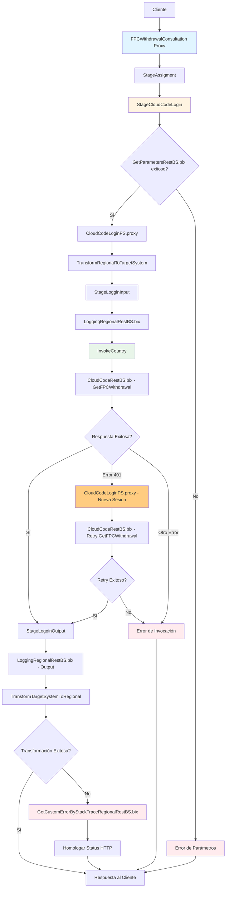
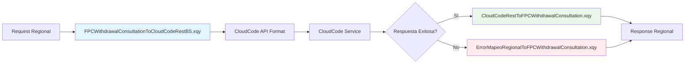

# Análisis Técnico: FPCWithdrawalConsultation

## Resumen Ejecutivo

El servicio **FPCWithdrawalConsultation** (Pension/FPCWithdrawalConsultation) es un servicio de tipo Local (Honduras) que permite consultar información de fondo de pensión y retiro efectuado por un cliente a partir de su identificación y número de solicitud. Implementa un patrón de **Proxy Rest/Soap Local**, expuesto y enrutado desde proxy de regionalización.

## Arquitectura del Servicio

### Patrón de Diseño
- **Tipo**: Servicio Local HTTP Rest / Soap
- **Versión**: v1
- **Protocolo**: SOAP/HTTP REST
- **Seguridad**: Basic Authentication

### Flujo de Ejecución



## Servicios Dependientes

### 1. GetParametersRestBS.bix
- **Tipo**: HTTP/REST
- **Propósito**: Obtener parámetros de configuración necesarios para la autenticación y operación del servicio
- **Etapa**: StageCloudCodeLogin
- **Parámetros**:
  - `parameterName`: "PG13516.SERVICE.ACCOUNT.APIFPC" (string) - Nombre del parámetro de configuración
- **Respuesta**:
  - `errorCode`: Código de estado de la operación ("SUCCESS" si es exitoso)
  - `message`: Mensaje descriptivo del resultado
  - `parameters/parameter/value`: Valor del parámetro solicitado (nombre de cuenta de servicio)
- **Validación**: Si errorCode != "SUCCESS", se detiene el flujo y se retorna error

### 2. CloudCodeLoginPS.proxy
- **Tipo**: SOAP
- **Propósito**: Servicio de autenticación que genera tokens de acceso para servicios de CloudCode
- **Etapa**: StageCloudCodeLogin / Manejo de Error 401
- **Operación**: cloudCodeLogin
- **Parámetros**:
  - `forceLogin`: "false" (inicial) / "true" (re-autenticación) - Forzar nueva sesión
  - `credentials`: Credenciales encriptadas obtenidas de ExtractCredentialsAPIFPC
- **Respuesta**:
  - `successIndicator`: Indicador de éxito de la autenticación
  - `message`: Mensaje descriptivo del resultado
  - `response/datos/token`: Token de sesión válido para CloudCode
- **Validación**: Se invoca inicialmente y en caso de error 401 para renovar sesión

### 3. LoggingRegionalRestBS.bix
- **Tipo**: HTTP/REST
- **Propósito**: Servicio de logging para registrar entrada y salida de operaciones
- **Etapa**: StageLogginInput / StageLogginOutput
- **Operación**: logOperation
- **Parámetros**:
  - Información de request/response y metadatos de la operación
  - Datos de trazabilidad y auditoria
- **Respuesta**:
  - Confirmación de registro de log
- **Validación**: Invocación desatendida, no afecta el flujo principal

### 4. CloudCodeRestBS.bix
- **Tipo**: HTTP/REST
- **Propósito**: Servicio principal de negocio que ejecuta la operación GetFPCWithdrawal
- **Etapa**: InvokeCountry
- **Operación**: GetFPCWithdrawal
- **Parámetros**:
  - `numeroSolicitud`: Número de solicitud de retiro (decimal)
  - `numeroIdentificacion`: Número de identificación del cliente (string)
  - **Header**: `Authorization`: Token de sesión obtenido de CloudCodeLoginPS
- **Respuesta**:
  - `error`: Indicador de error ("false" = éxito, otro valor = error)
  - `mensaje`: Mensaje descriptivo del resultado
  - `datos/retiros`: Objeto con información del retiro:
    - `id`: Identificador del retiro
    - `cuenta`: Número de cuenta
    - `numeroIdentificacion`: Número de identificación
    - `nombreCliente`: Nombre completo del cliente
    - `formaPago`: Método de pago
    - `moneda`: Tipo de moneda
    - `monto`: Monto del retiro (decimal)
    - `tipoRetiro`: Tipo de retiro
    - `cuentaBancaria`: Cuenta bancaria destino
- **Validación**: 
  - Manejo especial de error 401 para re-autenticación automática
  - Si error = "false" entonces statusService = "Success", sino "Error"

### 5. GetCustomErrorByStackTraceRegionalRestBS.bix
- **Tipo**: HTTP/REST
- **Propósito**: Generar trazabilidad de errores y homologar códigos de respuesta HTTP
- **Etapa**: TransformTargetSystemToRegional (en caso de error)
- **Operación**: process
- **Parámetros**:
  - `systemApplication`: Sistema de origen del error
  - `service`: Nombre del servicio que generó el error
  - `errorMessage`: Mensaje de error original
  - `errorCode`: Código de error original
  - `language`: Idioma para la respuesta de error
- **Respuesta**:
  - Error homologado con código HTTP estandarizado
  - Mensaje de error traducido según el idioma
- **Validación**: Se invoca solo cuando hay errores en la transformación de respuesta

## Transformaciones de Datos

### Procesamiento por País

| País | Código | Descripción Lógica | XQuery Request | XQuery Response |
|-------|--------|-------------------|----------------|-------------------|
| Honduras | HN | El servicio implementa transformaciones específicas para Honduras, convirtiendo el formato regional a CloudCode API y viceversa. Incluye manejo de credenciales encriptadas y mapeo de errores regionalizado. | SBHN_Pension_FPCWithdrawalConsultation/Transformations/FPCWithdrawalConsultationToCloudCodeRestBS.xqy | SBHN_Pension_FPCWithdrawalConsultation/Transformations/CloudCodeRestToFPCWithdrawalConsultation.xqy |

**Nota:** Este servicio está diseñado específicamente para Honduras y utiliza el sistema CloudCode como backend. Las transformaciones manejan la conversión entre el formato regional estándar y el formato específico de la API de CloudCode Honduras.

### Detalle de Transformaciones

#### 1. Transformación de Entrada (Regional → CloudCode)
- **Archivo**: `FPCWithdrawalConsultationToCloudCodeRestBS.xqy`
- **Etapa**: TransformRegionalToTargetSystem
- **Propósito**: Convertir el request regional a formato CloudCode API
- **Mapeo de Campos**:
  - `RequestNumber` → `numeroSolicitud` (decimal)
  - `ClientId` → `numeroIdentificacion` (string)
- **Validación**: Solo se ejecuta si errorCode = "SUCCESS" del login

#### 2. Transformación de Salida (CloudCode → Regional)
- **Archivo**: `CloudCodeRestToFPCWithdrawalConsultation.xqy`
- **Etapa**: TransformTargetSystemToRegional
- **Propósito**: Convertir la respuesta de CloudCode al formato regional
- **Mapeo de Campos CloudCode → Regional**:
  - `datos/retiros/cuenta` → `Account`
  - `datos/retiros/nombreCliente` → `ClientName`
  - `datos/retiros/numeroIdentificacion` → `IdNumber`
  - `datos/retiros/formaPago` → `PaymentMethod`
  - `datos/retiros/moneda` → `Currency`
  - `datos/retiros/monto` → `Amount`
  - `datos/retiros/tipoRetiro` → `WithdrawalType`
  - `datos/retiros/cuentaBancaria` → `BankingAccount`
- **Parámetros Adicionales**:
  - `StatusService`: Estado del servicio ("Success" o "Error")
  - `GlobalId`: Identificador global de la transacción

#### 3. Transformación de Errores
- **Archivo**: `ErrorMapeoRegionalToFPCWithdrawalConsultation.xqy`
- **Etapa**: TransformTargetSystemToRegional (caso de error)
- **Propósito**: Mapear errores de CloudCode al formato regional estándar
- **Parámetros**:
  - `StatusService`: "ERROR"
  - `targuetSystem`: Sistema origen del error
  - `errorMessage`: Mensaje de error original
  - `errorCode`: Código de error original
  - `ErrorMapeoRegionalOutput`: Respuesta del servicio de mapeo de errores
  - `GlobalId`: Identificador global para trazabilidad

#### 4. Transformaciones de Soporte (Commons)

##### 4.1 Extracción de Credenciales
- **Archivo**: `SBHN_Pension_Commons/Transformations/ExtractCredentialsAPIFPC.xqy`
- **Propósito**: Extraer y desencriptar credenciales para CloudCode
- **Entrada**: serviceAccount con accountName
- **Salida**: Credenciales desencriptadas para autenticación

##### 4.2 Preparación de Login
- **Archivo**: `SBHN_Pension_Commons/Transformations/ServiceToCloudCodeLogin.xqy`
- **Propósito**: Preparar request para CloudCodeLoginPS
- **Parámetros**:
  - `forceLogin`: "false" (normal) / "true" (re-autenticación)
  - `credentials`: Credenciales encriptadas

##### 4.3 Obtención de Parámetros
- **Archivo**: `SBHN_Pension_Commons/Transformations/ServiceToParameters.xqy`
- **Propósito**: Preparar request para GetParametersRestBS
- **Parámetro**: `parameterName` = "PG13516.SERVICE.ACCOUNT.APIFPC"

##### 4.4 Mapeo de Errores Genérico
- **Archivo**: `SBHN_Pension_Commons/Transformations/ServicesToError.xqy`
- **Propósito**: Preparar request para GetCustomErrorByStackTraceRegionalRestBS
- **Parámetros**:
  - `systemApplication`: Sistema origen
  - `service`: Nombre del servicio
  - `errorMessage`: Mensaje de error
  - `errorCode`: Código de error
  - `language`: Idioma de respuesta

### Flujo de Transformaciones



### Consideraciones Técnicas

- **Encoding**: UTF-8 para todos los archivos XQuery
- **Versión XQuery**: 1.0
- **Namespaces**: Uso consistente de namespaces regionales y CloudCode
- **Validación**: Transformaciones condicionadas por códigos de éxito/error
- **Trazabilidad**: GlobalId se mantiene a través de todas las transformaciones
- **Manejo de Errores**: Transformaciones específicas para casos de error con homologación de códigos HTTP

## Conexiones por País

### Honduras (HN01)

#### 1. GetParametersRestBS - Obtención de Parámetros
```xml
<!-- GetParametersRestBS - HTTP/REST -->
<service>GetParametersRestBS</service>
<endpoint>https://mwservices.gfficohsa.hn:8020/regional/utility/constants/rest/GetCustomParameter/v2</endpoint>
<path>/</path>
<method>POST</method>
<operation>GetParameters</operation>
<mediaType>application/xml, application/json</mediaType>
<!-- Autenticación: Regional Authentication -->
<!-- Request: GetParameters (parameterName) -->
<!-- Response: GetParametersResponse (errorCode, message, parameters) -->
```

#### 2. CloudCodeLoginPS - Autenticación CloudCode
```xml
<!-- CloudCodeLoginPS - SOAP -->
<service>CloudCodeLoginPS</service>
<path>SBHN_Pension_CloudCodeLogin/PS/CloudCodeLoginPS<path>
<operation>cloudCodeLogin</operation>
<!-- Autenticación: Basic Authentication -->
<!-- Request: cloudCodeLoginRequest (credentials, forceLogin) -->
<!-- Response: cloudCodeLoginResponse (successIndicator, message, token) -->
```

#### 3. LoggingRegionalRestBS - Logging Regional
```xml
<!-- LoggingRegionalRestBS - HTTP/REST -->
<service>LoggingRegionalRestBS</service>
<endpoint>https://mwservices.gfficohsa.hn:8020/regional/utility/logging/rest/writeToFileSystem/v2</endpoint>
<path>/</path>
<method>POST</method>
<operation>SaveLogInFileSystem</operation>
<mediaType>application/xml, application/json</mediaType>
<!-- Autenticación: Regional Authentication -->
<!-- Request: LoggingInput (datos de auditoria) -->
<!-- Response: HTTP 202 Accepted (sin body) -->
```

#### 4. CloudCodeRestBS - Consulta de Retiros FPC
```xml
<!-- CloudCodeRestBS - HTTP/REST -->
<service>CloudCodeRestBS</service>
<endpoint>https://apidev.afpficohsa.com/api/v2/retiros</endpoint>
<path>/retiros</path>
<method>GET</method>
<operation>GetFPCWithdrawal</operation>
<mediaType>application/json</mediaType>
<!-- Autenticación: Bearer Token (Authorization header) -->
<!-- Query Parameters: -->
<!--   - numeroSolicitud (decimal): Número de solicitud de retiro -->
<!--   - numeroIdentificacion (string): Identificación del cliente -->
<!-- Response: CloudCodeResponse (error, mensaje, datos/retiros) -->
```

#### 5. GetCustomErrorByStackTraceRegionalRestBS - Mapeo de Errores
```xml
<!-- GetCustomErrorByStackTraceRegionalRestBS - HTTP/REST -->
<service>GetCustomErrorByStackTraceRegionalRestBS</service>
<endpoint>https://mwservices.gfficohsa.hn:8020/regional/utility/constants/rest/GetCustomErrorByStackTrace/v2</endpoint>
<path>/</path>
<method>POST</method>
<operation>process</operation>
<mediaType>application/xml, application/json</mediaType>
<!-- Autenticación: Regional Authentication -->
<!-- Request: errorMappingRegionalInput (systemApplication, service, errorMessage, errorCode, language) -->
<!-- Response: errorMappingRegionalOutput (error homologado) -->
```

### Consideraciones Técnicas

- **País Único**: Solo Honduras (HN01) está soportado
- **Protocolos**: HTTP/REST para business services, SOAP para autenticación
- **Formatos**: JSON y XML soportados en servicios REST
- **Autenticación**: Regional Auth para BS, Bearer Token para CloudCode API
- **Timeouts**: Configurables por ambiente y servicio
- **SSL/TLS**: Requerido en todos los ambientes
- **Versionado**: API v1 para todos los servicios

## Validación XSD

### Información General
- **Esquema XSD**: FPCWithdrawalConsultationTypes.xsd
- **Namespace**: https://www.ficohsa.com/regional/pension
- **Versión**: 1.0

### Archivos de Esquema

#### Ubicación
- **XSD Principal**: `SBHN_Pension_FPCWithdrawalConsultation/Schemas/FPCWithdrawalConsultationTypes.xsd`
- **WSDL**: `SBHN_Pension_FPCWithdrawalConsultation/Resources/FPCWithdrawalConsultation.wsdl`
- **Commons**: `SBHN_Pension_Commons/Schemas/CommonTypes.xsd`

#### Dependencias
- **Namespace https://www.ficohsa.com/regional/common/commonTypes**: Para GeneralInfoType, StatusInfoType y ErrorInfoType
- **Namespace https://www.ficohsa.com/regional/pension**: Para tipos de datos del servicio FPC

### Estructura del Request

#### Definición XSD Request
```xml
<xsd:element name="FPCWithdrawalConsultation">
  <xsd:complexType>
    <xsd:sequence>
      <xsd:element name="GeneralInfo" minOccurs="1" type="ctp:GeneralInfoType"/>
      <xsd:element name="RequestNumber" maxOccurs="1" type="xsd:string"/>
      <xsd:element name="ClientId" maxOccurs="1" type="xsd:string"/>
    </xsd:sequence>
  </xsd:complexType>
</xsd:element>
```

#### Campos del Request

| Campo | Tipo XSD | Requerido | Cardinalidad | Descripción |
|-------|----------|-----------|--------------|-------------|
| GeneralInfo | GeneralInfoType | Sí | 1..1 | Información general de la transacción |
| RequestNumber | string | Sí | 1..1 | Número de solicitud de retiro |
| ClientId | string | Sí | 1..1 | Identificador del cliente |

#### Campos de GeneralInfo (Heredados)

| Campo | Tipo XSD | Requerido | Cardinalidad | Descripción |
|-------|----------|-----------|--------------|-------------|
| SourceBank | string | No | 0..1 | Banco origen |
| DestinationBank | string | No | 0..1 | Banco destino |
| GlobalId | string | No | 0..1 | Identificador global de transacción |
| ApplicationId | string | No | 0..1 | Identificador de aplicación |
| ApplicationUser | string | No | 0..1 | Usuario de aplicación |
| BranchId | string | No | 0..1 | Identificador de sucursal |
| TransactionDate | string | No | 0..1 | Fecha de transacción |
| Language | string | No | 0..1 | Idioma de respuesta |

**Estadísticas de Validación Request:**
- Total de campos: 11 (Request: 3, GeneralInfo: 8)
- Campos obligatorios: 3 (27%)
- Campos opcionales: 8 (73%)
- Tipos complejos: 1 (GeneralInfoType)
- Tipos simples: 10

#### Ejemplo de Request Válido
> **Nota:** Los siguientes son datos de ejemplo no reales, utilizados únicamente para propósitos de testing y documentación.

```xml
<FPCWithdrawalConsultation xmlns="https://www.ficohsa.com/regional/pension">
  <GeneralInfo>
    <GlobalId>TXN-12345-67890</GlobalId>
    <ApplicationId>PENSION_APP</ApplicationId>
    <ApplicationUser>SYSTEM_USER</ApplicationUser>
    <Language>ES</Language>
  </GeneralInfo>
  <RequestNumber>REQ-2024-001</RequestNumber>
  <ClientId>0801199012345</ClientId>
</FPCWithdrawalConsultation>
```

### Estructura del Response

#### Definición XSD Response
```xml
<xsd:element name="FPCWithdrawalConsultationResponse">
  <xsd:complexType>
    <xsd:sequence>
      <xsd:element name="StatusInfo" type="ctp:StatusInfoType" minOccurs="0"/>
      <xsd:element name="ErrorInfo" type="ctp:ErrorInfoType" minOccurs="0"/>
      <xsd:element name="Account" minOccurs="0" type="xsd:string"/>
      <xsd:element name="ClientName" minOccurs="0" type="xsd:string"/>
      <xsd:element name="IdNumber" minOccurs="0" type="xsd:string"/>
      <xsd:element name="PaymentMethod" minOccurs="0" type="xsd:string"/>
      <xsd:element name="Currency" minOccurs="0" type="xsd:string"/>
      <xsd:element name="Amount" minOccurs="0" type="xsd:decimal"/>
      <xsd:element name="WithdrawalType" minOccurs="0" type="xsd:string"/>
      <xsd:element name="BankingAccount" minOccurs="0" type="xsd:string"/>
    </xsd:sequence>
  </xsd:complexType>
</xsd:element>
```

#### Campos del Response

| Campo | Tipo XSD | Requerido | Cardinalidad | Descripción |
|-------|----------|-----------|--------------|-------------|
| StatusInfo | StatusInfoType | No | 0..1 | Información de estado de la transacción |
| ErrorInfo | ErrorInfoType | No | 0..1 | Información de error (si aplica) |
| Account | string | No | 0..1 | Número de cuenta del cliente |
| ClientName | string | No | 0..1 | Nombre completo del cliente |
| IdNumber | string | No | 0..1 | Número de identificación |
| PaymentMethod | string | No | 0..1 | Método de pago del retiro |
| Currency | string | No | 0..1 | Tipo de moneda |
| Amount | decimal | No | 0..1 | Monto del retiro |
| WithdrawalType | string | No | 0..1 | Tipo de retiro |
| BankingAccount | string | No | 0..1 | Cuenta bancaria destino |

**Estadísticas de Validación Response:**
- Total de campos: 10
- Campos obligatorios: 0 (0%)
- Campos opcionales: 10 (100%)
- Tipos complejos: 2 (StatusInfoType, ErrorInfoType)
- Tipos simples: 8

**Resumen Total de Validación XSD:**
- **Total de campos documentados**: 21 (Request: 11, Response: 10)
- **Porcentaje de completitud**: 100%
- **Campos con restricciones**: 0
- **Tipos complejos utilizados**: 3 (GeneralInfoType, StatusInfoType, ErrorInfoType)

#### Ejemplo de Response Válido

> **Nota:** Los siguientes son datos de ejemplo no reales, utilizados únicamente para propósitos de testing y documentación.

```xml
<FPCWithdrawalConsultationResponse xmlns="https://www.ficohsa.com/regional/pension">
  <StatusInfo>
    <Status>SUCCESS</Status>
    <TransactionId>TXN-12345-67890</TransactionId>
    <DateTime>2024-01-15T10:30:00</DateTime>
    <GlobalId>TXN-12345-67890</GlobalId>
  </StatusInfo>
  <Account>1234567890</Account>
  <ClientName>Juan Carlos Pérez García</ClientName>
  <IdNumber>0801199012345</IdNumber>
  <PaymentMethod>TRANSFERENCIA</PaymentMethod>
  <Currency>HNL</Currency>
  <Amount>50000.00</Amount>
  <WithdrawalType>PARCIAL</WithdrawalType>
  <BankingAccount>9876543210</BankingAccount>
</FPCWithdrawalConsultationResponse>
```

### Casos de Error XSD

#### 1. Error de Validación XSD - Campo Requerido Faltante

**Request Inválido:**
```xml
<!-- ERROR: Falta RequestNumber (requerido) -->
<FPCWithdrawalConsultation xmlns="https://www.ficohsa.com/regional/pension">
  <GeneralInfo>
    <GlobalId>TXN-12345-67890</GlobalId>
    <ApplicationId>PENSION_APP</ApplicationId>
    <Language>ES</Language>
  </GeneralInfo>
  <!-- RequestNumber faltante -->
  <ClientId>0801199012345</ClientId>
</FPCWithdrawalConsultation>
```

**Response de Error:**
```xml
<FPCWithdrawalConsultationResponse xmlns="https://www.ficohsa.com/regional/pension">
  <ErrorInfo>
    <Code>VALIDATION_ERROR</Code>
    <Error>REQUEST_VALIDATION_FAILED</Error>
    <Description>El campo RequestNumber es requerido y no puede estar vacío</Description>
    <ShortDescription>Campo requerido faltante</ShortDescription>
    <DateTime>2024-01-15T10:30:00</DateTime>
    <GlobalId>TXN-12345-67890</GlobalId>
    <Details>
      <SystemId>OSB</SystemId>
      <SystemStatus>ERROR</SystemStatus>
      <MessageId>VAL001</MessageId>
      <Messages>RequestNumber: Campo requerido</Messages>
    </Details>
  </ErrorInfo>
</FPCWithdrawalConsultationResponse>
```

#### 2. Error de Validación XSD - GeneralInfo Faltante

**Request Inválido:**
```xml
<!-- ERROR: Falta GeneralInfo (requerido) -->
<FPCWithdrawalConsultation xmlns="https://www.ficohsa.com/regional/pension">
  <!-- GeneralInfo faltante -->
  <RequestNumber>REQ-2024-001</RequestNumber>
  <ClientId>0801199012345</ClientId>
</FPCWithdrawalConsultation>
```

**Response de Error:**
```xml
<FPCWithdrawalConsultationResponse xmlns="https://www.ficohsa.com/regional/pension">
  <ErrorInfo>
    <Code>VALIDATION_ERROR</Code>
    <Error>REQUEST_VALIDATION_FAILED</Error>
    <Description>El elemento GeneralInfo es requerido</Description>
    <ShortDescription>Elemento requerido faltante</ShortDescription>
    <DateTime>2024-01-15T10:30:00</DateTime>
    <Details>
      <SystemId>OSB</SystemId>
      <SystemStatus>ERROR</SystemStatus>
      <MessageId>VAL002</MessageId>
      <Messages>GeneralInfo: Elemento requerido</Messages>
    </Details>
  </ErrorInfo>
</FPCWithdrawalConsultationResponse>
```

#### 3. Error de Validación XSD - Namespace Incorrecto

**Request Inválido:**
```xml
<!-- ERROR: Namespace incorrecto -->
<FPCWithdrawalConsultation xmlns="https://www.ficohsa.com/wrong/namespace">
  <GeneralInfo>
    <GlobalId>TXN-12345-67890</GlobalId>
    <ApplicationId>PENSION_APP</ApplicationId>
    <Language>ES</Language>
  </GeneralInfo>
  <RequestNumber>REQ-2024-001</RequestNumber>
  <ClientId>0801199012345</ClientId>
</FPCWithdrawalConsultation>
```

**Response de Error:**
```xml
<FPCWithdrawalConsultationResponse xmlns="https://www.ficohsa.com/regional/pension">
  <ErrorInfo>
    <Code>VALIDATION_ERROR</Code>
    <Error>NAMESPACE_VALIDATION_FAILED</Error>
    <Description>Namespace incorrecto. Se esperaba: https://www.ficohsa.com/regional/pension</Description>
    <ShortDescription>Namespace inválido</ShortDescription>
    <DateTime>2024-01-15T10:30:00</DateTime>
    <Details>
      <SystemId>OSB</SystemId>
      <SystemStatus>ERROR</SystemStatus>
      <MessageId>VAL003</MessageId>
      <Messages>Namespace esperado: https://www.ficohsa.com/regional/pension</Messages>
    </Details>
  </ErrorInfo>
</FPCWithdrawalConsultationResponse>
```

#### 4. Error de Validación XSD - Elemento Raíz Incorrecto

**Request Inválido:**
```xml
<!-- ERROR: Elemento raíz incorrecto -->
<WrongRootElement xmlns="https://www.ficohsa.com/regional/pension">
  <GeneralInfo>
    <GlobalId>TXN-12345-67890</GlobalId>
    <ApplicationId>PENSION_APP</ApplicationId>
    <Language>ES</Language>
  </GeneralInfo>
  <RequestNumber>REQ-2024-001</RequestNumber>
  <ClientId>0801199012345</ClientId>
</WrongRootElement>
```

**Response de Error:**
```xml
<FPCWithdrawalConsultationResponse xmlns="https://www.ficohsa.com/regional/pension">
  <ErrorInfo>
    <Code>VALIDATION_ERROR</Code>
    <Error>ROOT_ELEMENT_VALIDATION_FAILED</Error>
    <Description>Elemento raíz incorrecto. Se esperaba: FPCWithdrawalConsultation</Description>
    <ShortDescription>Elemento raíz inválido</ShortDescription>
    <DateTime>2024-01-15T10:30:00</DateTime>
    <Details>
      <SystemId>OSB</SystemId>
      <SystemStatus>ERROR</SystemStatus>
      <MessageId>VAL004</MessageId>
      <Messages>Elemento raíz esperado: FPCWithdrawalConsultation</Messages>
    </Details>
  </ErrorInfo>
</FPCWithdrawalConsultationResponse>
```

#### 5. Error de Validación XSD - Campos Vacíos

**Request Inválido:**
```xml
<!-- ERROR: Campos vacíos -->
<FPCWithdrawalConsultation xmlns="https://www.ficohsa.com/regional/pension">
  <GeneralInfo>
    <GlobalId>TXN-12345-67890</GlobalId>
    <ApplicationId>PENSION_APP</ApplicationId>
    <Language>ES</Language>
  </GeneralInfo>
  <RequestNumber></RequestNumber>  <!-- Vacío -->
  <ClientId></ClientId>            <!-- Vacío -->
</FPCWithdrawalConsultation>
```

**Response de Error:**
```xml
<FPCWithdrawalConsultationResponse xmlns="https://www.ficohsa.com/regional/pension">
  <ErrorInfo>
    <Code>VALIDATION_ERROR</Code>
    <Error>EMPTY_FIELD_VALIDATION_FAILED</Error>
    <Description>Los campos RequestNumber y ClientId no pueden estar vacíos</Description>
    <ShortDescription>Campos vacíos no permitidos</ShortDescription>
    <DateTime>2024-01-15T10:30:00</DateTime>
    <Details>
      <SystemId>OSB</SystemId>
      <SystemStatus>ERROR</SystemStatus>
      <MessageId>VAL005</MessageId>
      <Messages>RequestNumber y ClientId: Campos no pueden estar vacíos</Messages>
    </Details>
  </ErrorInfo>
</FPCWithdrawalConsultationResponse>
```

#### 6. Error de Validación XSD - Estructura XML Malformada

**Request Inválido:**
```xml
<!-- ERROR: XML malformado -->
<FPCWithdrawalConsultation xmlns="https://www.ficohsa.com/regional/pension">
  <GeneralInfo>
    <GlobalId>TXN-12345-67890</GlobalId>
    <ApplicationId>PENSION_APP</ApplicationId>
    <Language>ES</Language>
  </GeneralInfo>
  <RequestNumber>REQ-2024-001</RequestNumber>
  <ClientId>0801199012345
  <!-- Falta cierre de tag ClientId -->
</FPCWithdrawalConsultation>
```

**Response de Error:**
```xml
<FPCWithdrawalConsultationResponse xmlns="https://www.ficohsa.com/regional/pension">
  <ErrorInfo>
    <Code>VALIDATION_ERROR</Code>
    <Error>XML_MALFORMED</Error>
    <Description>El XML está malformado. Error en línea 8: Tag ClientId no cerrado correctamente</Description>
    <ShortDescription>XML malformado</ShortDescription>
    <DateTime>2024-01-15T10:30:00</DateTime>
    <Details>
      <SystemId>OSB</SystemId>
      <SystemStatus>ERROR</SystemStatus>
      <MessageId>VAL006</MessageId>
      <Messages>XML Parser Error: Tag no cerrado</Messages>
    </Details>
  </ErrorInfo>
</FPCWithdrawalConsultationResponse>
```

### Casos de Error de Negocio

#### 7. Error de Autenticación CloudCode
```xml
<FPCWithdrawalConsultationResponse xmlns="https://www.ficohsa.com/regional/pension">
  <ErrorInfo>
    <Code>AUTHENTICATION_ERROR</Code>
    <Error>CLOUDCODE_AUTH_FAILED</Error>
    <Description>Error de autenticación con el servicio CloudCode. Token inválido o expirado</Description>
    <ShortDescription>Falla de autenticación</ShortDescription>
    <DateTime>2024-01-15T10:30:00</DateTime>
    <GlobalId>TXN-12345-67890</GlobalId>
    <Details>
      <SystemId>CLOUDCODE</SystemId>
      <SystemStatus>UNAUTHORIZED</SystemStatus>
      <MessageId>AUTH401</MessageId>
      <Messages>Token de sesión inválido</Messages>
    </Details>
  </ErrorInfo>
</FPCWithdrawalConsultationResponse>
```

#### 8. Error de Negocio - Solicitud No Encontrada
```xml
<FPCWithdrawalConsultationResponse xmlns="https://www.ficohsa.com/regional/pension">
  <ErrorInfo>
    <Code>BUSINESS_ERROR</Code>
    <Error>REQUEST_NOT_FOUND</Error>
    <Description>No se encontró información de retiro para la solicitud REQ-2024-001 del cliente 0801199012345</Description>
    <ShortDescription>Solicitud no encontrada</ShortDescription>
    <DateTime>2024-01-15T10:30:00</DateTime>
    <GlobalId>TXN-12345-67890</GlobalId>
    <Details>
      <SystemId>CLOUDCODE</SystemId>
      <SystemStatus>NOT_FOUND</SystemStatus>
      <MessageId>BUS404</MessageId>
      <Messages>Solicitud de retiro no existe</Messages>
    </Details>
  </ErrorInfo>
</FPCWithdrawalConsultationResponse>
```

#### 9. Error de Sistema - Servicio No Disponible
```xml
<FPCWithdrawalConsultationResponse xmlns="https://www.ficohsa.com/regional/pension">
  <ErrorInfo>
    <Code>SYSTEM_ERROR</Code>
    <Error>SERVICE_UNAVAILABLE</Error>
    <Description>El servicio CloudCode no está disponible temporalmente. Intente nuevamente más tarde</Description>
    <ShortDescription>Servicio no disponible</ShortDescription>
    <DateTime>2024-01-15T10:30:00</DateTime>
    <GlobalId>TXN-12345-67890</GlobalId>
    <Details>
      <SystemId>CLOUDCODE</SystemId>
      <SystemStatus>SERVICE_UNAVAILABLE</SystemStatus>
      <MessageId>SYS503</MessageId>
      <Messages>Timeout en conexión con CloudCode API</Messages>
    </Details>
  </ErrorInfo>
</FPCWithdrawalConsultationResponse>
```

#### 10. Error de Configuración - Parámetros No Encontrados
```xml
<FPCWithdrawalConsultationResponse xmlns="https://www.ficohsa.com/regional/pension">
  <ErrorInfo>
    <Code>CONFIGURATION_ERROR</Code>
    <Error>PARAMETER_NOT_FOUND</Error>
    <Description>No se pudo obtener la configuración del parámetro PG13516.SERVICE.ACCOUNT.APIFPC</Description>
    <ShortDescription>Error de configuración</ShortDescription>
    <DateTime>2024-01-15T10:30:00</DateTime>
    <GlobalId>TXN-12345-67890</GlobalId>
    <Details>
      <SystemId>PARAMETERS_SERVICE</SystemId>
      <SystemStatus>NOT_FOUND</SystemStatus>
      <MessageId>CFG404</MessageId>
      <Messages>Parámetro de configuración no existe</Messages>
    </Details>
  </ErrorInfo>
</FPCWithdrawalConsultationResponse>
```

### Códigos de Error Estándar

| Código | Tipo | Descripción | HTTP Status |
|--------|------|-------------|-------------|
| VALIDATION_ERROR | Validación | Error en validación XSD o de negocio | 400 |
| AUTHENTICATION_ERROR | Autenticación | Falla en autenticación CloudCode | 401 |
| AUTHORIZATION_ERROR | Autorización | Sin permisos para la operación | 403 |
| BUSINESS_ERROR | Negocio | Error de lógica de negocio | 404/422 |
| SYSTEM_ERROR | Sistema | Error interno del sistema | 500 |
| SERVICE_UNAVAILABLE | Disponibilidad | Servicio no disponible | 503 |
| CONFIGURATION_ERROR | Configuración | Error en parámetros de configuración | 500 |
| TIMEOUT_ERROR | Timeout | Timeout en servicios externos | 504 |

---

## Historial de Cambios

| Fecha | Versión | Autor | Descripción |
|-------|---------|-------|-------------|
| 2026-05-18 | 1.0 | ARQ FICOHSA | Creación inicial del análisis técnico FPCWithdrawalConsultation |
