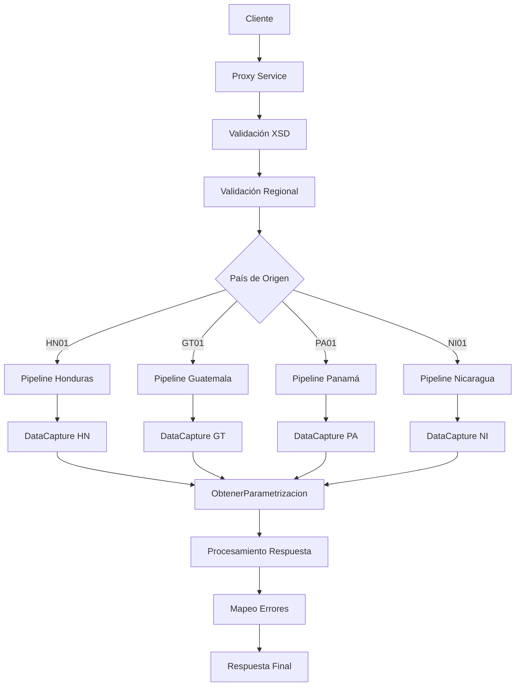

# Análisis Técnico: IngresoDataCapture

## Resumen Ejecutivo

El servicio **IngresoDataCapture** (ingresoDataCapture) es un servicio Servicio Regional Multi-Core que permite el procesamiento de ingresos de data capture para transacciones bancarias con soporte multi-moneda y categorización avanzada. Implementa un patrón de Servicio con Lógica Regional.

## Arquitectura del Servicio

### Patrón de Diseño
- **Tipo**: Servicio Regional Multi-Core
- **Versión**: V1
- **Protocolo**: SOAP/HTTP
- **Seguridad**: Custom Token Authentication

### Flujo de Ejecución



## Servicios Dependientes

### 1. DataCapture
- **Propósito**: Sistema backend para procesamiento de transacciones de data capture
- **Parámetros**: BATCH_ID, ACCOUNT_NUMBER, CURRENCY, AMOUNT, DEBIT_CREDIT, DESCRIPTION
- **Respuesta**: RECORD_STATUS con estado del procesamiento
- **Validación**: Validación de integridad de datos y reglas de negocio

### 2. ObtenerParametrizacion
- **Propósito**: Obtención de parámetros de configuración del middleware
- **Parámetros**: Parámetros de configuración regional
- **Respuesta**: Valores de configuración específicos por país
- **Validación**: Validación de existencia de parámetros

## Transformaciones de Datos

### Procesamiento por País

| País | Código | Descripción Lógica | XQuery Request | XQuery Response |
|-------|--------|-------------------|----------------|----------------|
| Honduras | HN01 | Procesamiento directo con validación local de moneda HNL | [ARCHIVOS_REQUEST_HN] | [ARCHIVOS_RESPONSE_HN] |
| Guatemala | GT01 | Procesamiento con conversión de moneda GTQ | [ARCHIVOS_REQUEST_GT] | [ARCHIVOS_RESPONSE_GT] |
| Panamá | PA01 | Procesamiento con soporte USD y PAB | [ARCHIVOS_REQUEST_PA] | [ARCHIVOS_RESPONSE_PA] |
| Nicaragua | NI01 | Procesamiento con moneda NIO | [ARCHIVOS_REQUEST_NI] | [ARCHIVOS_RESPONSE_NI] |

## Conexiones por País

### Honduras (HN01)
```xml
<!-- HTTP -->
<service>[SERVICIO_HN]</service>
<endpoint>[ENDPOINT_DATACAPTURE_HN]</endpoint>
<operation>ingresoDataCapture</operation>
<!-- Autenticación: Basic Authentication -->
```

### Guatemala (GT01)
```xml
<!-- HTTP -->
<service>[SERVICIO_GT]</service>
<endpoint>[ENDPOINT_DATACAPTURE_GT]</endpoint>
<operation>ingresoDataCapture</operation>
<!-- Autenticación: Token Authentication -->
```

### Panamá (PA01)
```xml
<!-- HTTP -->
<service>[SERVICIO_PA]</service>
<endpoint>[ENDPOINT_DATACAPTURE_PA]</endpoint>
<operation>ingresoDataCapture</operation>
<!-- Autenticación: OAuth 2.0 -->
```

### Nicaragua (NI01)
```xml
<!-- HTTP -->
<service>[SERVICIO_NI]</service>
<endpoint>[ENDPOINT_DATACAPTURE_NI]</endpoint>
<operation>ingresoDataCapture</operation>
<!-- Autenticación: Basic Authentication -->
```

### ObtenerParametrizacion (Todos los países)
```xml
<!-- JCA -->
<service>ObtenerParametrizacion</service>
<connection>[CONNECTION_MIDDLEWARE_DB]</connection>
<operation>obtenerParametros</operation>
```

## Validación XSD

### Información General
- **Esquema XSD**: ingresoDataCaptureTypes.xsd
- **Namespace**: http://www.ficohsa.com.hn/middleware.services/ingresoDataCaptureTypes
- **Versión**: 1.0

### Archivos de Esquema

#### Ubicación
- **XSD Principal**: `MasterNuevo/Middleware/Business_Resources/dataCapture/IngresoDataCapture/ingresoDataCaptureTypes.xsd`
- **WSDL**: `MasterNuevo/Middleware/Business_Resources/dataCapture/IngresoDataCapture/ingresoDataCapturePS.wsdl`
- **Headers**: `MasterNuevo/Middleware/Business_Resources/esquemas_generales/HeaderElements.xsd`

#### Dependencias
- **Namespace http://www.ficohsa.com.hn/middleware.services/autType**: Para headers de autenticación
- **Namespace http://www.ficohsa.com.hn/middleware.services/ingresoDataCaptureTypes**: Para tipos específicos del servicio

### Estructura del Request

#### Definición XSD Request
```xml
<xs:element name="ingresoDataCapture">
    <xs:complexType>
        <xs:sequence>
            <xs:element name="BATCH_ID" type="xs:string"/>
            <xs:element name="DEPARTMENT_CODE" type="xs:string" minOccurs="0"/>
            <xs:element name="ACCOUNT_NUMBER" type="xs:string" minOccurs="0"/>
            <xs:element name="CURRENCY" type="xs:string"/>
            <xs:element name="AMOUNT" type="xs:string"/>
            <xs:element name="DEBIT_CREDIT" type="xs:string"/>
            <xs:element name="DESCRIPTION" type="xs:string"/>
            <xs:element name="VALUE_DATE" type="xs:string" minOccurs="0"/>
            <xs:element name="PROFIT_CENTER" type="xs:string" minOccurs="0"/>
            <xs:element name="PROFIT_LOSS_CATEGORY" type="xs:string" minOccurs="0"/>
            <xs:element name="PRODUCT_CATEGORY" type="xs:string" minOccurs="0"/>
        </xs:sequence>
    </xs:complexType>
</xs:element>
```

#### Ejemplo de Request Válido
> **Nota:** Los siguientes son datos de ejemplo no reales, utilizados únicamente para propósitos de testing y documentación.

```xml
<ingresoDataCapture xmlns="http://www.ficohsa.com.hn/middleware.services/ingresoDataCaptureTypes">
    <BATCH_ID>BATCH001</BATCH_ID>
    <DEPARTMENT_CODE>DEP001</DEPARTMENT_CODE>
    <ACCOUNT_NUMBER>1234567890</ACCOUNT_NUMBER>
    <CURRENCY>HNL</CURRENCY>
    <AMOUNT>1000.00</AMOUNT>
    <DEBIT_CREDIT>D</DEBIT_CREDIT>
    <DESCRIPTION>Transacción de prueba</DESCRIPTION>
    <VALUE_DATE>2026-01-02</VALUE_DATE>
    <PROFIT_CENTER>PC001</PROFIT_CENTER>
    <PROFIT_LOSS_CATEGORY>PL001</PROFIT_LOSS_CATEGORY>
    <PRODUCT_CATEGORY>PROD001</PRODUCT_CATEGORY>
</ingresoDataCapture>
```

### Estructura del Response

### Definiciones XSD Completas

#### Response Principal
```xml
<xs:element name="ingresoDataCaptureResponse" type="cons:ingresoDataCaptureResponseType">
</xs:element>

<xs:complexType name="ingresoDataCaptureResponseType">
    <xs:sequence>
        <xs:element name="RECORD_STATUS"/>
    </xs:sequence>
</xs:complexType>
```

### Ejemplo de Response Válido

> **Nota:** Los siguientes son datos de ejemplo no reales, utilizados únicamente para propósitos de testing y documentación.

```xml
<ingresoDataCaptureResponse xmlns="http://www.ficohsa.com.hn/middleware.services/ingresoDataCaptureTypes">
    <RECORD_STATUS>SUCCESS</RECORD_STATUS>
</ingresoDataCaptureResponse>
```

### Casos de Error XSD

#### Request Inválido - Campo Faltante
> **Nota:** Los siguientes son datos de ejemplo no reales, utilizados únicamente para propósitos de testing y documentación.

```xml
<!-- ERROR: Falta BATCH_ID -->
<ingresoDataCapture xmlns="http://www.ficohsa.com.hn/middleware.services/ingresoDataCaptureTypes">
    <!-- BATCH_ID faltante -->
    <CURRENCY>HNL</CURRENCY>
    <AMOUNT>1000.00</AMOUNT>
    <DEBIT_CREDIT>D</DEBIT_CREDIT>
    <DESCRIPTION>Transacción de prueba</DESCRIPTION>
</ingresoDataCapture>
```

#### Request Inválido - Namespace Incorrecto
> **Nota:** Los siguientes son datos de ejemplo no reales, utilizados únicamente para propósitos de testing y documentación.

```xml
<!-- ERROR: Namespace incorrecto -->
<ingresoDataCapture xmlns="http://wrong.namespace/">
    <BATCH_ID>BATCH001</BATCH_ID>
    <CURRENCY>HNL</CURRENCY>
    <AMOUNT>1000.00</AMOUNT>
    <DEBIT_CREDIT>D</DEBIT_CREDIT>
    <DESCRIPTION>Transacción de prueba</DESCRIPTION>
</ingresoDataCapture>
```

#### Response Inválido - Campo Requerido Faltante
> **Nota:** Los siguientes son datos de ejemplo no reales, utilizados únicamente para propósitos de testing y documentación.

```xml
<!-- ERROR: Falta RECORD_STATUS (requerido) -->
<ingresoDataCaptureResponse xmlns="http://www.ficohsa.com.hn/middleware.services/ingresoDataCaptureTypes">
    <!-- RECORD_STATUS faltante -->
</ingresoDataCaptureResponse>
```

---

## Historial de Cambios

| Fecha | Versión | Autor | Descripción |
|-------|---------|-------|-------------|
| 2026-01-02 | 1.0 | ARQ FICOHSA | Creación inicial |
