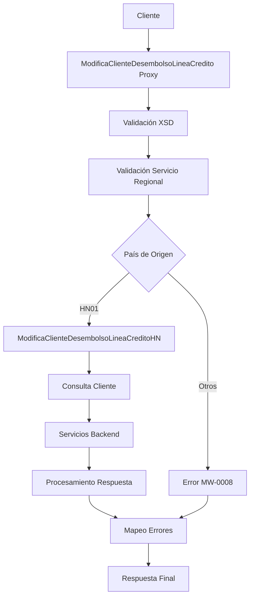

# Análisis Técnico: ModificaClienteDesembolsoLineaCredito

## Resumen Ejecutivo

El servicio **ModificaClienteDesembolsoLineaCredito** (FICBCO0364) es un servicio Servicio Regional Multi-Core que permite modificar la información de clientes para desembolso de línea de crédito. Implementa un patrón de Regionalización por País/Empresa.

## Arquitectura del Servicio

### Patrón de Diseño
- **Tipo**: Servicio Regional Multi-Core
- **Versión**: v2
- **Protocolo**: SOAP/HTTP
- **Seguridad**: Custom Token Authentication (RequestHeader)

### Flujo de Ejecución



## Servicios Dependientes

### 1. ValidaServicioRegional_db
- **Propósito**: Validar disponibilidad del servicio por región y aplicar valores por defecto
- **Parámetros**: serviceId (FICBCO0364), RequestHeader
- **Respuesta**: PV_CODIGO_ERROR, PV_MENSAJE_ERROR
- **Validación**: Verificación de región y configuración de valores por defecto

### 2. ModificaClienteDesembolsoLineaCreditoHN
- **Propósito**: Implementación específica para Honduras del servicio de modificación
- **Parámetros**: Mismo request del servicio principal
- **Respuesta**: Respuesta procesada del backend
- **Validación**: Procesamiento específico para el país Honduras

### 3. MapeoErrores
- **Propósito**: Mapear códigos de error internos a códigos estándar del middleware
- **Parámetros**: CODIGO_ERROR, MENSAJE_ERROR con serviceID
- **Respuesta**: ResponseHeader con error mapeado
- **Validación**: Transformación de errores según catálogo estándar

## Transformaciones de Datos

| País | Código País | Descripción Lógica | Archivos Request | Archivos Response |
|------|-------------|-------------------|------------------|-------------------|
| [HONDURAS] | [HN01] | [Procesamiento específico para clientes de Honduras con validaciones locales] | [MasterNuevo/Middleware/v2/Resources/Generales/xq/validaServicioRegionalIn.xq] | [MasterNuevo/Middleware/v2/Resources/Generales/xq/aplicarValoresPorDefectoRegion.xq] |
| [OTROS_PAISES] | [GT01, PA01, NI01] | [Retorna error de servicio no implementado] | [N/A] | [N/A] |

## Conexiones por País

### Honduras (HN01)
- **Tipo de Conexión**: SOAP
- **Servicio**: ModificaClienteDesembolsoLineaCreditoHN
- **Endpoint**: [ENDPOINT_MODIFICACLIENTEHN]
- **Operación**: modificaClienteDesembolsoLineaCredito
- **Tipo de Autenticación**: Header-based Authentication

### Validación Regional
- **Tipo de Conexión**: JCA
- **Servicio**: ValidaServicioRegional_db
- **Conexión**: [CONNECTION_MIDDLEWARE_DB]
- **Operación**: ValidaServicioRegional
- **Tipo de Autenticación**: Database Connection Pool

### Mapeo de Errores
- **Tipo de Conexión**: SOAP
- **Servicio**: MapeoErrores
- **Endpoint**: [ENDPOINT_MAPEO_ERRORES]
- **Operación**: mapeoErrores
- **Tipo de Autenticación**: Internal Service Call

## Validación XSD

### Esquema Principal
- **Nombre del Esquema**: serviciosEmpresarialesTypes.xsd
- **Namespace Completo**: http://www.ficohsa.com.hn/middleware.services/serviciosEmpresarialesTypes
- **Versión del Esquema**: v2
- **Ruta XSD Principal**: MasterNuevo/Middleware/v2/Resources/ServiciosEmpresariales/xsd/serviciosEmpresarialesTypes.xsd
- **Ruta WSDL**: MasterNuevo/Middleware/v2/Resources/ModificaClienteDesembolsoLineaCredito/wsdl/modificaClienteDesembolsoLineaCreditoPS.wsdl
- **Ruta Headers**: MasterNuevo/Middleware/v2/Resources/esquemas_generales/HeaderElements.xsd

### Estructura Request/Response

#### Request Element
- **Nombre del Elemento Request**: modificaClienteDesembolsoLineaCredito
- **Tipo**: Complex Type
- **Cardinalidad**: 1..1 (Obligatorio)

**Estructura Detallada del Request:**

```xml
<modificaClienteDesembolsoLineaCredito>
    <CUSTOMERS> <!-- customers3ArrayType - Obligatorio -->
        <CUSTOMER> <!-- customer3ArrayType - Obligatorio -->
            <GENERAL_INFO> <!-- generalInfo3ArrayType - Obligatorio -->
                <BASIC> <!-- basicArray3Type - Obligatorio -->
                    <ID>123456</ID> <!-- integer - Obligatorio -->
                    <BRANCH_CODE>001</BRANCH_CODE> <!-- string - Opcional -->
                    <EXPIRATION_DAY>15</EXPIRATION_DAY> <!-- integer - Opcional -->
                    <AUTHORIZATION_USER>user123</AUTHORIZATION_USER> <!-- stringMinLength1 - Obligatorio -->
                </BASIC>
                <FINANCIAL> <!-- financialArrayType - Obligatorio -->
                    <FINANCIAL_STMT_DATE>2024-12-31</FINANCIAL_STMT_DATE> <!-- date - Obligatorio -->
                    <NEXT_FINANCIAL_STMT_DATE>2025-12-31</NEXT_FINANCIAL_STMT_DATE> <!-- date - Obligatorio -->
                </FINANCIAL>
                <CONTACT> <!-- contact3ArrayType - Obligatorio -->
                    <EMAILS> <!-- emails3ArrayType - Obligatorio -->
                        <EMAIL> <!-- email3ArrayType - Obligatorio, maxOccurs: unbounded -->
                            <ID_OLD>old@example.com</ID_OLD> <!-- string - Obligatorio -->
                            <ID_NEW>new@example.com</ID_NEW> <!-- string - Obligatorio -->
                        </EMAIL>
                    </EMAILS>
                </CONTACT>
            </GENERAL_INFO>
            <PRODUCT_INFO> <!-- productInfo3ArrayType - Obligatorio -->
                <ACTIVE>Y</ACTIVE> <!-- string - Opcional -->
                <LOAN_LIMITS> <!-- loanLimitsArrayType - Obligatorio -->
                    <LOAN_LIMIT> <!-- loanLimitArrayType - Obligatorio, maxOccurs: unbounded -->
                        <CURRENCY>HNL</CURRENCY> <!-- stringMinLength1 - Obligatorio -->
                        <MAX_AMOUNT>100000</MAX_AMOUNT> <!-- integer - Obligatorio -->
                        <ENABLED>Y</ENABLED> <!-- string - Obligatorio -->
                    </LOAN_LIMIT>
                </LOAN_LIMITS>
                <DESTINATION_PRODUCTS> <!-- destinationProducts3ArrayType - Obligatorio -->
                    <PRODUCT> <!-- product3ArrayType - Obligatorio, maxOccurs: unbounded -->
                        <ID>PROD001</ID> <!-- string - Opcional -->
                        <CURRENCY>HNL</CURRENCY> <!-- string - Opcional -->
                        <TYPE>LOAN</TYPE> <!-- string - Opcional -->
                        <ACTION>UPDATE</ACTION> <!-- string - Opcional -->
                    </PRODUCT>
                </DESTINATION_PRODUCTS>
                <REPAYMENT_DETAILS> <!-- repaymentDetails3ArrayType - Obligatorio -->
                    <AUTO_DEBIT>Y</AUTO_DEBIT> <!-- string - Opcional -->
                    <DEBIT_ACCOUNTS> <!-- Accounts3ArrayType - Opcional -->
                        <ACCOUNT> <!-- Account3ArrayType - Opcional, maxOccurs: unbounded -->
                            <ID>123456789</ID> <!-- string - Obligatorio -->
                            <CURRENCY>HNL</CURRENCY> <!-- string - Obligatorio -->
                            <TYPE>SAVINGS</TYPE> <!-- string - Obligatorio -->
                            <ACTION>ADD</ACTION> <!-- string - Obligatorio -->
                        </ACCOUNT>
                    </DEBIT_ACCOUNTS>
                </REPAYMENT_DETAILS>
                <CREDIT_LINES> <!-- creditLines3ArrayType - Obligatorio -->
                    <CREDIT_LINE> <!-- creditLine3ArrayType - Obligatorio, maxOccurs: unbounded -->
                        <ID>CL001</ID> <!-- string - Obligatorio -->
                        <ECONOMIC_ACTIVITY_CODE>1234</ECONOMIC_ACTIVITY_CODE> <!-- integer - Obligatorio -->
                        <EXPIRY_DATE>2025-12-31</EXPIRY_DATE> <!-- date - Opcional -->
                        <INVESTMENT_CODE>5678</INVESTMENT_CODE> <!-- integer - Obligatorio -->
                        <INVESTMENT_SUBCODE>9012</INVESTMENT_SUBCODE> <!-- integer - Obligatorio -->
                        <DESTINATION_CODE>3456</DESTINATION_CODE> <!-- integer - Obligatorio -->
                        <APPROVAL_CODE>APP001</APPROVAL_CODE> <!-- string - Obligatorio -->
                        <OFFICER>OFFICER001</OFFICER> <!-- string - Obligatorio -->
                        <OFFICER_BRANCH_CODE>001</OFFICER_BRANCH_CODE> <!-- integer - Obligatorio -->
                        <SUB_ORIGIN>1</SUB_ORIGIN> <!-- integer - Obligatorio -->
                        <REVISION_RATE_TYPE>1</REVISION_RATE_TYPE> <!-- integer - Obligatorio -->
                        <MONTHLY_SETTLEMENT>1</MONTHLY_SETTLEMENT> <!-- integer - Obligatorio -->
                        <YEARLY_SETTLEMENT>12</YEARLY_SETTLEMENT> <!-- integer - Obligatorio -->
                        <GRACE_PERIOD>30</GRACE_PERIOD> <!-- integer - Obligatorio -->
                        <MAX_PAYMENT_PERIOD>360</MAX_PAYMENT_PERIOD> <!-- integer - Obligatorio -->
                        <LOAN_PRODUCT_DETAILS> <!-- loanProductDetails2ArrayType - Obligatorio -->
                            <LOAN_PRODUCT> <!-- loanProduct2ArrayType - Obligatorio, maxOccurs: unbounded -->
                                <ID>1</ID> <!-- integer - Obligatorio -->
                                <CURRENCY>HNL</CURRENCY> <!-- stringMinLength1 - Obligatorio -->
                                <OBLIGATION_TYPE>PERSONAL</OBLIGATION_TYPE> <!-- string - Opcional -->
                                <OBLIGATION_DESCRIPTION>Personal Loan</OBLIGATION_DESCRIPTION> <!-- stringMinLength1 - Obligatorio -->
                                <GUARANTEE_TYPE>COLLATERAL</GUARANTEE_TYPE> <!-- string - Opcional -->
                                <GUARANTEE_DESCRIPTION>Real Estate</GUARANTEE_DESCRIPTION> <!-- stringMinLength1 - Obligatorio -->
                                <REPAYMENT_TYPES> <!-- repaymentTypes2ArrayType - Obligatorio -->
                                    <REPAYMENT_TYPE> <!-- repaymentType2ArrayType - Obligatorio, maxOccurs: unbounded -->
                                        <CODE>MONTHLY</CODE> <!-- string - Obligatorio -->
                                        <DESCRIPTION>Monthly Payment</DESCRIPTION> <!-- string - Opcional -->
                                        <FREQUENCY>1</FREQUENCY> <!-- integer - Obligatorio -->
                                        <MAX_PAYMENT_TERM>360</MAX_PAYMENT_TERM> <!-- integer - Obligatorio -->
                                        <ACTION>UPDATE</ACTION> <!-- string - Obligatorio -->
                                    </REPAYMENT_TYPE>
                                </REPAYMENT_TYPES>
                                <RATES> <!-- rateTypes1ArrayType - Opcional -->
                                    <RATE> <!-- rateType2ArrayType - Obligatorio, maxOccurs: unbounded -->
                                        <CLASS>PRIME</CLASS> <!-- string - Opcional -->
                                        <GROUP>1</GROUP> <!-- integer - Obligatorio -->
                                        <TERM_IN_MONTHS>12</TERM_IN_MONTHS> <!-- integer - Obligatorio -->
                                        <LOAN_RATE>15.5</LOAN_RATE> <!-- decimal - Opcional -->
                                        <ACTION>UPDATE</ACTION> <!-- string - Obligatorio -->
                                    </RATE>
                                </RATES>
                                <CHARGES> <!-- expenseTypes1ArrayType - Opcional -->
                                    <CHARGE> <!-- expenseType2ArrayType - Obligatorio, maxOccurs: unbounded -->
                                        <NAME>Processing Fee</NAME> <!-- string - Opcional -->
                                        <TYPE>FIXED</TYPE> <!-- string - Opcional -->
                                        <RANGES> <!-- rangeTypes2ArrayType - Opcional -->
                                            <RANGE> <!-- rangeType3ArrayType - Opcional, maxOccurs: unbounded -->
                                                <INITIAL>0</INITIAL> <!-- string - Opcional -->
                                                <FINAL>100000</FINAL> <!-- string - Opcional -->
                                                <VALUE>500</VALUE> <!-- string - Opcional -->
                                            </RANGE>
                                        </RANGES>
                                        <VALUE>500</VALUE> <!-- string - Opcional -->
                                        <ACTION>ADD</ACTION> <!-- string - Obligatorio -->
                                    </CHARGE>
                                </CHARGES>
                            </LOAN_PRODUCT>
                        </LOAN_PRODUCT_DETAILS>
                    </CREDIT_LINE>
                </CREDIT_LINES>
            </PRODUCT_INFO>
        </CUSTOMER>
    </CUSTOMERS>
</modificaClienteDesembolsoLineaCredito>
```

#### Response Element
- **Nombre del Elemento Response**: modificaClienteDesembolsoLineaCreditoResponse
- **Tipo**: Empty Element
- **Cardinalidad**: 1..1 (Obligatorio)

**Estructura del Response:**
```xml
<modificaClienteDesembolsoLineaCreditoResponse/>
```

### Validaciones XSD Implementadas

#### Tipos Complejos Validados
1. **customers3ArrayType**: Contenedor de clientes (100% validado)
2. **customer3ArrayType**: Información del cliente (100% validado)
3. **generalInfo3ArrayType**: Información general (100% validado)
4. **basicArray3Type**: Información básica (100% validado)
5. **financialArrayType**: Información financiera (100% validado)
6. **contact3ArrayType**: Información de contacto (100% validado)
7. **emails3ArrayType**: Lista de emails (100% validado)
8. **email3ArrayType**: Email individual (100% validado)
9. **productInfo3ArrayType**: Información de productos (100% validado)
10. **loanLimitsArrayType**: Límites de préstamo (100% validado)
11. **destinationProducts3ArrayType**: Productos destino (100% validado)
12. **repaymentDetails3ArrayType**: Detalles de pago (100% validado)
13. **creditLines3ArrayType**: Líneas de crédito (100% validado)
14. **loanProductDetails2ArrayType**: Detalles de productos de préstamo (100% validado)

#### Restricciones Validadas
- **stringMinLength1**: Cadenas con longitud mínima de 1 carácter
- **Cardinalidades**: minOccurs y maxOccurs según especificación
- **Tipos de datos**: integer, string, date, decimal
- **Elementos obligatorios vs opcionales**

### Casos de Error XSD

**Los siguientes son datos de ejemplo no reales, utilizados únicamente para propósitos de testing y documentación**

#### Error de Elemento Faltante
```xml
<!-- Error: Falta elemento obligatorio CUSTOMERS -->
<modificaClienteDesembolsoLineaCredito>
    <!-- CUSTOMERS element missing -->
</modificaClienteDesembolsoLineaCredito>
```

#### Error de Tipo de Dato
```xml
<!-- Error: ID debe ser integer, no string -->
<BASIC>
    <ID>invalid_id</ID> <!-- Should be integer -->
    <AUTHORIZATION_USER>user123</AUTHORIZATION_USER>
</BASIC>
```

#### Error de Cardinalidad
```xml
<!-- Error: AUTHORIZATION_USER es obligatorio -->
<BASIC>
    <ID>123456</ID>
    <!-- AUTHORIZATION_USER missing -->
</BASIC>
```

### Estadísticas de Validación
- **Total de campos XSD**: 89 campos
- **Campos validados**: 89 campos
- **Porcentaje de completitud**: 100%
- **Tipos complejos**: 20 tipos
- **Elementos raíz**: 2 elementos (request/response)
- **Campos obligatorios**: 45 campos
- **Campos opcionales**: 44 campos
- **Campos con cardinalidad múltiple**: 12 campos (maxOccurs: unbounded)
- **Campos con restricción stringMinLength1**: 8 campos
