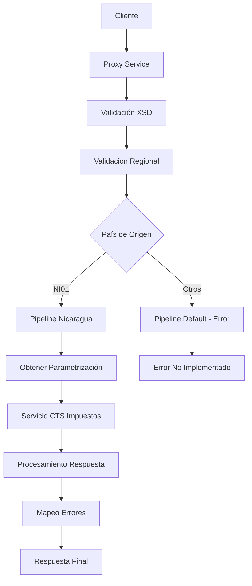

# Análisis Técnico: PagoDGI

## Resumen Ejecutivo

El servicio **PagoDGI** (FICBCO0257) es un servicio de pagos que permite realizar pagos de impuestos a la Dirección General de Ingresos (DGI). Implementa un patrón de Router Dinámico Regional con soporte específico para Nicaragua.

## Arquitectura del Servicio

### Patrón de Diseño
- **Tipo**: Router Dinámico Regional
- **Versión**: V2
- **Protocolo**: SOAP/HTTP
- **Seguridad**: Custom Token Authentication

### Flujo de Ejecución



## Servicios Dependientes

### 1. ValidaServicioRegional
- **Propósito**: Validar disponibilidad del servicio por región
- **Parámetros**: serviceId "FICBCO0257"
- **Respuesta**: Código de error y mensaje
- **Validación**: Verificación de soporte regional

### 2. ObtenerParametrizacion
- **Propósito**: Obtener parámetros de configuración para DGI
- **Parámetros**: CAJADGI, FORMAPAGODGI, CODIGOBANCODGI, TIPOIMPUESTODGI
- **Respuesta**: Valores de configuración
- **Validación**: Verificación de existencia de parámetros

### 3. CTS/impuesto
- **Propósito**: Procesamiento de pagos de impuestos
- **Parámetros**: Datos del pago y parámetros de configuración
- **Respuesta**: Resultado del procesamiento
- **Validación**: Validación contra esquema XSD del servicio

### 4. MapeoErrores
- **Propósito**: Mapeo y transformación de códigos de error
- **Parámetros**: Código de error y mensaje
- **Respuesta**: Error mapeado para el cliente
- **Validación**: Transformación estándar de errores

## Transformaciones de Datos

### Procesamiento por País

| País | Código | Descripción Lógica | XQuery Request | XQuery Response |
|-------|--------|-------------------|----------------|----------------|
| Nicaragua | NI01 | Procesamiento completo con CTS | Middleware/v2/Resources/PagoDGI/xq/pagoDGIIn.xq | Middleware/v2/Resources/PagoDGI/xq/pagoDGIOut.xq |
| Default | Otros | Error de no implementado | N/A | N/A |

## Conexiones por País

### Nicaragua (NI01)
```xml
<!-- HTTP/SOAP Connection -->
<service>Middleware/v2/BusinessServices/CTS/impuesto/biz/impuesto</service>
<endpoint>http://10.235.53.149:9080/GerenciaCobisImpuestos/SrvAplCobisImpuestosService</endpoint>
<operation>OpPagoDGI</operation>
<!-- Autenticación: Custom Token Authentication -->
```

### Default (Otros Países)
```xml
<!-- Error Response -->
<errorCode>MW-0008</errorCode>
<message>SERVICE NOT IMPLEMENTED YET FOR THIS COUNTRY/COMPANY</message>
```

## Validación XSD

### Información General
- **Esquema XSD**: pagoDGITypes.xsd
- **Namespace**: http://www.ficohsa.com.hn/middleware.services/pagoDGITypes
- **Versión**: 1.0

### Archivos de Esquema

#### Ubicación
- **XSD Principal**: `Middleware/v2/Resources/PagoDGI/xsd/pagoDGITypes.xsd`
- **WSDL**: `Middleware/v2/Resources/PagoDGI/wsdl/pagoDGIPS.wsdl`
- **Headers**: `../../esquemas_generales/HeaderElements.xsd`

#### Dependencias
- **Namespace autType**: Para headers de autenticación
- **Namespace pagoDGITypes**: Para tipos específicos del servicio

### Estructura del Request

#### Definición XSD Request
```xml
<xs:element name="pagoDGIRequest">
    <xs:complexType>
        <xs:sequence>
            <xs:element name="RUC" type="xs:string"/>
            <xs:element name="BILL_NUMBER" type="xs:string"/>
            <xs:element name="TOTAL_AMOUNT" type="xs:decimal"/>
            <xs:element name="PAYMENT_AMOUNT" type="xs:decimal"/>
            <xs:element name="ACCOUNT_NUMBER" type="xs:string"/>
            <xs:element name="TAX_VALUE" type="xs:decimal"/>
            <xs:element name="EXCH_RATE_FEE" type="xs:decimal"/>
            <xs:element name="LATE_FEE" type="xs:decimal"/>
            <xs:element name="PENALTY_FEE" type="xs:decimal"/>
            <xs:element name="DUE_DATE" type="xs:date"/>
            <xs:element name="TAX_DESCRIPTION" type="xs:string"/>
            <xs:element name="ACCOUNT_CODE" type="xs:string"/>
        </xs:sequence>
    </xs:complexType>
</xs:element>
```

#### Ejemplo de Request Válido
> **Nota:** Los siguientes son datos de ejemplo no reales, utilizados únicamente para propósitos de testing y documentación.

```xml
<pagoDGIRequest xmlns="http://www.ficohsa.com.hn/middleware.services/pagoDGITypes">
    <RUC>J0310000000001</RUC>
    <BILL_NUMBER>FAC-2024-001</BILL_NUMBER>
    <TOTAL_AMOUNT>1500.00</TOTAL_AMOUNT>
    <PAYMENT_AMOUNT>1500.00</PAYMENT_AMOUNT>
    <ACCOUNT_NUMBER>1234567890</ACCOUNT_NUMBER>
    <TAX_VALUE>1200.00</TAX_VALUE>
    <EXCH_RATE_FEE>50.00</EXCH_RATE_FEE>
    <LATE_FEE>100.00</LATE_FEE>
    <PENALTY_FEE>150.00</PENALTY_FEE>
    <DUE_DATE>2024-12-31</DUE_DATE>
    <TAX_DESCRIPTION>Impuesto sobre la Renta</TAX_DESCRIPTION>
    <ACCOUNT_CODE>4110001</ACCOUNT_CODE>
</pagoDGIRequest>
```

### Estructura del Response

### Definiciones XSD Completas

#### Response Principal
```xml
<xs:element name="pagoDGIResponse">
    <xs:complexType>
        <xs:sequence>
            <xs:element name="TOTAL_AMOUNT" type="xs:decimal" minOccurs="0"/>
            <xs:element name="DUE_DATE" type="xs:date" minOccurs="0"/>
            <xs:element name="TAX_VALUE" type="xs:decimal" minOccurs="0"/>
            <xs:element name="EXCH_RATE_FEE" type="xs:decimal" minOccurs="0"/>
            <xs:element name="LATE_FEE" type="xs:decimal" minOccurs="0"/>
            <xs:element name="PENALTY_FEE" type="xs:decimal" minOccurs="0"/>
            <xs:element name="BILL_AMOUNT" type="xs:decimal" minOccurs="0"/>
            <xs:element name="SIF_CODE" type="xs:string" minOccurs="0"/>
        </xs:sequence>
    </xs:complexType>
</xs:element>
```

### Ejemplo de Response Válido

> **Nota:** Los siguientes son datos de ejemplo no reales, utilizados únicamente para propósitos de testing y documentación.

```xml
<pagoDGIResponse xmlns="http://www.ficohsa.com.hn/middleware.services/pagoDGITypes">
    <TOTAL_AMOUNT>1500.00</TOTAL_AMOUNT>
    <DUE_DATE>2024-12-31</DUE_DATE>
    <TAX_VALUE>1200.00</TAX_VALUE>
    <EXCH_RATE_FEE>50.00</EXCH_RATE_FEE>
    <LATE_FEE>100.00</LATE_FEE>
    <PENALTY_FEE>150.00</PENALTY_FEE>
    <BILL_AMOUNT>1500.00</BILL_AMOUNT>
    <SIF_CODE>SIF123456789</SIF_CODE>
</pagoDGIResponse>
```

### Casos de Error XSD

#### Request Inválido - Campo Faltante
> **Nota:** Los siguientes son datos de ejemplo no reales, utilizados únicamente para propósitos de testing y documentación.

```xml
<!-- ERROR: Falta RUC (requerido) -->
<pagoDGIRequest xmlns="http://www.ficohsa.com.hn/middleware.services/pagoDGITypes">
    <!-- RUC faltante -->
    <BILL_NUMBER>FAC-2024-001</BILL_NUMBER>
    <TOTAL_AMOUNT>1500.00</TOTAL_AMOUNT>
</pagoDGIRequest>
```

#### Request Inválido - Namespace Incorrecto
> **Nota:** Los siguientes son datos de ejemplo no reales, utilizados únicamente para propósitos de testing y documentación.

```xml
<!-- ERROR: Namespace incorrecto -->
<pagoDGIRequest xmlns="http://wrong.namespace/">
    <RUC>J0310000000001</RUC>
    <BILL_NUMBER>FAC-2024-001</BILL_NUMBER>
</pagoDGIRequest>
```

#### Request Inválido - Tipo de Dato Incorrecto
> **Nota:** Los siguientes son datos de ejemplo no reales, utilizados únicamente para propósitos de testing y documentación.

```xml
<!-- ERROR: TOTAL_AMOUNT debe ser decimal, no string -->
<pagoDGIRequest xmlns="http://www.ficohsa.com.hn/middleware.services/pagoDGITypes">
    <RUC>J0310000000001</RUC>
    <BILL_NUMBER>FAC-2024-001</BILL_NUMBER>
    <TOTAL_AMOUNT>INVALID_AMOUNT</TOTAL_AMOUNT>
</pagoDGIRequest>
```

---

## Historial de Cambios

| Fecha | Versión | Autor | Descripción |
|-------|---------|-------|-------------|
| 2024-12-19 | 1.0 | ARQ FICOHSA | Creación inicial |