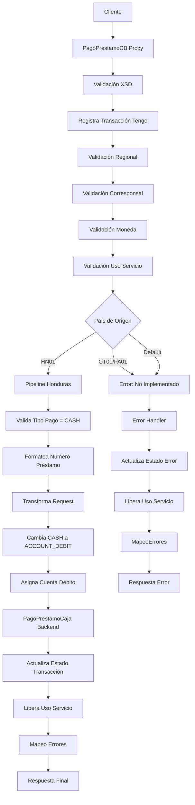

# Análisis Técnico: PagoPrestamoCB

## Resumen Ejecutivo

El servicio **PagoPrestamoCB** (FICBCO0211) es un servicio regional multi-core que permite procesar pagos de préstamos a través de corresponsales bancarios (CB). Implementa un patrón de servicio con validación regional, control de transacciones y validación de corresponsales bancarios.

## Arquitectura del Servicio

### Patrón de Diseño
- **Tipo**: Servicio Regional Multi-Core con Control de Transacciones
- **Versión**: v2
- **Protocolo**: SOAP/HTTP
- **Seguridad**: Custom Token Authentication con validación regional

### Flujo de Ejecución



## Servicios Dependientes

### 1. PagoPrestamoCaja (Backend)
- **Propósito**: Procesar el pago del préstamo en el sistema de caja
- **Parámetros**: pagoPrestamo (request transformado), RequestHeader
- **Respuesta**: pagoPrestamoResponse con detalles del pago procesado
- **Validación**: Validación de estructura y respuesta exitosa

### 2. ValidaServicioRegional
- **Propósito**: Validar disponibilidad del servicio por región y país
- **Parámetros**: serviceId (FICBCO0211), RequestHeader con región
- **Respuesta**: PV_CODIGO_ERROR (SUCCESS o código de error), PV_MENSAJE_ERROR
- **Validación**: Se valida que el código de error sea "SUCCESS"

### 3. consultarCorresponsalB
- **Propósito**: Consultar parametrización del corresponsal bancario
- **Parámetros**: bankingCorrespId, transactionType (2), sourceBank
- **Respuesta**: PV_CODIGO_MENSAJE, PV_CUENTA_DEBITO, PV_MONEDA_PERMITIDA, PV_TIPO_TRANSACCION
- **Validación**: Se valida que el código sea "SUCCESS" y que la moneda coincida

### 4. registrarUsoServicio
- **Propósito**: Registrar y validar cuota de uso del servicio por usuario
- **Parámetros**: idServicio (FICBCO0211), idUsuario, bancoOrigen, operacion (1=tomar, 2=liberar)
- **Respuesta**: PN_CODIGO_ERROR (0=éxito, otro=cuota excedida)
- **Validación**: Se valida que el código sea "0"

### 5. MapeoErrores
- **Propósito**: Transformar códigos de error internos a mensajes amigables
- **Parámetros**: CODIGO_ERROR, MENSAJE_ERROR (formato: "FICBCO0211$#$mensaje")
- **Respuesta**: ResponseHeader con successIndicator y messages mapeados
- **Validación**: Se aplica para todos los errores no exitosos

### 6. actualizaEstadoTransaccion
- **Propósito**: Actualizar el estado de la transacción en BD para control de Tengo
- **Parámetros**: tipoTransaccion (PAGO_PRESTAMO), estadoTransaccion, codigoOperacion, FT, refT24, tipoActualizacion (TENGO), tipoConsulta (1)
- **Respuesta**: Confirmación de actualización
- **Validación**: Se ejecuta al finalizar exitosamente y en caso de error

### 7. registraEstadoTransaccion
- **Propósito**: Registrar el estado inicial de la transacción en BD
- **Parámetros**: tipoTransaccion (4), estadoTransaccion (REGISTRADO), requestHeader, codigoCanal (1), referenciaT24, pagoPrestamo
- **Respuesta**: Confirmación de registro
- **Validación**: Se ejecuta al inicio del flujo

## Transformaciones de Datos

### Procesamiento por País

| País | Código | Descripción Lógica | XQuery Request | XQuery Response |
|-------|--------|-------------------|----------------|----------------|
| Honduras | HN01 | Valida tipo pago CASH, formatea préstamo, transforma request/header, cambia tipo pago a ACCOUNT_DEBIT, asigna cuenta débito del corresponsal | MasterNuevo/Middleware/v2/Resources/PagoPrestamoCB/xq/PagoPrestamoCBIn.xq, MasterNuevo/Middleware/v2/Resources/PagoPrestamoCB/xq/PagoPrestamoCBHdrIn.xq | N/A (respuesta directa del backend) |
| Guatemala | GT01 | No implementado - retorna error MW-0008 | N/A | N/A |
| Panamá | PA01 | No implementado - retorna error MW-0008 | N/A | N/A |
| Default | N/A | No implementado - retorna error MW-0008 | N/A | N/A |

## Conexiones por País

### Honduras (HN01)
```xml
<!-- HTTP -->
<service>PagoPrestamoCB</service>
<endpoint>[ENDPOINT_PAGOPRESTAMOCAJA_HN01]</endpoint>
<operation>pagoPrestamo</operation>
<!-- Autenticación: Custom Token Authentication (validado en header) -->
```

### Servicios de Base de Datos (Todos los países)
```xml
<!-- JCA -->
<service>ValidaServicioRegional_db</service>
<connection>[CONNECTION_MIDDLEWARE]</connection>
<operation>ValidaServicioRegional</operation>

<!-- JCA -->
<service>consultarCorresponsalB_db</service>
<connection>[CONNECTION_MIDDLEWARE]</connection>
<operation>consultarCorresponsalB</operation>

<!-- JCA -->
<service>registrarUsoServicio_db</service>
<connection>[CONNECTION_MIDDLEWARE]</connection>
<operation>registrarUsoServicio</operation>

<!-- JCA -->
<service>actualizaEstadoTransaccion_db</service>
<connection>[CONNECTION_MIDDLEWARE]</connection>
<operation>actualizaEstadoTransaccion</operation>

<!-- JCA -->
<service>registraEstadoTransaccion_db</service>
<connection>[CONNECTION_MIDDLEWARE]</connection>
<operation>registraEstadoTransaccion</operation>

<!-- JCA -->
<service>mapeodeErrores_db</service>
<connection>[CONNECTION_MIDDLEWARE]</connection>
<operation>mapeoErrores</operation>
```

## Validación XSD

### Información General
- **Esquema XSD**: XMLSchema_-541390746.xsd
- **Namespace**: http://www.ficohsa.com.hn/middleware.services/pagoPrestamoTypes
- **Versión**: 1.0

### Archivos de Esquema

#### Ubicación
- **XSD Principal**: `MasterNuevo/Middleware/v2/BusinessServices/OSB/PagoPrestamoCB/xsd/XMLSchema_-541390746.xsd`
- **WSDL**: `MasterNuevo/Middleware/v2/BusinessServices/OSB/PagoPrestamoCB/wsdl/PagoPrestamoCaja.wsdl`
- **Headers**: `MasterNuevo/Middleware/v2/Resources/esquemas_generales/HeaderElementsCB.xsd`

#### Dependencias
- **Namespace http://www.ficohsa.com.hn/middleware.services/autType**: Para RequestHeader y ResponseHeader
- **Namespace http://www.ficohsa.com.hn/middleware.services/pagoPrestamoTypes**: Para tipos de datos del servicio

### Estructura del Request

#### RequestHeader
```xml
<xs:complexType name="RequestHeader">
    <xs:sequence>
        <xs:element name="Authentication" type="auth:Authentication" minOccurs="1" maxOccurs="1"/>
        <xs:element name="Region" type="auth:Region" minOccurs="1" maxOccurs="1"/>
        <xs:element name="BankingCorrespondent" type="auth:BankingCorrespondent" minOccurs="1" maxOccurs="1"/>
    </xs:sequence>
</xs:complexType>

<xs:complexType name="Authentication">
    <xs:sequence>
        <xs:element name="UserName" type="xs:string" minOccurs="1" maxOccurs="1"/>
        <xs:element name="Password" type="xs:string" minOccurs="1" maxOccurs="1"/>
    </xs:sequence>
</xs:complexType>

<xs:complexType name="Region">
    <xs:sequence>
        <xs:element name="SourceBank" type="xs:string" minOccurs="1" maxOccurs="1"/>
        <xs:element name="DestinationBank" type="xs:string" minOccurs="0" maxOccurs="1"/>
    </xs:sequence>
</xs:complexType>

<xs:complexType name="BankingCorrespondent">
    <xs:sequence>
        <xs:element name="Id" type="xs:string" minOccurs="1" maxOccurs="1"/>
        <xs:element name="PointOfSale" type="xs:string" minOccurs="1" maxOccurs="1"/>
        <xs:element name="SubPointOfSale" type="xs:string" minOccurs="0" maxOccurs="1"/>
    </xs:sequence>
</xs:complexType>
```

#### Definición XSD Request
```xml
<xs:element name="pagoPrestamo">
    <xs:complexType>
        <xs:sequence>
            <xs:element name="LOAN_NUMBER" type="xs:string"/>
            <xs:element name="PAYMENT_AMOUNT" type="xs:string"/>
            <xs:element name="PAYMENT_CURRENCY" type="xs:string"/>
            <xs:element name="PAYMENT_TYPE" type="xs:string"/>
            <xs:element name="DEBIT_ACCOUNT" type="xs:string" minOccurs="0"/>
            <xs:element name="CHEQUE_NUMBER" type="xs:string" minOccurs="0"/>
            <xs:element name="BANK_CODE" type="xs:string" minOccurs="0"/>
            <xs:element name="INTERFACE_REFERENCE_NO" type="xs:string" minOccurs="0"/>
            <xs:element name="TRANSACTION_ID_BC" type="xs:string" minOccurs="0"/>
        </xs:sequence>
    </xs:complexType>
</xs:element>
```

#### Ejemplo de Request Válido
> **Nota:** Los siguientes son datos de ejemplo no reales, utilizados únicamente para propósitos de testing y documentación.

```xml
<!-- RequestHeader -->
<RequestHeader xmlns="http://www.ficohsa.com.hn/middleware.services/autType">
    <Authentication>
        <UserName>testuser</UserName>
        <Password>testpass</Password>
    </Authentication>
    <Region>
        <SourceBank>HN01</SourceBank>
    </Region>
    <BankingCorrespondent>
        <Id>CB001</Id>
        <PointOfSale>POS001</PointOfSale>
    </BankingCorrespondent>
</RequestHeader>

<!-- Body -->
<pagoPrestamo xmlns="http://www.ficohsa.com.hn/middleware.services/pagoPrestamoTypes">
    <LOAN_NUMBER>1234567890</LOAN_NUMBER>
    <PAYMENT_AMOUNT>1000.00</PAYMENT_AMOUNT>
    <PAYMENT_CURRENCY>HNL</PAYMENT_CURRENCY>
    <PAYMENT_TYPE>CASH</PAYMENT_TYPE>
    <TRANSACTION_ID_BC>TXN123456789</TRANSACTION_ID_BC>
</pagoPrestamo>
```

### Estructura del Response

#### ResponseHeader
```xml
<xs:complexType name="ResponseHeader">
    <xs:sequence>
        <xs:element name="transactionId" type="xs:string" minOccurs="0" maxOccurs="1"/>
        <xs:element name="messageId" type="xs:string" minOccurs="0" maxOccurs="1"/>
        <xs:element name="successIndicator" type="xs:string" minOccurs="0" maxOccurs="1"/>
        <xs:element name="application" type="xs:string" minOccurs="0" maxOccurs="1"/>
        <xs:element name="messages" type="xs:string" nillable="true" minOccurs="0" maxOccurs="unbounded"/>
        <xs:element name="valueDate" type="xs:string" minOccurs="0" maxOccurs="1"/>
    </xs:sequence>
</xs:complexType>
```

### Definiciones XSD Completas

#### Response Principal
```xml
<xs:element name="pagoPrestamoResponse" type="cred:pagoPrestamoResponseType"/>

<xs:complexType name="pagoPrestamoResponseType">
    <xs:sequence>
        <xs:element name="DATE_TIME" type="xs:string" minOccurs="0"/>
        <xs:element name="LOAN_NUMBER" type="xs:string" minOccurs="0"/>
        <xs:element name="DUE_ID" type="xs:string" minOccurs="0"/>
        <xs:element name="PAYMENT_CURRENCY" type="xs:string" minOccurs="0"/>
        <xs:element name="PAYMENT_AMOUNT" type="xs:string" minOccurs="0"/>
        <xs:element name="PAYMENT_SUBTOTAL_AMOUNT" type="xs:string" minOccurs="0"/>
        <xs:element name="PAYMENT_ADVANCE" type="xs:string" minOccurs="0"/>
        <xs:element name="LOAN_CUSTOMER_NAME" type="xs:string" minOccurs="0"/>
        <xs:element name="INTEREST_RATE" type="xs:string" minOccurs="0"/>
        <xs:element name="EFFECTIVE_DATE" type="xs:string" minOccurs="0"/>
        <xs:element name="MATURITY_DATE" type="xs:string" minOccurs="0"/>
        <xs:element name="INTEREST_BALANCE" type="xs:string" minOccurs="0"/>
        <xs:element name="CURRENT_PRINCIPAL_BALANCE" type="xs:string" minOccurs="0"/>
        <xs:element name="PREVIOUS_PRINCIPAL_BALANCE" type="xs:string" minOccurs="0"/>
        <xs:element name="BILL_NUMBER" type="xs:string" minOccurs="0"/>
        <xs:element name="RTEFORM" type="xs:string" minOccurs="0"/>
        <xs:element name="PAYMENT_DETAILS" minOccurs="0" maxOccurs="1">
            <xs:complexType>
                <xs:sequence>
                    <xs:element name="DETAIL_RECORD" minOccurs="0" maxOccurs="unbounded">
                        <xs:complexType>
                            <xs:sequence>
                                <xs:element name="LABEL" type="xs:string" minOccurs="0" maxOccurs="1"/>
                                <xs:element name="VALUE" type="xs:string" minOccurs="0" maxOccurs="1"/>
                            </xs:sequence>
                        </xs:complexType>
                    </xs:element>
                </xs:sequence>
            </xs:complexType>
        </xs:element>
    </xs:sequence>
</xs:complexType>
```

#### Tipos Complejos
```xml
<!-- PAYMENT_DETAILS es un tipo complejo anónimo definido inline -->
<xs:element name="PAYMENT_DETAILS" minOccurs="0" maxOccurs="1">
    <xs:complexType>
        <xs:sequence>
            <xs:element name="DETAIL_RECORD" minOccurs="0" maxOccurs="unbounded">
                <xs:complexType>
                    <xs:sequence>
                        <xs:element name="LABEL" type="xs:string" minOccurs="0" maxOccurs="1"/>
                        <xs:element name="VALUE" type="xs:string" minOccurs="0" maxOccurs="1"/>
                    </xs:sequence>
                </xs:complexType>
            </xs:element>
        </xs:sequence>
    </xs:complexType>
</xs:element>
```

### Ejemplo de Response Válido

> **Nota:** Los siguientes son datos de ejemplo no reales, utilizados únicamente para propósitos de testing y documentación.

```xml
<!-- ResponseHeader -->
<ResponseHeader xmlns="http://www.ficohsa.com.hn/middleware.services/autType">
    <transactionId>TXN987654321</transactionId>
    <successIndicator>SUCCESS</successIndicator>
    <messages>Pago procesado exitosamente</messages>
    <valueDate>2024-01-15</valueDate>
</ResponseHeader>

<!-- Body -->
<pagoPrestamoResponse xmlns="http://www.ficohsa.com.hn/middleware.services/pagoPrestamoTypes">
    <DATE_TIME>2024-01-15T10:30:00</DATE_TIME>
    <LOAN_NUMBER>1234567890</LOAN_NUMBER>
    <DUE_ID>001</DUE_ID>
    <PAYMENT_CURRENCY>HNL</PAYMENT_CURRENCY>
    <PAYMENT_AMOUNT>1000.00</PAYMENT_AMOUNT>
    <PAYMENT_SUBTOTAL_AMOUNT>950.00</PAYMENT_SUBTOTAL_AMOUNT>
    <PAYMENT_ADVANCE>0.00</PAYMENT_ADVANCE>
    <LOAN_CUSTOMER_NAME>Juan Perez</LOAN_CUSTOMER_NAME>
    <INTEREST_RATE>12.5</INTEREST_RATE>
    <EFFECTIVE_DATE>2023-01-01</EFFECTIVE_DATE>
    <MATURITY_DATE>2025-01-01</MATURITY_DATE>
    <INTEREST_BALANCE>50.00</INTEREST_BALANCE>
    <CURRENT_PRINCIPAL_BALANCE>9000.00</CURRENT_PRINCIPAL_BALANCE>
    <PREVIOUS_PRINCIPAL_BALANCE>10000.00</PREVIOUS_PRINCIPAL_BALANCE>
    <BILL_NUMBER>BILL001</BILL_NUMBER>
    <RTEFORM>RTE001</RTEFORM>
    <PAYMENT_DETAILS>
        <DETAIL_RECORD>
            <LABEL>Capital</LABEL>
            <VALUE>950.00</VALUE>
        </DETAIL_RECORD>
        <DETAIL_RECORD>
            <LABEL>Intereses</LABEL>
            <VALUE>50.00</VALUE>
        </DETAIL_RECORD>
    </PAYMENT_DETAILS>
</pagoPrestamoResponse>
```

### Casos de Error XSD

#### Request Inválido - Campo Faltante
> **Nota:** Los siguientes son datos de ejemplo no reales, utilizados únicamente para propósitos de testing y documentación.

```xml
<!-- ERROR: Falta LOAN_NUMBER (requerido) -->
<pagoPrestamo xmlns="http://www.ficohsa.com.hn/middleware.services/pagoPrestamoTypes">
    <!-- LOAN_NUMBER faltante -->
    <PAYMENT_AMOUNT>1000.00</PAYMENT_AMOUNT>
    <PAYMENT_CURRENCY>HNL</PAYMENT_CURRENCY>
    <PAYMENT_TYPE>CASH</PAYMENT_TYPE>
</pagoPrestamo>
```

#### Request Inválido - Namespace Incorrecto
> **Nota:** Los siguientes son datos de ejemplo no reales, utilizados únicamente para propósitos de testing y documentación.

```xml
<!-- ERROR: Namespace incorrecto -->
<pagoPrestamo xmlns="http://wrong.namespace/">
    <LOAN_NUMBER>1234567890</LOAN_NUMBER>
    <PAYMENT_AMOUNT>1000.00</PAYMENT_AMOUNT>
    <PAYMENT_CURRENCY>HNL</PAYMENT_CURRENCY>
    <PAYMENT_TYPE>CASH</PAYMENT_TYPE>
</pagoPrestamo>
```

#### Response Inválido - Estructura Incorrecta
> **Nota:** Los siguientes son datos de ejemplo no reales, utilizados únicamente para propósitos de testing y documentación.

```xml
<!-- ERROR: PAYMENT_DETAILS con estructura incorrecta -->
<pagoPrestamoResponse xmlns="http://www.ficohsa.com.hn/middleware.services/pagoPrestamoTypes">
    <DATE_TIME>2024-01-15T10:30:00</DATE_TIME>
    <LOAN_NUMBER>1234567890</LOAN_NUMBER>
    <PAYMENT_DETAILS>
        <!-- ERROR: Falta DETAIL_RECORD, tiene elemento incorrecto -->
        <INVALID_ELEMENT>Invalid</INVALID_ELEMENT>
    </PAYMENT_DETAILS>
</pagoPrestamoResponse>
```

---

## Historial de Cambios

| Fecha | Versión | Autor | Descripción |
|-------|---------|-------|-------------|
| 2024-01-XX | 1.0 | ARQ FICOHSA | Creación inicial |
