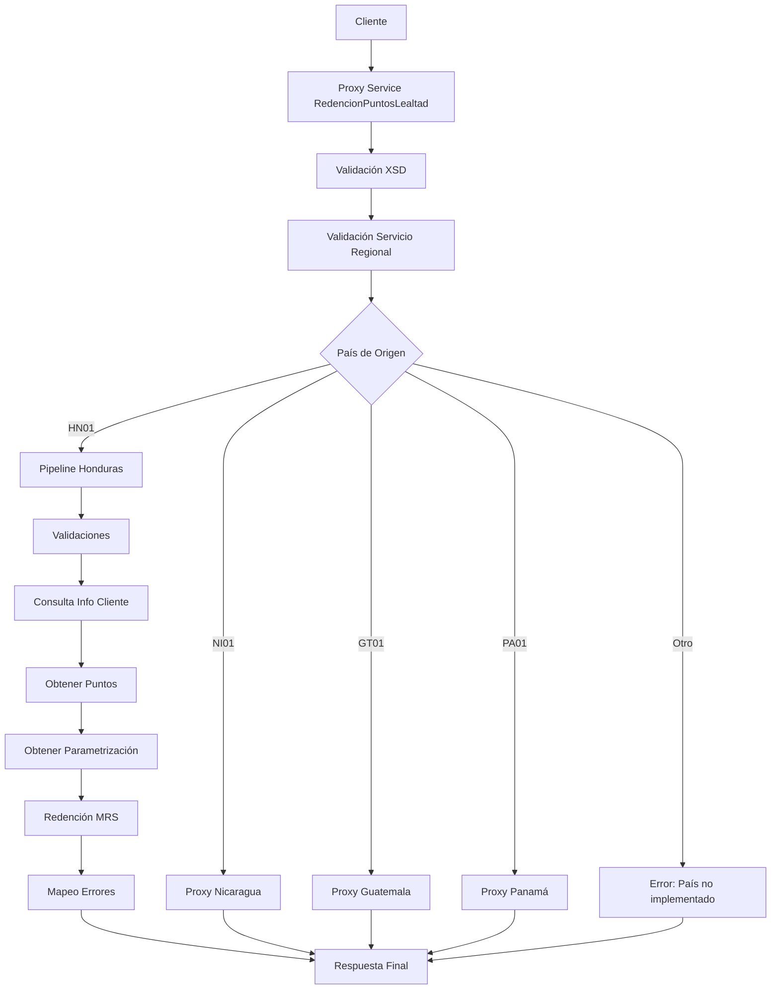

# Análisis Técnico: Redención de Puntos de Lealtad

## Resumen Ejecutivo

El servicio **Redención de Puntos de Lealtad** (FICBCO0229) es un servicio **Regional Multi-Core** que permite redimir puntos de programas de lealtad (Mastercard Rewards y VisionPlus) por efectivo o productos. Implementa un patrón de **Servicio Regional con Enrutamiento Estático por País**.

## Arquitectura del Servicio

### Patrón de Diseño
- **Tipo**: Servicio Regional Multi-Core
- **Versión**: v2
- **Protocolo**: SOAP/HTTP
- **Seguridad**: Custom Token Authentication

### Flujo de Ejecución



## Servicios Dependientes

### 1. ValidaServicioRegional
- **Propósito**: Validar que el servicio está habilitado para el país/empresa solicitante
- **Parámetros**: RequestHeader, serviceId (FICBCO0229)
- **Respuesta**: PV_CODIGO_ERROR, PV_MENSAJE_ERROR
- **Validación**: Verifica que PV_CODIGO_ERROR = 'SUCCESS'

### 2. Consultadecliente (T24)
- **Propósito**: Obtener información del cliente por CUSTOMER_ID o LEGAL_ID
- **Parámetros**: customerId/legalId, username, password
- **Respuesta**: LEGALID, SHORTNAME, Status
- **Validación**: successIndicator = 'Success' y ZERORECORDS vacío

### 3. sjConsultaTipoTarjeta
- **Propósito**: Determinar el tipo de tarjeta (débito/crédito) por BIN
- **Parámetros**: binNumber (primeros 6 dígitos), username, password
- **Respuesta**: CARD_TYPE, ERROR_MESSAGE
- **Validación**: ERROR_MESSAGE vacío

### 4. ConsultaMaestraTarjetaDebito (T24)
- **Propósito**: Obtener información del cliente asociado a tarjeta de débito
- **Parámetros**: cardNumber, username, password
- **Respuesta**: CUSTOMERLEGALID, NAMEONCARD, Status
- **Validación**: successIndicator = 'Success' y ZERORECORDS vacío

### 5. InformacionTarjeta (Alcance)
- **Propósito**: Obtener información del cliente asociado a tarjeta de crédito
- **Parámetros**: cardNumber
- **Respuesta**: IdentificacionClienteCuenta, NombreTarjetaHabiente, EstatusConfirmacion
- **Validación**: EstatusConfirmacion = '00'

### 6. canjearPuntosEfectivo
- **Propósito**: Convertir monto en efectivo a puntos equivalentes
- **Parámetros**: tipoConversion (2), montoConversion, CASH_REDEMPTION
- **Respuesta**: PN_VALOR_SALIDA (puntos), PV_CODIGO_ERROR, PV_MENSAJE_ERROR
- **Validación**: PV_CODIGO_ERROR = 'SUCCESS'

### 7. ObtenerParametrizacion
- **Propósito**: Obtener configuración de Matrix ID e Institution Name para MRS
- **Parámetros**: nombreParametros (FICBCO0229.MRS.MATRIXID.[PAIS], FICBCO0229.MRS.INSTITUTION.NAME)
- **Respuesta**: CONFIGURACIONES con NAME y VALUE
- **Validación**: Valores no vacíos

### 8. RedemptionService (Mastercard)
- **Propósito**: Ejecutar redención de puntos en Mastercard Rewards
- **Parámetros**: rewardMatrixItemId, quantity, MRSIdentity header
- **Respuesta**: pointTotalRemaining, redemptionId
- **Validación**: Respuesta exitosa sin errores

### 9. MapeoErrores
- **Propósito**: Mapear códigos de error internos a mensajes estándar
- **Parámetros**: CODIGO_ERROR, MENSAJE_ERROR (formato: FICBCO0229$#$mensaje)
- **Respuesta**: ResponseHeader con successIndicator y messages mapeados
- **Validación**: N/A

## Transformaciones de Datos

### Procesamiento por País

| País | Código | Descripción Lógica | XQuery Request | XQuery Response |
|------|--------|-------------------|----------------|-----------------|
| Honduras | HN01 | Validación de método CASH, consulta cliente por CUSTOMER_ID/LEGAL_ID/CARD_NUMBER, conversión efectivo-puntos, redención MRS | MasterNuevo/Middleware/v2/Resources/RedencionPuntosLealtad/xq/redencionPuntosLealtadValidate.xq<br>MasterNuevo/Middleware/v2/Resources/Genericos/consultaClienteHNIn.xq<br>MasterNuevo/Middleware/v2/Resources/Genericos/consultaTipoTarjetaHNIn.xq<br>MasterNuevo/Middleware/v2/Resources/Genericos/consultaInfoTDHNIn.xq<br>MasterNuevo/Middleware/v2/Resources/Genericos/consultaInfoTCHNIn.xq<br>MasterNuevo/Middleware/v2/Resources/Genericos/consultaClienteLegalHNIn.xq<br>MasterNuevo/Middleware/v2/Resources/ProgramaLealtad/xq/conversionPuntosIn.xq<br>MasterNuevo/Middleware/v2/Resources/ProgramaLealtad/xq/MRSIdentity.xq<br>MasterNuevo/Middleware/v2/Resources/RedencionPuntosLealtad/xq/doItemRedemptionIn.xq | MasterNuevo/Middleware/v2/Resources/RedencionPuntosLealtad/xq/redencionPuntosLealtadOut.xq<br>MasterNuevo/Middleware/v2/Resources/MapeoErrores/xq/mapeoErroresUsageOut.xq |
| Nicaragua | NI01 | Validación CARD_NUMBER, consulta tipo tarjeta, programa lealtad, conversión puntos, redención MRS o VisionPlus según programa | MasterNuevo/Middleware/v2/Resources/RedencionPuntosLealtad/xq/redencionPuntosLealtadValidate.xq<br>MasterNuevo/Middleware/v2/Resources/ProgramaLealtad/xq/consultaTipoTarjetaNIIn.xq<br>MasterNuevo/Middleware/v2/Resources/Genericos/obtenerTipoProgramaLealtadIn.xq<br>MasterNuevo/Middleware/v2/Resources/ProgramaLealtad/xq/consultaProgramaLealtadIn.xq<br>MasterNuevo/Middleware/v2/Resources/ProgramaLealtad/xq/conversionPuntosNIIn.xq<br>MasterNuevo/Middleware/v2/Resources/ProgramaLealtad/xq/MRSIdentity.xq<br>MasterNuevo/Middleware/v2/Resources/RedencionPuntosLealtad/xq/doItemRedemptionIn.xq<br>MasterNuevo/Middleware/v2/Resources/RedencionPuntosLealtad/xq/pointsRedeemNIIn.xq | MasterNuevo/Middleware/v2/Resources/RedencionPuntosLealtad/xq/redencionPuntosLealtadNIOut.xq |
| Guatemala | GT01 | Validación CARD_NUMBER, consulta datos cuenta, programa lealtad, conversión puntos, inserción transacción, redención VisionPlus | MasterNuevo/Middleware/v2/Resources/RedencionPuntosLealtad/xq/redencionPuntosLealtadValidate.xq<br>MasterNuevo/Middleware/v2/Resources/Generales/xq/convertirCodigoPais.xq<br>MasterNuevo/Middleware/v2/Resources/MasterDataGT/xq/conDatoCuentaGTIn.xq<br>MasterNuevo/Middleware/v2/Resources/ProgramaLealtad/xq/consultaProgramaLealtadIn.xq<br>MasterNuevo/Middleware/v2/Resources/ProgramaLealtad/xq/canjearPuntosEfectivoGTIn.xq<br>MasterNuevo/Middleware/v2/Resources/RedencionPuntosLealtad/xq/insTransaccionRedencion.xq<br>MasterNuevo/Middleware/v2/Resources/RedencionPuntosLealtad/xq/pointsRedeemGTIn.xq | MasterNuevo/Middleware/v2/Resources/RedencionPuntosLealtad/xq/redencionPuntosLealtadGTOut.xq |
| Panamá | PA01 | Delegado a proxy específico RedencionPuntosLealtadPA | N/A | N/A |

## Conexiones por País

### Honduras (HN01)

#### Conexión 1: T24 - Consulta Cliente
```xml
<!-- HTTP/SOAP -->
<service>consultasClienteBS</service>
<endpoint>[ENDPOINT_T24_HN01]</endpoint>
<operation>Consultadecliente</operation>
<!-- Autenticación: Basic Authentication (username/password en request) -->
```

#### Conexión 2: SJS - Consulta Tipo Tarjeta
```xml
<!-- JCA -->
<service>sjConsultaTipoTarjeta</service>
<connection>[CONNECTION_SJS_HN01]</connection>
<operation>ConsultaTipoTarjeta</operation>
```

#### Conexión 3: T24 - Consulta Tarjeta Débito
```xml
<!-- HTTP/SOAP -->
<service>tarjetasDebitoBS</service>
<endpoint>[ENDPOINT_T24_HN01]</endpoint>
<operation>ConsultaMaestraTarjetaDebito</operation>
<!-- Autenticación: Basic Authentication (username/password en request) -->
```

#### Conexión 4: Alcance - Información Tarjeta Crédito
```xml
<!-- HTTP/SOAP -->
<service>transaccionesAlcance</service>
<endpoint>[ENDPOINT_ALCANCE_HN01]</endpoint>
<operation>InformacionTarjeta</operation>
<!-- Autenticación: No requiere autenticación explícita -->
```

#### Conexión 5: MDW - Canjear Puntos Efectivo
```xml
<!-- JCA -->
<service>canjearPuntosEfectivo_db</service>
<connection>[CONNECTION_MDW_DB_HN01]</connection>
<operation>canjearPuntosEfectivo</operation>
```

#### Conexión 6: Mastercard - Redemption Service
```xml
<!-- HTTP/SOAP -->
<service>RedemptionService</service>
<endpoint>[ENDPOINT_MASTERCARD_MRS]</endpoint>
<operation>doItemRedemption</operation>
<!-- Autenticación: SOAP Header MRSIdentity (institutionName, appID) -->
```

### Nicaragua (NI01)
```xml
<!-- Proxy Route -->
<service>RedencionPuntosLealtadNI</service>
<operation>redencionPuntosLealtad</operation>
```

### Guatemala (GT01)
```xml
<!-- Proxy Route -->
<service>RedencionPuntosLealtadGT</service>
<operation>redencionPuntosLealtad</operation>
```

### Panamá (PA01)
```xml
<!-- Proxy Route -->
<service>RedencionPuntosLealtadPA</service>
<operation>redencionPuntosLealtad</operation>
```

## Validación XSD

### Información General
- **Esquema XSD**: programaLealtadTypes.xsd
- **Namespace**: http://www.ficohsa.com.hn/middleware.services/programaLealtadTypes
- **Versión**: 1.0

### Archivos de Esquema

#### Ubicación
- **XSD Principal**: `MasterNuevo/Middleware/v2/Resources/ProgramaLealtad/xsd/programaLealtadTypes.xsd`
- **WSDL**: `MasterNuevo/Middleware/v2/Resources/ProgramaLealtad/wsdl/programaLealtadPS.wsdl`
- **Headers**: `MasterNuevo/Middleware/v2/Resources/esquemas_generales/HeaderElements.xsd`

#### Dependencias
- **Namespace http://www.ficohsa.com.hn/middleware.services/autType**: Para RequestHeader y ResponseHeader
- **Namespace http://redemption.ws.mcrewards.mastercard.com/**: Para integración con Mastercard Rewards

### Estructura del Request

#### Definición XSD Request
```xml
<xs:element name="redencionPuntosLealtad">
    <xs:complexType>
        <xs:sequence>
            <xs:element name="CUSTOMER_ID_TYPE" minOccurs="1" maxOccurs="1">
                <xs:simpleType>
                    <xs:restriction base="xs:string">
                        <xs:enumeration value="CUSTOMER_ID"/>
                        <xs:enumeration value="LEGAL_ID"/>
                        <xs:enumeration value="CARD_NUMBER"/>
                    </xs:restriction>
                </xs:simpleType>
            </xs:element>
            <xs:element name="CUSTOMER_ID_VALUE" minOccurs="1" maxOccurs="1">
                <xs:simpleType>
                    <xs:restriction base="xs:string">
                        <xs:minLength value="1"/>
                    </xs:restriction>
                </xs:simpleType>
            </xs:element>
            <xs:element name="REDEMPTION_TYPE" minOccurs="1" maxOccurs="1">
                <xs:simpleType>
                    <xs:restriction base="xs:string">
                        <xs:enumeration value="CASH"/>
                        <xs:enumeration value="POINTS"/>
                    </xs:restriction>
                </xs:simpleType>
            </xs:element>
            <xs:element name="REDEMPTION_AMOUNT" type="xs:decimal" minOccurs="1" maxOccurs="1"/>
            <xs:element name="CASH_REDEMPTION" type="pro:cashRedemptionType" minOccurs="1" maxOccurs="1"/>
            <xs:element name="REDEMPTION_DETAILS" type="pro:redemptionDetailsType" minOccurs="1" maxOccurs="1"/>
            <xs:element name="PROGRAM_ID" minOccurs="0" maxOccurs="1">
                <xs:simpleType>
                    <xs:restriction base="xs:string">
                        <xs:enumeration value="1"/>
                        <xs:enumeration value="2"/>
                        <xs:enumeration value=""/>
                    </xs:restriction>
                </xs:simpleType>
            </xs:element>
        </xs:sequence>
    </xs:complexType>
</xs:element>

<xs:complexType name="cashRedemptionType">
    <xs:sequence>
        <xs:element name="CARD_NUMBER" type="xs:string" minOccurs="1" maxOccurs="1"/>
        <xs:element name="MERCHANT_ID" type="xs:string" minOccurs="1" maxOccurs="1"/>
        <xs:element name="MERCHANT_TYPE" type="xs:string" minOccurs="1" maxOccurs="1"/>
        <xs:element name="TERMINAL_ID" type="xs:string" minOccurs="1" maxOccurs="1"/>
    </xs:sequence>
</xs:complexType>

<xs:complexType name="redemptionDetailsType">
    <xs:sequence>
        <xs:element name="REDEMPTION_METHOD" minOccurs="1" maxOccurs="1">
            <xs:simpleType>
                <xs:restriction base="xs:string">
                    <xs:enumeration value="CASH"/>
                    <xs:enumeration value="ACCOUNT_CREDIT"/>
                    <xs:enumeration value="CREDIT_CARD_PAYMENT"/>
                </xs:restriction>
            </xs:simpleType>
        </xs:element>
        <xs:element name="ACCOUNT_NUMBER" type="xs:string" minOccurs="0" maxOccurs="1"/>
        <xs:element name="CREDIT_CARD_NUMBER" type="xs:string" minOccurs="0" maxOccurs="1"/>
    </xs:sequence>
</xs:complexType>
```

#### Ejemplo de Request Válido
> **Nota:** Los siguientes son datos de ejemplo no reales, utilizados únicamente para propósitos de testing y documentación.

```xml
<redencionPuntosLealtad xmlns="http://www.ficohsa.com.hn/middleware.services/programaLealtadTypes">
    <CUSTOMER_ID_TYPE>CARD_NUMBER</CUSTOMER_ID_TYPE>
    <CUSTOMER_ID_VALUE>4567123456789012</CUSTOMER_ID_VALUE>
    <REDEMPTION_TYPE>CASH</REDEMPTION_TYPE>
    <REDEMPTION_AMOUNT>100.00</REDEMPTION_AMOUNT>
    <CASH_REDEMPTION>
        <CARD_NUMBER>4567123456789012</CARD_NUMBER>
        <MERCHANT_ID>MERCHANT001</MERCHANT_ID>
        <MERCHANT_TYPE>RETAIL</MERCHANT_TYPE>
        <TERMINAL_ID>TERM001</TERMINAL_ID>
    </CASH_REDEMPTION>
    <REDEMPTION_DETAILS>
        <REDEMPTION_METHOD>CASH</REDEMPTION_METHOD>
    </REDEMPTION_DETAILS>
    <PROGRAM_ID>1</PROGRAM_ID>
</redencionPuntosLealtad>
```

### Estructura del Response

#### Definiciones XSD Completas

##### Response Principal
```xml
<xs:element name="redencionPuntosLealtadResponse" type="pro:redencionPuntosLealtadResponseType"/>

<xs:complexType name="redencionPuntosLealtadResponseType">
    <xs:sequence>
        <xs:element name="LEGAL_ID" type="xs:string" minOccurs="0" maxOccurs="1"/>
        <xs:element name="CUSTOMER_NAME" type="xs:string" minOccurs="0" maxOccurs="1"/>
        <xs:element name="POINTS_REDEEMED" type="xs:decimal" minOccurs="0" maxOccurs="1"/>
        <xs:element name="REMAINING_BALANCE" type="xs:decimal" minOccurs="0" maxOccurs="1"/>
        <xs:element name="REDEMPTION_ID" type="xs:long" minOccurs="0" maxOccurs="1"/>
    </xs:sequence>
</xs:complexType>
```

#### Ejemplo de Response Válido

> **Nota:** Los siguientes son datos de ejemplo no reales, utilizados únicamente para propósitos de testing y documentación.

```xml
<redencionPuntosLealtadResponse xmlns="http://www.ficohsa.com.hn/middleware.services/programaLealtadTypes">
    <LEGAL_ID>0801199012345</LEGAL_ID>
    <CUSTOMER_NAME>JUAN PEREZ LOPEZ</CUSTOMER_NAME>
    <POINTS_REDEEMED>5000</POINTS_REDEEMED>
    <REMAINING_BALANCE>15000</REMAINING_BALANCE>
    <REDEMPTION_ID>123456789</REDEMPTION_ID>
</redencionPuntosLealtadResponse>
```

### Casos de Error XSD

#### Request Inválido - Campo Faltante
> **Nota:** Los siguientes son datos de ejemplo no reales, utilizados únicamente para propósitos de testing y documentación.

```xml
<!-- ERROR: Falta REDEMPTION_TYPE (requerido) -->
<redencionPuntosLealtad xmlns="http://www.ficohsa.com.hn/middleware.services/programaLealtadTypes">
    <CUSTOMER_ID_TYPE>CARD_NUMBER</CUSTOMER_ID_TYPE>
    <CUSTOMER_ID_VALUE>4567123456789012</CUSTOMER_ID_VALUE>
    <!-- REDEMPTION_TYPE faltante -->
    <REDEMPTION_AMOUNT>100.00</REDEMPTION_AMOUNT>
</redencionPuntosLealtad>
```

#### Request Inválido - Valor de Enumeración Incorrecto
> **Nota:** Los siguientes son datos de ejemplo no reales, utilizados únicamente para propósitos de testing y documentación.

```xml
<!-- ERROR: CUSTOMER_ID_TYPE con valor no permitido -->
<redencionPuntosLealtad xmlns="http://www.ficohsa.com.hn/middleware.services/programaLealtadTypes">
    <CUSTOMER_ID_TYPE>EMAIL</CUSTOMER_ID_TYPE>
    <CUSTOMER_ID_VALUE>test@example.com</CUSTOMER_ID_VALUE>
    <REDEMPTION_TYPE>CASH</REDEMPTION_TYPE>
    <REDEMPTION_AMOUNT>100.00</REDEMPTION_AMOUNT>
</redencionPuntosLealtad>
```

#### Request Inválido - Tipo de Dato Incorrecto
> **Nota:** Los siguientes son datos de ejemplo no reales, utilizados únicamente para propósitos de testing y documentación.

```xml
<!-- ERROR: REDEMPTION_AMOUNT debe ser decimal, no string -->
<redencionPuntosLealtad xmlns="http://www.ficohsa.com.hn/middleware.services/programaLealtadTypes">
    <CUSTOMER_ID_TYPE>CARD_NUMBER</CUSTOMER_ID_TYPE>
    <CUSTOMER_ID_VALUE>4567123456789012</CUSTOMER_ID_VALUE>
    <REDEMPTION_TYPE>CASH</REDEMPTION_TYPE>
    <REDEMPTION_AMOUNT>CIEN</REDEMPTION_AMOUNT>
</redencionPuntosLealtad>
```

#### Response Inválido - Campo Requerido Faltante
> **Nota:** Los siguientes son datos de ejemplo no reales, utilizados únicamente para propósitos de testing y documentación.

```xml
<!-- ERROR: Todos los campos son opcionales en response, pero el namespace es obligatorio -->
<redencionPuntosLealtadResponse>
    <LEGAL_ID>0801199012345</LEGAL_ID>
</redencionPuntosLealtadResponse>
```

---

## Historial de Cambios

| Fecha | Versión | Autor | Descripción |
|-------|---------|-------|-------------|
| 2024-01-XX | 1.0 | ARQ FICOHSA | Creación inicial |
