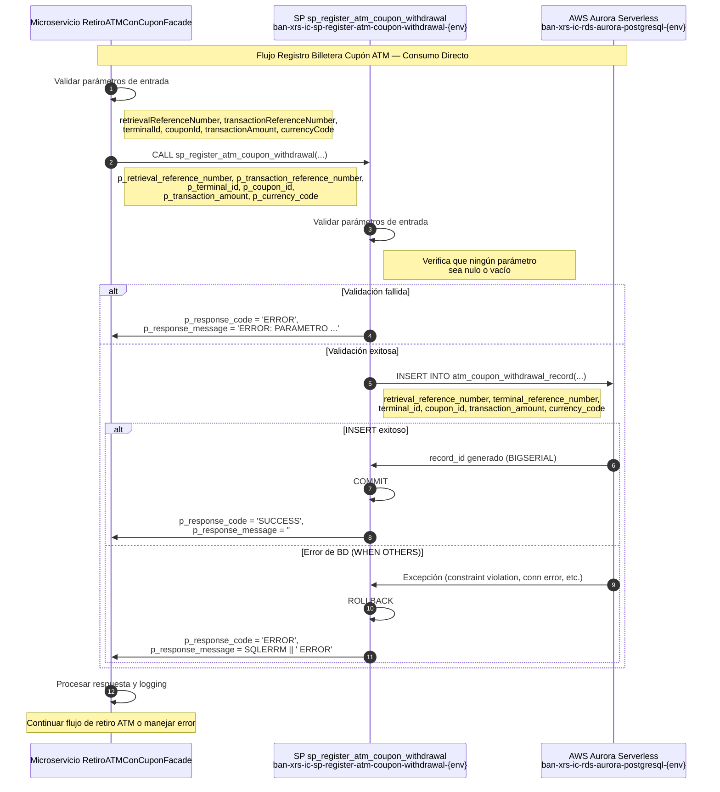

# Migración AWS Aurora — Registro Billetera Cupón ATM

## Control de Cambios

| Fecha | Versión | Cambio | Autor |
|-------|---------|--------|-------|
| 2026-05-08 | v1.0 | **Creación del Documento** | **David Julian Molano Peralta** |

[[_TOC_]]

---
## 1. Resumen Ejecutivo

Este documento describe la migración de la tabla Oracle (`MW_REGISTRO_BILLE_CUPON_ATM`) y su stored procedure asociado (`MW_P_REGISTRAR_BILLETERA_CUPON`) desde una base de datos Oracle hacia **AWS Aurora Serverless PostgreSQL**.

El proceso de migración incluye:
- Rediseño del esquema con nomenclatura **BIAN (Banking Industry Architecture Network)**
- Reescritura del stored procedure en **PL/pgSQL** (compatible con Aurora PostgreSQL)
- Incorporación de validaciones de parámetros de entrada ausentes en la versión Oracle original
- Reemplazo de `LTRIM/RTRIM` redundante por `TRIM` nativo de PostgreSQL
- Incorporación de llave primaria surrogate (`record_id`) y columna de auditoría (`created_at`)
- Definición de estrategia de manejo de errores y logging

| Componente Original | Componente AWS | Identificador |
|---|---|---|
| Oracle Schema `MIDDLEWARE` | Aurora PostgreSQL Schema `atmCouponManagement` | `ban-xrs-ic-rds-aurora-postgresql-{env}` |
| `MW_REGISTRO_BILLE_CUPON_ATM` | `atm_coupon_withdrawal_record` | — |
| `MW_P_REGISTRAR_BILLETERA_CUPON` | `sp_register_atm_coupon_withdrawal` | `ban-xrs-ic-sp-register-atm-coupon-withdrawal-{env}` |

---

## 2. Mapeo de Nomenclatura BIAN

### 2.1 Tabla

| Nombre Original (Oracle) | Nombre BIAN (Aurora PostgreSQL) | Descripción |
|---|---|---|
| `MW_REGISTRO_BILLE_CUPON_ATM` | `atm_coupon_withdrawal_record` | Registro de retiros ATM realizados mediante cupón de billetera digital |

### 2.2 Campos — `MW_REGISTRO_BILLE_CUPON_ATM` → `atm_coupon_withdrawal_record`

| Campo Original | Campo BIAN | Tipo Original | Tipo Aurora | Descripción |
|---|---|---|---|---|
| — | `record_id` | — | `BIGSERIAL` | Llave primaria surrogate añadida en la migración |
| `RETRIEVAL_REF_NUMBER_37` | `retrieval_reference_number` | `VARCHAR2` | `VARCHAR(50)` | Número de referencia de recuperación de la transacción (ISO 8583, campo 37) |
| `TERMINAR_REFERENCE_11` | `terminal_reference_number` | `VARCHAR2` | `VARCHAR(50)` | Número de referencia del terminal (ISO 8583, campo 11) |
| `TERMINAL_ID_41` | `terminal_id` | `VARCHAR2` | `VARCHAR(50)` | Identificador del terminal ATM (ISO 8583, campo 41) |
| `CUPON_ID_48` | `coupon_id` | `VARCHAR2` | `VARCHAR(50)` | Identificador del cupón de billetera digital (ISO 8583, campo 48) |
| `AMOUNT_04` | `transaction_amount` | `VARCHAR2` | `VARCHAR(20)` | Monto en formato ISO 8583 cero-relleno (campo 04) |
| `CURRENCY_49` | `currency_code` | `VARCHAR2` | `VARCHAR(10)` | Código de moneda ISO 4217 numérico (ISO 8583, campo 49) (ej. 340 = HNL) |
| `REFERENCIA_CB` | `corban_reference` | `VARCHAR2` | `VARCHAR(50)` | Referencia asignada por el sistema Corban (no poblada por este SP) |
| `ATM_DATE` | `atm_transaction_date` | `DATE` | `TIMESTAMP` | Fecha y hora de la transacción en el ATM (no poblada por este SP) |
| — | `created_at` | — | `TIMESTAMP` | Fecha de inserción del registro en Aurora (nueva columna de auditoría) |

### 2.3 Parámetros del Stored Procedure

| Parámetro Original | Parámetro BIAN | Dirección | Descripción |
|---|---|---|---|
| `PV_RETRIEVAL_REF` | `p_retrieval_reference_number` | IN | Número de referencia de recuperación (ISO 8583 campo 37) |
| `PV_TERMINAR_REFERENCE` | `p_transaction_reference_number` | IN | Número de referencia del terminal (ISO 8583 campo 11) |
| `PV_TERMINAL_ID` | `p_terminal_id` | IN | Identificador del terminal ATM (ISO 8583 campo 41) |
| `PV_CUPON_ID` | `p_coupon_id` | IN | Identificador del cupón de billetera digital (ISO 8583 campo 48) |
| `PV_AMOUNT` | `p_transaction_amount` | IN | Monto de la transacción en formato ISO 8583 cero-relleno |
| `PV_CURRENCY` | `p_currency_code` | IN | Código de moneda ISO 4217 numérico (ej. 340 = HNL) |
| `PV_CODIGO_ERROR` | `p_response_code` | OUT | Código de respuesta: `SUCCESS` / `ERROR` |
| `PV_MENSAJE_ERROR` | `p_response_message` | OUT | Mensaje descriptivo del resultado |

---

## 3. Modelo de Datos — AWS Aurora PostgreSQL

### 3.1 Tabla: `atm_coupon_withdrawal_record`

```sql
Schema  : atmCouponManagement
Tabla   : atm_coupon_withdrawal_record
PK      : record_id (surrogate BIGSERIAL)
Índices : idx_acwr_retrieval_reference, idx_acwr_coupon_id, idx_acwr_terminal_id
```

| Columna | Tipo | Nulo | PK | FK | Descripción |
|---|---|---|---|---|---|
| `record_id` | `BIGSERIAL` | NO | PK | — | Identificador único del registro (surrogate key) |
| `retrieval_reference_number` | `VARCHAR(50)` | NO | — | — | Referencia de recuperación de la transacción (ISO 8583 campo 37) |
| `terminal_reference_number` | `VARCHAR(50)` | NO | — | — | Referencia del terminal (ISO 8583 campo 11) |
| `terminal_id` | `VARCHAR(50)` | NO | — | — | Identificador del terminal ATM (ISO 8583 campo 41) |
| `coupon_id` | `VARCHAR(50)` | NO | — | — | Identificador del cupón de billetera digital (ISO 8583 campo 48) |
| `transaction_amount` | `VARCHAR(20)` | NO | — | — | Monto en formato ISO 8583 cero-relleno (campo 04) |
| `currency_code` | `VARCHAR(10)` | NO | — | — | Código de moneda ISO 4217 numérico (ISO 8583 campo 49) |
| `corban_reference` | `VARCHAR(50)` | YES | — | — | Referencia del sistema Corban (poblada por proceso externo) |
| `atm_transaction_date` | `TIMESTAMP` | YES | — | — | Fecha y hora de la transacción en el ATM |
| `created_at` | `TIMESTAMP` | NO | — | — | Fecha de creación del registro en Aurora |

---

## 4. Modelo Entidad-Relación

```
┌──────────────────────────────────────────────────────────────────────┐
│                     atmCouponManagement schema                       │
│                                                                      │
│  ┌───────────────────────────────────────────────────────────────┐   │
│  │               atm_coupon_withdrawal_record                    │   │
│  ├───────────────────────────────────────────────────────────────┤   │
│  │ PK record_id                                                  │   │
│  │    retrieval_reference_number                                 │   │
│  │    terminal_reference_number                                  │   │
│  │    terminal_id                                                │   │
│  │    coupon_id                                                  │   │
│  │    transaction_amount                                         │   │
│  │    currency_code                                              │   │
│  │    corban_reference         (nullable)                        │   │
│  │    atm_transaction_date     (nullable)                        │   │
│  │    created_at                                                 │   │
│  └───────────────────────────────────────────────────────────────┘   │
│                                                                      │
│  Tabla de registro transaccional — Sin relaciones FK                 │
└──────────────────────────────────────────────────────────────────────┘
```

**Cardinalidad:**
- Tabla de registro transaccional de retiros ATM con cupón de billetera digital
- Operaciones de escritura mediante el SP de registro; las consultas son realizadas por otros procesos del sistema
- Permite múltiples registros para la misma referencia de recuperación (sin restricción de unicidad entre registros históricos)
- `corban_reference` y `atm_transaction_date` son pobladas por procesos externos al SP de registro

---

## 5. Scripts DDL — Creación de Tablas

```sql
-- ============================================================
-- Schema
-- ============================================================
CREATE SCHEMA IF NOT EXISTS atmCouponManagement;

-- ============================================================
-- Tabla: atm_coupon_withdrawal_record
-- Equivalente a: MW_REGISTRO_BILLE_CUPON_ATM
-- ============================================================
CREATE TABLE atmCouponManagement.atm_coupon_withdrawal_record (
    record_id                    BIGSERIAL        NOT NULL,
    retrieval_reference_number   VARCHAR(50)      NOT NULL,
    terminal_reference_number    VARCHAR(50)      NOT NULL,
    terminal_id                  VARCHAR(50)      NOT NULL,
    coupon_id                    VARCHAR(50)      NOT NULL,
    transaction_amount           VARCHAR(20)      NOT NULL,
    currency_code                VARCHAR(10)      NOT NULL,
    corban_reference             VARCHAR(50),
    atm_transaction_date         TIMESTAMP,
    created_at                   TIMESTAMP        NOT NULL DEFAULT NOW(),

    CONSTRAINT pk_atm_coupon_withdrawal_record
        PRIMARY KEY (record_id),

    CONSTRAINT chk_acwr_retrieval_reference_not_empty
        CHECK (TRIM(retrieval_reference_number) <> ''),

    CONSTRAINT chk_acwr_coupon_id_not_empty
        CHECK (TRIM(coupon_id) <> ''),

    CONSTRAINT chk_acwr_terminal_id_not_empty
        CHECK (TRIM(terminal_id) <> '')
);

CREATE INDEX idx_acwr_retrieval_reference
    ON atmCouponManagement.atm_coupon_withdrawal_record (retrieval_reference_number);

CREATE INDEX idx_acwr_coupon_id
    ON atmCouponManagement.atm_coupon_withdrawal_record (coupon_id);

CREATE INDEX idx_acwr_terminal_id
    ON atmCouponManagement.atm_coupon_withdrawal_record (terminal_id);

COMMENT ON TABLE atmCouponManagement.atm_coupon_withdrawal_record
    IS 'Registro de retiros ATM realizados mediante cupón de billetera digital. Migrado desde Oracle MW_REGISTRO_BILLE_CUPON_ATM.';

COMMENT ON COLUMN atmCouponManagement.atm_coupon_withdrawal_record.record_id
    IS 'Llave primaria surrogate generada automáticamente. No existía en el modelo Oracle original.';
COMMENT ON COLUMN atmCouponManagement.atm_coupon_withdrawal_record.retrieval_reference_number
    IS 'Número de referencia de recuperación de la transacción. ISO 8583 campo 37.';
COMMENT ON COLUMN atmCouponManagement.atm_coupon_withdrawal_record.terminal_reference_number
    IS 'Número de referencia del terminal. ISO 8583 campo 11.';
COMMENT ON COLUMN atmCouponManagement.atm_coupon_withdrawal_record.terminal_id
    IS 'Identificador del terminal ATM. ISO 8583 campo 41.';
COMMENT ON COLUMN atmCouponManagement.atm_coupon_withdrawal_record.coupon_id
    IS 'Identificador del cupón de billetera digital. ISO 8583 campo 48.';
COMMENT ON COLUMN atmCouponManagement.atm_coupon_withdrawal_record.transaction_amount
    IS 'Monto de la transacción en formato ISO 8583 cero-relleno. ISO 8583 campo 04.';
COMMENT ON COLUMN atmCouponManagement.atm_coupon_withdrawal_record.currency_code
    IS 'Código de moneda ISO 4217 numérico. ISO 8583 campo 49 (ej. 340 = HNL).';
COMMENT ON COLUMN atmCouponManagement.atm_coupon_withdrawal_record.corban_reference
    IS 'Referencia asignada por el sistema Corban. No es poblada por el SP de registro; se actualiza por proceso externo.';
COMMENT ON COLUMN atmCouponManagement.atm_coupon_withdrawal_record.atm_transaction_date
    IS 'Fecha y hora de la transacción en el ATM. No es poblada por el SP de registro; se actualiza por proceso externo.';
COMMENT ON COLUMN atmCouponManagement.atm_coupon_withdrawal_record.created_at
    IS 'Fecha de inserción del registro en Aurora PostgreSQL. Nueva columna de auditoría añadida en la migración.';
```

---

## 6. Scripts DML — Carga Inicial de Datos

```sql
-- ============================================================
-- Carga inicial: atm_coupon_withdrawal_record
-- Fuente: MW_REGISTRO_BILLE_CUPON_ATM.csv (19 registros)
-- Nota: corban_reference y atm_transaction_date se migran
--       tal como existen en el CSV fuente (nullable)
-- ============================================================
INSERT INTO atmCouponManagement.atm_coupon_withdrawal_record
    (retrieval_reference_number, terminal_reference_number, terminal_id,
     coupon_id, transaction_amount, currency_code,
     corban_reference, atm_transaction_date, created_at)
VALUES
    ('4270', '000051', '00000003', '162613275441',   '000000003000', '340', '7907572', '2023-06-19 10:20:47.664', NOW()),
    ('4270', '000051', '00000003', '162613275441',   '000000003000', '340', '7907572', '2023-06-19 10:20:47.664', NOW()),
    ('4270', '000051', '00000003', '162613275441',   '000000003000', '340', '7907572', '2023-06-19 10:20:47.664', NOW()),
    ('4270', '000051', '00000003', '162613275441',   '000000003000', '340', '7907572', '2023-06-19 10:20:47.664', NOW()),
    ('4270', '000051', '00000003', '162613275441',   '000000003000', '340', '7907572', '2023-06-19 10:20:47.664', NOW()),
    ('4290', '000051', '00000003', '162613275441',   '000000003000', '340', '7934815', '2023-06-27 11:33:39.998', NOW()),
    ('9478', '000051', '00000003', '160183008838',   '000000020000', '340', '7939055', '2023-06-28 14:25:49.536', NOW()),
    ('5450', '000004', '00000044', '119307817547',   '000000020000', '340', '7939064', '2023-06-28 14:29:34.883', NOW()),
    ('5451', '000001', '00000044', '119307817547',   '000000010000', '340', '7939134', '2023-06-28 14:50:39.517', NOW()),
    ('9819', '019637', '00000297', '842459219707',   '000000050000', '340', NULL,      NULL,                      NOW()),
    ('9819', '019637', '00000297', '842459219707',   '000000050000', '340', NULL,      NULL,                      NOW()),
    ('9819', '019637', '00000297', '114578993798',   '000000050000', '340', NULL,      NULL,                      NOW()),
    ('9819', '019637', '00000297', '114578993798',   '000000050000', '340', NULL,      NULL,                      NOW()),
    ('9860', '019637', '00000297', '114578993798',   '000000050000', '340', NULL,      NULL,                      NOW()),
    ('9819', '019637', '00000297', '842459219707',   '000000050000', '340', NULL,      NULL,                      NOW()),
    ('9819', '019637', '00000297', '842459219707',   '000000050000', '340', NULL,      NULL,                      NOW()),
    ('9819', '019637', '00000297', '842459219707',   '000000050000', '340', NULL,      NULL,                      NOW()),
    ('4270', '000051', '00000003', '12345678987654', '000000003000', '340', NULL,      NULL,                      NOW()),
    ('9819', '019637', '00000297', '141057131001',   '000000050000', '340', NULL,      NULL,                      NOW());
```

---

## 7. Stored Procedure — AWS Aurora PostgreSQL

> **Nombre:** `sp_register_atm_coupon_withdrawal`
> **Identificador AWS:** `ban-xrs-ic-sp-register-atm-coupon-withdrawal-{env}`
> **Motor:** Aurora PostgreSQL — PL/pgSQL
> **Equivalente Oracle:** `MIDDLEWARE.MW_P_REGISTRAR_BILLETERA_CUPON`

```sql
-- ============================================================
-- SP: sp_register_atm_coupon_withdrawal
-- Descripción: Registra un retiro ATM realizado mediante cupón
--              de billetera digital en la tabla de registro
--              transaccional.
-- Autor migración: ficohsa-capa-media team
-- Fecha migración: 2026-05-08
-- Versión original Oracle: 1.0
-- ============================================================
CREATE OR REPLACE PROCEDURE atmCouponManagement.sp_register_atm_coupon_withdrawal(
    -- Parámetros de entrada
    IN  p_retrieval_reference_number    VARCHAR(50),
    IN  p_transaction_reference_number  VARCHAR(50),
    IN  p_terminal_id                   VARCHAR(50),
    IN  p_coupon_id                     VARCHAR(50),
    IN  p_transaction_amount            VARCHAR(20),
    IN  p_currency_code                 VARCHAR(10),
    -- Parámetros de salida
    OUT p_response_code                 VARCHAR(10),
    OUT p_response_message              VARCHAR(500)
)
LANGUAGE plpgsql
AS $$
BEGIN

    -- --------------------------------------------------------
    -- Validación parámetros de entrada
    -- --------------------------------------------------------
    IF p_retrieval_reference_number IS NULL OR TRIM(p_retrieval_reference_number) = '' THEN
        p_response_code    := 'ERROR';
        p_response_message := 'ERROR: PARAMETRO DE ENTRADA p_retrieval_reference_number ES REQUERIDO.';
        RETURN;
    END IF;

    IF p_transaction_reference_number IS NULL OR TRIM(p_transaction_reference_number) = '' THEN
        p_response_code    := 'ERROR';
        p_response_message := 'ERROR: PARAMETRO DE ENTRADA p_transaction_reference_number ES REQUERIDO.';
        RETURN;
    END IF;

    IF p_terminal_id IS NULL OR TRIM(p_terminal_id) = '' THEN
        p_response_code    := 'ERROR';
        p_response_message := 'ERROR: PARAMETRO DE ENTRADA p_terminal_id ES REQUERIDO.';
        RETURN;
    END IF;

    IF p_coupon_id IS NULL OR TRIM(p_coupon_id) = '' THEN
        p_response_code    := 'ERROR';
        p_response_message := 'ERROR: PARAMETRO DE ENTRADA p_coupon_id ES REQUERIDO.';
        RETURN;
    END IF;

    IF p_transaction_amount IS NULL OR TRIM(p_transaction_amount) = '' THEN
        p_response_code    := 'ERROR';
        p_response_message := 'ERROR: PARAMETRO DE ENTRADA p_transaction_amount ES REQUERIDO.';
        RETURN;
    END IF;

    IF p_currency_code IS NULL OR TRIM(p_currency_code) = '' THEN
        p_response_code    := 'ERROR';
        p_response_message := 'ERROR: PARAMETRO DE ENTRADA p_currency_code ES REQUERIDO.';
        RETURN;
    END IF;

    -- --------------------------------------------------------
    -- Inserción del registro de retiro ATM con cupón
    -- --------------------------------------------------------
    INSERT INTO atmCouponManagement.atm_coupon_withdrawal_record
    (
        retrieval_reference_number,
        terminal_reference_number,
        terminal_id,
        coupon_id,
        transaction_amount,
        currency_code
    )
    VALUES
    (
        TRIM(p_retrieval_reference_number),
        TRIM(p_transaction_reference_number),
        TRIM(p_terminal_id),
        TRIM(p_coupon_id),
        TRIM(p_transaction_amount),
        TRIM(p_currency_code)
    );

    COMMIT;

    -- --------------------------------------------------------
    -- Respuesta exitosa
    -- --------------------------------------------------------
    p_response_code    := 'SUCCESS';
    p_response_message := '';

EXCEPTION
    WHEN OTHERS THEN
        p_response_code    := 'ERROR';
        p_response_message := SQLERRM || ' ERROR';
        ROLLBACK;

END;
$$;

-- Permisos de ejecución
GRANT EXECUTE ON PROCEDURE atmCouponManagement.sp_register_atm_coupon_withdrawal(
    VARCHAR, VARCHAR, VARCHAR, VARCHAR, VARCHAR, VARCHAR,
    OUT VARCHAR, OUT VARCHAR
) TO atm_coupon_microservice_role;
```

---

## 8. Manejo de Errores del Stored Procedure

### 8.1 Tabla de Códigos de Error

| Código Error | Origen | Causa | Acción Recomendada |
|---|---|---|---|
| `SUCCESS` | SP | Operación exitosa, registro insertado | Continuar flujo normal |
| `ERROR: PARAMETRO DE ENTRADA p_retrieval_reference_number ES REQUERIDO` | SP | `p_retrieval_reference_number` nulo o vacío | Validar campo en microservicio antes de llamar |
| `ERROR: PARAMETRO DE ENTRADA p_transaction_reference_number ES REQUERIDO` | SP | `p_transaction_reference_number` nulo o vacío | Validar campo en microservicio antes de llamar |
| `ERROR: PARAMETRO DE ENTRADA p_terminal_id ES REQUERIDO` | SP | `p_terminal_id` nulo o vacío | Validar campo en microservicio antes de llamar |
| `ERROR: PARAMETRO DE ENTRADA p_coupon_id ES REQUERIDO` | SP | `p_coupon_id` nulo o vacío | Validar campo en microservicio antes de llamar |
| `ERROR: PARAMETRO DE ENTRADA p_transaction_amount ES REQUERIDO` | SP | `p_transaction_amount` nulo o vacío | Validar campo en microservicio antes de llamar |
| `ERROR: PARAMETRO DE ENTRADA p_currency_code ES REQUERIDO` | SP | `p_currency_code` nulo o vacío | Validar moneda en microservicio antes de llamar |
| `<mensaje de error de BD> ERROR` | SP `WHEN OTHERS` | Error inesperado en el INSERT (violación de constraint, fallo de conexión, etc.) | Revisar logs Aurora y estructura de datos |

---

## 9. Diagrama de Secuencia



---

## 10. Consideraciones de Migración

### 10.1 Diferencias Oracle → Aurora PostgreSQL

| Aspecto | Oracle PL/SQL | Aurora PostgreSQL PL/pgSQL |
|---|---|---|
| Recorte de espacios | `LTRIM(RTRIM(x))` | `TRIM(x)` — función única equivalente |
| COMMIT explícito | `COMMIT;` | `COMMIT;` — válido dentro de PROCEDURE desde PG11 / Aurora |
| ROLLBACK en EXCEPTION | `rollback;` — revierte la transacción | `ROLLBACK;` — equivalente en PROCEDURE; PL/pgSQL también hace rollback a savepoint automáticamente |
| Manejo de excepciones | `WHEN OTHERS THEN` | `WHEN OTHERS THEN` — disponible de igual forma |
| `SQLERRM` | Sí | `SQLERRM` disponible |
| Parámetros OUT | Por referencia | Por referencia (igual) |
| Tipo VARCHAR | `VARCHAR2` | `VARCHAR` |
| Llave primaria | No existía PK definida | `BIGSERIAL` surrogate añadida |

### 10.2 Mejoras Implementadas en la Migración

| Mejora | Descripción | Beneficio |
|---|---|---|
| **Validaciones de entrada** | Verificación de todos los parámetros IN nulos o vacíos | Prevención de registros inválidos y mensajes de error descriptivos |
| **Reemplazo de LTRIM/RTRIM** | `TRIM()` nativo de PostgreSQL | Código más idiomático y legible en PL/pgSQL |
| **Llave primaria surrogate** | Columna `record_id BIGSERIAL` | Identificación única de cada registro, soporte para procesos de actualización de `corban_reference` y `atm_transaction_date` |
| **Columna de auditoría** | `created_at TIMESTAMP DEFAULT NOW()` | Trazabilidad de inserción; no existía en el modelo Oracle |
| **Índices de consulta** | Índices sobre `retrieval_reference_number`, `coupon_id`, `terminal_id` | Performance en consultas de búsqueda por referencia o cupón |
| **Constraints de tabla** | `CHECK` para campos clave no vacíos | Integridad de datos a nivel de base de datos |
| **Nomenclatura BIAN** | Nombres de campos y SP alineados con estándares bancarios | Consistencia arquitectónica con el resto del esquema |

### 10.3 Datos de Migración

**Tabla original:** Contiene 19 registros de transacciones en el CSV fuente.

```csv
"RETRIEVAL_REF_NUMBER_37","TERMINAR_REFERENCE_11","TERMINAL_ID_41","CUPON_ID_48","AMOUNT_04","CURRENCY_49","REFERENCIA_CB","ATM_DATE"
"4270","000051","00000003","162613275441","000000003000","340","7907572","2023-06-19T10:20:47.664"
...
"9819","019637","00000297","141057131001","000000050000","340",,
```

**Observaciones de los datos:**
- Moneda única: `340` (código ISO 4217 numérico de HNL — Lempira hondureño)
- Los montos están en formato ISO 8583 cero-relleno de 12 dígitos (ej. `000000003000` = L. 30.00 ó L. 3,000 según escala del sistema)
- Los registros de las filas 10–19 (CSV) no tienen `REFERENCIA_CB` ni `ATM_DATE` — indican transacciones incompletas o pendientes de conciliación
- El terminal `00000297` concentra la mayor parte de las transacciones sin conciliar
- Existen registros duplicados por la misma combinación de referencia + cupón (comportamiento heredado del Oracle — la tabla no tenía unicidad)

**Estrategia de migración:**
1. **Crear esquema y tabla** con estructura mejorada
2. **Cargar datos existentes** mediante el script DML de la sección 6
3. **Validar integridad** con queries de verificación
4. **Probar SP** con casos de prueba completos
5. **Actualizar microservicio** para consumir el nuevo SP directamente

### 10.4 Script de Migración de Datos (vía ETL / dblink Oracle)

```sql
-- Script para migrar datos desde Oracle (alternativa vía dblink o ETL)
INSERT INTO atmCouponManagement.atm_coupon_withdrawal_record
    (retrieval_reference_number, terminal_reference_number, terminal_id,
     coupon_id, transaction_amount, currency_code,
     corban_reference, atm_transaction_date, created_at)
SELECT
    RETRIEVAL_REF_NUMBER_37,
    TERMINAR_REFERENCE_11,
    TERMINAL_ID_41,
    CUPON_ID_48,
    AMOUNT_04,
    CURRENCY_49,
    REFERENCIA_CB,
    CAST(ATM_DATE AS TIMESTAMP),
    NOW()
FROM oracle_source.MW_REGISTRO_BILLE_CUPON_ATM;
```

---

## 11. Testing y Validación

### 11.1 Casos de Prueba del SP

| Caso | Entrada | Resultado Esperado |
|---|---|---|
| **Registro exitoso** | retrievalRef='4270', termRef='000051', terminalId='00000003', couponId='162613275441', amount='000000003000', currency='340' | `p_response_code='SUCCESS'`, registro insertado en tabla |
| **`p_retrieval_reference_number` nulo** | retrievalRef=NULL, resto válidos | `p_response_code='ERROR'`, mensaje `p_retrieval_reference_number ES REQUERIDO` |
| **`p_retrieval_reference_number` vacío** | retrievalRef='   ' (espacios), resto válidos | `p_response_code='ERROR'`, mensaje `p_retrieval_reference_number ES REQUERIDO` |
| **`p_coupon_id` nulo** | couponId=NULL, resto válidos | `p_response_code='ERROR'`, mensaje `p_coupon_id ES REQUERIDO` |
| **`p_terminal_id` nulo** | terminalId=NULL, resto válidos | `p_response_code='ERROR'`, mensaje `p_terminal_id ES REQUERIDO` |
| **`p_transaction_amount` nulo** | amount=NULL, resto válidos | `p_response_code='ERROR'`, mensaje `p_transaction_amount ES REQUERIDO` |
| **`p_currency_code` nulo** | currency=NULL, resto válidos | `p_response_code='ERROR'`, mensaje `p_currency_code ES REQUERIDO` |
| **`p_transaction_reference_number` vacío** | termRef='', resto válidos | `p_response_code='ERROR'`, mensaje `p_transaction_reference_number ES REQUERIDO` |
| **Registro con TRIM de espacios** | retrievalRef=' 4270 ', couponId=' 162613275441 ' | `p_response_code='SUCCESS'`, valores almacenados sin espacios |
| **Múltiples registros para mismo cupón** | Llamadas sucesivas con mismo retrievalRef + couponId | `p_response_code='SUCCESS'` en cada llamada; tabla permite duplicados |

### 11.2 Queries de Validación Post-Migración

```sql
-- Verificar total de registros migrados
SELECT COUNT(*) FROM atmCouponManagement.atm_coupon_withdrawal_record;
-- Esperado: 19

-- Verificar distribución por terminal
SELECT terminal_id, COUNT(*) AS total_transacciones
  FROM atmCouponManagement.atm_coupon_withdrawal_record
 GROUP BY terminal_id
 ORDER BY total_transacciones DESC;

-- Verificar registros sin referencia Corban (pendientes de conciliación)
SELECT COUNT(*) AS registros_sin_conciliar
  FROM atmCouponManagement.atm_coupon_withdrawal_record
 WHERE corban_reference IS NULL;
-- Esperado: 11 (según CSV fuente)

-- Verificar que el TRIM se aplicó correctamente (sin espacios al inicio/fin)
SELECT COUNT(*) AS con_espacios
  FROM atmCouponManagement.atm_coupon_withdrawal_record
 WHERE retrieval_reference_number <> TRIM(retrieval_reference_number)
    OR coupon_id                  <> TRIM(coupon_id)
    OR terminal_id                <> TRIM(terminal_id);
-- Esperado: 0 filas

-- Verificar distribución por moneda
SELECT currency_code, COUNT(*) AS registros
  FROM atmCouponManagement.atm_coupon_withdrawal_record
 GROUP BY currency_code;
-- Esperado: 1 fila — currency_code='340', registros=19

-- Probar SP directamente en Aurora
CALL atmCouponManagement.sp_register_atm_coupon_withdrawal(
    'TEST001',   -- p_retrieval_reference_number
    'TST001',    -- p_transaction_reference_number
    '00000001',  -- p_terminal_id
    '999999999', -- p_coupon_id
    '000000001000', -- p_transaction_amount
    '340',       -- p_currency_code
    NULL,        -- p_response_code (OUT)
    NULL         -- p_response_message (OUT)
);
-- Verificar respuesta: p_response_code debe ser 'SUCCESS'

-- Limpiar registro de prueba
DELETE FROM atmCouponManagement.atm_coupon_withdrawal_record
 WHERE retrieval_reference_number = 'TEST001'
   AND coupon_id = '999999999';
```

---

## 12. Repositorio y Despliegue

| Ambiente | Repositorio | Rama | Observación |
|----------|-------------|------|-------------|
| Dev | `fn-ic-retiro-atm-cupon-facade-sys` | [Repositorio Azure](https://dev.azure.com/DevopsFicohsa/NOVA%20-%20Modernizaci%C3%B3n%20Capa%20Integraci%C3%B3n/_git/fn-ic-retiro-atm-cupon-facade-sys) | `develop` | Desarrollo activo |

---

## 13. Conclusiones y Recomendaciones

### 13.1 Decisiones Clave

1. **Llave primaria surrogate**: Se añade `record_id BIGSERIAL` dado que la tabla Oracle no tenía PK definida; es necesaria para soportar actualizaciones de `corban_reference` y `atm_transaction_date` por procesos externos
2. **Columnas nullable para datos de conciliación**: `corban_reference` y `atm_transaction_date` se mantienen opcionales porque no son pobladas por este SP; otros procesos de conciliación son responsables de actualizarlas
3. **Reemplazo de LTRIM/RTRIM**: `TRIM()` es el equivalente idiomático en PostgreSQL para ambas operaciones combinadas
4. **Validaciones de entrada añadidas**: El SP Oracle original no validaba parámetros; la versión migrada añade validaciones explícitas para todos los parámetros IN
5. **COMMIT/ROLLBACK explícitos preservados**: Se mantiene la semántica transaccional del SP Oracle original; los PROCEDURES en Aurora PostgreSQL (PG11+) soportan control explícito de transacciones

### 13.2 Beneficios de la Migración

- **Integridad de datos**: Constraints CHECK y llave primaria BIGSERIAL garantizan consistencia a nivel de base de datos
- **Trazabilidad**: `created_at` permite auditar cuándo fue insertado cada registro en Aurora
- **Performance**: Índices sobre `retrieval_reference_number`, `coupon_id` y `terminal_id` optimizan consultas de búsqueda por transacción
- **Mantenibilidad**: Código PL/pgSQL con `TRIM()`, validaciones explícitas y nomenclatura BIAN es más legible que el original Oracle
- **Observabilidad**: Mensajes de error diferenciados por parámetro facilitan el diagnóstico operativo
- **Escalabilidad**: Aurora Serverless v2 con escalado automático adapta la capacidad a la demanda transaccional

### 13.3 Próximos Pasos

1. **Crear esquema y tabla** en Aurora PostgreSQL con el DDL de la sección 5
2. **Cargar datos históricos** con el DML de la sección 6
3. **Ejecutar queries de validación** de la sección 11.2 para verificar integridad
4. **Implementar y probar SP** con los casos de prueba de la sección 11.1
5. **Actualizar microservicio** para consumir el nuevo SP directamente sobre Aurora PostgreSQL
6. **Definir proceso de conciliación** para la actualización de `corban_reference` y `atm_transaction_date` en los registros sin conciliar
7. **Monitorear performance** y ajustar índices según sea necesario
