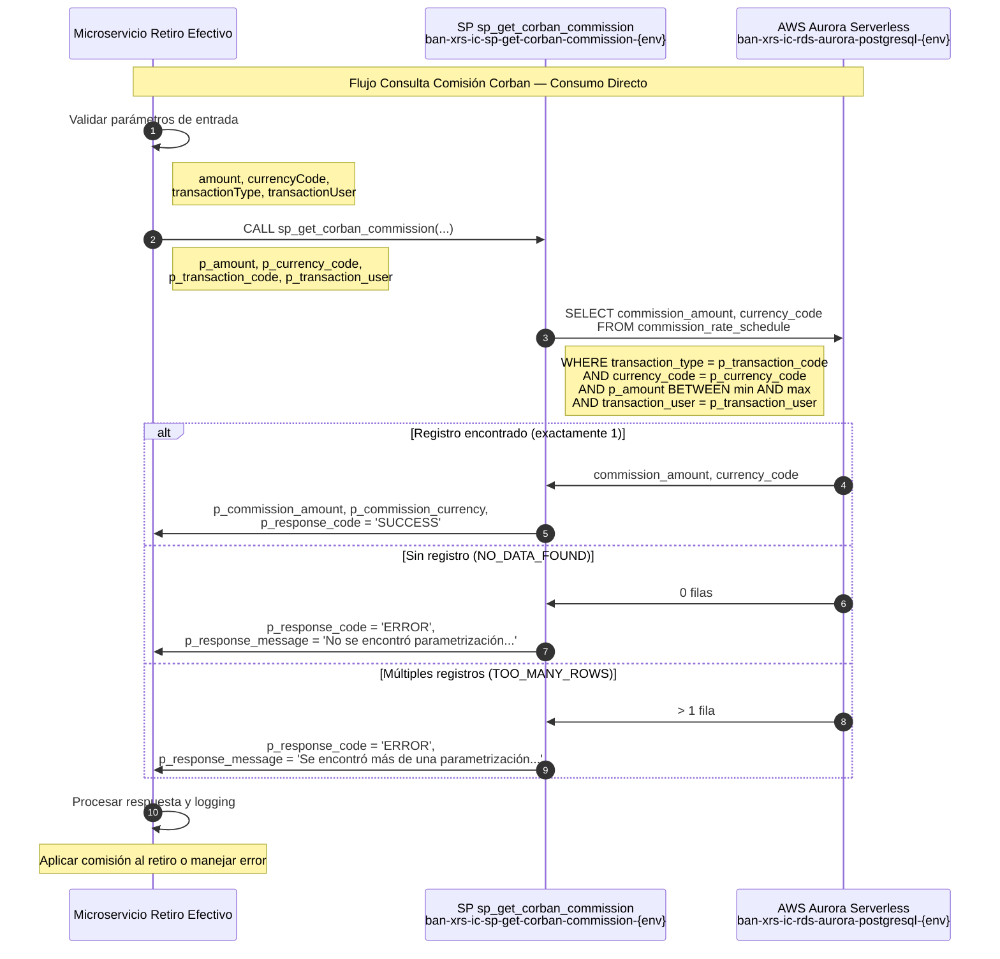

# Migración AWS Aurora — Consulta de Comisión Corban

## Control de Cambios

| Fecha | Versión | Cambio | Autor |
|-------|---------|--------|-------|
| 2026-04-30 | v1.0 | **Creación del Documento** | **David Julian Molano Peralta** |

[[_TOC_]]

---
## 1. Resumen Ejecutivo

Este documento describe la migración de la tabla Oracle (`MW_COMISIONES_CORBAN`) y su stored procedure asociado (`MW_P_CON_COMISION_CORBAN`) desde una base de datos Oracle hacia **AWS Aurora Serverless PostgreSQL**.

El proceso de migración incluye:
- Rediseño del esquema con nomenclatura **BIAN (Banking Industry Architecture Network)**
- Reescritura del stored procedure en **PL/pgSQL** (compatible con Aurora PostgreSQL)
- **Recomendación de NO usar Lambda** debido a que será consumido desde un único microservicio
- Definición de estrategia de manejo de errores y logging

| Componente Original | Componente AWS | Identificador |
|---|---|---|
| Oracle Schema `MIDDLEWARE` | Aurora PostgreSQL Schema `corbanManagement` | `ban-xrs-ic-rds-aurora-postgresql-{env}` |
| `MW_COMISIONES_CORBAN` | `commission_rate_schedule` | — |
| `MW_P_CON_COMISION_CORBAN` | `sp_get_corban_commission` | `ban-xrs-ic-sp-get-corban-commission-{env}` |

---

## 2. Mapeo de Nomenclatura BIAN

### 2.1 Tabla

| Nombre Original (Oracle) | Nombre BIAN (Aurora PostgreSQL) | Descripción |
|---|---|---|
| `MW_COMISIONES_CORBAN` | `commission_rate_schedule` | Parametrización de comisiones por tipo de transacción, rango de monto, moneda y usuario |

### 2.2 Campos — `MW_COMISIONES_CORBAN` → `commission_rate_schedule`

| Campo Original | Campo BIAN | Tipo Original | Tipo Aurora | Descripción |
|---|---|---|---|---|
| `TIPO_TRANSACCION` | `transaction_type` | `NUMBER` | `INTEGER` | Código de tipo de transacción Corban |
| `MONTO_MINIMO` | `minimum_amount` | `NUMBER` | `NUMERIC(18,2)` | Límite inferior del rango de monto aplicable |
| `MONTO_MAXIMO` | `maximum_amount` | `NUMBER` | `NUMERIC(18,2)` | Límite superior del rango de monto aplicable |
| `MONEDA` | `currency_code` | `VARCHAR2` | `VARCHAR(10)` | Código de moneda de la transacción (ej. HNL) |
| `COMISION` | `commission_amount` | `NUMBER` | `NUMERIC(18,2)` | Valor de la comisión a cobrar |
| `USUARIO_TRANSACCION` | `transaction_user` | `VARCHAR2` | `VARCHAR(50)` | Usuario o canal que origina la transacción |

### 2.3 Parámetros del Stored Procedure

| Parámetro Original | Parámetro BIAN | Dirección | Descripción |
|---|---|---|---|
| `Pv_MONTO` | `p_amount` | IN | Monto de la transacción a evaluar |
| `Pv_MONEDA` | `p_currency_code` | IN | Código de moneda de la transacción |
| `Pv_CODIGO_TRANSACCION` | `p_transaction_code` | IN | Tipo de transacción Corban |
| `Pv_USUARIO_TRANSACCION` | `p_transaction_user` | IN | Usuario o canal originador |
| `Pv_MONTO_COMISION` | `p_commission_amount` | OUT | Monto de comisión calculado |
| `Pv_MONEDA_COMISION` | `p_commission_currency` | OUT | Moneda en la que se expresa la comisión |
| `Pv_CODIGO_ERROR` | `p_response_code` | OUT | Código de respuesta: `SUCCESS` / `ERROR` |
| `Pv_MENSAJE_ERROR` | `p_response_message` | OUT | Mensaje descriptivo del resultado |

---

## 3. Modelo de Datos — AWS Aurora PostgreSQL

### 3.1 Tabla: `commission_rate_schedule`

```sql
Schema  : corbanManagement
Tabla   : commission_rate_schedule
PK      : (transaction_type, minimum_amount, maximum_amount, currency_code, transaction_user)
Índices : idx_crs_transaction_type, idx_crs_lookup
```

| Columna | Tipo | Nulo | PK | FK | Descripción |
|---|---|---|---|---|---|
| `transaction_type` | `INTEGER` | NO | PK | — | Código de tipo de transacción Corban |
| `minimum_amount` | `NUMERIC(18,2)` | NO | PK | — | Límite inferior del rango de monto |
| `maximum_amount` | `NUMERIC(18,2)` | NO | PK | — | Límite superior del rango de monto |
| `currency_code` | `VARCHAR(10)` | NO | PK | — | Código de moneda (ISO 4217, ej. HNL) |
| `commission_amount` | `NUMERIC(18,2)` | NO | — | — | Valor de la comisión a aplicar |
| `transaction_user` | `VARCHAR(50)` | NO | PK | — | Usuario o canal originador de la transacción |
| `created_at` | `TIMESTAMP` | NO | — | — | Fecha de creación del registro |
| `updated_at` | `TIMESTAMP` | YES | — | — | Fecha de última modificación |

---

## 4. Modelo Entidad-Relación

```
┌─────────────────────────────────────────────────────────────────────┐
│                       corbanManagement schema                       │
│                                                                     │
│  ┌──────────────────────────────────────────────────────────────┐   │
│  │               commission_rate_schedule                       │   │
│  ├──────────────────────────────────────────────────────────────┤   │
│  │ PK transaction_type                                          │   │
│  │ PK minimum_amount                                            │   │
│  │ PK maximum_amount                                            │   │
│  │ PK currency_code                                             │   │
│  │ PK transaction_user                                          │   │
│  │    commission_amount                                         │   │
│  │    created_at                                                │   │
│  │    updated_at                                                │   │
│  └──────────────────────────────────────────────────────────────┘   │
│                                                                     │
│  Tabla de parámetros - No relaciones FK                            │
└─────────────────────────────────────────────────────────────────────┘
```

**Cardinalidad:**
- Tabla de configuración/parametrización con registros únicos por combinación de tipo transacción, rango de monto, moneda y usuario
- Operaciones de solo lectura en tiempo de ejecución; la carga de datos es administrativa

---

## 5. Scripts DDL — Creación de Tablas

```sql
-- ============================================================
-- Schema
-- ============================================================
CREATE SCHEMA IF NOT EXISTS corbanManagement;

-- ============================================================
-- Tabla: commission_rate_schedule
-- Equivalente a: MW_COMISIONES_CORBAN
-- ============================================================
CREATE TABLE corbanManagement.commission_rate_schedule (
    transaction_type        INTEGER             NOT NULL,
    minimum_amount          NUMERIC(18,2)       NOT NULL,
    maximum_amount          NUMERIC(18,2)       NOT NULL,
    currency_code           VARCHAR(10)         NOT NULL,
    commission_amount       NUMERIC(18,2)       NOT NULL DEFAULT 0.00,
    transaction_user        VARCHAR(50)         NOT NULL,
    created_at              TIMESTAMP           NOT NULL DEFAULT NOW(),
    updated_at              TIMESTAMP,

    CONSTRAINT pk_commission_rate_schedule
        PRIMARY KEY (transaction_type, minimum_amount, maximum_amount, currency_code, transaction_user),

    CONSTRAINT chk_crs_amount_range
        CHECK (minimum_amount >= 0 AND maximum_amount > minimum_amount),

    CONSTRAINT chk_crs_commission_non_negative
        CHECK (commission_amount >= 0)
);

CREATE INDEX idx_crs_transaction_type
    ON corbanManagement.commission_rate_schedule (transaction_type);

CREATE INDEX idx_crs_lookup
    ON corbanManagement.commission_rate_schedule (transaction_type, currency_code, transaction_user);

COMMENT ON TABLE corbanManagement.commission_rate_schedule
    IS 'Parametrización de comisiones por tipo de transacción, rango de monto, moneda y usuario Corban. Migrado desde Oracle MW_COMISIONES_CORBAN.';

COMMENT ON COLUMN corbanManagement.commission_rate_schedule.transaction_type
    IS 'Código numérico del tipo de transacción Corban (ej. 4 = Retiro Efectivo).';
COMMENT ON COLUMN corbanManagement.commission_rate_schedule.minimum_amount
    IS 'Límite inferior del rango de monto para la aplicación de la comisión.';
COMMENT ON COLUMN corbanManagement.commission_rate_schedule.maximum_amount
    IS 'Límite superior del rango de monto para la aplicación de la comisión.';
COMMENT ON COLUMN corbanManagement.commission_rate_schedule.currency_code
    IS 'Código de moneda ISO 4217 al que aplica la parametrización (ej. HNL).';
COMMENT ON COLUMN corbanManagement.commission_rate_schedule.commission_amount
    IS 'Valor de la comisión a cobrar cuando el monto de la transacción cae en el rango definido.';
COMMENT ON COLUMN corbanManagement.commission_rate_schedule.transaction_user
    IS 'Usuario o canal originador de la transacción al que aplica la parametrización.';
```

---

## 6. Scripts DML — Carga Inicial de Datos

```sql
-- ============================================================
-- Carga inicial: commission_rate_schedule
-- Fuente: MW_COMISIONES_CORBAN.csv
-- ============================================================
INSERT INTO corbanManagement.commission_rate_schedule
    (transaction_type, minimum_amount, maximum_amount, currency_code, commission_amount, transaction_user, created_at)
VALUES
    (4, 100.00,   5000.00,  'HNL',  0.00, 'HNBNDSRCBT',        NOW()),
    (4, 5001.00,  10000.00, 'HNL',  0.00, 'HNBNDSRCBT',        NOW()),
    (4, 100.00,   5000.00,  'HNL',  0.00, 'SRV-ITINTB',        NOW()),
    (4, 5001.00,  10000.00, 'HNL',  0.00, 'SRV-ITINTB',        NOW()),
    (4, 100.00,   50000.00, 'HNL',  0.00, 'HNBNQACBT',         NOW()),
    (4, 100.00,   50000.00, 'HNL',  0.00, 'HNBNSVCTENGO',      NOW()),
    (4, 5001.00,  10000.00, 'HNL',  0.00, 'HNBNDSRCARDRECHA',  NOW()),
    (4, 100.00,   5000.00,  'HNL',  0.00, 'HNPRDRECTENGO',     NOW()),
    (4, 100.00,   5000.00,  'HNL',  0.00, 'HNBNDSRCARDRECHA',  NOW()),
    (4, 5001.00,  10000.00, 'HNL',  0.00, 'HNPRDRECTENGO',     NOW()),
    (4, 100.00,   5000.00,  'HNL', 50.00, 'HNQAOMNIW',         NOW());
```

---

## 7. Stored Procedure — AWS Aurora PostgreSQL

> **Nombre:** `sp_get_corban_commission`
> **Identificador AWS:** `ban-xrs-ic-sp-get-corban-commission-{env}`
> **Motor:** Aurora PostgreSQL — PL/pgSQL
> **Equivalente Oracle:** `MIDDLEWARE.MW_P_CON_COMISION_CORBAN`

```sql
-- ============================================================
-- SP: sp_get_corban_commission
-- Descripción: Consulta la comisión aplicable a una transacción
--              Corban según tipo de transacción, moneda, rango
--              de monto y usuario originador.
-- Autor migración: ficohsa-capa-media team
-- Fecha migración: 2026-04-30
-- Versión original Oracle: 1.0
-- ============================================================
CREATE OR REPLACE PROCEDURE corbanManagement.sp_get_corban_commission(
    -- Parámetros de entrada
    IN  p_amount                NUMERIC(18,2),
    IN  p_currency_code         VARCHAR(10),
    IN  p_transaction_code      INTEGER,
    IN  p_transaction_user      VARCHAR(50),
    -- Parámetros de salida
    OUT p_commission_amount     NUMERIC(18,2),
    OUT p_commission_currency   VARCHAR(10),
    OUT p_response_code         VARCHAR(10),
    OUT p_response_message      VARCHAR(500)
)
LANGUAGE plpgsql
AS $$
DECLARE
    v_commission_amount   NUMERIC(18,2);
    v_commission_currency VARCHAR(10);
BEGIN

    -- --------------------------------------------------------
    -- Validación parámetros de entrada
    -- --------------------------------------------------------
    IF p_amount IS NULL OR p_amount < 0 THEN
        p_response_code    := 'ERROR';
        p_response_message := 'ERROR: PARAMETRO p_amount DEBE SER MAYOR O IGUAL A CERO.';
        RETURN;
    END IF;

    IF p_currency_code IS NULL OR TRIM(p_currency_code) = '' THEN
        p_response_code    := 'ERROR';
        p_response_message := 'ERROR: PARAMETRO DE ENTRADA p_currency_code ES REQUERIDO.';
        RETURN;
    END IF;

    IF p_transaction_code IS NULL THEN
        p_response_code    := 'ERROR';
        p_response_message := 'ERROR: PARAMETRO DE ENTRADA p_transaction_code ES REQUERIDO.';
        RETURN;
    END IF;

    IF p_transaction_user IS NULL OR TRIM(p_transaction_user) = '' THEN
        p_response_code    := 'ERROR';
        p_response_message := 'ERROR: PARAMETRO DE ENTRADA p_transaction_user ES REQUERIDO.';
        RETURN;
    END IF;

    -- --------------------------------------------------------
    -- Consultar parametrización de comisión
    -- --------------------------------------------------------
    BEGIN
        SELECT commission_amount, currency_code
          INTO STRICT v_commission_amount, v_commission_currency
          FROM corbanManagement.commission_rate_schedule
         WHERE transaction_type = p_transaction_code
           AND currency_code    = p_currency_code
           AND p_amount BETWEEN minimum_amount AND maximum_amount
           AND transaction_user = p_transaction_user;

    EXCEPTION
        WHEN NO_DATA_FOUND THEN
            p_response_code    := 'ERROR';
            p_response_message := 'No se encontró parametrización de comisión para el tipo de transacción '
                                  || p_transaction_code
                                  || ' moneda ' || p_currency_code
                                  || ' y monto ' || p_amount;
            RETURN;
        WHEN TOO_MANY_ROWS THEN
            p_response_code    := 'ERROR';
            p_response_message := 'Se encontró más de una parametrización de comisión para el tipo de transacción '
                                  || p_transaction_code
                                  || ' moneda ' || p_currency_code
                                  || ' y monto ' || p_amount;
            RETURN;
        WHEN OTHERS THEN
            p_response_code    := 'ERROR';
            p_response_message := 'ERROR EN CONSULTA COMISION: ' || SQLERRM;
            RETURN;
    END;

    -- --------------------------------------------------------
    -- Respuesta exitosa
    -- --------------------------------------------------------
    p_commission_amount   := v_commission_amount;
    p_commission_currency := v_commission_currency;
    p_response_code       := 'SUCCESS';
    p_response_message    := '';

EXCEPTION
    WHEN OTHERS THEN
        p_response_code    := 'ERROR';
        p_response_message := 'ERROR GENERAL SP sp_get_corban_commission: ' || SQLERRM;
END;
$$;

-- Permisos de ejecución
GRANT EXECUTE ON PROCEDURE corbanManagement.sp_get_corban_commission(
    NUMERIC, VARCHAR, INTEGER, VARCHAR,
    OUT NUMERIC, OUT VARCHAR, OUT VARCHAR, OUT VARCHAR
) TO corban_microservice_role;
```

---

## 8. Decisión de Arquitectura: ¿Lambda o Consumo Directo?

### 8.1 Análisis del Contexto

**Características del caso de uso:**
- **Un único microservicio consumidor** (no múltiples APIs externas)
- **Operación de consulta pura** (SELECT sin escritura — solo lectura de parámetros)
- **Modelo de datos sencillo** (una sola tabla de parametrización, sin relaciones complejas)
- **Lógica de negocio mínima** (lookup por clave compuesta)

### 8.2 Comparación de Arquitecturas

#### Opción A: Con Lambda (NO recomendada)

```
┌─────────────────┐    REST/HTTPS    ┌──────────────┐    pool TCP    ┌──────────────────────────┐
│ Microservicio   │ ───────────────► │ Lambda       │ ─────────────► │  Aurora PostgreSQL        │
│ Retiro Efectivo │    JSON          │ (wrapper)    │    CALL sp..   │  sp_get_corban_commission │
└─────────────────┘                  └──────────────┘                └──────────────────────────┘
```

**Desventajas:**
- **Latencia adicional**: HTTP round-trip + cold start Lambda
- **Complejidad innecesaria**: Wrapper que no agrega valor
- **Costos adicionales**: Invocaciones Lambda + API Gateway
- **Punto de falla extra**: Lambda puede fallar independientemente del SP

#### Opción B: Consumo Directo (RECOMENDADA)

```
┌─────────────────┐    conexión pool    ┌──────────────────────────┐
│ Microservicio   │ ──────────────────► │  Aurora PostgreSQL        │
│ Retiro Efectivo │    CALL sp_get...   │  sp_get_corban_commission │
└─────────────────┘                     └──────────────────────────┘
```

**Ventajas:**
- **Menor latencia**: Conexión directa sin intermediarios
- **Simplicidad**: Menos componentes = menos puntos de falla
- **Menor costo**: Sin costos de Lambda ni API Gateway
- **Control total**: El microservicio maneja su propio pool de conexiones y retry logic

### 8.3 Recomendación Final

> **RECOMENDACIÓN: NO usar Lambda**
>
> Para este caso específico, la Lambda actuaría como un **wrapper innecesario** que agrega complejidad sin beneficios. El microservicio debe consumir directamente el stored procedure desde Aurora PostgreSQL.

### 8.4 Implementación Recomendada en el Microservicio

```javascript
// Ejemplo de implementación en Node.js
const { Pool } = require('pg');

class CorbanCommissionService {
    constructor() {
        this.pool = new Pool({
            host: process.env.AURORA_HOST,
            port: 5432,
            database: 'corban_db',
            user: process.env.DB_USER,
            password: process.env.DB_PASSWORD,
            max: 10, // máximo 10 conexiones en el pool
            idleTimeoutMillis: 30000,
            connectionTimeoutMillis: 2000,
        });
    }

    async getCorbanCommission(amount, currencyCode, transactionType, transactionUser) {
        const client = await this.pool.connect();
        try {
            const result = await client.query(
                'CALL corbanManagement.sp_get_corban_commission($1, $2, $3, $4, $5, $6, $7, $8)',
                [amount, currencyCode, transactionType, transactionUser, null, null, null, null]
            );

            const row = result.rows[0];

            if (row.p_response_code === 'SUCCESS') {
                return {
                    success: true,
                    commissionAmount: row.p_commission_amount,
                    commissionCurrency: row.p_commission_currency
                };
            } else {
                return { success: false, error: row.p_response_message };
            }
        } finally {
            client.release();
        }
    }
}
```

---

## 9. Manejo de Errores del Stored Procedure

### 9.1 Tabla de Códigos de Error

| Código Error | Origen | Causa | Acción Recomendada |
|---|---|---|---|
| `SUCCESS` | SP | Operación exitosa, comisión encontrada | Continuar flujo normal con el monto retornado |
| `ERROR: PARAMETRO p_amount DEBE SER MAYOR O IGUAL A CERO` | SP | `p_amount` nulo o negativo | Validar monto en microservicio antes de llamar |
| `ERROR: PARAMETRO DE ENTRADA p_currency_code ES REQUERIDO` | SP | `p_currency_code` nulo o vacío | Validar moneda en microservicio |
| `ERROR: PARAMETRO DE ENTRADA p_transaction_code ES REQUERIDO` | SP | `p_transaction_code` nulo | Validar tipo de transacción en microservicio |
| `ERROR: PARAMETRO DE ENTRADA p_transaction_user ES REQUERIDO` | SP | `p_transaction_user` nulo o vacío | Validar usuario en microservicio |
| `No se encontró parametrización de comisión...` | SP | Sin registro en `commission_rate_schedule` para los criterios | Revisar datos de parametrización; el rango de monto puede no estar cubierto |
| `Se encontró más de una parametrización de comisión...` | SP | Más de un registro coincide con los criterios | Revisar y corregir solapamiento de rangos en la tabla de parametrización |
| `ERROR EN CONSULTA COMISION` | SP | Error inesperado en el SELECT | Revisar conectividad y permisos DB |
| `ERROR GENERAL SP sp_get_corban_commission` | SP | Error inesperado no controlado | Revisar logs Aurora y estructura de datos |

---

## 10. Diagrama de Secuencia



---

## 11. Consideraciones de Migración

### 11.1 Diferencias Oracle → Aurora PostgreSQL

| Aspecto | Oracle PL/SQL | Aurora PostgreSQL PL/pgSQL |
|---|---|---|
| Tipo de dato para monto | `NUMBER` implícito | `NUMERIC(18,2)` explícito |
| Parámetro de monto | `VARCHAR2` (string) — conversión implícita en BETWEEN | `NUMERIC(18,2)` — tipo correcto desde la firma |
| SELECT INTO único | `SELECT INTO` (lanza `NO_DATA_FOUND` / `TOO_MANY_ROWS`) | `SELECT INTO STRICT` — comportamiento equivalente explícito |
| Captura de `TOO_MANY_ROWS` | `WHEN OTHERS` (no diferenciado) | `WHEN TOO_MANY_ROWS` — excepción específica |
| Variables locales | `Ln_`, `Lv_` prefijos Oracle | `v_` prefijo PL/pgSQL |
| `SQLERRM` | Sí | `SQLERRM` disponible |
| Parámetros OUT | Por referencia | Por referencia (igual) |

### 11.2 Mejoras Implementadas en la Migración

| Mejora | Descripción | Beneficio |
|---|---|---|
| **Tipo de dato correcto para monto** | Parámetro `p_amount` como `NUMERIC(18,2)` en lugar de `VARCHAR2` | Elimina conversión implícita y errores de parseo |
| **Excepción diferenciada** | `WHEN TOO_MANY_ROWS` separada de `WHEN OTHERS` | Mensajes de error más precisos para diagnóstico |
| **`SELECT INTO STRICT`** | Uso explícito de `STRICT` para garantir unicidad | Comportamiento equivalente al Oracle, más legible |
| **Validaciones de entrada** | Verificación de parámetros nulos y valores inválidos | Prevención de errores y mensajes descriptivos |
| **Constraints de tabla** | `CHECK` para rangos y comisión no negativa | Integridad de datos a nivel DB |
| **Índice compuesto de lookup** | Índice sobre `(transaction_type, currency_code, transaction_user)` | Performance mejorada en las consultas del SP |
| **Nomenclatura BIAN** | Nombres de campos alineados con estándares bancarios | Consistencia arquitectónica |

### 11.3 Datos de Migración

**Tabla original:** Contiene 11 registros de parametrización activos en el CSV fuente.

```csv
"TIPO_TRANSACCION","MONTO_MINIMO","MONTO_MAXIMO","MONEDA","COMISION","USUARIO_TRANSACCION"
4,100,5000,HNL,0,HNBNDSRCBT
4,5001,10000,HNL,0,HNBNDSRCBT
...
4,100,5000,HNL,50,HNQAOMNIW
```

**Observaciones de los datos:**
- Todos los registros corresponden a `TIPO_TRANSACCION = 4` (Retiro Efectivo)
- Moneda única: `HNL` (Lempira hondureño)
- La mayoría de usuarios tienen comisión `0`; el usuario `HNQAOMNIW` tiene comisión de `50 HNL` para montos entre 100 y 5000

**Estrategia de migración:**
1. **Crear esquema y tabla** con estructura mejorada
2. **Cargar datos existentes** mediante el script DML de la sección 6
3. **Validar integridad** con queries de verificación
4. **Probar SP** con casos de prueba completos

### 11.4 Script de Migración de Datos

```sql
-- Script para migrar datos desde Oracle (alternativa vía dblink o ETL)
INSERT INTO corbanManagement.commission_rate_schedule
    (transaction_type, minimum_amount, maximum_amount, currency_code, commission_amount, transaction_user, created_at)
SELECT
    TIPO_TRANSACCION,
    CAST(MONTO_MINIMO AS NUMERIC(18,2)),
    CAST(MONTO_MAXIMO AS NUMERIC(18,2)),
    MONEDA,
    CAST(COMISION AS NUMERIC(18,2)),
    USUARIO_TRANSACCION,
    NOW()
FROM oracle_source.MW_COMISIONES_CORBAN;
```

---

## 12. Testing y Validación

### 12.1 Casos de Prueba del SP

| Caso | Entrada | Resultado Esperado |
|---|---|---|
| **Comisión encontrada — monto bajo, usuario HNBNDSRCBT** | amount=500, currency='HNL', type=4, user='HNBNDSRCBT' | commission_amount=0, response_code='SUCCESS' |
| **Comisión encontrada — monto alto, usuario HNBNDSRCBT** | amount=6000, currency='HNL', type=4, user='HNBNDSRCBT' | commission_amount=0, response_code='SUCCESS' |
| **Comisión no cero — usuario HNQAOMNIW** | amount=1000, currency='HNL', type=4, user='HNQAOMNIW' | commission_amount=50, response_code='SUCCESS' |
| **Sin parametrización — usuario inexistente** | amount=500, currency='HNL', type=4, user='USUARIO_INEXISTENTE' | response_code='ERROR', mensaje NO_DATA_FOUND |
| **Sin parametrización — monto fuera de rango** | amount=99, currency='HNL', type=4, user='HNBNDSRCBT' | response_code='ERROR', mensaje NO_DATA_FOUND |
| **Moneda inválida** | currency='USD', type=4, user='HNBNDSRCBT' | response_code='ERROR', mensaje NO_DATA_FOUND |
| **Monto nulo** | amount=NULL | response_code='ERROR', mensaje de validación |
| **Usuario vacío** | user='' | response_code='ERROR', mensaje de validación |
| **Tipo de transacción nulo** | type=NULL | response_code='ERROR', mensaje de validación |

### 12.2 Queries de Validación Post-Migración

```sql
-- Verificar total de registros migrados
SELECT COUNT(*) FROM corbanManagement.commission_rate_schedule;
-- Esperado: 11

-- Verificar distribución por usuario
SELECT transaction_user, COUNT(*) AS registros, SUM(commission_amount) AS total_comision
  FROM corbanManagement.commission_rate_schedule
 GROUP BY transaction_user
 ORDER BY transaction_user;

-- Verificar que no existan solapamientos de rangos por usuario
SELECT a.transaction_user, a.minimum_amount, a.maximum_amount,
       b.minimum_amount AS b_min, b.maximum_amount AS b_max
  FROM corbanManagement.commission_rate_schedule a
  JOIN corbanManagement.commission_rate_schedule b
    ON a.transaction_type  = b.transaction_type
   AND a.currency_code     = b.currency_code
   AND a.transaction_user  = b.transaction_user
   AND a.minimum_amount   <> b.minimum_amount
   AND a.minimum_amount BETWEEN b.minimum_amount AND b.maximum_amount;
-- Esperado: 0 filas (sin solapamientos)
```

---

## 13. Repositorio y Despliegue

| Ambiente | Repositorio | Rama | Observación |
|----------|-------------|------|-------------|
| Dev | `fn-ic-get_corban_commission-sys` | [Repositorio Azure](https://dev.azure.com/DevopsFicohsa/NOVA%20-%20Modernizaci%C3%B3n%20Capa%20Integraci%C3%B3n/_git/fn-ic-get_corban_commission-sys) | `develop` | Desarrollo activo |

---

## 14. Conclusiones y Recomendaciones

### 14.1 Decisiones Clave

1. **NO usar Lambda**: El microservicio debe consumir directamente el SP para minimizar latencia y complejidad
2. **Corregir tipo de dato del monto**: Cambiar de `VARCHAR2` a `NUMERIC(18,2)` para el parámetro de entrada `p_amount`
3. **Diferenciar excepciones**: Separar `TOO_MANY_ROWS` de `OTHERS` para mensajes de error más precisos
4. **Usar `SELECT INTO STRICT`**: Equivalente explícito al comportamiento Oracle para unicidad de resultado
5. **Agregar índice compuesto**: Optimizar la consulta de lookup por los campos más usados en el WHERE

### 14.2 Beneficios de la Migración

- **Performance mejorada**: Aurora Serverless v2 con escalado automático e índice de lookup optimizado
- **Integridad de datos**: Constraints y tipos correctos eliminan conversiones implícitas
- **Observabilidad**: Mensajes de error diferenciados facilitan el diagnóstico operativo
- **Mantenibilidad**: Código PL/pgSQL más legible y explícito que el original Oracle
- **Costos optimizados**: Sin componentes intermedios innecesarios

### 14.3 Próximos Pasos

1. **Crear esquema y tabla** en Aurora PostgreSQL con el DDL de la sección 5
2. **Cargar datos de parametrización** con el DML de la sección 6
3. **Ejecutar queries de validación** de la sección 12.2 para verificar integridad
4. **Implementar y probar SP** con los casos de prueba de la sección 12.1
5. **Actualizar microservicio** para consumir el nuevo SP directamente
6. **Monitorear performance** y ajustar configuraciones según sea necesario
