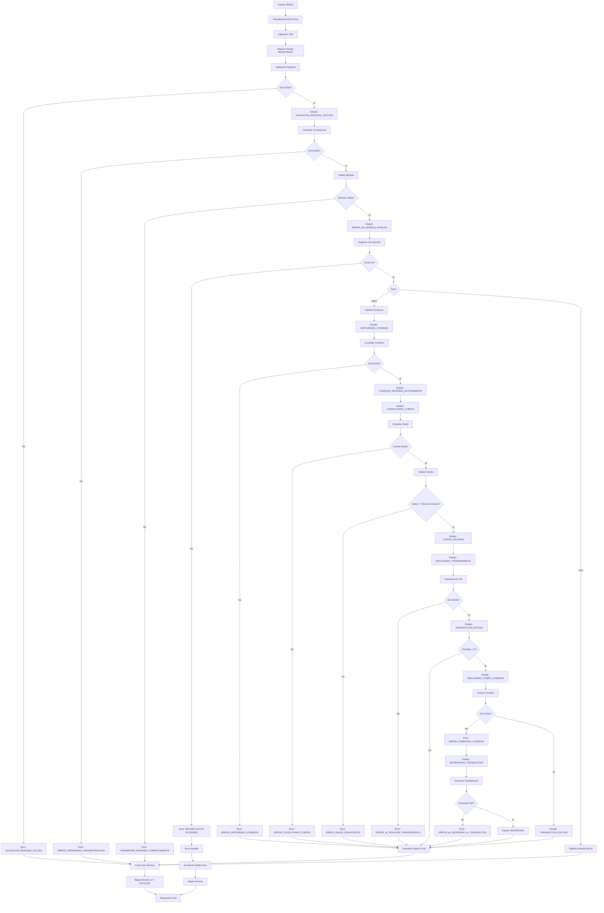

# Análisis Técnico: RetiroEfectivoCBS

## Resumen Ejecutivo

El servicio **RetiroEfectivoCBS** (FICBCO0218$0265) es un servicio regional multi-core que permite realizar retiros de efectivo a través de corresponsales bancarios (TENGO). Implementa un patrón de servicio con lógica compleja que incluye validaciones de saldo, cálculo de comisiones, ejecución de transferencias y manejo de reversiones automáticas.

## Arquitectura del Servicio

### Patrón de Diseño
- **Tipo**: Servicio Regional Multi-Core con Lógica Compleja
- **Versión**: V2
- **Protocolo**: SOAP/HTTP
- **Seguridad**: Custom Token Authentication (Username/Password en header)

### Flujo de Ejecución



**Descripción del Flujo:**

**Pipeline Validaciones (Request):**
1. Validación XSD contra retiroEfectivoCBTypes.xsd
2. Registro estado inicial: REGISTRADO
3. Validación regional con serviceId FICBCO0218
4. Consulta parametrización corresponsal (tipo transacción '4')
5. Validación moneda permitida
6. Registro uso servicio (operación "1" - apertura)

**Branch Regionalización:**
- **HN01**: Ejecuta pipeline completo
- **Default**: Pipeline vacío (sin procesamiento)

**Pipeline HN01 (Request) - Solo Honduras:**
7. Consulta comisión (código transacción '4')
8. Consulta saldo cuenta
9. Validación fondos suficientes (monto + comisión)
10. Transferencia principal T24
11. Cobro comisión (condicional si > 0)
12. Reversión automática si falla comisión
13. Actualización estado final

**Pipeline HN01 (Response):**
14. Construcción respuesta con datos cuenta y comisión

**Pipeline Validaciones (Response):**
15. Cierre uso servicio (operación "2")
16. Mapeo errores si successIndicator != SUCCESS

**Error Handler:**
17. Actualización estado con error actual
18. Mapeo errores
19. Respuesta con body vacío

## Servicios Dependientes

### 1. registraEstadoTransaccion_db
- **Propósito**: Registrar el estado inicial de la transacción TENGO en la base de datos
- **Parámetros**: tipoTransaccion='1', estadoTransaccion='REGISTRADO', codigoCanal='1', retiroEfectivoCB, HeaderCB
- **Respuesta**: Confirmación de registro
- **Validación**: Se ejecuta al inicio del flujo antes de cualquier validación

### 2. ValidaServicioRegional_db
- **Propósito**: Validar que el servicio esté disponible para la región solicitada
- **Parámetros**: serviceId="FICBCO0218", requestHeader
- **Respuesta**: PV_CODIGO_ERROR (SUCCESS o código de error), PV_MENSAJE_ERROR
- **Validación**: Si no es SUCCESS, se detiene el flujo y se retorna error

### 3. consultarCorresponsalB_db
- **Propósito**: Obtener la parametrización del corresponsal bancario
- **Parámetros**: bankingCorrespId, transactionType='4', sourceBank
- **Respuesta**: PV_CODIGO_MENSAJE, PV_CUENTA_DEBITO, PV_MONEDA_PERMITIDA, PV_TIPO_TRANSACCION, PV_CUENTA_CREDITO
- **Validación**: Valida que la moneda de la transacción coincida con la moneda permitida

### 4. registrarUsoServicio_db
- **Propósito**: Registrar el uso del servicio y validar cuota
- **Parámetros**: idServicio, idUsuario, bancoOrigen, operacion="1" (request) / "2" (response)
- **Respuesta**: PN_CODIGO_ERROR (0=OK, otro=cuota excedida)
- **Validación**: Si código != 0, se genera error MW-0001 SERVICE QUOTA EXCEEDED

### 5. consultaComisionesCB_db
- **Propósito**: Calcular el monto de la comisión a cobrar
- **Parámetros**: codigoTransaccion='4', retiroEfectivo, usuarioTransaccion
- **Respuesta**: PV_CODIGO_ERROR, PV_MONTO_COMISION
- **Validación**: Si no es SUCCESS, se detiene el flujo

### 6. consultaCuentasBS (Consultadesaldodecuenta)
- **Propósito**: Consultar saldo disponible y detalles de la cuenta
- **Parámetros**: requestHeader, retiroEfectivo (ACCOUNT_NUMBER)
- **Respuesta**: WSFICOACCTBASICDETAILSType con AVAILBALANCE
- **Validación**: Valida que count > 0 (cuenta existe) y saldo disponible >= (monto + comisión)

### 7. svcRegistraTransaccionTengo (RetiroEfectivoTengo)
- **Propósito**: Ejecutar la transferencia principal del retiro en T24
- **Parámetros**: tipoTrxT24, retiroEfectivoREQ, cuentaCreditoT24, HeaderCB
- **Respuesta**: Status con successIndicator, transactionId, messages
- **Validación**: Si successIndicator != SUCCESS, se detiene el flujo

### 8. transferenciasBS (Transfmodelbankentrecuentas)
- **Propósito**: Ejecutar la transferencia de comisión
- **Parámetros**: retiroEfectivo, requestHeader, originalTransaction, tipoTransaccionComision, cuentacomision, outputParameters1 (comisión)
- **Respuesta**: Status con successIndicator, transactionId
- **Validación**: Si falla, se reversa la transferencia principal

### 9. ReversarTransaccion
- **Propósito**: Reversar la transferencia principal si falla el cobro de comisión
- **Parámetros**: transactionId (de la transferencia principal)
- **Respuesta**: ResponseHeader con successIndicator
- **Validación**: Si falla la reversión, se registra el error pero no se detiene el flujo

### 10. actualizaEstadoTransaccion_db
- **Propósito**: Actualizar el estado final de la transacción
- **Parámetros**: FT (transactionId), tipoTransaccion='RETIRO', codigoOperacion, estadoTransaccion, tipoActualizacion='TENGO', tipoConsulta=1
- **Respuesta**: Confirmación de actualización
- **Validación**: Se ejecuta al final del flujo exitoso

### 11. MapeoErrores
- **Propósito**: Mapear códigos de error a mensajes estandarizados
- **Parámetros**: CODIGO_ERROR, MENSAJE_ERROR (formato: "FICBCO0218$#$mensaje")
- **Respuesta**: mapeoErroresResponse con código y mensaje mapeados
- **Validación**: Se ejecuta en el response pipeline si successIndicator != SUCCESS

## Transformaciones de Datos

### Procesamiento por País

| País | Código | Descripción Lógica | XQuery Request | XQuery Response |
|-------|--------|-------------------|----------------|-----------------|
| Honduras | HN01 | Flujo completo con validaciones, consultas, transferencias y reversión | Ver tabla detallada abajo | Ver tabla detallada abajo |
| Default | N/A | Pipeline básico vacío sin procesamiento específico | N/A | N/A |

### Archivos XQuery por Etapa del Flujo

#### Pipeline Validaciones (Request)

| Etapa | Archivo XQuery | Propósito |
|-------|----------------|----------|
| Registro Estado Inicial | MasterNuevo/Middleware/v2/Resources/RetiroEfectivoCBS/xq/registraEstadoTransaccion.xq | Construye request para registrar estado inicial REGISTRADO |
| Validación Regional | MasterNuevo/Middleware/v2/Resources/Generales/xq/validaServicioRegionalIn.xq | Construye request para validar servicio regional |
| Aplicar Valores Default | MasterNuevo/Middleware/v2/Resources/Generales/xq/aplicarValoresPorDefectoRegionCB.xq | Aplica valores por defecto según región |
| Consultar Corresponsal | MasterNuevo/Middleware/v2/Resources/Genericos/consultarCorresponsalBIn.xq | Construye request para consultar parametrización corresponsal |
| Registrar Uso Servicio | MasterNuevo/Middleware/Business_Resources/general/UsoServicio/registroUsoServicioIn.xq | Construye request para registrar uso servicio (apertura) |

#### Pipeline Validaciones (Response)

| Etapa | Archivo XQuery | Propósito |
|-------|----------------|----------|
| Cerrar Uso Servicio | MasterNuevo/Middleware/Business_Resources/general/UsoServicio/registroUsoServicioIn.xq | Construye request para cerrar uso servicio (operación "2") |
| Mapeo Errores In | MasterNuevo/Middleware/v2/Resources/MapeoErrores/xq/mapeoErroresUsageIn.xq | Construye request para mapear errores |
| Mapeo Errores Out | MasterNuevo/Middleware/v2/Resources/MapeoErrores/xq/mapeoErroresUsageOut.xq | Transforma response de mapeo errores a header |

#### Pipeline HN01 (Request) - Solo Honduras

| Etapa | Archivo XQuery | Propósito |
|-------|----------------|----------|
| Consulta Comisión | MasterNuevo/Middleware/v2/Resources/RetiroEfectivoCBS/xq/consultaComisionesCBIn.xq | Construye request para consultar comisión a cobrar |
| Consulta Saldo Cuenta | MasterNuevo/Middleware/v2/Resources/RetiroEfectivoCBS/xq/retiroEfectivoConsultaSaldoCuentaIn.xq | Construye request para consultar saldo disponible |
| Transferencia T24 | MasterNuevo/Middleware/v2/Resources/RetiroEfectivoCBS/xq/retiroEfectivoTengoT24In.xq | Construye request para transferencia principal en T24 |
| Transferencia Comisión | MasterNuevo/Middleware/v2/Resources/RetiroEfectivoCBS/xq/retiroEfectivoTransferenciaCuentasComisionIn.xq | Construye request para cobro de comisión |
| Reversión | MasterNuevo/Middleware/Business_Resources/pagoPrestamo/reversarTransaccion/reversarTransaccionIn.xq | Construye request para reversar transferencia |
| Actualizar Estado Final | MasterNuevo/Middleware/v2/Resources/RetiroEfectivoCBS/xq/actualizaEstadoTransaccion.xq | Construye request para actualizar estado final |

#### Pipeline HN01 (Response) - Solo Honduras

| Etapa | Archivo XQuery | Propósito |
|-------|----------------|----------|
| Header Response | MasterNuevo/Middleware/v2/Resources/RetiroEfectivoCBS/xq/retiroEfectivoHeaderOut.xq | Construye header de respuesta con successIndicator, messages, transactionId |
| Body Response | MasterNuevo/Middleware/v2/Resources/RetiroEfectivoCBS/xq/retiroEfectivoOut.xq | Construye body de respuesta con datos cuenta y comisión |

#### Error Handler

| Etapa | Archivo XQuery | Propósito |
|-------|----------------|----------|
| Actualizar Estado Error | MasterNuevo/Middleware/v2/Resources/RetiroEfectivoCBS/xq/actualizaEstadoTransaccion.xq | Actualiza estado con error actual |
| Mapeo Errores In | MasterNuevo/Middleware/v2/Resources/MapeoErrores/xq/mapeoErroresUsageIn.xq | Construye request para mapear error |
| Mapeo Errores Out | MasterNuevo/Middleware/v2/Resources/MapeoErrores/xq/mapeoErroresUsageOut.xq | Transforma response de mapeo a header |

## Conexiones por País

### Honduras (HN01)
```xml
<!-- HTTP - Consulta Saldo Cuenta -->
<service>consultaCuentasBS</service>
<endpoint>[ENDPOINT_CONSULTA_CUENTAS_HN01]</endpoint>
<operation>Consultadesaldodecuenta</operation>
<!-- Autenticación: Custom Token Authentication (Username/Password en header) -->

<!-- HTTP - Transferencia Principal T24 -->
<service>svcRegistraTransaccionTengo</service>
<endpoint>[ENDPOINT_T24_TENGO_HN01]</endpoint>
<operation>RetiroEfectivoTengo</operation>
<!-- Autenticación: Custom Token Authentication (Username/Password en header) -->

<!-- HTTP - Transferencia Comisión -->
<service>transferenciasBS</service>
<endpoint>[ENDPOINT_TRANSFERENCIAS_HN01]</endpoint>
<operation>Transfmodelbankentrecuentas</operation>
<!-- Autenticación: Custom Token Authentication (Username/Password en header) -->

<!-- JCA - Base de Datos Middleware -->
<service>consultaComisionesCB_db</service>
<connection>[CONNECTION_MIDDLEWARE]</connection>
<operation>consultaComisionesCB</operation>

<!-- JCA - Base de Datos Middleware -->
<service>consultarCorresponsalB_db</service>
<connection>[CONNECTION_MIDDLEWARE]</connection>
<operation>consultarCorresponsalB</operation>

<!-- JCA - Base de Datos Middleware -->
<service>ValidaServicioRegional_db</service>
<connection>[CONNECTION_MIDDLEWARE]</connection>
<operation>ValidaServicioRegional</operation>

<!-- JCA - Base de Datos Middleware -->
<service>registrarUsoServicio_db</service>
<connection>[CONNECTION_MIDDLEWARE]</connection>
<operation>registrarUsoServicio</operation>

<!-- JCA - Base de Datos Middleware -->
<service>registraEstadoTransaccion_db</service>
<connection>[CONNECTION_MIDDLEWARE]</connection>
<operation>registraEstadoTransaccion</operation>

<!-- JCA - Base de Datos Middleware -->
<service>actualizaEstadoTransaccion_db</service>
<connection>[CONNECTION_MIDDLEWARE]</connection>
<operation>actualizaEstadoTransaccion</operation>
```

## Validación XSD

### Información General
- **Esquema XSD**: retiroEfectivoCBTypes.xsd
- **Namespace**: http://www.ficohsa.com.hn/middleware.services/retiroEfectivoCBTypes
- **Versión**: 1.0

### Archivos de Esquema

#### Ubicación
- **XSD Principal**: `MasterNuevo/Middleware/v2/Resources/RetiroEfectivoCBS/xsd/retiroEfectivoCBTypes.xsd`
- **WSDL**: `MasterNuevo/Middleware/v2/Resources/RetiroEfectivoCBS/wsdl/retiroEfectivoCB_PS.wsdl`
- **Headers**: `MasterNuevo/Middleware/v2/esquemas_generales/HeaderElementsCB.xsd`

#### Dependencias
- **Namespace http://www.ficohsa.com.hn/middleware.services/autType**: Para headers de autenticación (RequestHeader/ResponseHeader)
- **Namespace http://www.ficohsa.com.hn/middleware.services/retiroEfectivoCBTypes**: Para tipos de datos del servicio

### Estructura del Request

#### Definición XSD Request
```xml
<xs:element name="retiroEfectivo">
    <xs:complexType>
        <xs:sequence>
            <xs:element name="ACCOUNT_NUMBER" type="xs:string" minOccurs="1" maxOccurs="1"/>
            <xs:element name="CURRENCY" type="xs:string" minOccurs="1" maxOccurs="1"/>
            <xs:element name="AMOUNT" type="xs:string" minOccurs="1" maxOccurs="1"/>
            <xs:element name="TOKEN_ID" type="xs:string" minOccurs="1" maxOccurs="1"/>
            <xs:element name="TRANSACTION_ID_CB" type="xs:string" minOccurs="1" maxOccurs="1"/>
        </xs:sequence>
    </xs:complexType>
</xs:element>
```

#### Ejemplo de Request Válido
> **Nota:** Los siguientes son datos de ejemplo no reales, utilizados únicamente para propósitos de testing y documentación.

```xml
<retiroEfectivo xmlns="http://www.ficohsa.com.hn/middleware.services/retiroEfectivoCBTypes">
    <ACCOUNT_NUMBER>1234567890</ACCOUNT_NUMBER>
    <CURRENCY>HNL</CURRENCY>
    <AMOUNT>500.00</AMOUNT>
    <TOKEN_ID>TKN123456789</TOKEN_ID>
    <TRANSACTION_ID_CB>CB20240101001</TRANSACTION_ID_CB>
</retiroEfectivo>
```

### Estructura del Response

#### Definiciones XSD Completas

##### Response Principal
```xml
<xs:element name="retiroEfectivoResponse" type="ret:retiroEfectivoResponseType">
</xs:element>

<xs:complexType name="retiroEfectivoResponseType">
    <xs:sequence>
        <xs:element name="ACCOUNT_NUMBER" type="xs:string" minOccurs="0" maxOccurs="1"/>
        <xs:element name="AMOUNT" type="xs:string" minOccurs="0" maxOccurs="1"/>
        <xs:element name="CURRENCY" type="xs:string" minOccurs="0" maxOccurs="1"/>
        <xs:element name="ACCOUNT_NAME" type="xs:string" minOccurs="0" maxOccurs="1"/>
        <xs:element name="TOKEN_ID" type="xs:string" minOccurs="0" maxOccurs="1"/>
        <xs:element name="COMMISION_AMOUNT" type="xs:string" minOccurs="0" maxOccurs="1"/>
    </xs:sequence>
</xs:complexType>
```

### Ejemplo de Response Válido

> **Nota:** Los siguientes son datos de ejemplo no reales, utilizados únicamente para propósitos de testing y documentación.

```xml
<retiroEfectivoResponse xmlns="http://www.ficohsa.com.hn/middleware.services/retiroEfectivoCBTypes">
    <ACCOUNT_NUMBER>1234567890</ACCOUNT_NUMBER>
    <AMOUNT>500.00</AMOUNT>
    <CURRENCY>HNL</CURRENCY>
    <ACCOUNT_NAME>JUAN PEREZ</ACCOUNT_NAME>
    <TOKEN_ID>TKN123456789</TOKEN_ID>
    <COMMISION_AMOUNT>10.00</COMMISION_AMOUNT>
</retiroEfectivoResponse>
```

### Casos de Error XSD

#### Request Inválido - Campo Faltante
> **Nota:** Los siguientes son datos de ejemplo no reales, utilizados únicamente para propósitos de testing y documentación.

```xml
<!-- ERROR: Falta ACCOUNT_NUMBER (requerido) -->
<retiroEfectivo xmlns="http://www.ficohsa.com.hn/middleware.services/retiroEfectivoCBTypes">
    <!-- ACCOUNT_NUMBER faltante -->
    <CURRENCY>HNL</CURRENCY>
    <AMOUNT>500.00</AMOUNT>
    <TOKEN_ID>TKN123456789</TOKEN_ID>
    <TRANSACTION_ID_CB>CB20240101001</TRANSACTION_ID_CB>
</retiroEfectivo>
```

#### Request Inválido - Namespace Incorrecto
> **Nota:** Los siguientes son datos de ejemplo no reales, utilizados únicamente para propósitos de testing y documentación.

```xml
<!-- ERROR: Namespace incorrecto -->
<retiroEfectivo xmlns="http://wrong.namespace/">
    <ACCOUNT_NUMBER>1234567890</ACCOUNT_NUMBER>
    <CURRENCY>HNL</CURRENCY>
    <AMOUNT>500.00</AMOUNT>
    <TOKEN_ID>TKN123456789</TOKEN_ID>
    <TRANSACTION_ID_CB>CB20240101001</TRANSACTION_ID_CB>
</retiroEfectivo>
```

#### Response Inválido - Tipo de Dato Incorrecto
> **Nota:** Los siguientes son datos de ejemplo no reales, utilizados únicamente para propósitos de testing y documentación.

```xml
<!-- ERROR: AMOUNT debe ser string numérico -->
<retiroEfectivoResponse xmlns="http://www.ficohsa.com.hn/middleware.services/retiroEfectivoCBTypes">
    <ACCOUNT_NUMBER>1234567890</ACCOUNT_NUMBER>
    <AMOUNT>INVALID_AMOUNT</AMOUNT>
    <CURRENCY>HNL</CURRENCY>
</retiroEfectivoResponse>
```

---

## Historial de Cambios

| Fecha | Versión | Autor | Descripción |
|-------|---------|-------|-------------|
| 2024-01-15 | 1.0 | ARQ FICOHSA | Creación inicial |
