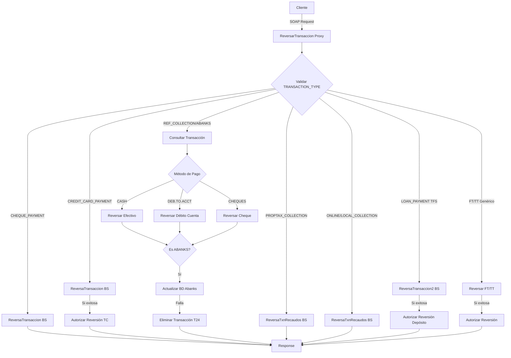

# Análisis Técnico: ReversarTransaccion

## 1. Resumen Ejecutivo

**Servicio:** ReversarTransaccion  
**Código:** N/A  
**Tipo:** Servicio Simple  
**Patrón de Diseño:** Orquestación con Lógica Condicional Compleja

### Descripción Funcional

El servicio ReversarTransaccion es un servicio de orquestación que permite revertir diferentes tipos de transacciones bancarias en el sistema T24. Implementa una lógica condicional compleja que determina el flujo de reversión según el tipo de transacción (TRANSACTION_TYPE) y el método de pago utilizado. Soporta reversión de pagos de cheques, tarjetas de crédito, recaudos (referencia, impuestos, locales, en línea, Abanks), pagos de préstamos y transacciones genéricas FT/TT. Para cada tipo, ejecuta validaciones, consultas previas, reversión y autorización cuando es exitosa. Incluye mecanismos de compensación para casos especiales como ABANKS_COLLECTION.

## 2. Arquitectura del Servicio

### 2.1 Patrón de Diseño

El servicio implementa el patrón **Orquestación con Enrutamiento Condicional Complejo**:



### 2.2 Flujo de Procesamiento

1. **Recepción y Validación Inicial**
   - Extrae TRANSACTION_ID y TRANSACTION_TYPE del request
   - Genera UUID para trazabilidad
   - Extrae tipo de transacción (primeros 2 caracteres del ID)

2. **Enrutamiento Condicional**
   - Evalúa TRANSACTION_TYPE para determinar el flujo
   - Para recaudos: consulta información de la transacción en T24
   - Valida método de pago para recaudos

3. **Ejecución de Reversión**
   - Invoca el Business Service correspondiente
   - Transforma request usando XQuery específico
   - Captura resultado de la reversión

4. **Autorización (si aplica)**
   - Si la reversión es exitosa, ejecuta autorización
   - Solo para: CREDIT_CARD_PAYMENT, LOAN_PAYMENT, FT/TT genéricos

5. **Procesamiento Especial Abanks**
   - Actualiza base de datos externa
   - Si falla, ejecuta compensación eliminando transacción en T24

6. **Construcción de Response**
   - Transforma response usando XQuery específico
   - Construye ResponseHeader con resultado
   - Maneja errores con mensajes descriptivos

## 3. Servicios Dependientes

### 3.1 Business Services

| Business Service | Tipo | Operaciones | Propósito |
|-----------------|------|-------------|-----------|
| reversionRecaudoAbanks_v2_db | JCA/DB | reversionRecaudoAbanks_v2 | Actualizar BD externa de Abanks |
| ReversaTransaccion | SOAP | ReversiondePagodeCheques, ReversionpagoTC, ReversiondetransaccionFT, ReversiondetransaccionTT, AutorizacionreversionFT, AutorizacionreversionTT | Reversiones y autorizaciones principales |
| ReversaTxnRecaudos | SOAP | Reversionpagorecaudoamdcefec, Reversionpagorecaudoamdcdbcta, Reversionpagorecaudoamdcficochq, Reversionpagorecaudoamdcobchq, Reversionpagorecaudoamdcchqintl, Reversionpagorecaudolineaefec, Reversionpagorecaudolineadbcta, Reversionpagorecaudolineaficochq, Reversionpagorecaudolineaobchq, Reversionpagorecaudolineachqintl | Reversiones de recaudos (impuestos y locales) |
| ConsultasTransacciones | SOAP | ConsultadetransaccionFT, ConsultadetransaccionTT | Consultar información de transacciones |
| ReversaTransaccion2 | SOAP | Reversiondepositocombinado, AuthReversionDepositosCombinados | Reversiones de depósitos combinados/préstamos |
| PagoRecaudos | SOAP | EliminacionpagorecaudorefTT, EliminacionpagorecaudorefFT | Eliminar transacciones (compensación) |

### 3.2 Conexiones

| Servicio | Tipo Conexión | Endpoint | Autenticación |
|----------|---------------|----------|---------------|
| reversionRecaudoAbanks_v2_db | JCA | [CONNECTION_DB_ABANKS] | Manejada por conexión JCA |
| ReversaTransaccion | HTTP/SOAP | [ENDPOINT_REVERSA_TRANSACCION] | Usuario/Password en header |
| ReversaTxnRecaudos | HTTP/SOAP | [ENDPOINT_REVERSA_TXN_RECAUDOS] | Usuario/Password en header |
| ConsultasTransacciones | HTTP/SOAP | [ENDPOINT_CONSULTAS_TRANSACCIONES] | Usuario/Password en header |
| ReversaTransaccion2 | HTTP/SOAP | [ENDPOINT_REVERSA_TRANSACCION2] | Usuario/Password en header |
| PagoRecaudos | HTTP/SOAP | [ENDPOINT_PAGO_RECAUDOS] | Usuario/Password en header |

## 4. Transformaciones de Datos

### 4.1 Archivos XQuery de Request

| Tipo de Transacción | Archivo XQuery Request | Propósito |
|---------------------|------------------------|-----------|
| CHEQUE_PAYMENT | MiddlewareCaja/Resources/xqueries/ReversarTransaccion/ReversarTransaccionPagoChequeIn.xq | Transformar request para reversión de pago de cheque |
| CREDIT_CARD_PAYMENT | MiddlewareCaja/Resources/xqueries/ReversarTransaccion/ReversarTransaccionPagooRetiroTCIn.xq | Transformar request para reversión de pago TC |
| CREDIT_CARD_PAYMENT (Auth) | MiddlewareCaja/Resources/xqueries/ReversarTransaccion/AutorizarReversionPagooRetiroTCIn.xq | Transformar request para autorización de reversión TC |
| REF_COLLECTION (CASH) | MiddlewareCaja/Resources/xqueries/ReversarTransaccion/ReversarTransaccionPagoRecaudoRefEfectIn.xq | Transformar request para reversión recaudo ref efectivo |
| REF_COLLECTION (DEB.TO.ACCT) | MiddlewareCaja/Resources/xqueries/ReversarTransaccion/ReversarTransaccionPagoRecaudoRefDebCtaIn.xq | Transformar request para reversión recaudo ref débito cuenta |
| REF_COLLECTION (FICO.CHEQUE) | MiddlewareCaja/Resources/xqueries/ReversarTransaccion/ReversarTransaccionPagoRecaudoRefFicoChqIn.xq | Transformar request para reversión recaudo ref cheque Fico |
| REF_COLLECTION (OB.CHEQUE) | MiddlewareCaja/Resources/xqueries/ReversarTransaccion/ReversarTransaccionPagoRecaudoRefOBChqIn.xq | Transformar request para reversión recaudo ref cheque OB |
| REF_COLLECTION (INTL.CHEQUE) | MiddlewareCaja/Resources/xqueries/ReversarTransaccion/ReversarTransaccionPagoRecaudoRefIntChqIn.xq | Transformar request para reversión recaudo ref cheque internacional |
| PROPTAX_COLLECTION (CASH) | MiddlewareCaja/Resources/xqueries/ReversarTransaccion/ReversarTransaccionPagoRecaudoAMDCEfectIn.xq | Transformar request para reversión recaudo AMDC efectivo |
| PROPTAX_COLLECTION (DEB.TO.ACCT) | MiddlewareCaja/Resources/xqueries/ReversarTransaccion/ReversarTransaccionPagoRecaudoAMDCDebCtaIn.xq | Transformar request para reversión recaudo AMDC débito cuenta |
| PROPTAX_COLLECTION (FICO.CHEQUE) | MiddlewareCaja/Resources/xqueries/ReversarTransaccion/ReversarTransaccionPagoRecaudoAMDCFicoChqIn.xq | Transformar request para reversión recaudo AMDC cheque Fico |
| PROPTAX_COLLECTION (OB.CHEQUE) | MiddlewareCaja/Resources/xqueries/ReversarTransaccion/ReversarTransaccionPagoRecaudoAMDCOBChqIn.xq | Transformar request para reversión recaudo AMDC cheque OB |
| PROPTAX_COLLECTION (INTL.CHEQUE) | MiddlewareCaja/Resources/xqueries/ReversarTransaccion/ReversarTransaccionPagoRecaudoAMDCIntChqIn.xq | Transformar request para reversión recaudo AMDC cheque internacional |
| ONLINE/LOCAL_COLLECTION (CASH) | MiddlewareCaja/Resources/xqueries/ReversarTransaccion/ReversarTransaccionPagoRecaudoLocalEfectIn.xq | Transformar request para reversión recaudo local efectivo |
| ONLINE/LOCAL_COLLECTION (DEB.TO.ACCT) | MiddlewareCaja/Resources/xqueries/ReversarTransaccion/ReversarTransaccionPagoRecaudoLocalDebCtaIn.xq | Transformar request para reversión recaudo local débito cuenta |
| ONLINE/LOCAL_COLLECTION (FICO.CHEQUE) | MiddlewareCaja/Resources/xqueries/ReversarTransaccion/ReversarTransaccionPagoRecaudoLocalFicoChqIn.xq | Transformar request para reversión recaudo local cheque Fico |
| ONLINE/LOCAL_COLLECTION (OB.CHEQUE) | MiddlewareCaja/Resources/xqueries/ReversarTransaccion/ReversarTransaccionPagoRecaudoLocalOBChqIn.xq | Transformar request para reversión recaudo local cheque OB |
| ONLINE/LOCAL_COLLECTION (INTL.CHEQUE) | MiddlewareCaja/Resources/xqueries/ReversarTransaccion/ReversarTransaccionPagoRecaudoLocalIntChqIn.xq | Transformar request para reversión recaudo local cheque internacional |
| LOAN_PAYMENT (TFS) | MiddlewareCaja/Resources/xqueries/ReversarTransaccion/ReversarTransaccionPagooPrestamoIn.xq | Transformar request para reversión pago préstamo |
| LOAN_PAYMENT (TFS Auth) | MiddlewareCaja/Resources/xqueries/ReversarTransaccion/AutorizarReversionDepositoCombinadoIn.xq | Transformar request para autorización reversión depósito combinado |
| FT Genérico | MiddlewareCaja/Resources/xqueries/ReversarTransaccion/ReversarTransaccionFTIn.xq | Transformar request para reversión FT |
| FT Genérico (Auth) | MiddlewareCaja/Resources/xqueries/ReversarTransaccion/AutorizarReversionFTIn.xq | Transformar request para autorización reversión FT |
| TT Genérico | MiddlewareCaja/Resources/xqueries/ReversarTransaccion/ReversarTransaccionTTIn.xq | Transformar request para reversión TT |
| TT Genérico (Auth) | MiddlewareCaja/Resources/xqueries/ReversarTransaccion/AutorizarReversionTTIn.xq | Transformar request para autorización reversión TT |
| Consulta FT | MiddlewareCaja/Resources/xqueries/ReversarTransaccion/ConsultaTransaccionFT.xq | Transformar request para consulta transacción FT |
| Consulta TT | MiddlewareCaja/Resources/xqueries/ReversarTransaccion/ConsultaTransaccionTT.xq | Transformar request para consulta transacción TT |
| ABANKS_COLLECTION | MiddlewareCaja/Resources/xqueries/ReversarTransaccion/v2/ReversarTransaccionAbanksIn.xq | Transformar request para actualización BD Abanks |
| Eliminación FT | MiddlewareCaja/Resources/xqueries/ReversarTransaccion/v2/EliminacionRevRecRefFTIn.xq | Transformar request para eliminación FT (compensación) |
| Eliminación TT | MiddlewareCaja/Resources/xqueries/ReversarTransaccion/v2/EliminacionRevRecRefTTIn.xq | Transformar request para eliminación TT (compensación) |

### 4.2 Archivos XQuery de Response

| Tipo de Transacción | Archivo XQuery Response | Propósito |
|---------------------|-------------------------|-----------|
| CHEQUE_PAYMENT | MiddlewareCaja/Resources/xqueries/ReversarTransaccion/ReversarTransaccionPagoChequeHeaderOut.xq | Transformar response de reversión pago cheque |
| CREDIT_CARD_PAYMENT | MiddlewareCaja/Resources/xqueries/ReversarTransaccion/ReversarTransaccionPagooRetiroTCHeaderOut.xq | Transformar response de reversión pago TC |
| REF_COLLECTION (CASH) | MiddlewareCaja/Resources/xqueries/ReversarTransaccion/ReversarTransaccionPagoRecaudoRefEfectHeaderOut.xq | Transformar response de reversión recaudo ref efectivo |
| REF_COLLECTION (DEB.TO.ACCT) | MiddlewareCaja/Resources/xqueries/ReversarTransaccion/ReversarTransaccionPagoRecaudoRefDebCtaHeaderOut.xq | Transformar response de reversión recaudo ref débito cuenta |
| REF_COLLECTION (FICO.CHEQUE) | MiddlewareCaja/Resources/xqueries/ReversarTransaccion/ReversarTransaccionPagoRecaudoRefFicoChqHeaderOut.xq | Transformar response de reversión recaudo ref cheque Fico |
| REF_COLLECTION (OB.CHEQUE) | MiddlewareCaja/Resources/xqueries/ReversarTransaccion/ReversarTransaccionPagoRecaudoRefOBChqHeaderOut.xq | Transformar response de reversión recaudo ref cheque OB |
| REF_COLLECTION (INTL.CHEQUE) | MiddlewareCaja/Resources/xqueries/ReversarTransaccion/ReversarTransaccionPagoRecaudoRefIntChqHeaderOut.xq | Transformar response de reversión recaudo ref cheque internacional |
| PROPTAX/ONLINE/LOCAL (Teller) | MiddlewareCaja/Resources/xqueries/ReversarTransaccion/ReversarTransaccionPagoRecaudoTellerHeaderOut.xq | Transformar response de reversión recaudo (Teller) |
| PROPTAX/ONLINE/LOCAL (Transfer) | MiddlewareCaja/Resources/xqueries/ReversarTransaccion/ReversarTransaccionPagoRecaudoTransferHeaderOut.xq | Transformar response de reversión recaudo (Transfer) |
| ABANKS_COLLECTION | MiddlewareCaja/Resources/xqueries/ReversarTransaccion/ReversarTransaccionAbanksHeaderOut.xq | Transformar response de actualización BD Abanks |
| LOAN_PAYMENT (TFS) | MiddlewareCaja/Resources/xqueries/ReversarTransaccion/ReversarTransaccionPagooPrestamoHeaderOut.xq | Transformar response de reversión pago préstamo |
| FT Genérico | MiddlewareCaja/Resources/xqueries/ReversarTransaccion/ReversarTransaccionFTHeaderOut.xq | Transformar response de reversión FT |
| TT Genérico | MiddlewareCaja/Resources/xqueries/ReversarTransaccion/ReversarTransaccionTTHeaderOut.xq | Transformar response de reversión TT |

### 4.3 Lógica de Transformación

**Nota:** Los siguientes son datos de ejemplo no reales, utilizados únicamente para propósitos de testing y documentación.

**Request:**
- Extrae TRANSACTION_ID y TRANSACTION_TYPE del body
- Agrega credenciales de autenticación del header
- Genera UUID para trazabilidad
- Construye request específico según tipo de transacción y método de pago

**Response:**
- Extrae successIndicator y messages del response del BS
- Construye ResponseHeader con formato estándar
- Incluye transactionId, messageId, valueDate según disponibilidad
- Para errores: construye mensaje descriptivo concatenando código y razón

## 5. Validación XSD

### 5.1 Request - reversarTransaccion

**Namespace:** http://www.ficohsa.com.hn/middleware.services/reversarTransaccionTypes  
**Archivo XSD:** MiddlewareCaja/Resources/xsds/ReversarTransaccion/ReversarTransaccion.xsd

| Campo | Tipo | Obligatorio | Restricciones | Descripción |
|-------|------|-------------|---------------|-------------|
| TRANSACTION_ID | string | Sí | minLength=1 | ID de la transacción a revertir |
| TRANSACTION_TYPE | string | Sí | minLength=1 | Tipo de transacción (CHEQUE_PAYMENT, CREDIT_CARD_PAYMENT, REF_COLLECTION, PROPTAX_COLLECTION, ONLINE_COLLECTION, LOCAL_COLLECTION, ABANKS_COLLECTION, LOAN_PAYMENT) |
| AUTHORIZER_USERNAME | string | No | - | Usuario autorizador |
| AUTHORIZER_PASSWORD | string | No | - | Contraseña del autorizador |

**Validaciones:**
- TRANSACTION_ID debe tener al menos 1 carácter
- TRANSACTION_TYPE debe tener al menos 1 carácter
- Para transacciones FT/TT genéricas: TRANSACTION_ID debe comenzar con "FT" o "TT"
- TRANSACTION_TYPE debe ser uno de los valores soportados

### 5.2 Response - reversarTransaccionResponse

**Namespace:** http://www.ficohsa.com.hn/middleware.services/reversarTransaccionTypes  
**Archivo XSD:** MiddlewareCaja/Resources/xsds/ReversarTransaccion/ReversarTransaccion.xsd

| Campo | Tipo | Obligatorio | Descripción |
|-------|------|-------------|-------------|
| reversarTransaccionResponse | empty element | Sí | Elemento vacío, la información se retorna en el header |

### 5.3 Headers - AutenticacionRequestHeader

**Namespace:** http://www.ficohsa.com.hn/middleware.services/autType  
**Archivo XSD:** MiddlewareCaja/Resources/xsds/General/Autenticacion.xsd

| Campo | Tipo | Obligatorio | Descripción |
|-------|------|-------------|-------------|
| UserName | string | Sí | Usuario para autenticación |
| Password | string | Sí | Contraseña para autenticación |

### 5.4 Headers - ResponseHeader

**Namespace:** http://www.ficohsa.com.hn/middleware.services/autType  
**Archivo XSD:** MiddlewareCaja/Resources/xsds/General/Autenticacion.xsd

| Campo | Tipo | Obligatorio | Descripción |
|-------|------|-------------|-------------|
| transactionId | string | No | ID de la transacción procesada |
| messageId | string | No | ID del mensaje |
| successIndicator | string | No | Indicador de éxito (SUCCESS/ERROR) |
| application | string | No | Aplicación que procesó |
| messages | string | No | Mensajes de respuesta (puede repetirse) |
| valueDate | string | No | Fecha valor de la transacción |

### 5.5 Estadísticas de Validación

- **Total de campos documentados:** 11
- **Campos obligatorios:** 4
- **Campos opcionales:** 7
- **Tipos complejos:** 3 (reversarTransaccion, AutenticacionRequestHeader, ResponseHeader)
- **Porcentaje de completitud:** 100%

### 5.6 Casos de Error XSD

| Escenario | Validación | Mensaje Esperado |
|-----------|------------|------------------|
| TRANSACTION_ID vacío | minLength=1 | Campo requerido no suministrado |
| TRANSACTION_TYPE vacío | minLength=1 | Campo requerido no suministrado |
| TRANSACTION_TYPE no soportado | Lógica de negocio | UNSUPPORTED TRANSACTION_TYPE |
| TRANSACTION_ID inválido para FT/TT | Lógica de negocio | TRANSACTION_ID MUST TO BEGIN WITH "FT" OR "TT" |
| Campos requeridos faltantes | Validación general | REQUIRED FIELDS NOT SUPPLIED |

## 6. Configuraciones Técnicas

### 6.1 Configuración del Proxy Service

```xml
<ser:coreEntry isProxy="true" isEnabled="true" isTracingEnabled="false">
  <ser:binding type="SOAP" isSoap12="false">
    <wsdl ref="MiddlewareCaja/Resources/wsdls/ReversarTransaccion"/>
    <port>reversarTransaccionPSSOAP</port>
  </ser:binding>
  <ser:logging isEnabled="true">
    <logLevel>debug</logLevel>
  </ser:logging>
  <ser:sla-alerting isEnabled="true">
    <alertLevel>normal</alertLevel>
  </ser:sla-alerting>
</ser:coreEntry>
```

### 6.2 Variables de Pipeline

| Variable | Tipo | Propósito |
|----------|------|-----------|
| trxId | string | Almacena TRANSACTION_ID |
| tipoTrx | string | Primeros 2 caracteres del TRANSACTION_ID (FT/TT) |
| transactionType | string | Tipo de transacción |
| uuid | string | UUID generado para trazabilidad |
| payMethod | string | Método de pago extraído de consulta |
| valueDate | string | Fecha valor de la transacción |
| inputter | string | Usuario que ingresó la transacción |
| branchCode | string | Código de sucursal |
| validationMessage | string | Mensaje de validación/error |
| statusReversion | string | Estado de la reversión (SUCCESS/ERROR) |
| messageReversion | string | Mensaje de la reversión |
| successIndicatorAbanks | string | Código de error de actualización Abanks |

### 6.3 Error Handler

El servicio implementa un error handler global que:
- Captura cualquier excepción no manejada
- Construye ResponseHeader con successIndicator="ERROR"
- Concatena errorCode y reason del fault
- Retorna response con body vacío y header de error

## 7. Consideraciones de Seguridad

- Las credenciales se pasan en el header SOAP (AutenticacionRequestHeader)
- No se almacenan credenciales en logs
- La conexión JCA a BD Abanks maneja autenticación a nivel de conexión
- Se recomienda uso de HTTPS para transporte
- Los passwords de autorizador son opcionales y se pasan en el body

## 8. Recomendaciones

1. **Monitoreo:** Implementar alertas para reversiones fallidas, especialmente ABANKS_COLLECTION
2. **Auditoría:** Registrar todas las reversiones en sistema de auditoría
3. **Timeouts:** Configurar timeouts apropiados en Business Services (recomendado: 60-120 segundos)
4. **Reintentos:** No implementar reintentos automáticos para evitar reversiones duplicadas
5. **Compensación:** Validar que el mecanismo de compensación de Abanks funcione correctamente
6. **Testing:** Probar exhaustivamente todos los tipos de transacción y métodos de pago
7. **Documentación:** Mantener actualizada la lista de TRANSACTION_TYPE soportados
8. **Performance:** Optimizar consultas previas a reversión para reducir latencia
