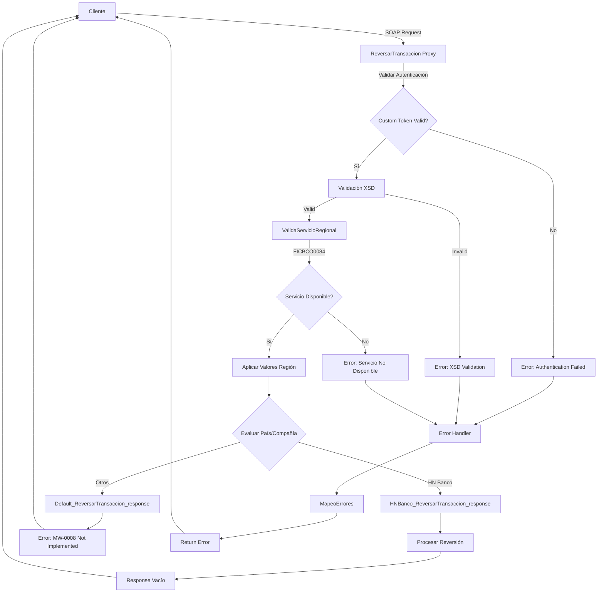
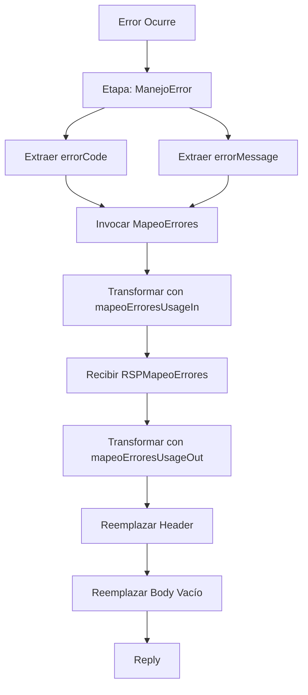

# Análisis Técnico - ReversarTransaccion

## 1. Resumen Ejecutivo

**Nombre del Servicio:** ReversarTransaccion  
**Código de Servicio:** FICBCO0084  
**Tipo de Servicio:** Servicio Regional Multi-Core  
**Patrón de Diseño:** Validación Regional con Pipelines Múltiples por País/Compañía

### Descripción Funcional
El servicio ReversarTransaccion proporciona capacidades de reversión de transacciones bancarias previamente ejecutadas. Implementa un patrón de validación regional que verifica la disponibilidad del servicio en la región del solicitante antes de procesar la reversión. El servicio valida el esquema XSD del request con un campo obligatorio (TRANSACTION_ID) y uno opcional (TRANSACTION_TYPE), ejecuta ValidaServicioRegional con código FICBCO0084, y procesa la reversión de la transacción. El servicio tiene múltiples pipelines de respuesta según país/compañía, incluyendo un pipeline por defecto que retorna error MW-0008 para implementaciones no disponibles. El response es un elemento vacío sin campos de salida. Incluye manejo de errores mediante MapeoErrores para estandarización de mensajes. Es un servicio crítico de reversión utilizado por 5 canales.

---

## 2. Arquitectura del Servicio

### Patrón Arquitectónico
El servicio implementa un patrón de **Validación Regional con Pipelines Múltiples por País/Compañía**:

1. Recepción de solicitud con autenticación custom token
2. Validación XSD del request
3. Validación de disponibilidad regional del servicio
4. Aplicación de configuraciones regionales
5. Enrutamiento a pipeline de respuesta específico según país/compañía
6. Procesamiento de reversión de transacción
7. Manejo centralizado de errores con mapeo

### Diagrama de Flujo



---

## 3. Servicios Dependientes

### Servicios de Validación y Configuración

| Servicio | Tipo | Propósito | Operación |
|----------|------|-----------|-----------|
| ValidaServicioRegional | Business Service (DB) | Validar disponibilidad del servicio en la región | ValidaServicioRegional |
| MapeoErrores | Proxy Service | Estandarizar códigos y mensajes de error | mapeoErrores |

### Cadena de Dependencias
```
ReversarTransaccion
├── ValidaServicioRegional (DB)
└── MapeoErrores
```

---

## 4. Transformaciones de Datos

### Transformaciones por Etapa

| Etapa | Descripción | Archivos XQuery Request | Archivos XQuery Response |
|-------|-------------|------------------------|--------------------------|
| Validación Regional | Construcción de request para validar servicio | [Transformación inline en proxy] | N/A |
| Aplicación Regional | Aplicar configuraciones por defecto de región | N/A | [Transformación inline en proxy] |
| Mapeo de Errores Request | Construcción de request para mapeo de errores | `Middleware/v2/Resources/MapeoErrores/xq/mapeoErroresUsageIn.xq` | N/A |
| Mapeo de Errores Response | Transformación de respuesta de mapeo de errores | N/A | `Middleware/v2/Resources/MapeoErrores/xq/mapeoErroresUsageOut.xq` |

### Lógica de Transformación

**Validación Regional (inline):**
- Entrada: RequestHeader, serviceId
- Salida: Request para ValidaServicioRegional
- Parámetros: serviceId = "FICBCO0084"

**Aplicación Regional (inline):**
- Entrada: RequestHeader original
- Salida: RequestHeader con valores regionales aplicados
- Propósito: Enriquecer header con configuraciones específicas de la región

**mapeoErroresUsageIn.xq:**
- Entrada: CODIGO_ERROR (errorCode del fault), MENSAJE_ERROR (concatenado con "FICBCO0084$#$")
- Salida: Request para MapeoErrores

**mapeoErroresUsageOut.xq:**
- Entrada: mapeoErroresResponse, successIndicator (errorCode)
- Salida: ResponseHeader con error mapeado

---

## 5. Conexiones por País

### Validación Regional (Común para todos los países)

| País | Tipo Conexión | Servicio | Endpoint | Operación |
|------|---------------|----------|----------|-----------|
| Todos | JCA (Database) | ValidaServicioRegional | [CONNECTION_VALIDACION_REGIONAL] | ValidaServicioRegional |

**Nota:** La conexión JCA maneja la autenticación a nivel de conexión configurada en el servidor.

### Pipelines de Respuesta por País/Compañía

| País/Compañía | Pipeline | Comportamiento |
|---------------|----------|----------------|
| Honduras Banco | HNBanco_ReversarTransaccion_response | Procesa reversión de transacción |
| Otros (Default) | Default_ReversarTransaccion_response | Retorna error MW-0008: SERVICE NOT IMPLEMENTED YET |

---

## 6. Validación XSD

### Esquema Principal
- **Archivo XSD:** reversarTransaccionTypes.xsd
- **Ruta:** Middleware/Business_Resources/ReversarTransaccion/ReversarTransaccion/reversarTransaccionTypes.xsd
- **Namespace:** http://www.ficohsa.com.hn/middleware.services/reversarTransaccionTypes
- **Prefijo:** con

### Estructura del Request: reversarTransaccion

| Campo | Tipo | Obligatorio | Cardinalidad | Restricciones | Descripción |
|-------|------|-------------|--------------|---------------|-------------|
| reversarTransaccion | complexType | Sí | 1..1 | - | Elemento raíz del request |
| TRANSACTION_ID | string | Sí | 1..1 | - | Identificador de la transacción a reversar |
| TRANSACTION_TYPE | string | No | 0..1 | - | Tipo de transacción |

### Estructura del Response: reversarTransaccionResponse

| Campo | Tipo | Obligatorio | Cardinalidad | Restricciones | Descripción |
|-------|------|-------------|--------------|---------------|-------------|
| reversarTransaccionResponse | Empty Type | Sí | 1..1 | - | Elemento raíz del response (vacío) |

### Ejemplo de Request Válido

**Nota:** Los siguientes son datos de ejemplo no reales, utilizados únicamente para propósitos de testing y documentación.

```xml
<rev:reversarTransaccion xmlns:rev="http://www.ficohsa.com.hn/middleware.services/reversarTransaccionTypes">
  <TRANSACTION_ID>TXN123456789</TRANSACTION_ID>
  <TRANSACTION_TYPE>TRANSFER</TRANSACTION_TYPE>
</rev:reversarTransaccion>
```

### Ejemplo de Response Válido

**Nota:** Los siguientes son datos de ejemplo no reales, utilizados únicamente para propósitos de testing y documentación.

```xml
<rev:reversarTransaccionResponse xmlns:rev="http://www.ficohsa.com.hn/middleware.services/reversarTransaccionTypes"/>
```

### Casos de Error de Validación XSD

**Error 1: TRANSACTION_ID faltante**
```xml
<rev:reversarTransaccion>
  <!-- TRANSACTION_ID faltante -->
  <TRANSACTION_TYPE>TRANSFER</TRANSACTION_TYPE>
</rev:reversarTransaccion>
```
Error esperado: `cvc-complex-type.2.4.b: The content of element 'reversarTransaccion' is not complete`

### Estadísticas de Validación
- **Total de elementos en Request:** 3
- **Elementos obligatorios:** 2 (67%)
- **Elementos opcionales:** 1 (33%)
- **Total de elementos en Response:** 1
- **Elementos obligatorios en Response:** 1 (100%)
- **Elementos opcionales en Response:** 0 (0%)
- **Tipos complejos definidos:** 1
- **Tipos simples definidos:** 0
- **Cobertura de documentación:** 100%

---

## 7. Manejo de Errores

### Error Handler Dedicado
- **Nombre:** _onErrorHandler-8848777042473091319--23eafd38.13c2a05c9f3.-6ddb
- **Tipo:** Pipeline de error con mapeo

### Flujo de Manejo de Errores



### Extracción de Información de Error
```xpath
errorCode: fn:string($fault/ctx:errorCode/text())
errorMessage: fn:string($fault/ctx:reason/text())
```

### Integración con MapeoErrores
- **Servicio:** Middleware/v2/ProxyServices/MapeoErrores
- **Operación:** mapeoErrores
- **Transformación Request:** mapeoErroresUsageIn.xq
- **Transformación Response:** mapeoErroresUsageOut.xq
- **Parámetros:** CODIGO_ERROR, MENSAJE_ERROR (formato: "FICBCO0084$#$[mensaje]")

### Pipeline de Respuesta por Defecto
- **Pipeline:** Default_ReversarTransaccion_response
- **Error Code:** MW-0008
- **Mensaje:** SERVICE NOT IMPLEMENTED YET FOR THIS COUNTRY/COMPANY
- **Propósito:** Manejar solicitudes de países/compañías no implementados

---

## 8. Configuración de Seguridad

### Autenticación Custom Token
- **Tipo:** Username/Password en header
- **Namespace:** http://www.ficohsa.com.hn/middleware.services/autType
- **Prefijo:** aut

**Extracción de Username:**
```xpath
./aut:RequestHeader/Authentication/UserName/text()
```

**Extracción de Password:**
```xpath
./aut:RequestHeader/Authentication/Password/text()
```

**Variable de contexto:** header

### Transporte
- **Protocolo:** HTTP (NO HTTPS configurado)
- **Provider:** http
- **Dirección:** Inbound

---

## 9. Configuración de Monitoreo y Logging

### Logging
- **Estado:** Habilitado
- **Nivel:** debug
- **Propósito:** Trazabilidad completa de requests y responses

### Reporting
- **Estado:** Habilitado
- **Propósito:** Métricas de uso y rendimiento

### SLA Alerting
- **Estado:** Habilitado
- **Nivel:** normal
- **Propósito:** Alertas de cumplimiento de SLA

### Pipeline Alerting
- **Estado:** Habilitado
- **Nivel:** normal
- **Propósito:** Alertas de errores en pipeline

### Monitoring
- **Estado:** Habilitado
- **Intervalo de agregación:** 360 segundos
- **Nivel:** Action

---

## 10. Consideraciones de Implementación

### Variables de Configuración Requeridas
- `[CONNECTION_VALIDACION_REGIONAL]`: Conexión JCA a base de datos de validación

### Dependencias de Despliegue
1. Base de datos de ValidaServicioRegional debe estar disponible
2. Servicio MapeoErrores debe estar desplegado
3. Esquemas XSD deben estar registrados en el servidor OSB

### Puntos de Configuración por Ambiente
- Conexión JCA a base de datos
- Credenciales de autenticación
- Timeouts de servicios
- Niveles de logging
- Configuración de pipelines por país/compañía

### Consideraciones Especiales
- El servicio NO implementa router dinámico
- El servicio tiene autenticación custom token configurada
- El servicio NO utiliza HTTPS (solo HTTP)
- El response es un elemento vacío (sin campos de salida)
- Es un servicio crítico de reversión
- El servicio tiene múltiples pipelines de respuesta según país/compañía
- El pipeline por defecto retorna error MW-0008 para implementaciones no disponibles
- El servicio es utilizado por 5 canales críticos
- El campo TRANSACTION_TYPE es opcional
- Monitoring habilitado con intervalo de 360 segundos (diferente a otros servicios)

---

**Versión del Documento:** 1.0  
**Fecha de Análisis:** 2025-01-15  
**Analista:** Equipo de Arquitectura OSB
