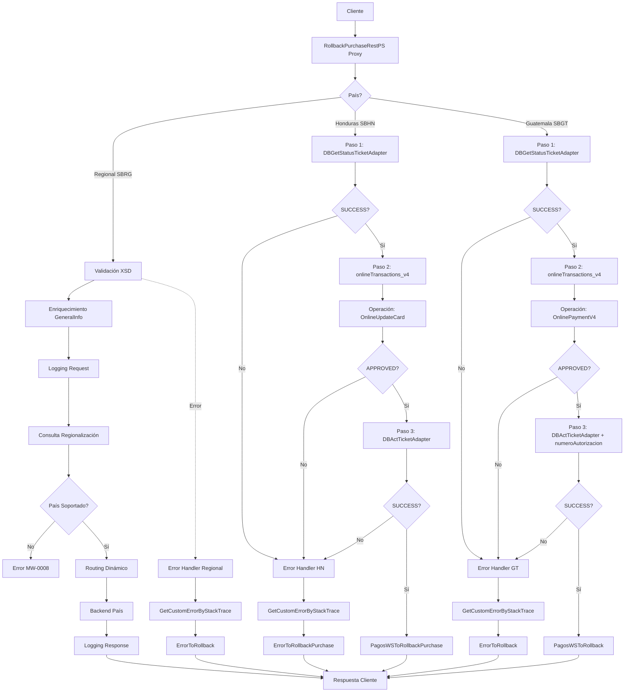

# Análisis Técnico: RollbackPurchaseRestPS

## Resumen Ejecutivo

El servicio **RollbackPurchaseRestPS** es un servicio Router Regional que permite realizar el reverso de transacciones de compra con tarjeta de crédito. Implementa un patrón de Router Dinámico Regional que enruta las solicitudes al backend correspondiente según el país de destino (Honduras, Guatemala, Panamá, Nicaragua).

## Arquitectura del Servicio

### Patrón de Diseño
- **Tipo**: Router Dinámico Regional
- **Versión**: v1
- **Protocolo**: REST/HTTP y SOAP/HTTP (dual binding)
- **Seguridad**: HTTP Basic Authentication over SSL (OWSM Policy)

### Flujo de Ejecución



## Servicios Dependientes

### Servicios Regionales (SBRG)

#### 1. GetCountryURLByNameRestBS
- **Propósito**: Determinar la URL del backend según el país de destino
- **Parámetros**: 
  - destinationBank: Banco destino
  - service: "Card/RollbackPurchase"
  - version: "v1"
  - operation: Operación del servicio
  - sourceBank: Banco origen
  - user: Usuario de la aplicación
- **Respuesta**: URL del backend del país o "N/A" si no está soportado
- **Validación**: Si retorna "N/A", se genera error MW-0008

#### 2. RollbackPurchaseRestBS
- **Propósito**: Invocar el backend de Vision+ para ejecutar el reverso de compra
- **Parámetros**: getStatusTicket (request completo)
- **Respuesta**: getStatusTicketResponse con el estado del reverso
- **Validación**: Routing dinámico usando la URL obtenida de regionalización

#### 3. LoggingRegionalRestBS
- **Propósito**: Registrar requests y responses para auditoría y troubleshooting
- **Parámetros**: 
  - body: Contenido del mensaje
  - service, version, operation: Identificación del servicio
  - uuid, user, sourceBank, destinationBank: Contexto de la transacción
  - state, codeError, messageError: Estado y errores
  - messageType: "REQUEST" o "RESPONSE"
- **Respuesta**: Confirmación de registro
- **Validación**: Se invoca en request, response y error flows

#### 4. GetCustomErrorByStackTraceRegionalRestBS
- **Propósito**: Mapear errores técnicos del OSB a errores de negocio comprensibles
- **Parámetros**:
  - systemApplication: "OSB"
  - service: Nombre del servicio
  - errorCode: Código de error técnico
  - errorMessage: Mensaje de error técnico
  - language: Idioma de la respuesta
- **Respuesta**: Error mapeado con código y descripción
- **Validación**: Solo se invoca en el error handler

### Servicios Específicos de Honduras (SBHN)

#### 5. DBGetStatusTicketAdapter
- **Propósito**: Consultar información del ticket en la base de datos
- **Parámetros**: Request transformado mediante RollbackPurchaseToPagosWS.Xquery
- **Respuesta**: 
  - PV_SUCCESSINDICATOR: Indicador de éxito
  - PV_MESSAGES: Mensajes de error
  - PV_SECUENCIAMOVIMIENTO: Secuencia del movimiento
  - PN_ORGANIZACION: Organización
  - PV_MERCHANTNUMBER: Número de comercio
  - PN_VALOREFECTIVO: Valor efectivo
  - PV_FECHAEXPTC: Fecha expiración TC
  - PV_NUMEROTARJETA: Número de tarjeta
- **Validación**: Si PV_SUCCESSINDICATOR = 'SUCCESS' y PV_MESSAGES = '', continúa al siguiente paso

#### 6. onlineTransactions_v4
- **Propósito**: Ejecutar el reverso de la transacción en Vision+
- **Operación**: OnlineUpdateCard
- **Parámetros**: Request transformado mediante RollbackPurchaseToOnlinePayment.Xquery
  - sequence: Secuencia del movimiento
  - requestType: 'R' (Reverso)
  - org: Organización
  - merchant: Número de comercio
  - payment: Valor efectivo
  - expiration: Fecha expiración
  - creditCard: Número de tarjeta
- **Respuesta**: ActionDescription (APPROVED/ERROR)
- **Validación**: Si ActionDescription = 'APPROVED', continúa a actualizar ticket

#### 7. DBActTicketAdapter
- **Propósito**: Actualizar el estado del ticket en la base de datos
- **Parámetros**: Request transformado mediante RollbackPurchaseToActTicket.Xquery
  - RollbackPurchase: Request original
  - statusTicket: 'R' (Reversado)
- **Respuesta**:
  - PV_SUCCESSINDICATOR: Indicador de éxito
  - PV_MESSAGES: Mensajes de error
- **Validación**: Si PV_SUCCESSINDICATOR = 'SUCCESS', el reverso se completó exitosamente

### Servicios Específicos de Guatemala (SBGT)

#### 8. DBGetStatusTicketAdapter
- **Propósito**: Consultar información del ticket en la base de datos
- **Parámetros**: Request transformado mediante RollbackToPagosWS.Xquery
- **Respuesta**: Mismos campos que Honduras (PV_SUCCESSINDICATOR, PV_MESSAGES, etc.)
- **Validación**: Si PV_SUCCESSINDICATOR = 'SUCCESS' y PV_MESSAGES = '', continúa al siguiente paso

#### 9. onlineTransactions_v4
- **Propósito**: Ejecutar el reverso de la transacción en Vision+
- **Operación**: OnlinePaymentV4 (diferente a Honduras)
- **Parámetros**: Request transformado mediante RollbackToOnlinePayment.Xquery
  - Mismos parámetros que Honduras
- **Respuesta**: ActionDescription (APPROVED/ERROR)
- **Validación**: Si ActionDescription = 'APPROVED', continúa a actualizar ticket

#### 10. DBActTicketAdapter
- **Propósito**: Actualizar el estado del ticket en la base de datos
- **Parámetros**: Request transformado mediante RollbackToActTicket.Xquery
  - RollbackPurchase: Request original
  - statusTicket: 'R' (Reversado)
  - **numeroAutorizacion**: Código de autorización de Vision+ (parámetro adicional)
- **Respuesta**: PV_SUCCESSINDICATOR, PV_MESSAGES
- **Validación**: Si PV_SUCCESSINDICATOR = 'SUCCESS', el reverso se completó exitosamente

## Transformaciones de Datos

### Procesamiento por País

| País | Código | Descripción Lógica | XQuery Request | XQuery Response |
|-------|--------|-------------------|----------------|-----------------|
| Regional | RG | Router que determina el país destino y enruta dinámicamente. No tiene lógica de negocio propia. | N/A (usa template CardTemplateRG) | N/A (usa template CardTemplateRG) |
| Honduras | HN | Lógica compleja de 3 pasos: 1) Consulta ticket en BD, 2) Ejecuta reverso en Vision+ OnlineUpdateCard, 3) Actualiza estado del ticket | SBHN_Card_RollbackPurchase/Transformations/RollbackPurchaseToPagosWS.Xquery<br>SBHN_Card_RollbackPurchase/Transformations/RollbackPurchaseToOnlinePayment.Xquery<br>SBHN_Card_RollbackPurchase/Transformations/RollbackPurchaseToActTicket.Xquery | SBHN_Card_RollbackPurchase/Transformations/PagosWSToRollbackPurchase.Xquery<br>SBHN_Card_RollbackPurchase/Transformations/ErrorToRollbackPurchase.Xquery |
| Guatemala | GT | Lógica compleja de 3 pasos: 1) Consulta ticket en BD, 2) Ejecuta reverso en Vision+ OnlinePaymentV4, 3) Actualiza estado con numeroAutorizacion | SBGT_Card_RollbackPurchase/Transformatios/RollbackToPagosWS.Xquery<br>SBGT_Card_RollbackPurchase/Transformatios/RollbackToOnlinePayment.Xquery<br>SBGT_Card_RollbackPurchase/Transformatios/RollbackToActTicket.Xquery | SBGT_Card_RollbackPurchase/Transformatios/PagosWSToRollback.Xquery<br>SBGT_Card_RollbackPurchase/Transformatios/ErrorToRollback.Xquery |

### Transformaciones Específicas de Honduras

#### Request Transformations
1. **RollbackPurchaseToPagosWS.Xquery**
   - **Propósito**: Transformar request del servicio a formato de consulta de BD
   - **Input**: getStatusTicket
   - **Output**: Request para DBGetStatusTicketAdapter
   - **Parámetros**: Ticket del request

2. **RollbackPurchaseToOnlinePayment.Xquery**
   - **Propósito**: Transformar a formato de Vision+ OnlineUpdateCard
   - **Input**: Datos del ticket obtenidos de la BD
   - **Output**: Request para onlineTransactions_v4
   - **Parámetros**: sequence, requestType ('R'), org, merchant, payment, expiration, creditCard

3. **RollbackPurchaseToActTicket.Xquery**
   - **Propósito**: Transformar a formato de actualización de estado del ticket
   - **Input**: Request original + statusTicket
   - **Output**: Request para DBActTicketAdapter
   - **Parámetros**: RollbackPurchase, statusTicket ('R')

#### Response Transformations
4. **PagosWSToRollbackPurchase.Xquery**
   - **Propósito**: Transformar response de BD a formato de respuesta del servicio
   - **Input**: Response de DBGetStatusTicketAdapter
   - **Output**: getStatusTicketResponse
   - **Parámetros**: globalId, PagosWS (response de BD)

5. **ErrorToRollbackPurchase.Xquery**
   - **Propósito**: Transformar errores a formato de respuesta
   - **Input**: Error mapeado + contexto
   - **Output**: getStatusTicketResponse con error
   - **Parámetros**: messaggeOnlinePayment, ErrorToRollback, globalId, messageError, targetSystem, status

> **Nota:** El servicio regional (SBRG) no tiene transformaciones XQuery propias, utiliza el template CardTemplateRG para el procesamiento común y enruta a los servicios específicos de cada país.

## Conexiones por País

### Regional (SBRG)
```xml
<!-- REST/HTTP -->
<service>RollbackPurchaseRestBS</service>
<endpoint>[ENDPOINT_VISION_PLUS_PAIS]</endpoint>
<operation>rollbackPurchase</operation>
<!-- Autenticación: HTTP Basic Auth over SSL -->
<timeout>70</timeout>
<connection-timeout>65</connection-timeout>
```

### Honduras (HN)
```xml
<!-- REST/HTTP -->
<service>SBHN_Card_RollbackPurchase/BS/RollbackPurchaseRestBS</service>
<endpoint>[ENDPOINT_VISION_PLUS_HN]</endpoint>
<operation>rollbackPurchase</operation>
<!-- Autenticación: HTTP Basic Auth over SSL -->
```

### Guatemala (GT)
```xml
<!-- REST/HTTP -->
<service>SBGT_Card_RollbackPurchase/BS/RollbackPurchaseRestBS</service>
<endpoint>[ENDPOINT_VISION_PLUS_GT]</endpoint>
<operation>rollbackPurchase</operation>
<!-- Autenticación: HTTP Basic Auth over SSL -->
```

## Validación XSD

### Información General
- **Esquema XSD**: RollbackPurchaseTypes.xsd
- **Namespace**: https://www.ficohsa.com/regional/card
- **Versión**: 1.0
- **Esquema Común**: CommonTypes.xsd (namespace: https://www.ficohsa.com/regional/common/commonTypes)

### Archivos de Esquema

#### Ubicación
- **XSD Principal**: `FuentesDynamo/SBRG_Card_RollbackPurchase/Schemas/RollbackPurchaseTypes.XMLSchema`
- **WSDL**: `FuentesDynamo/SBRG_Card_RollbackPurchase/Resources/RollbackPurchase.WSDL`
- **XSD Común**: `FuentesDynamo/SBRG_Card_Commons/Schemas/CommonTypes.XMLSchema`

#### Dependencias
- **Namespace com**: https://www.ficohsa.com/regional/common/commonTypes - Para tipos comunes (GeneralInfoType, StatusInfoType, ErrorInfoType)

### Estructura del Request

#### Definición XSD Request
```xml
<xsd:element name="getStatusTicket">
  <xsd:complexType>
    <xsd:sequence>
      <xsd:element name="GeneralInfo" type="com:GeneralInfoType"/>
      <xsd:element name="Ticket" type="xsd:string"/>
      <xsd:element name="TransactionType" type="xsd:string"/>
    </xsd:sequence>
  </xsd:complexType>
</xsd:element>

<!-- GeneralInfoType (del esquema común) -->
<xsd:complexType name="GeneralInfoType">
  <xsd:sequence>
    <xsd:element name="SourceBank" minOccurs="0" type="xsd:string"/>
    <xsd:element name="DestinationBank" minOccurs="0" type="xsd:string"/>
    <xsd:element name="GlobalId" minOccurs="0" type="xsd:string"/>
    <xsd:element name="ApplicationId" minOccurs="0" type="xsd:string"/>
    <xsd:element name="ApplicationUser" minOccurs="0" type="xsd:string"/>
    <xsd:element name="BranchId" type="xsd:string" minOccurs="0"/>
    <xsd:element name="TransactionDate" type="xsd:string" minOccurs="0"/>
    <xsd:element name="Language" type="xsd:string" minOccurs="0"/>
  </xsd:sequence>
</xsd:complexType>
```

#### Ejemplo de Request Válido
> **Nota:** Los siguientes son datos de ejemplo no reales, utilizados únicamente para propósitos de testing y documentación.

```xml
<getStatusTicket xmlns="https://www.ficohsa.com/regional/card">
  <GeneralInfo>
    <SourceBank>FICOHSA</SourceBank>
    <DestinationBank>FICOHSA</DestinationBank>
    <GlobalId>550e8400-e29b-41d4-a716-446655440000</GlobalId>
    <ApplicationId>MOBILE_APP</ApplicationId>
    <ApplicationUser>testuser</ApplicationUser>
    <BranchId>001</BranchId>
    <TransactionDate>2024-01-15</TransactionDate>
    <Language>es</Language>
  </GeneralInfo>
  <Ticket>TKT123456789</Ticket>
  <TransactionType>PURCHASE</TransactionType>
</getStatusTicket>
```

### Estructura del Response

### Definiciones XSD Completas

#### Response Principal
```xml
<xsd:element name="getStatusTicketResponse">
  <xsd:complexType>
    <xsd:sequence>
      <xsd:element name="StatusInfo" type="com:StatusInfoType"/>
      <xsd:element name="ErrorInfo" type="com:ErrorInfoType"/>
      <xsd:element name="Status" type="xsd:string"/>
      <xsd:element name="OriginalAgency" type="xsd:decimal"/>
      <xsd:element name="MerchantNumber" type="xsd:string"/>
      <xsd:element name="CreditCard" type="xsd:string"/>
      <xsd:element name="OperationType" type="xsd:string"/>
      <xsd:element name="BalanceCurrency" type="xsd:decimal"/>
      <xsd:element name="Organizations" type="xsd:decimal"/>
      <xsd:element name="TransactionCurrency" type="xsd:string"/>
      <xsd:element name="ExchangeRate" type="xsd:decimal"/>
      <xsd:element name="TransactionType" type="xsd:decimal"/>
      <xsd:element name="User" type="xsd:string"/>
      <xsd:element name="MovementSequence" type="xsd:string"/>
      <xsd:element name="OriginalSequence" type="xsd:string"/>
      <xsd:element name="PaymentAmount" type="xsd:decimal"/>
      <xsd:element name="CheckValue" type="xsd:decimal"/>
      <xsd:element name="DocumentNumber" type="xsd:decimal"/>
      <xsd:element name="CardExpirationDate" type="xsd:string"/>
      <xsd:element name="CheckType" type="xsd:decimal"/>
      <xsd:element name="OriginalBank" type="xsd:string"/>
      <xsd:element name="DestinationBank" type="xsd:string"/>
      <xsd:element name="Description" type="xsd:string"/>
      <xsd:element name="Channel" type="xsd:string"/>
      <xsd:element name="AutorizationNumber" type="xsd:string"/>
      <xsd:element name="Applied" type="xsd:string"/>
      <xsd:element name="AppliedOnLine" type="xsd:string"/>
    </xsd:sequence>
  </xsd:complexType>
</xsd:element>
```

#### Tipos Complejos
```xml
<!-- StatusInfoType (del esquema común) -->
<xsd:complexType name="StatusInfoType">
  <xsd:sequence>
    <xsd:element name="Status" minOccurs="0" type="xsd:string"/>
    <xsd:element name="TransactionId" minOccurs="0" type="xsd:string"/>
    <xsd:element name="ValueDate" minOccurs="0" type="xsd:date"/>
    <xsd:element name="DateTime" minOccurs="0" type="xsd:dateTime"/>
    <xsd:element name="GlobalId" minOccurs="0" type="xsd:string"/>
  </xsd:sequence>
</xsd:complexType>

<!-- ErrorInfoType (del esquema común) -->
<xsd:complexType name="ErrorInfoType">
  <xsd:sequence>
    <xsd:element name="Code" minOccurs="0" type="xsd:string"/>
    <xsd:element name="Error" minOccurs="0" type="xsd:string"/>
    <xsd:element name="Description" minOccurs="0" type="xsd:string"/>
    <xsd:element name="ShortDescription" minOccurs="0" type="xsd:string"/>
    <xsd:element name="DateTime" minOccurs="0" type="xsd:dateTime"/>
    <xsd:element name="GlobalId" type="xsd:string" minOccurs="0"/>
    <xsd:element name="Details" minOccurs="0" maxOccurs="unbounded">
      <xsd:complexType>
        <xsd:sequence>
          <xsd:element name="SystemId" minOccurs="0" type="xsd:string"/>
          <xsd:element name="SystemStatus" minOccurs="0" type="xsd:string"/>
          <xsd:element name="MessageId" minOccurs="0" type="xsd:string"/>
          <xsd:element name="Messages" minOccurs="0" type="xsd:string"/>
        </xsd:sequence>
      </xsd:complexType>
    </xsd:element>
  </xsd:sequence>
</xsd:complexType>
```

### Ejemplo de Response Válido

> **Nota:** Los siguientes son datos de ejemplo no reales, utilizados únicamente para propósitos de testing y documentación.

```xml
<getStatusTicketResponse xmlns="https://www.ficohsa.com/regional/card">
  <StatusInfo>
    <Status>SUCCESS</Status>
    <TransactionId>TXN987654321</TransactionId>
    <ValueDate>2024-01-15</ValueDate>
    <DateTime>2024-01-15T10:30:00</DateTime>
    <GlobalId>550e8400-e29b-41d4-a716-446655440000</GlobalId>
  </StatusInfo>
  <ErrorInfo>
    <Code>0000</Code>
    <Error></Error>
    <Description>Transacción exitosa</Description>
    <ShortDescription>OK</ShortDescription>
    <DateTime>2024-01-15T10:30:00</DateTime>
    <GlobalId>550e8400-e29b-41d4-a716-446655440000</GlobalId>
  </ErrorInfo>
  <Status>REVERSED</Status>
  <OriginalAgency>100</OriginalAgency>
  <MerchantNumber>MERCH001</MerchantNumber>
  <CreditCard>************1234</CreditCard>
  <OperationType>REVERSAL</OperationType>
  <BalanceCurrency>1</BalanceCurrency>
  <Organizations>1</Organizations>
  <TransactionCurrency>HNL</TransactionCurrency>
  <ExchangeRate>1.00</ExchangeRate>
  <TransactionType>2</TransactionType>
  <User>testuser</User>
  <MovementSequence>SEQ001</MovementSequence>
  <OriginalSequence>OSEQ001</OriginalSequence>
  <PaymentAmount>1500.00</PaymentAmount>
  <CheckValue>0</CheckValue>
  <DocumentNumber>0</DocumentNumber>
  <CardExpirationDate>12/25</CardExpirationDate>
  <CheckType>0</CheckType>
  <OriginalBank>FICOHSA</OriginalBank>
  <DestinationBank>FICOHSA</DestinationBank>
  <Description>Reverso de compra</Description>
  <Channel>MOBILE</Channel>
  <AutorizationNumber>AUTH123456</AutorizationNumber>
  <Applied>Y</Applied>
  <AppliedOnLine>Y</AppliedOnLine>
</getStatusTicketResponse>
```

### Casos de Error XSD

#### Request Inválido - Campo Faltante
> **Nota:** Los siguientes son datos de ejemplo no reales, utilizados únicamente para propósitos de testing y documentación.

```xml
<!-- ERROR: Falta Ticket (campo requerido) -->
<getStatusTicket xmlns="https://www.ficohsa.com/regional/card">
  <GeneralInfo>
    <SourceBank>FICOHSA</SourceBank>
  </GeneralInfo>
  <!-- Ticket faltante -->
  <TransactionType>PURCHASE</TransactionType>
</getStatusTicket>
```

#### Request Inválido - Namespace Incorrecto
> **Nota:** Los siguientes son datos de ejemplo no reales, utilizados únicamente para propósitos de testing y documentación.

```xml
<!-- ERROR: Namespace incorrecto -->
<getStatusTicket xmlns="http://wrong.namespace/">
  <GeneralInfo>
    <SourceBank>FICOHSA</SourceBank>
  </GeneralInfo>
  <Ticket>TKT123456789</Ticket>
  <TransactionType>PURCHASE</TransactionType>
</getStatusTicket>
```

#### Response Inválido - Campo Requerido Faltante
> **Nota:** Los siguientes son datos de ejemplo no reales, utilizados únicamente para propósitos de testing y documentación.

```xml
<!-- ERROR: Falta StatusInfo (requerido) -->
<getStatusTicketResponse xmlns="https://www.ficohsa.com/regional/card">
  <!-- StatusInfo faltante -->
  <ErrorInfo>
    <Code>0000</Code>
  </ErrorInfo>
  <Status>REVERSED</Status>
</getStatusTicketResponse>
```

---

## Historial de Cambios

| Fecha | Versión | Autor | Descripción |
|-------|---------|-------|-------------|
| 2024-01-XX | 1.0 | ARQ FICOHSA | Creación inicial |
