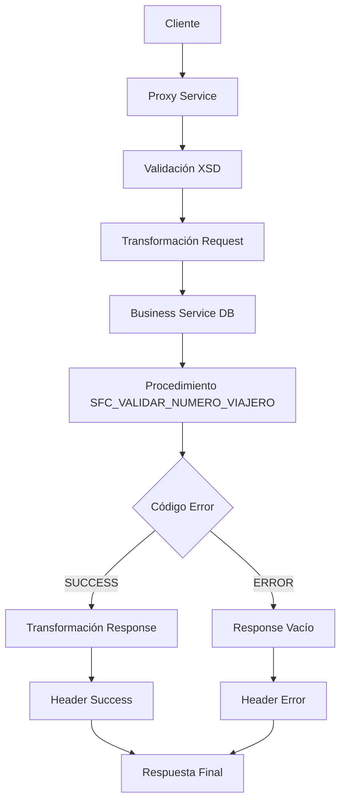

# Análisis Técnico: ValidaNumeroViajero

## Resumen Ejecutivo

El servicio **ValidaNumeroViajero** (1) es un servicio simple que permite validar números de viajero frecuente en el sistema SALESFORCE. Implementa un patrón de conexión directa a base de datos.

## Arquitectura del Servicio

### Patrón de Diseño
- **Tipo**: Servicio Simple
- **Versión**: v2
- **Protocolo**: SOAP/HTTP
- **Seguridad**: Custom Token Authentication

### Flujo de Ejecución



## Servicios Dependientes

### 1. validaNumeroViajero_db
- **Propósito**: Conexión con base de datos de Interfaz para ejecutar procedimiento de validación
- **Parámetros**: PV_TYPE, PV_NUMERO_VIAJERO
- **Respuesta**: PV_RESULT, PV_ERROR_CODE, PV_ERROR_MESAJE
- **Validación**: Conexión JCA administrada

## Transformaciones de Datos

### Procesamiento por País

| País | Código | Descripción Lógica | XQuery Request | XQuery Response |
|-------|--------|-------------------|----------------|----------------|
| General | N/A | Validación directa sin regionalización | MasterNuevo/Middleware/v2/Resources/ValidaNumeroViajero/xq/ValidaNumeroViajeroIn.xq | MasterNuevo/Middleware/v2/Resources/ValidaNumeroViajero/xq/ValidaNumeroViajeroOut.xq |

## Conexiones por País

### General (Todos los países)
```xml
<!-- JCA -->
<service>validaNumeroViajero_db</service>
<connection>[CONNECTION_INTERFAZSFC]</connection>
<operation>validaNumeroViajero</operation>
```

## Validación XSD

### Información General
- **Esquema XSD**: validaNumeroViajeroTypes.xsd
- **Namespace**: http://www.ficohsa.com.hn/middleware.services/validaNumeroViajeroTypes
- **Versión**: 1.0

### Archivos de Esquema

#### Ubicación
- **XSD Principal**: `MasterNuevo/Middleware/v2/Resources/ValidaNumeroViajero/xsd/validaNumeroViajeroTypes.xsd`
- **WSDL**: `MasterNuevo/Middleware/v2/Resources/ValidaNumeroViajero/wsdl/validaNumeroViajeroPS.wsdl`
- **Headers**: `MasterNuevo/Middleware/v2/Resources/esquemas_generales/HeaderElements.xsd`

#### Dependencias
- **Namespace http://www.ficohsa.com.hn/middleware.services/autType**: Para headers de autenticación
- **Namespace http://www.ficohsa.com.hn/middleware.services/validaNumeroViajeroTypes**: Para tipos específicos del servicio

### Estructura del Request

#### Definición XSD Request
```xml
<xs:element name="validaNumeroViajero">
    <xs:complexType>
        <xs:sequence>
            <xs:element name="Type" type="xs:string" minOccurs="1"/>
            <xs:element name="FlyerNumber" type="xs:string" minOccurs="1"/>
        </xs:sequence>
    </xs:complexType>
</xs:element>
```

#### Ejemplo de Request Válido
> **Nota:** Los siguientes son datos de ejemplo no reales, utilizados únicamente para propósitos de testing y documentación.

```xml
<validaNumeroViajero xmlns="http://www.ficohsa.com.hn/middleware.services/validaNumeroViajeroTypes">
    <Type>VALIDATION</Type>
    <FlyerNumber>FF123456789</FlyerNumber>
</validaNumeroViajero>
```

### Estructura del Response

### Definiciones XSD Completas

#### Response Principal
```xml
<xs:element name="validaNumeroViajeroResponse">
    <xs:complexType>
        <xs:sequence>
            <xs:element name="Result" type="xs:string" minOccurs="0"/>
        </xs:sequence>
    </xs:complexType>
</xs:element>
```

### Ejemplo de Response Válido

> **Nota:** Los siguientes son datos de ejemplo no reales, utilizados únicamente para propósitos de testing y documentación.

```xml
<validaNumeroViajeroResponse xmlns="http://www.ficohsa.com.hn/middleware.services/validaNumeroViajeroTypes">
    <Result>VALID</Result>
</validaNumeroViajeroResponse>
```

### Casos de Error XSD

#### Request Inválido - Campo Faltante
> **Nota:** Los siguientes son datos de ejemplo no reales, utilizados únicamente para propósitos de testing y documentación.

```xml
<!-- ERROR: Falta Type -->
<validaNumeroViajero xmlns="http://www.ficohsa.com.hn/middleware.services/validaNumeroViajeroTypes">
    <FlyerNumber>FF123456789</FlyerNumber>
    <!-- Type faltante -->
</validaNumeroViajero>
```

#### Request Inválido - Namespace Incorrecto
> **Nota:** Los siguientes son datos de ejemplo no reales, utilizados únicamente para propósitos de testing y documentación.

```xml
<!-- ERROR: Namespace incorrecto -->
<validaNumeroViajero xmlns="http://wrong.namespace/">
    <Type>VALIDATION</Type>
    <FlyerNumber>FF123456789</FlyerNumber>
</validaNumeroViajero>
```

#### Response Inválido - Campo Requerido Faltante
> **Nota:** Los siguientes son datos de ejemplo no reales, utilizados únicamente para propósitos de testing y documentación.

```xml
<!-- ERROR: Response vacío cuando debería tener contenido -->
<validaNumeroViajeroResponse xmlns="http://www.ficohsa.com.hn/middleware.services/validaNumeroViajeroTypes">
    <!-- Result faltante en caso de éxito -->
</validaNumeroViajeroResponse>
```

---

## Historial de Cambios

| Fecha | Versión | Autor | Descripción |
|-------|---------|-------|-------------|
| 29-01-2026 | 1.0 | Joseph Giron | Creación inicial |