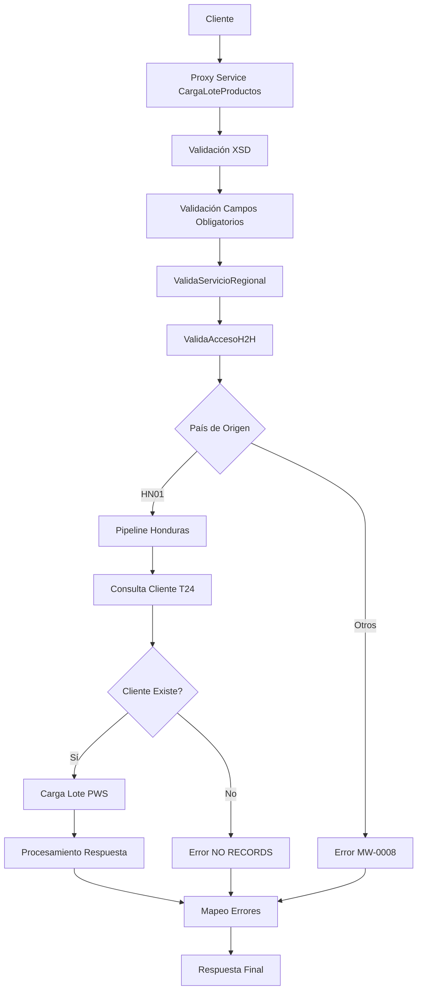

# Análisis Técnico: CargaLoteProductos

## Resumen Ejecutivo

El servicio **CargaLoteProductos** (FICBCO0380) es un servicio Regional Multi-Core que permite la carga masiva de productos bancarios para clientes empresariales. Implementa un patrón de Servicio con Validación y Procesamiento Regional.

## Arquitectura del Servicio

### Patrón de Diseño
- **Tipo**: Servicio Regional Multi-Core
- **Versión**: v1
- **Protocolo**: SOAP/HTTP
- **Seguridad**: Custom Token Authentication + H2H Access Control

### Flujo de Ejecución



## Servicios Dependientes

### 1. validaServicioRegional_db
- **Propósito**: Validar disponibilidad del servicio por región
- **Parámetros**: serviceId="FICBCO0380", requestHeader
- **Respuesta**: PV_CODIGO_ERROR, PV_MENSAJE_ERROR
- **Validación**: Debe retornar SUCCESS para continuar

### 2. validaAccesoH2H_db
- **Propósito**: Validar acceso Host-to-Host del usuario y cliente
- **Parámetros**: operacion="CARGALOTEPRODUCTOS", codigoCliente, usuario, codigoPais, idProxy="FICBCO0379"
- **Respuesta**: PV_DESCRIPCIONMENSAJE
- **Validación**: Mensaje vacío indica acceso autorizado

### 3. sjConsultaClienteResiliencia
- **Propósito**: Consultar información del cliente en T24
- **Parámetros**: CUSTOMER_ID del request
- **Respuesta**: WSCUSTOMERType con datos del cliente
- **Validación**: successIndicator debe ser "Success"

### 4. cargaLoteProductos_db
- **Propósito**: Procesar carga masiva de productos en PWS
- **Parámetros**: Datos del cliente T24 + información del lote
- **Respuesta**: PV_CODIGOERROR, PV_DESCRIPCIONMENSAJE, PV_CODIGOLOTE
- **Validación**: SUCCESS indica procesamiento exitoso

### 5. mapeoErrores
- **Propósito**: Mapear y normalizar códigos de error
- **Parámetros**: CODIGO_ERROR, MENSAJE_ERROR con prefijo "FICBCO0380$#$"
- **Respuesta**: Código y mensaje normalizados
- **Validación**: Aplicado en todos los casos de error

## Transformaciones de Datos

### Procesamiento por País

| País | Código | Descripción Lógica | XQuery Request | XQuery Response |
|-------|--------|-------------------|----------------|----------------|
| Honduras | HN01 | Consulta cliente T24 y carga en PWS | MasterNuevo/MWHostToHost/v1/Resources/CargaLoteProductos/xq/ConsultaClienteIN.xq | MasterNuevo/MWHostToHost/v1/Resources/CargaLoteProductos/xq/cargaLoteProductosOUT.xq |
| Default | Otros | Error servicio no implementado | N/A | N/A |

## Conexiones por País

### Honduras (HN01)
```xml
<!-- JCA Connection -->
<service>validaServicioRegional_db</service>
<connection>[CONNECTION_MDW_PAIS]</connection>
<operation>ValidaServicioRegional</operation>

<!-- JCA Connection -->
<service>validaAccesoH2H_db</service>
<connection>[CONNECTION_INTFC_PAIS]</connection>
<operation>validaAccesoH2H</operation>

<!-- HTTP Connection -->
<service>sjConsultaClienteResiliencia</service>
<endpoint>[ENDPOINT_CONSULTA_CLIENTE_PAIS]</endpoint>
<operation>Consultadecliente</operation>
<!-- Autenticación: Custom Token (T24 Integration) -->

<!-- JCA Connection -->
<service>cargaLoteProductos_db</service>
<connection>[CONNECTION_PWS_PAIS]</connection>
<operation>cargaLoteProductos</operation>

<!-- HTTP Connection -->
<service>mapeoErrores</service>
<endpoint>[ENDPOINT_MAPEO_ERRORES]</endpoint>
<operation>mapeoErrores</operation>
<!-- Autenticación: Internal Service Call -->
```

### Default (Otros Países)
```xml
<!-- Error Response -->
<error>MW-0008</error>
<message>SERVICE NOT IMPLEMENTED YET FOR THIS COUNTRY/COMPANY</message>
```

## Validación XSD

### Información General
- **Esquema XSD**: aperturaMasivaTypes.xsd
- **Namespace**: http://www.ficohsa.com.hn/middleware.services/aperturaMasivaTypes
- **Versión**: 1.0

### Archivos de Esquema

#### Ubicación
- **XSD Principal**: `MasterNuevo/MWHostToHost/v1/Resources/AperturaMasiva/xsd/aperturaMasivaTypes.xsd`
- **WSDL**: `MasterNuevo/MWHostToHost/v1/Resources/CargaLoteProductos/wsdl/cargaLoteProductosPS.wsdl`
- **Headers**: `MasterNuevo/MWHostToHost/v1/Resources/EsquemasGenerales/headerElements.xsd`

#### Dependencias
- **Namespace http://www.ficohsa.com.hn/middleware.services/autType**: Para headers de autenticación
- **Namespace http://www.ficohsa.com.hn/middleware.services/aperturaMasivaTypes**: Para tipos de datos de apertura masiva

### Estructura del Request

#### Definición XSD Request
```xml
<xs:element name="cargaLoteProductosRequest" type="amas:cargaLoteProductosRequest" />

<xs:complexType name="cargaLoteProductosRequest">
    <xs:sequence>
        <xs:element name="CUSTOMER_ID" type="xs:string" minOccurs="1" maxOccurs="1"/>
        <xs:element name="PAYROLL_GROUP_ID" type="xs:string" minOccurs="1" maxOccurs="1"/>
        <xs:element name="CUSTOMERS" type="amas:customersCargaType" minOccurs="1" maxOccurs="1"/>
        <xs:element name="KV_PAIRS" type="amas:KVPairType" minOccurs="0" maxOccurs="1"/>
    </xs:sequence>
</xs:complexType>

<xs:complexType name="customersCargaType">
    <xs:sequence>
        <xs:element name="CUSTOMER" maxOccurs="unbounded" type="amas:customerCargaType"/>
    </xs:sequence>
</xs:complexType>

<xs:complexType name="customerCargaType">
    <xs:sequence>
        <xs:element name="CUSTOMER_ID_TYPE" type="amas:StringLength20" minOccurs="1" maxOccurs="1"/>
        <xs:element name="LEGAL_ID" type="amas:StringLength13" minOccurs="1" maxOccurs="1"/>
        <xs:element name="LEGAL_ID_EMISSION_DATE" type="xs:date" minOccurs="0" maxOccurs="1"/>
        <xs:element name="GIVEN_NAMES" type="amas:StringLength40" minOccurs="1" maxOccurs="1"/>
        <xs:element name="FAMILY_NAME" type="amas:StringLength40" minOccurs="1" maxOccurs="1"/>
        <xs:element name="DATE_OF_BIRTH" type="xs:date" minOccurs="1" maxOccurs="1"/>
        <xs:element name="GENDER" minOccurs="1" maxOccurs="1">
            <xs:simpleType>
                <xs:restriction base="amas:StringLength1">
                    <xs:enumeration value="1"/>
                    <xs:enumeration value="2"/>
                </xs:restriction>
            </xs:simpleType>
        </xs:element>
        <xs:element name="MARITAL_STATUS" minOccurs="1" maxOccurs="1">
            <xs:simpleType>
                <xs:restriction base="amas:StringLength1">
                    <xs:enumeration value="S"/>
                    <xs:enumeration value="L"/>
                    <xs:enumeration value="M"/>
                    <xs:enumeration value="D"/>
                    <xs:enumeration value="W"/>
                </xs:restriction>
            </xs:simpleType>
        </xs:element>
        <xs:element name="HOME_ADDRESS" type="amas:StringLength60" minOccurs="1" maxOccurs="1"/>
        <xs:element name="CELLULAR" type="amas:StringLength11" minOccurs="0" maxOccurs="1"/>
        <xs:element name="PHONE_NUMBER" type="amas:StringLength11" minOccurs="0" maxOccurs="1"/>
        <xs:element name="PHONE_REFERENCE" type="amas:StringLength20" minOccurs="0" maxOccurs="1"/>
        <xs:element name="EDUCATION_LEVEL" minOccurs="1" maxOccurs="1">
            <xs:simpleType>
                <xs:restriction base="amas:StringLength1">
                    <xs:enumeration value="A"/>
                    <xs:enumeration value="P"/>
                    <xs:enumeration value="S"/>
                    <xs:enumeration value="H"/>
                    <xs:enumeration value="G"/>
                </xs:restriction>
            </xs:simpleType>
        </xs:element>
        <xs:element name="PROFESSION" minOccurs="1" maxOccurs="1">
            <xs:simpleType>
                <xs:restriction base="amas:StringLength3">
                    <xs:pattern value="[0-9]+"/>
                </xs:restriction>
            </xs:simpleType>
        </xs:element>
        <xs:element name="START_DAY_JOB" type="xs:date" minOccurs="1" maxOccurs="1"/>
        <xs:element name="JOB_TITTLE" minOccurs="1" maxOccurs="1">
            <xs:simpleType>
                <xs:restriction base="amas:StringLength3">
                    <xs:pattern value="[0-9]+"/>
                </xs:restriction>
            </xs:simpleType>
        </xs:element>
        <xs:element name="INCOME_CURRENCY" minOccurs="1" maxOccurs="1">
            <xs:simpleType>
                <xs:restriction base="amas:StringLength3">
                    <xs:enumeration value="HNL"/>
                    <xs:enumeration value="USD"/>
                </xs:restriction>
            </xs:simpleType>
        </xs:element>
        <xs:element name="INCOME_AMOUNT" type="amas:StringLength10" minOccurs="1" maxOccurs="1"/>
        <xs:element name="MARRIED_NAME" type="amas:StringLength40" minOccurs="0" maxOccurs="1"/>
        <xs:element name="MARRIED_LASTNAME" type="amas:StringLength40" minOccurs="0" maxOccurs="1"/>
        <xs:element name="REFERENCE_NAME" type="amas:StringLength40" minOccurs="1" maxOccurs="1"/>
        <xs:element name="REFERENCE_LASTNAME" type="amas:StringLength40" minOccurs="1" maxOccurs="1"/>
        <xs:element name="REFERENCE_PHONE" type="amas:StringLength11" minOccurs="1" maxOccurs="1"/>
        <xs:element name="REFERENCE_RELATIONSHIP" minOccurs="1" maxOccurs="1">
            <xs:simpleType>
                <xs:restriction base="amas:StringLength3">
                    <xs:pattern value="[0-9]+"/>
                </xs:restriction>
            </xs:simpleType>
        </xs:element>
        <xs:element name="BENEFICIARY_NAME" type="amas:StringLength50" minOccurs="1" maxOccurs="1"/>
        <xs:element name="BENEFICIARY_RELATIONSHIP" minOccurs="1" maxOccurs="1">
            <xs:simpleType>
                <xs:restriction base="amas:StringLength3">
                    <xs:pattern value="[0-9]+"/>
                </xs:restriction>
            </xs:simpleType>
        </xs:element>
    </xs:sequence>
</xs:complexType>
```

#### Ejemplo de Request Válido
> **Nota:** Los siguientes son datos de ejemplo no reales, utilizados únicamente para propósitos de testing y documentación.

```xml
<cargaLoteProductosRequest xmlns="http://www.ficohsa.com.hn/middleware.services/aperturaMasivaTypes">
    <CUSTOMER_ID>EMPRESA001</CUSTOMER_ID>
    <PAYROLL_GROUP_ID>PLANILLA001</PAYROLL_GROUP_ID>
    <CUSTOMERS>
        <CUSTOMER>
            <CUSTOMER_ID_TYPE>IDENTIDAD</CUSTOMER_ID_TYPE>
            <LEGAL_ID>0801199012345</LEGAL_ID>
            <LEGAL_ID_EMISSION_DATE>2010-01-15</LEGAL_ID_EMISSION_DATE>
            <GIVEN_NAMES>JUAN CARLOS</GIVEN_NAMES>
            <FAMILY_NAME>LOPEZ MARTINEZ</FAMILY_NAME>
            <DATE_OF_BIRTH>1990-05-20</DATE_OF_BIRTH>
            <GENDER>1</GENDER>
            <MARITAL_STATUS>S</MARITAL_STATUS>
            <HOME_ADDRESS>COL. KENNEDY BLOQUE 15 CASA 20</HOME_ADDRESS>
            <CELLULAR>98765432</CELLULAR>
            <PHONE_NUMBER>22334455</PHONE_NUMBER>
            <EDUCATION_LEVEL>H</EDUCATION_LEVEL>
            <PROFESSION>123</PROFESSION>
            <START_DAY_JOB>2020-01-01</START_DAY_JOB>
            <JOB_TITTLE>456</JOB_TITTLE>
            <INCOME_CURRENCY>HNL</INCOME_CURRENCY>
            <INCOME_AMOUNT>25000</INCOME_AMOUNT>
            <REFERENCE_NAME>MARIA</REFERENCE_NAME>
            <REFERENCE_LASTNAME>GONZALEZ</REFERENCE_LASTNAME>
            <REFERENCE_PHONE>99887766</REFERENCE_PHONE>
            <REFERENCE_RELATIONSHIP>001</REFERENCE_RELATIONSHIP>
            <BENEFICIARY_NAME>ANA LOPEZ</BENEFICIARY_NAME>
            <BENEFICIARY_RELATIONSHIP>002</BENEFICIARY_RELATIONSHIP>
        </CUSTOMER>
    </CUSTOMERS>
</cargaLoteProductosRequest>
```

### Estructura del Response

### Definiciones XSD Completas

#### Response Principal
```xml
<xs:element name="cargaLoteProductosResponse" type="amas:cargaLoteProductosResponse" />

<xs:complexType name="cargaLoteProductosResponse">
    <xs:sequence>
        <xs:element name="BANK_BATCH_ID" minOccurs="0" type="xs:string"/>
    </xs:sequence>
</xs:complexType>
```

#### Tipos Complejos
```xml
<xs:complexType name="KVPairType">
    <xs:sequence>
        <xs:element name="PAIR" type="amas:PairType" minOccurs="1" maxOccurs="unbounded"/>
    </xs:sequence>
</xs:complexType>

<xs:complexType name="PairType">
    <xs:sequence>
        <xs:element name="KEY" type="xs:string" minOccurs="1" maxOccurs="1"/>
        <xs:element name="VALUE" type="xs:string" minOccurs="1" maxOccurs="1"/>
    </xs:sequence>
</xs:complexType>
```

### Ejemplo de Response Válido

> **Nota:** Los siguientes son datos de ejemplo no reales, utilizados únicamente para propósitos de testing y documentación.

```xml
<cargaLoteProductosResponse xmlns="http://www.ficohsa.com.hn/middleware.services/aperturaMasivaTypes">
    <BANK_BATCH_ID>LOTE20241212001</BANK_BATCH_ID>
</cargaLoteProductosResponse>
```

### Casos de Error XSD

#### Request Inválido - Campo Faltante
> **Nota:** Los siguientes son datos de ejemplo no reales, utilizados únicamente para propósitos de testing y documentación.

```xml
<!-- ERROR: Falta CUSTOMER_ID (requerido) -->
<cargaLoteProductosRequest xmlns="http://www.ficohsa.com.hn/middleware.services/aperturaMasivaTypes">
    <PAYROLL_GROUP_ID>PLANILLA001</PAYROLL_GROUP_ID>
    <!-- CUSTOMER_ID faltante -->
</cargaLoteProductosRequest>
```

#### Request Inválido - Namespace Incorrecto
> **Nota:** Los siguientes son datos de ejemplo no reales, utilizados únicamente para propósitos de testing y documentación.

```xml
<!-- ERROR: Namespace incorrecto -->
<cargaLoteProductosRequest xmlns="http://wrong.namespace/">
    <CUSTOMER_ID>EMPRESA001</CUSTOMER_ID>
</cargaLoteProductosRequest>
```

#### Request Inválido - Enumeración Incorrecta
> **Nota:** Los siguientes son datos de ejemplo no reales, utilizados únicamente para propósitos de testing y documentación.

```xml
<!-- ERROR: GENDER debe ser 1 o 2 -->
<cargaLoteProductosRequest xmlns="http://www.ficohsa.com.hn/middleware.services/aperturaMasivaTypes">
    <CUSTOMER_ID>EMPRESA001</CUSTOMER_ID>
    <PAYROLL_GROUP_ID>PLANILLA001</PAYROLL_GROUP_ID>
    <CUSTOMERS>
        <CUSTOMER>
            <GENDER>X</GENDER> <!-- Valor inválido -->
        </CUSTOMER>
    </CUSTOMERS>
</cargaLoteProductosRequest>
```

---

## Historial de Cambios

| Fecha | Versión | Autor | Descripción |
|-------|---------|-------|-------------|
| 2024-12-12 | 1.0 | ARQ FICOHSA | Creación inicial |
